#Indicators & Oscillators

**Handeln wie die Profis!**

AgenaTrader stellt Ihnen eine Vielzahl von leistungsstarken Indikatoren zur Verfügung, die Sie bei Ihrer individuellen Marktanalyse unterstützen.

Indikatoren können Sie verwenden
-   in Charts
-   im Condition Escort
-   AgenaScript

Für jeden Indikator finden Sie eine kurze Beschreibung der Funktionsweise, Wissenswertes zur Interpretation, eine Darstellung im Chart und viele techn. Details zur Verwendung in AgenaScript


##Accumulation/Distribution (ADL)
### Beschreibung
Das Konzept des Indikators Accumulation Distribution Line (ADL) wurde von Marc Chaikin entwickelt. Der ADL ist ein Volumen Indikator. Er zeigt die Geldströme an.
Der ADL ist eine Weiterentwicklung des On Balance Volume (OBV). Das OBV von Joe Granville war einer der ersten Volumen Indikatoren.

### Interpretation
Es gibt zwei Varianten der Interpretation des ADL.

1.  The depiction of *divergence*
2. die Ausbildung einer Divergenz.

Steigt in einem Aufwärtstrend der ADL an, fließt Geld in Richtung der steigenden Kurse – der Aufwärtstrend wird bestätigt.
Fällt der ADL in einem Abwärtstrend, wird Geld aus der Aktie herausgezogen. Der Abwärtstrend wird bestätigt.

### Weitere Informationen
[vtadwiki.vtad.de](http://vtadwiki.vtad.de/index.php/Accumulation_Distribution_Linie)

### Verwendung
```cs
ADL()
ADL(IDataSeries input)
ADL()[int barsAgo]
ADL(IDataSeries input)[int barsAgo]
```

### Rückgabewert
**double**

Bei Verwendung der Methode mit einem Index (z.B. ADL()\[int barsAgo\] )  wird der Wert des Indikators für den referenzierten Bar ausgegeben.

### Parameter
input Eingangsdatenreihe für den Indikator

### Darstellung


### Beispiel
```cs
//Prüfung auf die Richtung des ADL
if (IsSerieRising(ADL())
Print("The ADL indicator is rising.");
```

##Adaptive Price Zone (APZ)
### Beschreibung
Der Adaptive Preis Zone Indikator wurde 2006 in dem S&C Artikel "Trading With An Adpative Price Zone" von Lee Leibfarth beschrieben. Es ist ein auf Unbeständigkeit basierender technischer Indikator, der dazu benutzt werden kann, Punkte zu identifizieren, an denen der Markt seine Richtung umkehren kann. Er ist eine Reihe von Bändern, die auf einem doppelt geglätteten exponentiell gleitenden Durchschnitt basieren. Die Bänder bilden einen Kanal, der den Durchschnittspreis umgibt und die Preisschwankungen verfolgt. Er bewährt sich besonders in volatilen Märkten. Überquert der Preis das obere Band der Zone kann dies eine Gelegenheit anzeigen, in Erwartung einer Umkehr zu verkaufen. Andererseits zeigt eine Überschreitung der unteren Begrenzung eine Gelegenheit an, in Erwartung einer Umkehr zu kaufen.

### Interpretation
The bigger the price movement, the greater the distance between the upper and lower band will be. The smaller the price movement, the Je größer die Preisbewegung, desto größer wird der Abstand zwischen dem oberen und dem unteren Band. Je kleiner die Preisbewegung, desto geringer ist der Abstand zwischen den Bändern. Weiter auseinanderliegende Bänder signalisieren gesteigerte Unbeständigkeit, enger zusammenliegende Bänder zeigen eine reduzierte Unbeständigkeit an.
Wenn die Preisbewegung das obere oder untere Band durchbricht, tendiert die APZ dazu, zu ihrem statistischen Durchschnitt zurückzukehren. Dieser Versuch, das Ungleichgewicht auszugleichen, wenn der Preis über die Bänder hinausschießt, führt zu Handelsgelegenheiten. Daher liefert eine Überschreitung des oberen Bandes eine Verkaufsgelegenheit, während eine Unterschreitung des unteren Bandes eine Kaufgelegenheit bedeutet. (Quelle: www.etoro.de)

### Weitere Informationen
<http://www.investopedia.com/articles/trading/10/adaptive-price-zone-indicator-explained.asp>

### Verwendung
```cs
APZ(double barPct, int period)
APZ(IDataSeries input, double barPct, int period)
Upper Band
APZ(double barPct, int period).Upper[int barsAgo]
APZ(IDataSeries input, double barPct, int period).Upper[int barsAgo]
Lower Band
APZ(double barPct, int period).Lower[int barsAgo]
APZ(IDataSeries input, double barPct, int period).Lower[int barsAgo]
```

### Rückgabewert
**double**

Bei Verwendung der Methode mit einem Index (z.B. **APZ**(2, 20)\[**int** barsAgo\] ) wird der Wert des Indikators für den referenzierten Bar ausgegeben.

### Parameters
barPct Standardabweichung

input Eingangsdatenreihe für den Indikator

period Number of bars included in the calculation

### Darstellung


### Beispiel
```cs
//Ausgabe des aktuellen Wertes für das obere und untere Band eines 20 Perioden APZ
Print("Value for the upper APZ band : " + APZ(2, 20).Upper[0]);
Print("Value for the lower APZ band: " + APZ(2, 20).Lower[0]);
```

##Aroon
### Description
Der Aroon, 1995 von Tushar Chande entwickelt, ist ein Indikator der technischen Analyse und dient der Trendbestimmung eines Kurses.
Der AROON besteht aus zwei Indikatorlinien - dem AROON-UP und dem AROON-DOWN. 
Die AROON-UP Linie misst die Tage, die seit dem letzten Kurshoch vergangen sind, die AROON-DOWN Linie misst die Tage, die seit dem letzten Kurstief vergangen sind. Die Linien oszillieren in einer Skala zwischen 0 und 100. 
Bei einem neuen 14-Tage Hoch nimmt der 14er AROON-UP den Wert 100 an, analog dazu nimmt bei einem neuen 14-Tage Tief der 14er AROON-DOWNs den Wert 100 an.
Beim AROON-UP subtrahiert man den Berechnungszeitraum (n) mit der Anzahl der Tage seit dem letzten Hoch (TsH) und dividiert diesen Wert durch n und multipliziert diesen wiederrum mit 100. (Quelle: VTAD)

### Interpretation
Wenn der AROON-UP oberhalb des AROON-DOWN notiert und sich die Linie im Extrembereich zwischen 80 und 100 befindet, signalisiert dies einen Aufwärtstrend. Ein Abwärtstrend wird signalisiert, wenn der AROON-DOWN über dem AROON-UP notiert und sich die Linie im Extrembereich zwischen 20 und 0 befindet.
In der Standardeinstellung liegt die Signallinie also bei 80. Der Grenzwert von 70 wurde von Tusher Chande vorgegeben, aber der kann auch verschoben werden, so z.B. benutzt Erich Florek den Wert 90. Befinden sich die beiden Indikatorlinien im neutralen Bereich - also unterhalb der Signallinie, deutet dies auf eine Seitwärtsbewegung hin. Trendfolger interessieren also nur Indikatorstände im Extrembereich oberhalb der Signallinie.
Ein Überkreuzen der beiden Linien ist ein erstes Anzeichen für einen möglichen Trendwechsel. Befindet sich einer der Indikatoren in der Extremzone, gilt der Trend als bestätigt. Je höher die jeweilige AROON-Linie notiert, desto kontinuierlicher verläuft ein Trend. Der AROON gibt über die Trendstärke keine Auskunft.

### Weitere Informationen
<http://stockcharts.com/school/doku.php?id=chart\_school:technical\_indicators:aroon>

### Verwendung
```cs
Aroon(int period)
Aroon(IDataSeries input, int period)
//For the upper value
Aroon(int period).Up[int barsAgo]
Aroon(IDataSeries input, int period).Up[int barsAgo]
//For the lower value
Aroon(int period).Down[int barsAgo]
Aroon(IDataSeries input, int period).Down[int barsAgo]
```

### Rückgabewert
**double**

Bei Verwendung der Methode mit einem Index  (z.B. **Aroon**(20)\[**int** barsAgo\] ) wird der Wert des Indikators für den referenzierten Bar ausgegeben.

### Parameters
input Eingangsdatenreihe für den Indikator

period Anzahl der Bars, die in die Berechnung einbezogen werden

### Darstellung


### Beispiel
```cs
//Ausgabe des aktuellen Up- und Down-Wertes für einen 20 Perioden Aroon
Print("Current value for Aroon Up is : " + Aroon(20).Up[0]);
Print("Current value for Aroon Down is: " + Aroon(20).Down[0]);
```

## Aroon Oscillator
### Beschreibung
Der Arron Oszillator ist ein trendfolgender Indikator, der auf dem Konzept des Aroon Indikators ("Aroon Up" und "Aroon Down") aufbaut. Er misst die Stärke eines Trendes und die Wahrscheinlichkeit dafür, dass dieser sich fortsetzt.
Der Aroon Oszillator berechnet sich aus der Substraktion Aroon Down von Aroon Up. Ergebnisse über der Null-Linie zeigen an, dass ein Aufwärtstrend vorliegt , Werte unter Null stehen für einen aktuellen Abwärtstrend.

### Interpretation
Der Arron Oszillator eignet sich als Trendfilter- und Trendstärke-Indikator. Er wird analog zum Average Directional Movement Indikator (ADX) verwendet.

### Verwendung
```cs
AroonOscillator(int period)
AroonOscillator(IDataSeries input, int period)
AroonOscillator(int period)[int barsAgo]
AroonOscillator(IDataSeries input, int period)[int barsAgo]
```

### Rückgabewert
**double**

Bei Verwendung der Methode mit einem Index (**AroonOcsillator**(20)\[**int** barsAgo\] ) wird der Wert des Indikators für den referenzierten Bar ausgegeben.

### Parameters
input Eingangsdatenreihe für den Indikator

period Anzahl der Bars, die in die Berechnung einbezogen werden

### Darstellung


### Beispiel
```cs
//Ausgabe des aktuellen Wertes für einen 20 Perioden Aroon Oszillator
Print("Value for the oscillator is: " + AroonOscillator(20)[0]);
```

##Average Directional Index (ADX)
### Beschreibung
Der Average Directional Movement Index ADX ist ein Indikator der technischen Analyse und dient der Trendstärkebestimmung eines Kurses. Er wurde von Welles Wilder 1978 entwickelt und in seinem Buch „New Concepts in Technical Trading Systems“ veröffentlicht. (Quelle: Wikipedia)


### Interpretation
Der ADX zeigt ausschließlich die Stärke eines Trends und nicht die Richtung. So deutet ein steigender ADX auf eine Trendphase und ein fallender ADX auf eine trendlose Phase hin. Viele Experten messen hierbei der Bewegungsrichtung oftmals größerer Bedeutung zu, als seiner absoluten Höhe. Zieht man die Höhe des ADX mit in Betracht, dann stehen im Allgemeinen Werte über 15 für eine Trendphase und Werte unterhalb für eine trendlose Phase.

### Weitere Informationen
<http://de.wikipedia.org/wiki/Average\_Directional\_Movement\_Index>

### Verwendung
```cs
ADX(int period)
ADX(IDataSeries input, int period)
ADX(int period)[int barsAgo]
ADX(IDataSeries input, int period)[int barsAgo]
```

### Rückgabewert
**double**

Bei Verwendung der Methode mit einem Index (z.B. **ADX**(20)\[**int** barsAgo\] ) wird der Wert des Indikators für den referenzierten Bar ausgegeben.

### Parameters
input Eingangsdatenreihe für den Indikator

period Anzahl der Bars, die in die Berechnung einbezogen werden

### Darstellung


### Beispiel
```cs
//Ausgabe des aktuellen Wertes eines 20 Perioden ADX
Print("Value of the ADX: " + ADX(20)[0]);
```

##Average Directional Movement Rating (ADXR)
### Beschreibung
Der Indikator Average Directional Movement Rating (ADXR) entspricht dem aktuellen ADX addiert mit dem ADX von vor n Tagen geteilt durch 2.
( aktueller ADX + ADX vor n Tagen ) / 2

### Interpretation
Der Oszillator bewegt sich um eine Hilfslinie, die typischerweise auf dem Wert 20 liegt. Wenn der ADXR über 20 steigt, liegt ein Trend vor. Fällt der ADXR unter 20, existiert kein Trend, der Markt tendiert seitwärts.
Welles Wilder empfiehlt den Markt bei einem ADXR-Wert von 25 und größer zu kaufen, und solange der Wert über 20 bleibt, die Stücke zu halten.

### Verwendung
```cs
ADXR(int interval, int period)
ADXR(IDataSeries input, int interval, int period)
ADXR(int interval, int period)[int barsAgo]
ADXR(IDataSeries input, int interval, int period)[int barsAgo]
```

### Rückgabewert
**double**

Bei Verwendung der Methode mit einem Index (z.B. **ADXR**(10, 14)\[**int** barsAgo\]) wird der Wert des Indikators für den referenzierten Bar ausgegeben.

### Parameters
input Input Eingangsdatenreihe für den Indikator

interval Intervall zwischen dem ersten ADX-Wert und dem aktuellen ADX-Wert

period Anzahl der Bars, die in die Berechnung einbezogen werden

### Darstellung


### Beispiel
```cs
//Ausgabe des aktuellen Wertes des ADXR
Print("Value of the ADXR: " + ADXR(10, 14)[0]);
```

##Average True Range (ATR)
### Beschreibung & Interpretation
Die True Range (TR) - und ihre geglättete Variante, die Average True Range (ATR) - wurde von Welles Wilder 1978 in seinem Buch "New Concepts in Technical Trading Systems" vorgestellt. Die ATR wird auch "Wilders Volatility" genannt. Wilder suchte nach einer Möglichkeit, die Volatilität der Rohstoff- und Terminmärkte in einem Indikator darzustellen.

Laut Definition von Wilder ist die True Range = "wahre Handelsspanne" das Maximum aus folgenden drei Bedingungen:

1. Der heutigen Handelsspanne (Tagestief bis Tageshoch), oder
2. der Handelsspanne zwischen dem Schlusskurs von gestern und dem Hoch von heute, oder
3. der Handelsspanne zwischen dem Schlusskurs von gestern und dem Tief von heute.

Insbesondere mit Bedingung 2 und 3 werden Kurslücken (Gaps) in stark volatilen Märkten berücksichtigt.

Um die Average True Range zu erhalten, wird die True Range geglättet, sprich mit einem simplen gleitenden Durchschnitt (SMA) versehen. Laut Wilder ergibt die Glättung um 14 Tage den besten Volatilitäts-Indikator. (Quelle: VTAD)

Die ATR wird in vielfältigster Weise zur Volatilitätsbestimmung und insbesondere in Stopp-Strategien verwendet. Zur Bestimmung der Trendstärke ist die Volatilität allein nicht hinreichend, weshalb die ATR hierzu als Volatilitätsfilter in Kombination mit anderen Indikatoren verwendet werden muß.

### Weitere Informationen
VTAD: <http://vtadwiki.vtad.de/index.php/Average\_True\_Range>

### Verwendung
```cs
ATR(int period)
ATR(IDataSeries input, int period)
ATR(int period)[int barsAgo]
ATR(IDataSeries input, int period)[int barsAgo]
```

### Rückgabewert
**double**

Bei Verwendung der Methode mit einem Index(z.B. **ATR**(14)\[**int** barsAgo\] ) wird der Wert des Indikators für den referenzierten Bar ausgegeben.

### Parameters
input Eingangsdatenreihe für den Indikator

period Anzahl der Bars, die in die Berechnung einbezogen werden

### Darstellung


### Beispiel
```cs
//Ausgabe des aktuellen Wertes eines 14 Perioden ATR
Print("The current ATR value is: " + ATR(14)[0]);
```

##Balance of Power (BOP)
### Beschreibung
Der Balance of Power (BOP) wurde von Igor Livshin im August 2001 in der Ausgabe des "Stocks and Commodities Magazine" beschrieben.
Der BOP-Indikator gibt die Stärke der Käufer (Bullen) gegenüber den Verkäufern (Bären) an. Er oszilliert zwischen den Werten -100 und 100.
BOP=(Close-Open) / (High-Low)

### Interpretation
Eine Richtungsänderung des BOP kann als Warnsignal aufgefasst werden und zieht oftmals eine Preisänderung nach sich.

### Verwendung
```cs
BOP(int smooth)
BOP(IDataSeries input, int smooth)
BOP(int smooth)[int barsAgo]
BOP(IDataSeries input, int smooth)[int barsAgo]
```

### Rückgabewert
**double**

Bei Verwendung der Methode mit einem Index (z.B. **BOP**(5)\[**int** barsAgo\] ) wird der Wert des Indikators für den referenzierten Bar ausgegeben.

### Parameters
input Eingangsdatenreihe für den Indikator

smooth Einstellung zur Glättung

### Darstellung


### Beispiel
```cs
//Ausgabe des Wertes für die Balance of Power mit einer Glättung von 5 Perioden
Print("The Balance of Power value is: " + BOP(5));
```

##Bollinger Bands
### Description & Interpretation
Die Bollinger Bands (BB) wurden von John Bollinger 1983 entwickelt. Bollinger Bänder sind Kanallinien, die in und um die Preisstruktur in einem Chart gezeichnet werden. Der Unterschied zwischen Prozentbändern (Envelopes) und Bollinger Bändern liegt in der Volatilität. Prozentbänder verlaufen in einem konstanten Abstand zum Preis. Bollinger Bänder hingegen berücksichtigen die 20-Tage-Volatilität (in der Standardeinstellung). In Phasen geringer Volatilität liegen die Bänder eng am Preis, steigt die Volatilität an, weiten sich die beiden Bänder aus.

Die Basis der Bollinger Bänder ist ein gleitender Durchschnitt (GD, SMA), der den mittelfristigen Trend anzeigt. Dieser wird als mittleres Band bezeichnet und in der Standardeinstellung mit 20 Tagen berechnet. Die Breite des Kanals wird vom Ausmaß der Volatilität, der statistischen Methode der Standardabweichung, bestimmt. Das obere Band ergibt sich aus dem mittleren Band + 2 Standardabweichungen, das untere Band aus dem mittleren Band - 2 Standardabweichungen.

Die Berechnung erfolgt nach folgender Vorschrift:

Oberes Band = Mittleres Band + 2 Standardabweichungen
Mittleres Band = Durchschnitt von 20 Zeiteinheiten (Perioden)
Unteres Band = Mittleres Band - 2 Standardabweichungen

Der Faktor (Standard = 2) kann natürlich variiert werden und ist dafür verantwortlich, wieviel Prozent der Kurse (statistisch gesehen) innerhalb des oberen und unteren Bandes liegen. Bei einem Faktor von 1 sind es 68% der Kurse, bei Faktor = 2 sind es immerhin schon 95% und bei 3 Standardabweichungen 99% der Kurse.

Wenn man die Anzahl der Tage (Perioden) für die Berechnung des Bollinger Bandes variiert, empfiehlt es sich, gleichzeitig auch den Faktor anzupassen. Nach Bollinger sollten folgende Einstellungen verwendet werden:
bei Periode = 10 ist Faktor = 1,9
bei Periode = 50 ist Faktor = 2,1

In der Praxis werden für die Berechnung der Bollinger Bänder zumeist die Schlusskurse verwendet, obwohl Bollinger selbst den typischen Preis (Tageshoch + Tagestief + Tagesschluss) / 3 sowie den gewichteten Kurs (weighted close (Tageshoch + Tagestief + Tagesschluss) / 2+ g, g=Gewichtungsfaktor) empfiehlt, da die auf diese Weise berechneten Kurse das Tagesgeschehen besser widerspiegeln.

Siehe auch:  [*BollingerMTF*](#bollingermtf), [*Bollinger Percent %B*](#bollinger-percent-b-b), [*Bollinger Bands Width*](#bollinger-band-width-bbwidth)

### Interpretation
In der Praxis häufig (und erfolgreich) herangezogen, um Kauf- bzw. Verkaufsentscheidungen zu treffen. So ist es z.B. ziemlich einfach, anhand einer längerfristigen Entwicklung, den Kursverlauf auf außerordentliche Schwankungen zu überprüfen (trendfolgende Ausbruchssysteme).
Überschreitet der Kurs das obere Band, werden steigende Kurse erwartet, der sogenannten Long Position. Diese Long-Position wird wieder aufgelöst (geschlossen), wenn der Kurs entweder wieder unter das obere Band fällt, der Kurs unter das mittlere Band fällt oder wenn der Kurs unter das untere Band fällt.
Bei einem umgekehrten Verlauf werden folglich fallende Kurse erwartet und setzt auf diese indem eine Short-Position aufgebaut wird.
Jedoch sind die Bollinger Bänder in ihrem theoretischen Ansatz nicht dazu konstruiert, um Kauf- bzw. Verkaufsentscheidungen zu treffen. Sie sollen lediglich dazu dienen, festzustellen, ob ein Kurs über- bzw. unterbewertet ist.

### Weitere Informationen
VTAD: [http://vtadwiki.vtad.de/index.php/Bollinger_B%C3%A4nder](http://vtadwiki.vtad.de/index.php/Bollinger_B%C3%A4nder)

Buch "Technische Indikatoren - simplified" von Oliver Paesler (German only)

### Verwendung
```cs
Bollinger(double numStdDev, int period)
Bollinger(IDataSeries input, double numStdDev, int period)
//Für das obere Band
Bollinger(double numStdDev, int period).Upper[int barsAgo]
Bollinger(IDataSeries input, double numStdDev, int period).Upper[int barsAgo]
//Für das untere Band
Bollinger(double numStdDev, int period).Lower[int barsAgo]
Bollinger(IDataSeries input, double numStdDev, int period).Lower[int barsAgo]
```

### Rückgabewert
**double**

Bei Verwendung der Methode mit einem Index(z.B. **Bollinger**(2, 20)\[**int** barsAgo\] ) wird der Wert des Indikators für den referenzierten Bar ausgegeben.

### Parameters
input Eingangsdatenreihe für den Indikator

numStdDev Standardabweichung

period Anzahl der Bars, die in die Berechnung einbezogen werden

### Darstellung


### Beispiel
```cs
//Ausgabe des Wertes des oberen Bollinger Bandes
Print("Value of the upper band: " + Bollinger(2, 20).Upper[0]);
//Ausgabe des Wertes des mittleren Bollinger Bandes
Print("Value of the middle band: " + Bollinger(2, 20)[0]);
//Ausgabe des Wertes des unteren Bollinger Bandes
Print("Value of the lower band: " + Bollinger(2, 20).Lower[0]);
```

##Bollinger Percent B (%b)
### Beschreibung
Bänder Indikatoren, wie die Bollinger Bänder haben meist einen direkten Bezug zur Kursentwicklung, wodurch die Beziehung zwischen dem Kurs und den diesen Kurs umschließenden Bändern sehr anschaulich dargestellt werden kann. Aus dieser Beziehung lassen sich weitere Indikatoren (bzw. Oszillatoren) ableiten, die die die relative Position des Kurses in Bezug zu den Bändern darstellen. Diese Art Indikatoren werden unter dem Chart in einem separaten Chartpanel dargestellt. Ein Vertreter dieser Gruppe ist der Bollinger Bands %B (oder auch Bollinger Bands Oszillator - BBO bzw. nur b%)

Der Indikator %b erinnert in seiner Definition an den Stochastik-Indikator, wobei der Wertebereich nicht wie bei der Stochastik auf 0 - 100 begrenzt ist. Der Wert 1 (100%) zeigt das Schneiden des Kurses mit dem oberen Bollinger Band an. Bei einem Wert von 0,5 (50%) befindet sich der Kurs auf dem mittleren Bollinger Band. Der Wert 0 (0%) steht für den Schnittpunkt von Kurs und unterem Bollinger Band. Kurse können auch ausserhalb der Bollinger Bänder notieren, was vom %b-Indikator mit Werten über 100 bzw. unter 0 dargestellt wird. Der Wert -0,2 (-20%) wird angezeigt, wenn der Kurs sich um 20% der Bandbreite unterhalb des unteren Bandes befindet.

Die Berechnung wird nach folgender Formel vorgenommen:
%b = (Close - lower Bollinger band) / (upper Bollinger Band - lower Bollinger band) * 100

Siehe auch  [*Bollinger Bands*](#bollingerbands), [*BBWidth*](#bbwidth)

**Eine weitere Anwendung: Normalisieren von Indikatoren**

Bollinger Bands und damit auch der %b-Indikator können nicht nur auf die Kurse von Aktien und Indices, sondern auch auf Zeitreihen mit fundamentalen Daten, Volumendaten von Aktien und auf andere Indikatoren, angewendet werden. Immer dann, wenn es interessant zu wissen ist, ob ein Wert relativ hoch oder niedrig ist, kann der %b-Indikator eine neue Perspektive eröffnen. Wenn Sie wissen möchten, ob das Volumen einer Aktie relativ hoch oder niedrig liegt, können Sie die Bollinger Bänder oder %b auch auf die Volumendaten anwenden.
John Bollinger sieht in der Anwendung der %b auf andere Indikatoren eine der wichtigsten Einsatzgebiete des %b. Wenn Sie einen Indikator mit %b normalisieren, berechnen Sie zuerst den Indikator, z.B. den RSI und nutzen bei der Berechnung des %b die Daten des RSI anstelle der Kursdaten. Sie wenden also den %b auf den RSI an, wie es auch schon beim StochRSI, StochMACD und StochMomentum mit dem Stochastic %K getan wurde. Da zeigt sich die enge Verwandtschaft des %b mit dem Stochastic %K. Die Anwendung des %b auf einen Indikator wirkt genauso, als würden Sie Bollinger Bands über den Verlauf des Indikators legen und die Schnittpunkte der Bänder mit dem Indikator entsprechen folglich den Werten 1 und 0 eines mit %b normalisierten Indikators. Der mit %b normalisierte Indikator stellt die relative Position des Ursprungsindikators zu seinem oberen und unteren Band dar. Damit werden die starren Grenzen durch die Berücksichtigung der Beweglichkeit des Ursprungsindikators aufgehoben. John Bollinger formuliert es sehr treffend: „Sie definieren einen Hoch- oder Tiefstand auf einer relativen Basis. Dies kann oft zu tiefen Einblicken und Erkenntnissen führen, die von den traditionellen Richtlinien und Regelwerken nicht zu erwarten sind." ... 
John Bollinger gibt für einige Indikatoren die Parameter für die %b-Berechnung an. Für einen 9-Tage-RSI verwendet er 40 Tage und einen Faktor 2,0 und für einen 14-Tage-RSI nutzt er 50 Tage und einen Faktor von 2,1 zur Berechnung des %b. Für den über 10 Tage berechneten Volumenindikator Money Flow Index (MFI) gibt er für %b 40 Tage und einen Faktor von 2,0 an."

(Quelle: Oliver Paesler: "Technische Indikatoren - simplified" und John Bollinger: "Bollinger Bänder")

### Interpretation
Der BB-Oszillator (%b) bildet die Lage des aktuellen Schlusskurses innerhalb oder außerhalb der Bollinger - Bänder ab. Seine Skalenbreite reicht von Null bis 100, lässt aber auch Extremwerte darüber oder darunter zu. Befindet sich der aktuelle Kurs innerhalb der Bänder, liegt der Indikator zwischen Null und 100. Befindet sich der Kurs genau am oberen Band, hat der Indikator den Wert 100, liegt der Kurs über dem oberen Band hat der Indikator Werte über 100und zeigt damit einen Ausbruch aus dem Bollinger-Band an. Befindet sich der aktuelle Kurs am unteren Bollinger-Band, hat der Indikator den Wert Null, ist er unter das untere Bollinger Band ausgebrochen, hat der Indikator Werte kleiner Null.

Der Indikator %b wird ähnlich wie andere Oszillatoren verwendet:
Erkennen überdehnter Marktsituationen: Der Indikator lässt uns Situationen erkennen, in denen die Kurse weit überdehnt und somit Korrekturanfällig sind. Bricht der Indikator in eine der Extremzonen aus, wird unterstellt, dass diese Bewegung korrigiert wird. Somit gelten Bewegungen in die Extremzonen als Handelssignale. Der Eintritt oder der Austritt des Indikators in / aus eine(r) Extremzone kann als Signal gewertet werden. Ein solcher Ausbruch ist eine andere Darstellung des Kursausbruches aus den zu Grunde liegenden Bollinger – Bändern.

Richtungsänderungen des Indikators als Hinweis auf Änderungen im Kursmomentum: Durch anlegen einer Signallinie können Richtungsänderungen im Indikatorverlauf in Handelssignale umgewandelt werden. Schneidet der Indikator seine Signallinie nach oben, gilt dies als Kaufsignal, schneidet er sie nach unten, gilt dies als Verkaufssignal. Zusätzlich kann die Mittellinie als Trennung zwischen „nur Kaufsignale“ – Bereich und „nur Verkaufssignale“ – Bereich verwendet werden.

(Quelle: tradesignalonline)

### Weitere Informationen
VTAD: [http://vtadwiki.vtad.de/index.php/Bollinger_B%C3%A4nder](http://vtadwiki.vtad.de/index.php/Bollinger_B%C3%A4nder)

Buch "Technische Indikatoren - simplified" von Oliver Paesler (German only)

### Verwendung
```cs
BollingerPercentB(int period, double numStdDev)
BollingerPercentB(IDataSeries input, int period, double numStdDev)
BollingerPercentB(int period, double numStdDev) [int barsAgo]
BollingerPercentB(IDataSeries input, int period, double numStdDev)[int barsAgo]
```

### Rückgabewert
**double**

Bei Verwendung der Methode mit einem Index  (z.B.  **BollingerPercentB**(20, 2)\[**int** barsAgo\] ) wird der Wert des Indikators für den referenzierten Bar ausgegeben.

### Parameters
input		Eingangsdatenreihe für den Indikator

period		Anzahl der Bars, die in die Berechnung einbezogen werden

numStdDev	Standardabweichung

### Darstellung


### Beispiel
//Ausgabe des Wertes des BollingerPercentB

**Print**("Value of the Bollinger Percent B is: " + **BollingerPercentB**(20, 2)\[0\]);

##Bollinger Band Width (BBWidth)
### Beschreibung
Bollinger Bands Width (BBWidth) ist neben dem Bollinger Percent B (%b) ein weiterer aus den Bollinger Bändern abgeleiteter Indikator.
Die Bandweite gibt die Breite der Bänder im Verhältnis zum gleitenden Durchschnitt an und ist damit ein Indikator, der die Volatilität anzeigt. Die Bandweite errechnet sich, indem die Differenz aus dem oberen und dem unteren Band durch das mittlere Band (dem Durchschnitt) geteilt wird.
Der Indikator wird im Chart mit einer Signallinie dargestellt. Die Signallinie ist ein SMA(150) über die Bandweite, anschließend dividiert durch 1,9.

### Interpretation
John Bollinger verwendet die BandWidth, um einen steigenden oder fallenden Trend zu erkennen. Viele Trends haben ihren Ursprung in einer seitwärtsgerichteten Kursbewegung bei der die Volatilität und damit auch der BandWidth-Indikator niedrig ist. Wird ein Ausbruch aus dieser seitlichen Schiebezone durch ein plötzliches Ansteigen der BandWidth begleitet, deutet dies auf den Beginn eines nachhaltigen Trends in Richtung des Ausbruchs hin.

(Quelle: Oliver Paesler: "Technische Indikatoren - simplified" und John Bollinger: "Bollinger Bänder")

Kreuzungen mit der Signallinie können ebenfalls als Signalgeber Verwendung finden. Hier entspricht die Signalgebung der von den gleitenden Durchschnitten bekannten Weise.

### Weitere Informationen
VTAD: [*http://vtadwiki.vtad.de/index.php/Bollinger\_B%C3%A4nder*](http://vtadwiki.vtad.de/index.php/Bollinger_B%C3%A4nder)

Buch "Technische Indikatoren - simplified" von Oliver Paesler (German only)

### Verwendung
```cs
BBWidth(double numStdDev, int period)
BBWidth(IDataSeries input, double numStdDev, int period)
BBWidth(double numStdDev, int period)[int barsAgo]
BBWidth(IDataSeries input, double numStdDev, int period)[int barsAgo]

//für den Wert der BandBreite (wie oben)
BBWidth(double numStdDev, int period).BandWidth
BBWidth(IDataSeries input, double numStdDev, int period).BandWidth
BBWidth(double numStdDev, int period).BandWidth[int barsAgo]
BBWidth(IDataSeries input, double numStdDev, int period).BandWidth[int barsAgo]

//für den Wert der Triggerlinie (Threshold)
BBWidth(double numStdDev, int period).Threshold
BBWidth(IDataSeries input, double numStdDev, int period).Threshold
BBWidth(double numStdDev, int period).Threshold[int barsAgo]
BBWidth(IDataSeries input, double numStdDev, int period).Threshold[int barsAgo]
```

### Rückgabewert
**double**

Bei Verwendung der Methode mit einem Index  (z.B **BBWidth**(2, 20)\[**int** barsAgo\] ) wird der Wert des Indikators für den referenzierten Bar ausgegeben.

### Parameters
input		Eingangsdatenreihe für den Indikator

period		Anzahl der Bars, die in die Berechnung einbezogen werden

numStdDev	Standardabweichung

### Darstellung


### Beispiel
```cs
//Ausgabe des Wertes für BollingerBandWidth
Print("The value of the Bollinger Band Width is: " + BBWidth(2, 20).BandWidth[0]);
//Ausgabe des Wertes der Signallinie
Print("The value of the signal line is: " + BBWidth(2, 20).Threshold[0]);
```

##Bollinger MTF (MultiTimeFrame)
### Beschreibung
Der Indikator BollingerMTF ist die Multi TimeFrame-Variante der Bollinger Bänder (Bollinger Bands).
Er ist hauptsächlich für die Nutzung im Intraday-Bereich geeignet.
Multi TimeFrame bedeutet, dass der Indikator in einer anderen Zeiteinheit berechnet werden kann, als der Kurs im Chart angezeigt wird. Möchte man z.B. in einem 5-Minuten Chart die Bollinger Bänder des Stundencharts angezeigt bekommen, ist das mit dem Indikator Bollinger Bands nicht möglich. Hier ist BollingerMTF zu verwenden.
Im Indikator BollingerMTF kommt ein weiterer Parameter (MTFMinutes) hinzu, der die Zeiteinheit angibt, auf der die Berechnung der Bollinger-Bänder vorgenommen werden soll.

### Darstellung
Die Abbildung zeigt einen 5 Min.-Chart mit einem 60-Min.Bollinger Band


## BuySellPressure
### Beschreibung
Der Indikator BuySellPressure zeigt für den aktuellen Bar den Kauf- und den Verkaufsdruck als prozentualen Wert an. Dazu werden Trades als "Kauf" bzw. als "Verkauf" klassifiziert. Für diese Klassifizierung wird ein "Kauf" immer dann angenommen, wenn die Transaktion am oder über dem Ask ausgeführt wurde. Als "Verkauf" wird ein Umsatz am oder unter dem Bid gewertet. Trades im Inside Market werden ignoriert.

**Achtung:
Dies ist ein Realtime-Indikator. Er funktioniert nur auf Realtime-Daten und wird deshalb nicht für historische Daten gezeichnet.**

**Wenn Sie den Eigenschaften-Dialog des Indikators aufrufen und dort Änderungen vornehmen, wird der Indikator im Anschluß neu gestartet und alle bisher in den Chart gezeichneten Daten gehen verloren..**

See [*BuySellVolume*](#buysellvolume).

### Verwendung
```cs
BuySellPressure()
BuySellPressure(IDataSeries input)

//Für den Wert von buy pressure
BuySellPressure().BuyPressure[int barsAgo]
BuySellPressure(IDataSeries input).BuyPressure[int barsAgo]

//Für den Wert von sell pressure
BuySellPressure().SellPressure[int barsAgo]
BuySellPressure(IDataSeries input).SellPressure[int barsAgo]
```

### Rückgabewert
**double**

Bei Verwendung der Methode mit einem Index ( z.B. **BuySellPressure**().BuyPressure\[**int** barsAgo\] ) wird der Wert des Indikators für den referenzierten Bar ausgegeben.

**Hinweis:**
**Wird BuySellPressure mit EOD-Daten verwendet, wird immer der Wert 50 ausgegeben.**
-   BuySellPressure().SellPressure\[0\] = 50
-   BuySellPressure().SellPressure\[0\] = 50

### Parameters
input	Eingangsdatenreihe für den Indikator

### Darstellung


### Beispiel
```cs
protected override void OnInit()
{
  // Die Eigenschaft CalculateOnBarClose sollte unbedingt hier gesetzt werden,
    // da im Eigenschaften-Dialog des Indikators bzw. der Strategie
    // CalculateOnBarClose = true gesetzt sein kann.
    // Mit CalculateOnBarClose = true werden keine Werte berechnet und angezeigt.

  BuySellPressure().CalculateOnClosedBar = false;
}

protected override void OnCalculate()
{
 // Suche nach einem Long Breakout Signal
  if (Close[0] > DonchianChannel(20).Upper[5])
  {
  // Der Indikator BuySellPressure kann nur für Realtime-Daten berechnet werden.
     // Um eine Strategie, in der BuySellPressure verwendet wird, dennoch einem Backtest 
     // unterziehen zu können, muß mit if (Historical ... geprüft werden,
     // ob die Strategie mit Realtime- oder historischen Daten aufgerufen wurde.
     // Im Beispiel wird ein Breakout-Signal mit dem DonchianChannel(20) generiert.
     // Wenn Realtime-Daten zur Verfügung stehen, soll zusätzlich sichergestellt sein,
     // dass mindestens 70% der Umsätze im Ausbruchbar am bzw. über dem Ask stattgefunden haben.
    if (IsHistoricalMode || BuySellPressure().BuyPressure[0] > 70)
    OpenLong();
  }
}
```

##BuySellVolume
### Beschreibung
Der Indikator BuySellVolume zeigt für den aktuellen Bar den Kauf- und den Verkaufsdruck als Umsatzbar ähnlich dem Volumen (Vol) unter dem Chart an. Dazu werden Trades als "Kauf" bzw. als "Verkauf" klassifiziert. Für diese Klassifizierung wird ein "Kauf" immer dann angenommen, wenn die Transaktion am oder über dem Ask ausgeführt wurde. Als "Verkauf" wird ein Umsatz am oder unter dem Bid gewertet. Trades im Inside Market werden ignoriert.

**Achtung: Dies ist ein Realtime-Indikator. Er funktioniert nur auf Realtime-Daten und wird deshalb nicht für historische Daten gezeichnet. Wenn Sie den Eigenschaften-Dialog des Indikators aufrufen und dort Änderungen vornehmen, wird der Indikator im Anschluß neu gestartet und alle bisher in den Chart gezeichneten Daten gehen verloren.**

Siehe auch [*BuySellPressure*](#buysellpressure) 

### Verwendung
```cs
BuySellVolume BuySellVolume()
BuySellVolume BuySellVolume(IDataSeries input)
```

### Rückgabewert
**double**

Bei Verwendung der Methode mit einem Index (z.B. **BuySellVolume**().BuyVolume\[**int** barsAgo\] ) wird der Wert des Indikators für den referenzierten Bar ausgegeben.

### Parameter
input	Eingangsdatenreihe für den Indikator

### Darstellung


### Beispiel
```cs
//Output für die  BuySellVolume
Print("The BuySellVolume is: " + BuySellVolume()[0]);
```

##CandleStickPattern
### Beschreibung
Der Indikator CandleStickPattern sucht nach bestimmten Candlestick-Formationen.


### Weitere Informationen
Erklärung der einzelnen Formationen und ihrer jeweiligen Interpretation finden sich z.B. unter: [http://en.wikipedia.org/wiki/Candlestick_pattern](http://en.wikipedia.org/wiki/Candlestick_pattern)

### Verwendung
```cs
CandleStickPattern(ChartPattern pattern, int trendStrength)
CandleStickPattern(IDataSeries input, ChartPattern pattern, int trendStrength)
CandleStickPattern(ChartPattern pattern, int trendStrength)[int barsAgo]
CandleStickPattern(IDataSeries input, ChartPattern pattern, int trendStrength)[int barsAgo]
```

### Rückgabewert
**double**

0 - Pattern nicht vorhanden
1 - Pattern vorhanden

Bei Verwendung der Methode mit einem Index ( z.B. **CandleStickPattern**(...)\[**int** barsAgo\] )  wird der Wert des Indikators für den referenzierten Bar ausgegeben.

### Parameters
|               |                                                                                                                                                                                                                    |
|---------------|-------------------------------------------------------------------------------------------------------------------------------------------------------------------------------------------------------------------|
| InSeries      | Eingangsdatenreihe für den Indikator
|
| pattern       | Mögliche Werte sind:
                ChartPattern.BearishBeltHold
                 ChartPattern.BearishEngulfing
                 ChartPattern.BearishHarami
                 ChartPattern.BearishHaramiCross
                 ChartPattern.BullishBeltHold
                ChartPattern.BullishEngulfing
                ChartPattern.BullishHarami
                ChartPattern.BullishHaramiCross  
                ChartPattern.DarkCloudCover
                ChartPattern.Doji
                ChartPattern.DownsideTasukiGap
                ChartPattern.EveningStar
                ChartPattern.FallingThreeMethods
                ChartPattern.Hammer
                ChartPattern.HangingMan
                ChartPattern.InvertedHammer
                ChartPattern.MorningStart
                ChartPattern.PiercingLine
                ChartPattern.RisingThreeMethods
                ChartPattern.ShootingStar
                ChartPattern.StickSandwich
                ChartPattern.ThreeBlackCrows
                ChartPattern.ThreeWhiteSoldiers
                ChartPattern.UpsideGapTwoCrows
                ChartPattern.UpsideTasukiGap    |
| trendStrength | Die Anzahl der Bars links und rechts neben dem Umkehrpunkt (Swing High bzw. Low), die zur Identifizierung eines Trends verwendet werden. Der Wert 0 schaltet die Trendsuche ab, d.h. es wird ausschließlich nach den Chartmustern gesucht. |

### Darstellung


### Beispiel
```cs
if (CandelStickPattern(ChartPattern.ShootingStar, 5)[0] == 1)
Print("Pattern ShootingStar found!");
```

##ChaikinMoneyFlow (CMF)
### Beschreibung
Der Chaikin Money Flow Index (CMF) wurde von Marc Chaikin entwickelt. Es ist ein Volumen-Indikator der versucht, folgende Frage zu beantworten: Wohin fließt das Geld? In die Aktie rein = Akkumulation oder aus der Aktie raus = Distribution. Wobei der CMF nicht nur Anwendung bei Aktien findet. Es können andere Instrumente wie Rohstoffe oder Devisen analysiert werden – sofern Umsätze publiziert werden. Chaikin wollte mit seinem CMF das On Balance Volume (OBV) von Granville erweitern und verbessern. Beim CMF wird die Position der Schlusskurse innerhalb der gehandelten Tagesrange (Handelsspanne) in Relation zum Volumen gestellt. Konkret gesagt geht es um das Handelsvolumen, also die Summe der gehandelten Aktien, multipliziert mit dem jeweiligen Kurs. Denn nur das Handelsvolumen zeigt die Geldmengen an, die in einen Wert geflossen sind oder abgezogen wurden. Der Indikator zeigt an, ob „akkumuliert“ wurde – sprich Kaufdruck aufgebaut wurde, welcher sich in der Regel in steigenden Kurse ausdrückt, oder ob „distributiert“ wurde. In diesem Fall wird Verkaufsdruck aufgebaut und in der Regel fallen die Kurse. (Quelle: VTAD)

### Interpretation
Der CMF oszilliert um eine Nulllinie, er wird in einem separaten Fenster mit nach oben und unten offener Skala abgetragen.
Befindet sich der CMF über der Nulllinie, zeigt er an, dass das Wertpapier nachgefragt wird, es wird also akkumuliert. Im beigefügten Beispiel (Abbildung 1) ist der Indikatorwert dann im grünen Bereich. Werden höhere Hochs ausgebildet, nimmt der Kaufdruck zu.
Ein CMF unterhalb der Nulllinie deutet auf Abgabedruck hin, es wird also distributiert. Der Indikatorwert befindet sich dann im roten Bereich. Werden tiefere Tiefs ausgebildet, nimmt der Verkaufsruck zu. Im beigefügten Beispiel hat der Verkaufsdruck in den letzten Tagen deutlich zugenommen, obwohl der Kurs (noch) kein tieferes Tief ausgebildet hat, ist der CMF regelrecht abgestürzt.
Werden über Wochen hinweg Divergenzen zwischen Kursverlauf und Indikatorverlauf ausgebildet, ist dies als ernstes Warnsignal zu betrachten.
Der Chaikin Money Flow sollte immer in Kombination mit anderen Methoden der Technischen Analyse verwendet werden.
Chaikin schlägt folgende Indikator-Kombination vor:
Chaikin Money Flow: Ein Volumen-Indikator, er zeigt den Kauf- oder Verkaufsdruck an.
RSI: Ein Momentum-Indikator, welcher potentielle überkauft- oder überverkauft-Levels anzeigt.
Gleitende Durchschnitte: Sind Trendfolge-Indikatoren und zeigen den aktuell vorherrschenden Trend an.
Verhältnis-Chart oder auch Ratio-Chart: Damit wird die Relative Stärke einer Aktie gegen einen Index berechnet. Dabei wird der Kurs der Aktie durch den Kurs des Index geteilt.
Diese Indikatoren gehören unterschiedlichen Indikatorkategorien an und ergänzen sich gut.

### Weitere Informationen
VTAD: <http://vtadwiki.vtad.de/index.php/Chaikin\_Money\_Flow>

### Verwendung
```cs
ChaikinMoneyFlow(int period)
ChaikinMoneyFlow(IDataSeries input, int period)
ChaikinMoneyFlow(int period)[int barsAgo]
ChaikinMoneyFlow(IDataSeries input, int period)[int barsAgo]
```

### Rückgabewert
**double**

Bei Verwendung der Methode mit einem Index (z.B.  **ChaikinMoneyFlow**(21)\[**int** barsAgo\] ),  wird der Wert des Indikators für den referenzierten Bar ausgegeben.

### Parameters
input		Eingangsdatenreihe für den Indikator

period		Anzahl der Bars, die in die Berechnung einbezogen werden

### Darstellung


### Beispiel
```cs
//Ausgabe des ChaikinMoneyFlow Wertes
Print("Der ChaikinMoneyFlow Wert ist: " + ChaikinMoneyFlow(21)[0]);
```

##Chaikin Oscillator
### Beschreibung
Der Chaikin Oszillator ist ein Volumenindikator, der anzeigt, ob neue Highs von erhöhten Volumen begleitet werden. Nachdem Larry Williams das OBV-Konzept von Joe Granville weiterentwickelt hatte, machte sich Marc Chaikin daran, das Konzept der Accumulation/ Distribution zu verfeinern.
Der Chaikin Oszillator ist einfach der Moving Average Convergence Divergence Indicator (MACD) angewendet auf die Accumulation/Distribution Linie. Berechnet wird die Differenz zwischen einem 3-Tage exp. gleitenden Durchschnitt und einem 10-Tage exp. gleitenden Durchschnitt der Accumulation/Distribution Linie.

### Interpretation
Die Interpretation des Chaikin Oscillator folgt dem Prinzip der Accumulation/Distribution. Wie bei allen Volumenindikatoren ist auch beim Chaikin Oscillator eine der Hauptanwendung die Suche nach Divergenzen, die häufig auf Trendbrüche hinweisen.
Als Oszillator zeigt er Veränderungen in der Liquidität an, die in eine Aktie hinein oder heraus fließt. Chaikin hat empfohlen, die Oszillator- Signale nur in Trendrichtung zu nutzen: In einem Aufwärtstrend gelten nur die Kaufsignale, in einem Abwärtstrend finden nur die Verkaufssignale Berücksichtigung. Dennoch kann der Chaikin-Oscillator auch gemäß der klassischen Oszillator-Anwendung als Indikator von überkauften bzw. überverkauften Situationen angewendet werden.

### Verwendung
```cs
ChaikinOscillator(int fast, int slow)
ChaikinOscillator(IDataSeries input, int fast, int slow)
ChaikinOscillator(int fast, int slow)[int barsAgo]
ChaikinOscillator(IDataSeries input, int fast, int slow)[int barsAgo]
```

### Rückgabewert
**double**

Bei Verwendung der Methode mit einem Index  (z.B. **ChaikinOscillator**(3, 10)\[**int** barsAgo\] ) wird der Wert des Indikators für den referenzierten Bar ausgegeben.

### Parameters
input		Eingangsdatenreihe für den Indikator

fast		Anzahl der Bars, für die Berechnung des Fast EMA

slow		Anzahl der Bars, für die Berechnung des Slow EMA

### Darstellung


### Beispiel
```cs
//Ausgabe des ChaikinOscillator Wertes für die Parameter fast=3 und slow=10
Print("The Chaikin Oscillator value is: " + ChaikinOscillator(3, 10)[0]);
```

##ChaikinVolatility (CVL)
### Beschreibung
Der Indikator ChaikinVolatility (CVL) ist einer von mehreren Indikatoren, die das Ziel haben, die Schwankungsbreite von Kursbewegungen zu messen. Andere Vertreter dieser Indikatorengruppe sind z.B. die Bollinger-Bänder, die Standardabweichung (StdDev) oder die Average True Range (ATR).
In seinem Volatilitätsindikator verwendet Marc Chaikins die tägliche Handelsspanne (Tageshöchstkurs minus Tagestiefstkurs) als grundlegendes Maß für die Volatilität. Damit unterstellt er, dass bei steigender Volatilität die Handelsspanne größer wird und bei nachlassender Volatilität die Handelsspanne kleiner wird. (Quelle: VTAD)

### Interpretation
Der Indikator oszilliert um eine Nulllinie und schwankt zwischen einer Werteskala von +100 bis -100. Er kann sowohl im Tageschart, als auch im Wochen- oder Monatschart verwendet werden.
Er zeigt bei einem Wert über der Nulllinie an, dass die Volatilität steigt, bei einem Wert unter der Nulllinie fällt die Volatilität.
Nach Chaikin zeigt ein sehr steiler Anstieg seines Indikators, dass bald mit einer Bodenbildungsphase zu rechnen ist. Ein Rückgang des Indikators, der sich über einen längeren Zeitraum erstreckt, deutet auf eine bevorstehende Topbildung hin.
Bodenbildungen des Indikators im negativen Bereich deuten auf mögliche Ausbruchsbewegungen aus einer Range hin, die oftmals den Beginn einer Trendphase einleitet.
Die Chaikin´s Volatility dient in der Regel nicht zur Herleitung konkreter Signale, sondern vielmehr zur "Abrundung" eines Handelssystems. Er ist viel zu hippelig und lässt damit viel Interpretationsspielraum zu. Hinzu kommt, dass Kursverluste fast immer mit steigender Volatilität begleitet werden, Kursgewinne hingegen aber nicht zwingend von ansteigender Volatilität begleitet werden. Auch fehlen - insbesondere in langanhaltenden Trendphasen - eindeutige Signale.

### Verwendung
```cs
ChaikinVolatility(int fast, int slow)
ChaikinVolatility(IDataSeries input, int fast, int slow)
ChaikinVolatility(int fast, int slow)[int barsAgo]
ChaikinVolatility(IDataSeries input, int fast, int slow)[int barsAgo]
```

### Rückgabewert
**double**

Bei Verwendung der Methode mit einem Index  (z.B. **ChaikinVolatility**(14)\[**int** barsAgo\] )  wird der Wert des Indikators für den referenzierten Bar ausgegeben.

### Parameters
input		Eingangsdatenreihe für den Indikator

period		Anzahl der Bars, die in die Berechnung einbezogen werden
### Darstellung


### Beispiel
```cs
//Ausgabe der ChaikinVolatility berechnet auf 14 Perioden
Print("The value of the Chaikin Volatility is: " + ChaikinVolatility(14)[0]);
```

##Chande Momentum Oscillator (CMO)
### Beschreibung
Der Chande Momentum Oscillator (CMO) wurde von Tushar Chande entwickelt und in dem Buch "The New Technical Trader" (Wiley, 1994) von Chande/Kroll präsentiert. Der CMO ähnelt dem herkömmlichen Momentum und auch dem RSI. Während der RSI mit einem Up-Momentum und einer Glättungskomponente arbeitet, werden beim CMO sowohl auf- als auch abwärtsgerichtete Momentum-Daten berücksichtigt. Da auf eine Glättung verzichtet wird, kommt das kurzfristige Momentum besser zur Geltung. Die Formel kreiert einen Oszillator, dessen Range zwischen +100 und -100 schwankt. (Quelle: http://www.boersenwissen.de)

### Interpretation
**Tals Oszillator**
Bei einem CMO-Wert über + 50 ist ein Markt überkauft, unter -50 dagegen überverkauft. Ein Wert von + 50 drückt aus, dass das Up -Momentum dreimal so hoch ist wie das Down-Momentum und umgekehrt.
**zur Trendbestimmung**
Je höher / tiefer der CMO ist, desto stärker ist der jeweilige Trend. Schwankt der CMO um seine Null-Linie herum, liegt ein Seitwärtsmarkt vor. Die Mittellinie stellt die Grenze zwischen dem aufwärts- und abwärtsgerichteten Momentum dar. Liegt der CMO darüber, kann man steigende Kurse erwarten, ansonsten eher fallende.**

### Weitere Informationen
<http://www.boersenwissen.de/content/content\_bin/cont\_bin18.html>

### Verwendung
```cs
CMO(int period)
CMO(IDataSeries input, int period)
CMO(int period)[int barsAgo]
CMO(IDataSeries input, int period)[int barsAgo]
```

### Rückgabewert
**double**

Bei Verwendung der Methode mit einem Index  (z.B.. **CMO**(14)\[**int** barsAgo\] ) wird der Wert des Indikators für den referenzierten Bar ausgegeben.

### Parameters
input		Eingangsdatenreihe für den Indikator

period		Anzahl der Bars, die in die Berechnung einbezogen werden

### Darstellung


### Beispiel
```cs
//Ausgabe des Wertes für den Chande Momentum Oscillator
Print("The current value for the Chande Momentum Oscillator is: " + CMO(14)[0]);
```
##Climactic Distance
### Description
The Climactic Distance indicator was invented and developed by Gilbert Kreuzthaler, CEO of Include IT GmbH and founder of AgenaTrader.com. This indicator is used in the Location Point Trading system. It calculates the median course of the current and historical candle at a distance to the simple moving average (SMA) of the last 20 periods. Additionally, it also measures the average course deviation within the last 80 periods. If the median course exceeds the top or bottom course deviation, the market is deemed climactic, and this influences the trading decisions made in Location Point Trading.

### Calcualtion
Black line in the middle: SMA 20
Green moving line: Median Kurs
Red upper and lower line: Average course deviation oft he last 80 periods.

### More information
[https://www.facebook.com/Location-Point-Trading-344217482287592/?fref=ts](https://www.facebook.com/Location-Point-Trading-344217482287592/?fref=ts)

### Usage
```cs
ClimacticDistance(int sMAPeriod, int thresholdPercent)
ClimacticDistance(IDataSeries InSeries, int sMAPeriod, int thresholdPercent)
ClimacticDistance(int period, int tresholdPercent, Color climacticColor)
ClimacticDistance(IDataSeries InSeries, int sMAPeriod, int thresholdPercent, Color climacticColor)
//Upper band
ClimacticDistance(int sMAPeriod, int thresholdPercent).Upper[int barsAgo]
ClimacticDistance(IDataSeries InSeries, int sMAPeriod, int thresholdPercent).Upper[int barsAgo]
ClimacticDistance(int period, int tresholdPercent, Color climacticColor).Upper[int barsAgo]
ClimacticDistance(IDataSeries InSeries, int sMAPeriod, int thresholdPercent, Color climacticColor).Upper[int barsAgo]
//Lower band
ClimacticDistance(int sMAPeriod, int thresholdPercent).Lower[int barsAgo]
ClimacticDistance(IDataSeries InSeries, int sMAPeriod, int thresholdPercent).Lower[int barsAgo]
ClimacticDistance(int period, int tresholdPercent, Color climacticColor).Lower[int barsAgo]
ClimacticDistance(IDataSeries InSeries, int sMAPeriod, int thresholdPercent, Color climacticColor).Lower[int barsAgo]

//MovingAverage
ClimacticDistance(int sMAPeriod, int thresholdPercent).MovingAverage[int barsAgo]
ClimacticDistance(IDataSeries InSeries, int sMAPeriod, int thresholdPercent).MovingAverage[int barsAgo]
ClimacticDistance(int period, int tresholdPercent, Color climacticColor).MovingAverage[int barsAgo]
ClimacticDistance(IDataSeries InSeries, int sMAPeriod, int thresholdPercent, Color climacticColor).MovingAverage[int barsAgo]
//Distance
ClimacticDistance(int sMAPeriod, int thresholdPercent).Distance[int barsAgo]
ClimacticDistance(IDataSeries InSeries, int sMAPeriod, int thresholdPercent).Distance[int barsAgo]
ClimacticDistance(int period, int tresholdPercent, Color climacticColor).Distance[int barsAgo]
ClimacticDistance(IDataSeries InSeries, int sMAPeriod, int thresholdPercent, Color climacticColor).Distance[int barsAgo]
```
### Return value
**double**

### Parameters
Image

### Visualization
Image

### Example
```cs
//Output of the value for the Upper climactic distance line
Print(“Value of the upper band: “ + ClimacticDistnance(20, 80).Upper[0]);
//Output of the value for the Lower climactic distance line
Print(“Value of the upper band: “ + ClimacticDistnance(20, 80).Lower[0]);
//Output of the value for the Distance climactic distance line
Print(“Value of the upper band: “ + ClimacticDistnance(20, 80).Distance[0]);
//Output of the value for the Moving Average climactic distance line
Print(“Value of the upper band: “ + ClimacticDistnance(20, 80).MovingAverage[0]);
```

##Commodity Channel Index (CCI)
### Beschreibung
Der Commodity Channel Index (CCI) wurde 1980 von Donald Lambert entwickelt und fand seine erste Verwendung am Warenterminmarkt. Der CCI ist ein recht komplexer, trendfolgend ausgerichteter Indikator. Er funktioniert besonders gut in Seitwärtsbewegungen mit einem deutlichen Seitwärtstrendkanal. Er wird verwendet, um Beginn und Ende von Kurstrends, von saisonalen Trends und Zyklen zu erkennen. (Quelle: VTAD)

### Interpretation
CCI measures the difference between a securitys price change and its average price change. High positive readings indicate that prices are well above their average, which is a show of strength. Low negative readings indicate that prices are well below their average, which is a show of weakness.

The Commodity Channel Index (CCI) can be used as either a coincident or leading indicator. As a coincident indicator, surges above +100 reflect strong price action that can signal the start of an uptrend. Plunges below -100 reflect weak price action that can signal the start of a downtrend.

As a *leading indicator*, *momentum oscillators*, chartists can look for overbought or oversold conditions that may foreshadow a mean reversion. Similarly, bullish and bearish divergences can be used to detect early momentum shifts and anticipate trend reversals.

### Weitere Informationen
VTAD: [http://vtadwiki.vtad.de/index.php/Commodity_Channel_Index](http://vtadwiki.vtad.de/index.php/Commodity_Channel_Index)

### Verwendung
```cs
CCI(int period)
CCI(IDataSeries input, int period)
CCI(int period)[int barsAgo]
CCI(IDataSeries input, int period)[int barsAgo]
```

### Return value
**double**

Bei Verwendung der Methode mit einem Index  (z.B **CCI**(14)\[**int** barsAgo\] )  wird der Wert des Indikators für den referenzierten Bar ausgegeben.

### Parameters
input		Eingangsdatenreihe für den Indikator

period		Anzahl der Bars, die in die Berechnung einbezogen werden

### Darstellung


### Beispiel
```cs
//Ausgabe des CCI-Wertes berechnet auf 14 Perioden
Print("The value of the Commodity Channel Index is: " + CCI(14));
```

## Darvas Boxes
### Beschreibung
Die Darvas Boxes sind ein Teil der Handelsstrategie des ungarischen Tänzers Nicolas Darvas. Im stark steigenden Aktienmarkt 1957/58 generierte Darvas mit seinem System innerhalb von 18 Monaten aus etwa 20.000 US$ mehr als 2.000.000 US$. Vorgestellt wurde das Handelssystem erstmals in seinem Buch "How I made 2.000.000$ in the Stock Market". 
Eine Box besteht aus einer oberen ("Deckel") und einer unteren Begrenzung ("Boden"). Jede neue Box setzt auf der vorhergeneden Box auf, so dass eine treppenförmige Darstellung entsteht.
Im ersten Schritt wird der "Deckel" bestimmt.  Wenn eine Aktie an drei aufeinanderfolgenden Tagen kein neues Hoch markiert, wird dieses zurückliegende Hoch die obere Begrenzung der Box.
Anschließend wird der "Boden" der Box bestimmt, der sich als niedrigster Kurs ergibt, auf den die Aktie nachgab. Dieser Tiefstkurs darf dann an den drei Folgetagen nicht mehr unterschritten werden. 

### Interpretation
Das System gleicht einem trendfolgenden Channel-Breakout-System. 
Sobald der Kurs aus eine dieser Boxen ausbricht, entsteht ein Kauf- bzw. Verkauf-Signal.

Wenn der Kurs (in einer Long-Position) durch eine untere Begrenzung fällt, wird die Position geschlossen.

Für Short-Positionen ist der Ablauf analog. 

### Weitere Informationen
Ein Handelssystem basierend auf Darvas Boxes:
[http://www.eusdoni.de/index.php?option=com_content&view=article&catid=13:eusdoni-version-3&id=42:darvas-boxen](http://www.eusdoni.de/index.php?option=com_content&view=article&catid=13:eusdoni-version-3&id=42:darvas-boxen)

### Verwendung
```cs
Darvas()
Darvas(IDataSeries input)

//For the upper Box boundary
Darvas().Upper[int barsAgo]
Darvas(IDataSeries input).Upper[int barsAgo]

//Returns the lower value
Darvas().Lower[int barsAgo]
Darvas(IDataSeries input).Lower[int barsAgo]
```

### Rückgabewert
**double**

Bei Verwendung der Methode mit einem Index (z.B. **Darvas**()\[**int** barsAgo\] ) wird der Wert des Indikators für den referenzierten Bar ausgegeben.

### Parameter
input		Eingangsdatenreihe für den Indikator

### Darstellung


### Beispiel
```cs
//Ausgabe des Wertes für die obere Begrenzung der Box (Deckel)
Print("The upper boundary for the Darvas box is: " + Darvas().Upper[0]);
//Ausgabe des Wertes für die untere Begrenzung der Box (Boden)
Print("The lower boundary for the Darvas box is: " + Darvas().Lower[0]);
```

##Directional Movement (DM)
### Beschreibung
Der Directional Movement Indikator (DM) ist identisch mit dem ADX Indikator, wobei hier zusätzlich die Werte +DM und -DM berechnet werden. Diese Werte fließen später in die Berechnung des Directional Movement Index (DMI) ein.

### Interpretation
Der Directional Movement Indikator ist positiv, wenn die Differenz zwischen den Hochpunkten am größten ist. Er ist nach unten gerichtet (oder negativ), wenn die Differenz zwischen den Kurstiefs den größten Wert hat. Somit ist die nach oben gerichtete Bewegung +DM, und die nach unten gerichtete Bewegung ist -DM.
Die Plus- bzw. Minus-Zeichen sind nicht im math. Sinne zu verstehen. Sie geben nur nach oben oder unten gerichtete Bewegung an. Der Wert ist immer eine positive Zahl, unabhängig von Aufwärts- oder Abwärtsbewegung.

### Further information
siehe Directional Movement Index ([*DMI*](#directional-movement-index-dmi))

### Verwendung
```cs
DM(int period)
DM(IDataSeries input, int period)
DM(int period)[int barsAgo]
DM(IDataSeries input, int period)[int barsAgo]
//Für den Wert von +DM
DM(int period).DiPlus[int barsAgo]
DM(IDataSeries input, int period).DiPlus[int barsAgo]
//Für den Wert von -DM
DM(int period).DiMinus[int barsAgo]
DM(IDataSeries input, int period).DiMinus[int barsAgo]
```

### Rückgabewert
**double**

Bei Verwendung der Methode mit einem Index (z.B. **DM**(14).DiPlus\[**int** barsAgo\] ) wird der Wert des Indikators für den referenzierten Bar ausgegeben.

### Parameters
input		Eingangsdatenreihe für den Indikator

period		Anzahl der Bars, die in die Berechnung einbezogen werden

### Darstellung


### Beispiel
```cs
//Ausgabe der Directional Movement-Werte +DM und -DM
Print("The current +DM value is: " + DM(14).DiPlus[0]);
Print("The current –DM value is: " + DM(14).DiMinus[0]);
```

##Donchian Channel
### Beschreibung
Der Donchian Channel ist unter dem Begriff 4-Wochen-Regel bekannt geworden und funktioniert folgendermaßen: Wenn der aktuelle Kurs den Höchstkurs der letzten vier Wochen übersteigt, wird eine Long-Position eröffnet. Besteht zur gleichen Zeit eine Short-Position, wird diese geschlossen. Fällt der Kurs unter den Tiefstkurs der letzten vier Wochen, wird eine Long-Position geschlossen bzw. eine Short-Position aufgebaut. 
Der Handelsansatz des Donchian Channel ist ein reines Trendfolgesystem und setzt das Prinzip „Bei Stärke kaufen, bei Schwäche verkaufen“ direkt um. Es ist ein Breakout System und wurde von den "Turtles" verwendet. 
Bei diesem Indikator werden die Höchst- und Tiefstkurse der letzten n-Tage als Linien über und unter den Kursverlauf gezeichnet. Die vier Wochen entsprechen 20 Handelstagen.

### Interpretation
**Früher**
Zu seiner Anfangszeit verwendete man beim Donchian Channel beim kurzfristigen System für den Einstieg in eine Long-Position das Überschreiten des 20-Tage-Höchstkurses und für den Ausstieg das Unterschreiten des 10-Tage-Tiefstkurses. Umgekehrt erfolgte der Einstieg in eine Short-Position bei einem 20-Tage-Tief und der Ausstieg bei einem 10-Tage-Hoch. Bei langfristigen Systemen verwendete man anstellen der 20 Tage beim Einstieg 55 Tage und anstatt 10 Tage beim Ausstieg nahm man 20 Tage. Zudem benutzte man volatilitätsbasierte Stopps und eine ebenso volatilitätsbasierte Methode zur Positionsbestimmung.
**Heute**
Aktuelle Forschungsergebnisse zeigen, dass heute die langfristigen Ausbrüche zwischen 40 und 100 Tagen besser funktionieren als die kurzfristigen. Der Ansatz aus den vergangenen Jahrzehnten ist mittlerweile zu populär geworden.

### Weitere Informationen
VTAD: <http://vtadwiki.vtad.de/index.php/Donchian\_Channel>

### Verwendung
```cs
DonchianChannel(int period)
DonchianChannel(IDataSeries input, int period)

//Für das obere Band
DonchianChannel(int period).Upper[int barsAgo]
DonchianChannel(IDataSeries input, int period).Upper[int barsAgo]

//Für das mittlere Band
DonchianChannel(int period)[int barsAgo]
DonchianChannel(IDataSeries input, int period)[int barsAgo]

//Für das untere Band
DonchianChannel(int period).Lower[int barsAgo]
DonchianChannel(IDataSeries input, int period).Lower[int barsAgo]
```

### Rückgabewert
**double**

Bei Verwendung der Methode mit einem Index  (z.B. **DonchianChannel**(14)\[**int** barsAgo\] ) wird der Wert des Indikators für den referenzierten Bar ausgegeben.

### Parameters
input		Eingangsdatenreihe für den Indikator

period		Anzahl der Bars, die in die Berechnung einbezogen werden

### Darstellung


### Example
```cs
//Ausgabe der Werte für den DDonchianChannel
Print("The upper band is at: " + DonchianChannel(14).Upper[0]);
Print("The middle band is at: " + DonchianChannel(14)[0]);
Print("The lower band is at: " + DonchianChannel(14).Lower[0]);
```

##Directional Movement Index (DMI)
### Beschreibung
Das Directional Movement Konzept wurde 1978 von Welles Wilder jr. in seinem Buch „New Concepts in Technical Trading Systems“ vorgestellt. Dieses Konzept beinhaltet folgende Komponenten:

Directional Movement Index (DMI)

Average Directional Movement Index ([*ADX*](#average-directional-index-adx))

True Range (TR)

Der Directional Movement Index ist eine Vorstufe des Average Directional Movement Index (ADX). Der DMI zeigt die prozentuale Stärke einer trendgerichteten Bewegung an. Verwendet wird in der Regel die geglättete Variante, der ADX. (Quelle: VTAD)

### Interpretation
Der DMI zeigt die Trendstärke an, nicht aber die Trendrichtung. Damit eignet er sich als Filter für trendfolgende Handelssysteme, z.B. den Parabolic SAR, um Seitwärtsphasen herauszufiltern. Bei einem steigenden DMI und ins besondere Werten über 25 wird ein Trend angezeigt, darunter liegt eine Seitwärtsphase vor. +DI und –DI weisen auf die Trendrichtung hin. Im Aufwärtstrend liegt der +DI über dem –DI, im Abwärtstrend entsprechend umgekehrt. Bei Kreuzungen des +DI und –DI wechselt der Trend. Je weiter +DI und –DI auseinander driften, desto stärker ist der Trend. Pendeln +DI und –DI eher lustlos um einander herum und taucht der DMI nach unten ab, liegt eine Seitwärtsphase vor. DMI sowie +DI und –DI eignen sich für Trendlinien- und Divergenzanalyse.

### Weitere Informationen
VTAD: [http://vtadwiki.vtad.de/index.php/DMI_-_Directional_Movement_Index](http://vtadwiki.vtad.de/index.php/DMI_-_Directional_Movement_Index)

### Verwendung
```cs
DMI(int period)
DMI(IDataSeries input, int period)
DMI(int period)[int barsAgo]
DMI(IDataSeries input, int period)[int barsAgo]
```

### Rückgabewert
**double**

Bei Verwendung der Methode mit einem Index (z.B. **DMI**(20)\[**int** barsAgo\] )  wird der Wert des Indikators für den referenzierten Bar ausgegeben.

### Parameters
input		Eingangsdatenreihe für den Indikator

period		Anzahl der Bars, die in die Berechnung einbezogen werden

### Darstellung
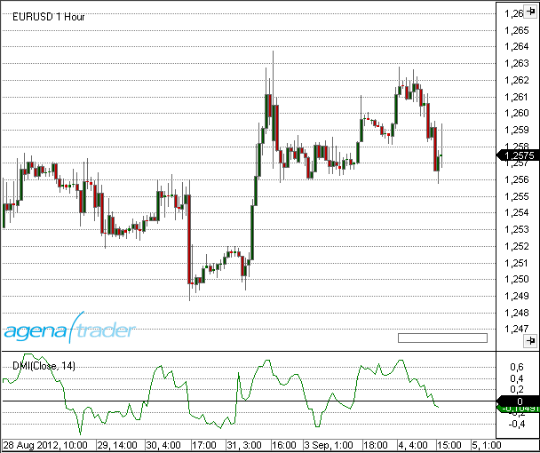

### Beispiel
```cs
//Ausgabe des Wertes für den Directional Movement Index
Print("The current DMI value is: " + DMI(20)[0]);
```

##Double Stochastics (DSS)
### Beschreibung
Die Double Smothed Stochastic (DSS) wurde zuerst von W. Blau vorgestellt. Es handelt sich um einen doppelt geglätteten Stochastic-Indikator. Einige Zeit später wurde von W. Bressert eine weitere Variante einer doppelt geglätteten Stochastik vorgestellt. Diese auch als DSS Bressert bekannte Variante konnte die Qualität der Signale gegenüber der Variante von Blau deutlich verbessern.  Der Indikator reagiert sensibler auf kleinere Kursbewegungen und erzeugt mehr Signale als die Version von W. Blau. Die Bressert-Version taucht wesentlich deutlicher in die Extremzonen ein als die Blau-Version.

Von der Blau-Version existiert eine weitere Variante, die mit 2 EMA's berechnet wird. Diese Version ist in AgenaTrader mit "Blau2" bezeichnet. 

Unabhängig von der konkreten Berechnungsvariante bewegt sich der Indikator DSS immer in einer Skala von 0 bis 100. Für die Extremzonen gelten die gleichen Werte wie bei Lanes Original-Stochastik und den Blau-Versionen. Der obere Extrembereich wird bei 80 und der untere Extrembereich bei 20 festgelegt. Diese Werte können variiert werden. Es kann oft sehr profitabel sein, die Extremzonen zu verändern. Für diverse Anwendungen ist es sinnvoll, eine zusätzliche Linie als Mittellinie bei 50 einzuzeichnen.
Die Glättung hat in Bresserts Version nicht die herausragende Bedeutung wie bei Blau. Das soll heißen, der Aufwand zum Auffinden der optimalen Einstellung kann gering gehalten werden. Bei den Blau-Versionen ist es wichtiger, verschiedene Parameter zu testen. (Quelle: z.T. tradesignalonline)

### Interpretation
Hier gilt das gleiche, was auch zu Lanes Original-Stochastik geschrieben wurde.
Als Interpretation gilt zunächst, dass Indikatorwerte von über 80 als überkaufter Zustand gelten. Indikatorwerte von unter 20 gelten als überverkaufter Zustand. Solchen Situationen wird zunächst unterstellt, dass sie vom Markt korrigiert werden.
Hauptanwendung ist jedoch das Generieren von Handelssignalen aus Schnittpunkten einer Signallinie oder einer Linie der Extrembereiche. Als Signallinie kann ein gleitender Durchschnitt variabler Berechnungsmethoden auf den Indikator berechnet werden. In der Regel werden hier Periodeneinstellungen von 3 bis 5 Tagen verwendet.

Da der Indikator ein nahezu „eckenloses“ Verlaufsmuster bildet, bieten sich für die Signallinie eng anliegende Varianten, wie der Kaufmann's Adaptive Moving Average (KAMA), der Weighted Moving Average (WMA) oder ein anderer, sehr reagibler Durchschnitt an. Die Gefahr von ungewollten Überkreuzungen ist bei diesem Indikator sehr gering. Als Signale werden die Schnittpunkte mit der Signallinie verwendet. Schneidet der Indikator die Signallinie nach oben, gilt dies als Kaufsignal, schneidet er sie nach unten als Verkaufssignal.
Mit Hilfe der Mittellinie oder den Extremzonen können die Signale zusätzlich gefiltert werden. Bullishe Signale können nur dann verwendet werden, wenn sie unter der Mittellinie oder in der unteren Extremzone entstehen. Bearishe Signale werden dann nur verwendet, wenn sie in der oberen Extremzone oder über der Mittellinie entstehen.

Eine andere Variante der Signalerzeugung ist, die direkte Bewegung des Indikators in eine Extremzone hinein oder aus ihr heraus als Signal zu werten. Läuft der Indikator aus der unteren Überverkauft - Zone heraus, kann dies als Kaufsignal gelten, läuft er aus der oberen Überkauft - Zone heraus, gilt das als Verkaufssignal.
In trendstarken Phasen läuft dieser Indikator relativ oft die entgegengesetzte Extremzone an und liefert so brauchbare Signale.

### Verwendung
```cs
DoubleStochastics(int period)
DoubleStochastics(int period)[int barsAgo]
DoubleStochastics(int period, DoubleStochasticsMode mode, int EMA-Period1)
DoubleStochastics(IDataSeries input, int period, DoubleStochasticsMode mode, int EMA-Period1)
DoubleStochastics(int period, DoubleStochasticsMode mode, int EMA-Period1)[int barsAgo]
DoubleStochastics(IDataSeries input, int period, DoubleStochasticsMode mode, int EMA-Period1)[int barsAgo]
DoubleStochastics(int period, DoubleStochasticsMode mode, int EMA-Period1, int EMA-Period2)
DoubleStochastics(IDataSeries input, int period, DoubleStochasticsMode mode, int EMA-Period1, int EMA-Period2)
DoubleStochastics(int period, DoubleStochasticsMode mode, int EMA-Period1, int EMA-Period2)[int barsAgo]
DoubleStochastics(IDataSeries input, int period, DoubleStochasticsMode mode, int EMA-Period1, int EMA-Period2)[int barsAgo]

//Für den Wert von %K   (Signaturen sind nur noch aus Gründen der Kompatibilität vorhanden)
DoubleStochastics(int period).K[int barsAgo]
DoubleStochastics(IDataSeries input, int period).K[int barsAgo]
DoubleStochastics(int period, DoubleStochasticsMode mode, int EMA-Period1).K[int barsAgo]
DoubleStochastics(IDataSeries input, int period, DoubleStochasticsMode mode, int EMA-Period1).K[int barsAgo]
DoubleStochastics(int period, DoubleStochasticsMode mode, int EMA-Period1, int EMA-Period2).K[int barsAgo]
DoubleStochastics(IDataSeries input, int period, DoubleStochasticsMode mode, int EMA-Period1, int EMA-Period2).K[int barsAgo]
```

### Rückgabewert
**double**

Bei Verwendung der Methode mit einem Index (z.B. **DoubleStochastics**(...)\[**int** barsAgo\] bzw **DoubleStochastics**(...).K\[**int** barsAgo\]) wird der Wert des Indikators für den referenzierten Bar ausgegeben.

### Parameters
input		Eingangsdatenreihe für den Indikator

period		Anzahl der Bars, die in die Berechnung einbezogen werden. (default: 10)

mode		Berechnungsmethode, mögliche Werte sind: Blau, Blau2 und Bressert. (default: Bressert)

EMA-Period1	Periode für den EMA in der Berechnung nach Bressert. (default: 2) 

EMA-Period2	Periode für den zweiten EMA in der Berechnung für Variante Blau2. (default: 5) 

### Darstellung


### Beispiel
```cs
//Ausgabe des Wertes für %K des DSS-Bressert
Print("The value of the DSS Bressert %K is: " + DoubleStochastics(10, DoubleStochasticsMode.Bressert, 2)[0]);
```

##Dynamic Momentum Index (DMIndex)
### Beschreibung
Hyperlink+Keywords
Der Dynamic Momentum Index (DMIndex), wurde von Tushar Chande entwickelt. Es handelt sich hierbei um eine spezielle Variante des Relative Strength Index (RSI).

Chande veränderte den Dynamic Momentum Index so, dass dieser die Periodeneinstellung je nach Marktsituation automatisch selbst verändert. Dies erreichte er durch die Kopplung des RSI an eine Volatilitätskomponente. Diese Volatilitätskomponente des Dynamic Momentum Index bestimmt sich aus einer 5-tägigen Standardabweichung der Schlusskurse, die in das Verhältnis zu einem 10-tätigen Durchschnitt einer 5-tägigen Standardabweichung gesetzt wird. 

Als Basis werden werden beim RSI üblicherweise 14 Tage zur Berechnung gewählt, diese Konstante wird nun durch den Volatilitätsquotienten (V) geteilt. Das Ergebnis wird nun mit einem Minimal- und einem Maximalwert verglichen und darf nicht außerhalb des festgelegten Bereichs von minimal 5 Tagen und maximal 30 Tagen liegen.

### Interpretation
Zeigt der Dynamic Momentum Index den Überkauftbereich an, so wird auf fallende Kurse gesetzt, zeigt der Dynamic Momentum Index den Überverkauftbereich an, so wird auf steigende Kurse gesetzt. Ein solches Handeln ist sinnvoll, wenn andere Indikatoren eine trendlose Phase anzeigen, es soll also gegen den Trend gehandelt werden. Während einer starken Trendphase empfiehlt sich ein Handeln in Trendrichtung, in der Phase eines Aufwärtstrends wird auf eine Überverkauftsituation gewartet bis ein Kaufsignal erfolgt.

### Weitere Informationen
VTAD: <http://vtadwiki.vtad.de/index.php/Dynamic\_Momentum\_Index>

### Verwendung
```cs
DMIndex(int smooth)
DMIndex(IDataSeries input, int smooth)
DMIndex(int smooth)[int barsAgo]
DMIndex(IDataSeries input, int smooth)[int barsAgo]
```

### Rückgabewert
**double**

Bei Verwendung der Methode mit einem Index  (z.B. **DMIndex**(3)\[**int** barsAgo\] ) wird der Wert des Indikators für den referenzierten Bar ausgegeben.

### Parameters
input		Eingangsdatenreihe für den Indikator

smooth	Einstellung zur Glättung

### Darstellung
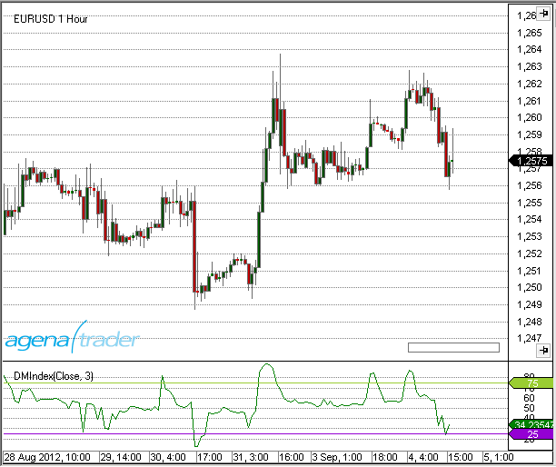

### Beispiel
```cs
//Ausgabe des Wertes für den DMIndex Indikator mit einer Glättung von 3
Print("The current value for the DMIndex is: " + DMIndex(3)[0]);
```

##Ease of Movement (EOM)
### Beschreibung
Der Ease of Movement (EOM) ist ein interessanter Indikator, der von Richard W. Arms entworfen wurde. Der EOM versucht die Bewegung des Preises, in ein Verhältnis zum aufgewendeten Volumen zu setzen. Je stärker der Indikator ausschlägt, desto größer war der Kursfortschritt mit hohem Volumen. Der EOM ist ein sensibler Seismograph von Angebot und Nachfrage.
Arms glättet den EOM mit einem 13-tägigen SMA. Man kann ihn aber auch völlig ungeglättet benutzen. (Quelle: http://www.volumen-analyse.de)

### Interpretation
Die Nulllinie ist praktisch die Stelle, wo eine gewisse Entspannung zwischen Angebot und Nachfrage eingetreten ist. Wenn sich der EOM von der Nulllinie wegbewegt, dann ist ein Impuls in dieser Richtung entstanden. Den EOM kann man sich als Tischtennisspiel vorstellen, wo die Spieler “Angebot” und “Nachfrage” heißen. Die Nulllinie ist das Tischtennisnetz. Auf jeden Schlag kommt eine Gegenreaktion. Die Kraft des Schlages ist definiert durch das Volumen.
Wenn man nun den EOM in ein Handelssystem einbauen möchte, dann muss man den EOM auf unterschiedliche Art und Weise benutzen.
In einem Trend ist das entgegengesetzte Kreuzen der Nulllinie ein Einstiegssignal in Trendrichtung.
Bei einem Ausbruch muss der EOM einen heftigen Ausschlag zeigen. Jede nicht entschlossene Bewegung des EOM deutet auf einen Fehlausbruch hin.
Die Beobachtung von neues Hochs bzw. neuen Tiefs im EOM zeigt die vorzeitige Umkehr von Angebots- und Nachfragemenge.

### Weitere Informationen
<http://www.volumen-analyse.de>

### Verwendung
```cs
EaseOfMovement(int smoothing, int volDivisor)
EaseOfMovement(IDataSeries input, int smoothing, int volDivisor)
EaseOfMovement(int smoothing, int volDivisor)[int barsAgo]
EaseOfMovement(IDataSeries input, int smoothing, int volDivisor)[int barsAgo]
```

### Rückgabewert
**double**

Bei Verwendung der Methode mit einem Index (z.B. **EaseOfMovement**(14, 10000)\[**int** barsAgo\] )  wird der Wert des Indikators für den referenzierten Bar ausgegeben.

### Parameters
input		Eingangsdatenreihe für den Indikator

smoothing	Einstellung zur Glättung

volDivisor	Zur Berechnung der Box Ratio (s. unten Berechnung)

### Darstellung


### Berechnung
Midpoint = (High + Low) / 2
MidpointMove = Midpoint \[today\] – Midpoint \[yesterday\]
BoxRatio = Volume / (High – Low)
Ease = MidpointMove / Box Ratio

### Beispiel
```cs
//Ausgabe der Werte für den EaseOfMovement;
Print("The value for the Ease of Movement is: " + EaseOfMovement(14, 10000)[0]);
```

##Fisher Transform
### Beschreibung
Der Indikator FisherTransform wurde im November 2002 vom Physiker John Ehlers in einem Artikel im "Stocks and Commodities Magazine" veröffentlicht. Der Indikator soll große Wendepunkte signalisieren.
Viele Indikatoren reagieren in seitwärts gerichteten Marktphasen mit chaotischen Bewegungsmustern, die entweder gar nicht oder nur mir vielen Fehlsignalen versetzt, verwendet werden können. Mit Hilfe der „Inverse Fisher Transformation“ können diese Indikatoren derart verändert werden, dass die Bewegungen weniger zufällig und die Signalqualität dadurch verbessert wird. Die Transformation komprimiert, streckt oder staucht die Eingangswerte der Funktion derart, dass diese mit großer Wahrscheinlichkeit zwischen -1 und 1 ausgegeben werden. Daraus resultier ein nahezu eindeutiges Bewegungsmuster, selbst bei Indikatoren wie dem RSI, der normalerweise sehr unruhige und chaotische Bewegungen vollzieht. (Quelle: tradesignalonline.com)

### Interpretation
Ein System unter Verwendung des Indikators FisherTransform wird z.B. unter
<https://www.prorealtime.com/de/pdf/probacktest.pdf> beschrieben.

### Parameters
input		Eingangsdatenreihe für den Indikator

period		Anzahl der Bars, die in die Berechnung einbezogen werden

### Rückgabewert
**double**

Bei Verwendung der Methode mit einem Index (z.B. **FisherTransform**(10)\[**int** barsAgo\] ) wird der Wert des Indikators für den referenzierten Bar ausgegeben.

### Verwendung
```cs
FisherTransform(int period)
FisherTransform(IDataSeries input, int period)
FisherTransform(int period)[int barsAgo]
FisherTransform(IDataSeries input, int period)[int barsAgo]
```

### Darstellung


### Beispiel
```cs
//Ausgabe des Wertes für FisherTransform
Print("The current value for the Fisher Transform is: " + FisherTransform(10)[0]);
```

##Forecast Oscillator (FOSC)
### Beschreibung
Der Forecast Oscillator (FOSC) vergleicht den aktuellen Kurs mit dem Ergebnis des Time-Series-Forecast (TSF). Angegeben wird das prozentuale Verhältnis der Differenz zwischen dem Schlusskurs und dem Wert des Time Series Forecast für den vorhergegangenen Bar.

### Interpretation
Der Oszillator eignet sich gut als moderne Alternative zum bekannten Momentum-Oszillator bzw. zum MACD.
Positive Werte des Oszillators deuten darauf hin, dass die tatsächliche Höhe des Kurses vom Time Series Forecast nicht korrekt (zu niedrig) eingeschätz wurde und negative Werte bedeuten, dass die Kurse tatsächlich niedriger sind, als die vom TSF vorausgesagten.
Meist wird zusätzlich zur Linie des FOSC eine SMA-Linie eingezeichnet, um Reversals des Oszillators leichter erkennen zu können.

### Weitere Informationen
FMLabs: <http://www.fmlabs.com/reference/default.htm?url=ForecastOscillator.htm>

### Parameters
input		Eingangsdatenreihe für den Indikator

period		Anzahl der Bars, die in die Berechnung einbezogen werden

### Rückgabewert
**double**

Bei Verwendung der Methode mit einem Index (z.B. **FOSC**(14)\[**int** barsAgo\] ) wird der Wert des Indikators für den referenzierten Bar ausgegeben.

### Verwendung
```cs
FOSC(int period)
FOSC(IDataSeries input, int period)
FOSC(int period)[int barsAgo]
FOSC(IDataSeries input, int period)[int barsAgo]
```

### Darstellung


### Beispiele
```cs
//Ausgabe des Wertes für den Forecast Oscillator (FOSC) 
Print("The current value for the Forecast Oscillator is: " + FOSC(14)[0]);

//Bestimmung der zukünftigen Marktrichtung mit dem FOSC
if (FOSC(14)[0] > 0)
Print("The FOSC is bigger than zero, which indicates rising price movements.");
```

##HighestHighIndex()
### Beschreibung
HighestHighIndex liefert den Index des Bars mit dem höchsten Hoch, das innerhalb einer bestimten Anzahl Perioden erreicht wurde.
Im Unterschied zu HighestBar() ist dies ein Indikator, der im Chart dargestellt werden kann.

Siehe auch [*HighestHighPrice()*](#highesthighprice), [*LowestLowPrice()*](#lowestlowprice), [*LowestLowIndex*](#lowestlowindex), [*GetSerieHighestValue()*](#getseriehighestvalue), [*GetSerieLowestValue()*](#getserielowestvalue).

### Verwendung
```cs
HighestHighIndex(int BarsBack)
HighestHighIndex(int BarsBack)[int barsAgo]
```

### Rückgabewert
**double**

Bei Verwendung der Methode mit einem Index ( z.B. **HighestHighIndex**(14)\[**int** barsAgo\] ) wird der Wert für den referenzierten Bar ausgegeben.

### **Parameter**
BarsBack	Anzahl der Perioden, innerhalb derer nach dem höchsten Hoch gesucht wird

### Darstellung


### Beispiel
```cs
// Wieviel Bars zurück liegt der Bar mit dem höchsten Hoch der letzten 14 Bars?
Print("The highest high in the last 14 bars was " + HighestHighIndex(14)[0] + " bars ago.");
```

##HighestHighPrice()
### Beschreibung
HighestHighPrice liefert das höchste Hoch, das innerhalb einer bestimten Anzahl Perioden erreicht wurde.

Im Unterschied zu  GetSerieHighestValue(),ist dies ein Indikator, der im Chart dargestellt werden kann.

Siehe auch  [*HighestHighIndex()*](#highesthighindex), [*LowestLowPrice()*](#lowestlowprice), [*LowestLowIndex*](#lowestlowindex), [*GetSerieHighestValue()*](#getseriehighestvalue), [*GetSerieLowestValue()*](#getserielowestvalue).

### Verwendung
```cs
HighestHighPrice(int BarsBack)
HighestHighPrice(int BarsBack)[int barsAgo]
```

### Rückgabewert
**double**

Bei Verwendung der Methode mit einem Index ( z.B. **HighestHighPrice**(14)\[**int** barsAgo\] )  wird der Wert für den referenzierten Bar ausgegeben.

### Parameter
BarsBack	Anzahl der Perioden, innerhalb derer nach dem höchsten Hoch gesucht wird

### Darstellung


### Beispiel
```cs
// Welchen Wert hatte das höchste Hoch der letzten 14 Bars?
Print("The highest high for the last 14 bars is " + HighestHighPrice(14)[0]);
```

##IchimokuCloud
### Beschreibung
Der Ichimoku-Indikator wurde in den 30er Jahren entwickelt und erst 1968 von dem japanischen Journalist Goichi Hosada, der sich „Ichimoku Sanjin“ nannte, vorgestellt.
Der Indikator besteht aus fünf Linien:
**1. Tenkan Sen - die drehende Linie**
Sie ist der Mittelwert vom höchsten und niedrigsten Kurs der letzten neun Stunden und man errechnet sie aus dem höchsten Hoch und aus dem tiefsten Tief geteilt durch zwei. Zur Berechnung werden also die letzten 9 Perioden verwendet.
**2. Kinjun Sen - die Standard Linie**
Sie ist der Mittelwert vom höchsten und vom niedrigsten Kurs der letzten 26 Perioden. Diese Linie wird genauso berechnet wie die drehende Linie nur, dass keine 9 Perioden zur Berechnung verwendet werden, sondern 26 Perioden. Das bedeutet, sie ist wesentlich langsamer, was die Marktveränderungen betrifft, als die drehende Linie.
**3. Chikou Span - die verzögerte Linie**
Sie stellt eine Rückwärtsprojektion des aktuellen Kurses um 26 Perioden dar. Sie endet also auch bei 26 Zeiteinheiten in der Vergangenheit. Das ist der ganz normale Kurverlauf nur 26 Perioden nach hinten versetzt.
**4. Senkou Span A  - die erste vorauseilende Linie**
Die erste vorauseilende Linie (1st preceeding Line) ist der Mittelwert aus Standard Linie und drehender Linie, der 26 Perioden in die Zukunft projiziert wird.
**5. Senkou Span B - die zweite vorauseilende Linie**
Die zweite vorauseilende Linie (2nd preceeding Line) ist der Mittelwert aus höchstem und tiefstem Kurs der letzten 52 Perioden, der ebenfalls 26 Perioden in die Zukunft projiziert wird.
**Kumo - Wolke **
Die Wolke (Cloud) ist der Bereich zwischen Senkou Span A und Senkou Span B.
Der Bereich wird i.d.R. farblich hervorgehoben und hat so die Form einer Wolke.

Die Linien und die Wolke können jeweils einzeln zu- bzw. abgeschaltet werden.

**Wichtiger Hinweis:**
Die Wolke wird z.T. "in die Zukunft" gezeichnet, d.h. über den letzten Bar rechts im Chart hinaus.
Um diesen Teil der Wolke im Chart zu sehen, muß der Chart mit der Maus auf der Zeitachse nach links verschoben werden.


### Interpretation
Similarly to the smoothing averages, the Ichimoku indicator will create a bullish signal when the Tenkan Sen crosses over the Kinjun Sen from below. Ein bärisches Signal entsteht, wenn der Tenkan Sen den Kinjun Sen von oben kreuzt.

### Weitere Informationen
<http://de.wikipedia.org/wiki/Ichimoku>

<http://www.forexabode.com/technical-analysis/ichimoku-cloud>

<http://stockcharts.com/school/doku.php?id=chart\_school:technical\_indicators:ichimoku\_cloud>

<http://www.forexonlinegeheimnisse.com/ichimoku-kinko-hyo-teil-i\#top> (Part 1, German)

<http://www.forexonlinegeheimnisse.com/ichimoku-kinko-hyo-teil-ii-das-perfekte-kauf-oder-verkaufssignal\#top> (Part 2, German)

### Verwendung
```cs
IchimokuCloud(int periodFast, int periodMedium, int periodSlow)
IchimokuCloud(IDataSeries input, int periodFast, int periodMedium, int periodSlow)

//TenkanSen
IchimokuCloud(int periodFast, int periodMedium, int periodSlow).TenkanSen[int barsAgo]
IchimokuCloud(IDataSeries input, int periodFast, int periodMedium, int periodSlow).TenkanSen[int barsAgo]

//KijunSen
IchimokuCloud(int periodFast, int periodMedium, int periodSlow).KijunSen[int barsAgo]
IchimokuCloud(IDataSeries input, int periodFast, int periodMedium, int periodSlow).KijunSen[int barsAgo]

//ChikouSpan
IchimokuCloud(int periodFast, int periodMedium, int periodSlow).ChikouSpan[int barsAgo]
IchimokuCloud(IDataSeries input, int periodFast, int periodMedium, int periodSlow).ChikouSpan[int barsAgo]

//SenkouSpanA
IchimokuCloud(int periodFast, int periodMedium, int periodSlow).SenkouSpanA[int barsAgo]
IchimokuCloud(IDataSeries input, int periodFast, int periodMedium, int periodSlow).SenkouSpanA[int barsAgo]

//SenkouSpanB
IchimokuCloud(int periodFast, int periodMedium, int periodSlow).SenkouSpanB[int barsAgo]
IchimokuCloud(IDataSeries input, int periodFast, int periodMedium, int periodSlow).SenkouSpanB[int barsAgo]
```

### Rückgabewert
**double**

Bei Verwendung der Methode mit einem Index ( z.B. **IchimokuCloud**(9,26,52)\[**int** barsAgo\] ) wird der Wert des Indikators für den referenzierten Bar ausgegeben.

### Parameters
input		Eingangsdatenreihe für den Indikator

periodFast		Anzahl der Perioden zur Berechnung der Tenkan Linie, (default: 9)

periodMedium		Anzahl der Perioden zur Berechnung der Kijun Linie, (default: 26)

periodSlow		Anzahl der Perioden zur Berechnung von Chikou Linie, (default: 52)

### Darstellung


##InsideBarsMT
**Für diesen Indikator ist die Installation des Markttechnik-Paketes Voraussetzung.**

### Beschreibung
Der Indikator InsideBarsMT stellt markttechnische Innenstäbe in einem Chart graphisch dar.
Innenstäbe werden hier exakt so definiert, wie sie von Michael Voigt in seinem Buch ("Das große Buch der Markttechnik")  vorgestellt wurden.
Die Darstellung ist änderbar und es sind zusätzliche Anpassungen möglich.
Zudem gibt es einige Datenreihen zur Verwendung in Stopp-Berechnungen für selbsterstellte Indikatoren bzw. Strategien.

### Interpretation
Als Innenstab (InsideBar) wird ein Bar bezeichnet, dessen Körper (die Spanne zwischen Open und Close) innerhalb der Hoch-Tief-Spanne eines vorausgegangenen Bars liegt. Dieser vorausgegangene Bar wird als Außenstab (OutsideBar) bezeichnet .
Innenstäbe ähneln zumeist einer Seitwärtsphase und bilden Trendkorrekturen tieferliegender Zeiteinheiten ab. Beim "Handel der Bewegung" wird der Stop nach dem Auftreten von Innenstäben an das Hoch bzw. Tief der Vorperiode gelegt. Ist das Hoch bzw. Tief der Vorperiode für eine Stoppversetzung ungeeignet (zu dicht), wird das Hoch bzw. Tief einer älteren Kerze für die Stopversetzung herangezogen.

### Verwendung
```cs
InsideBarsMT().isInsideBar[int barsAgo]
InsideBarsMT().isOutsideBar[int barsAgo]
InsideBarsMT().HighBeforeOutsideBar[int barsAgo]
InsideBarsMT().LowBeforeOutsideBar[int barsAgo]
```

### Parameter
input		Eingangsdatenreihe für den Indikator

unit		Mögliche Werte sind:
		InsideBarsMTToleranceUnit.Ticks
		InsideBarsMTToleranceUnit.Points
		InsideBarsMTToleranceUnit.Percent
		InsideBarsMTToleranceUnit.ATR
    
value		ein Wert vom Typ double.  (z.B. 5 Ticks,  0,1 ATR,  0,3 Percent ... )

**Hinweis:**
1. Im Modus "InsideBarsMTToleranceUnit.Percent" wird der Prozentwert immer vom Schlusskurs der Kerze (Close) berechnet.
2. Wenn kein Parameter angegeben wird, ist die Toleranz = 0.

### Eigenschaften
-   **InsideBarsMT**().isInsideBar\[**int** barsAgo\]

liefert den Wert 1 (double-Wert), wenn der referenzierte Bar ein Innenstab ist, sonst 0.

-   **InsideBarsMT**().isOutsideBar\[**int** barsAgo\]

liefert den Wert 1 (double-Wert) , wenn der referenzierte  Bar ( Index [1] oder größer) ein Außenstab ist, sonst 0.
(Für den aktuellen Bar (Index [0]) ist eine Entscheidung darüber, ob er ein Aussenstab ist, erst nach dem folgenden Bar möglich.
Der Wert für den aktuellen Bar ist daher immer 0.)

-   **InsideBarsMT**().HighBeforeOutsideBar\[**int** barsAgo\]

liefert für einen Innenstab das Hoch (double-Wert) des Bars vor dem zugehörigen Außenstab oder ein noch weiter zurückliegendes "sinnvolles" Hoch. Ist der aktuelle Bar kein Innenstab, enthält dieser Wert 0.

-   **InsideBarsMT**().LowBeforeOutsideBar\[**int** barsAgo\]

liefert für einen Innenstab das Tief (double-Wert) des Bars vor dem zugehörigen Außenstaboder ein noch weiter zurückliegendes "sinnvolles" Tief. Ist der aktuelle Bar kein Innenstab, enthält dieser Wert 0.


### Darstellung
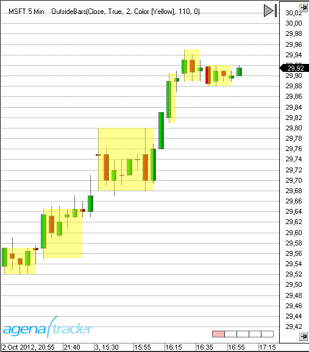

### Die Parameter "ToleranceUnit" und "ToleranceValue"
Im Bild ist eine längere Phase zu erkennen, in der sich der Markt in Innenstäben befindet.
Der mit dem Pfeil markierte Bar öffnet genau am Tief des roten Außenstabes.
Würde das Open der grünen Kerze nur einen Tick tiefer liegen, wäre der markierte Bar kein Innenstab und damit der rote Bar auch kein Außenstab.
Die Parameter "ToleranceUnit" und "ToleranceValue" legen einen Wert fest, um den die Innenstäbe die Hoch/Tief-Spanne ihres Außenstabes noch über- bzw. unterschreiten dürfen, um dennoch als Innenstäbe zu gelten.
Diese Toleranz kann in Ticks, Punkten, Prozent oder einem ATR-Vielfachen angegeben werden.

In der Defaulteinstellung ist der Parametzer "Tolerance" =  0. 


### Beispiel
```cs
double StopPrice;
protected override void OnCalculate()
{
// Position beim Kreuzen der GD's öffnen
if (CrossAbove(SMA(10),SMA(20),1) && Position.PositionType == PositionType.Flat)
OpenLong();
// Wenn der aktuelle Bar ein Innenstab ist, Stop zurückversetzen
if (InsideBarsMT().isInsideBar[0])
StopPrice = InsideBarsMT().LowBeforeOutsideBar[0];
else
// andere Stopmethode anwenden
}
```

##Keltner Channel
### Beschreibung
Im Jahr 1960 veröffentliche Chester W. Keltner sein Buch „How to Make Money in Commodities“ und präsentierte seine Keltner-Channels.
Kanäle oder Bänder bestehen aus zwei Komponenten: einem gleitenden Durchschnitt (GD) als Trendfolger, wobei der GD mit unterschiedlichen Methoden berechnet werden kann und eine diesen GD umhüllende Komponente. Komponente Eins gibt die Trendrichtung und die Trendstärke an, Komponente Zwei definiert Unterstützungs- und Widerstandszonen und zeigt Extrembewegungen des Kurses an.
Es lässt sich die Aussagekraft eines einzelnen gleitenden Durchschnitts erhöhen, indem man ihn mit Prozentbändern oder Kanälen umgibt. Die Prozentbänder werden mit einem festen Prozentsatz über und unter einem gleitenden Durchschnitt (GD) platziert. Wenn der Kurs vom GD zu weit abweicht, werden extreme Marktsituationen angezeigt. Bei kurzfristig orientierten Anlegern werden oft 3% Bänder um die 21-Tage Linien verwendet. Für langfristige Analysen werden 5% Bänder und der 10-Wochen Durchschnitt, oder 10% Bänder und der 40-Wochen Durchschnitt verwendet. Nachteile der Prozentbänder sind, dass sie gemäß ihrer Berechnung immer einen festen Abstand zu ihrem GD haben - ohne Berücksichtigung der Handelsspanne oder Volatilität.
Keltner hat durch die Berücksichtigung der täglichen Handelsspanne die Volatilität in seiner Channel-Konstuktion mit eingebaut. (Quelle: VTAD)


### Interpretation
Der Keltner Channel wird als klassisches Trendfolgesystem verwendet:
Bricht der Kurs aus dem oberen Band aus, so wird das als Kaufsignal gewertet.
Bricht der Kurs aus dem unteren Band aus, so wird das als Verkaufssignal gewertet.

### Weitere Informationen
VTAD: <http://vtadwiki.vtad.de/index.php/Keltner\_Channel>

### Verwendung
```cs
KeltnerChannel(double offsetMutiplier, int period)
KeltnerChannel(IDataSeries input, double offsetMutiplier, int period)

//Returns midline value
KeltnerChannel(double offsetMutiplier, int period)[int barsAgo]
KeltnerChannel(IDataSeries input, double offsetMutiplier, int period)[int barsAgo]

//Returns upper band value
KeltnerChannel(double offsetMutiplier, int period).Upper[int barsAgo]
KeltnerChannel(IDataSeries input, double offsetMutiplier, int period).Upper[int barsAgo]

//Returns lower band value
KeltnerChannel(double offsetMutiplier, int period).Lower[int barsAgo]
KeltnerChannel(IDataSeries input, double offsetMutiplier, int period).Lower[int barsAgo]
```

### Return value
**double**

Bei Verwendung der Methode mit einem Index ( z.B. **KeltnerChannel**(1.5, 15)\[**int** barsAgo\] ) wird der Wert des Indikators für den referenzierten Bar ausgegeben.

### Parameters
input			Eingangsdatenreihe für den Indikator

offsetMultiplier		Multiplikator für den SMA (siehe Berechnung)

period			Anzahl der Bars, die in die Berechnung einbezogen werden

### Darstellung


### Berechnung
diff.**Set**(High\[0\] - Low\[0\]);

**double** middle = **SMA**(Typical, Period)\[0\];

**double** offset = **SMA**(diff, Period)\[0\] \* offsetMultiplier;

**double** upper = middle + offset;

**double** lower = middle - offset;

### Beispiel
```cs
//Die aktuellen Werte für den KelterChannel berechnet auf 15 Perioden
Print("Current value of the upper Keltner Channel band: " + KeltnerChannel(1.5, 15).Upper[0]);
Print("Current value of the middle Keltner Channel band: " + KeltnerChannel(1.5, 15)[0]);
Print("Current value of the lower Keltner Channel band: " + KeltnerChannel(1.5, 15).Lower[0]);
```

##KeyReversalUp
### Beschreibung
KeyReversalUp sucht in einer vorgegebenen Anzahl von Perioden nach einer wie folgt definierten Umkehrformation:
1.  Das aktuelle Close ist höher als das vorhergegangene Close
2.  Das aktuelle Tief ist kleiner oder gleich dem tiefsten Tief der letzten n Bars.

Siehe auch  [*KeyReversalDown*](#keyreversaldown), [*KeyReversalUpAtSMA*](#keyreversalupatsma), [*KeyReversalDownAtSMA*](#keyreversaldownatsma), [*KeyReversalUpAtEMA*](#keyreversalupatema), [*KeyReversalDownAtEMA*](#keyreversaldownatema).


### Parameter
input		Eingangsdatenreihe für den Indikator
period		Anzahl der Bars, die in die Berechnung einbezogen werden

### Rückgabewert
**double**

0 - keine Umkehrformation vorhanden
1 - Umkehrformation vorhanden

### Verwendung
```cs
KeyReversalUp(int period)
KeyReversalUp(IDataSeries input, int period)
KeyReversalUp(int period)[int barsAgo]
KeyReversalUp(IDataSeries input, int period)[int barsAgo]
```

### Beispiel
```cs
// Suche nach Möglichkeiten für einen Long-Einstieg
if (KeyReversalUp(10)[0] == 1)
Print("Es ist eine Long-Umkehrformation aufgetreten.");
```

##KeyReversalDown
### Beschreibung
KeyReversalDown sucht in einer vorgegebenen Anzahl von Perioden nach einer wie folgt definierten Umkehrformation:

1.  Das aktuelle Close ist tiefer als das vorhergegangene Close
2.  Das aktuelle Hoch ist größer oder gleich dem höchsten Hoch der letzten n Bars.

Siehe auch [*KeyReversalUp*](#keyreversalup), [*KeyReversalUpAtSMA*](#keyreversalupatsma), [*KeyReversalDownAtSMA*](#keyreversaldownatsma), [*KeyReversalUpAtEMA*](#keyreversalupatema), [*KeyReversalDownAtEMA*](#keyreversaldownatema).


### Parameters
input		Eingangsdatenreihe für den Indikator
period		Anzahl der Bars, die in die Berechnung einbezogen werden

### Rückgabewert
**double**

0 - keine Umkehrformation vorhanden
1 - Umkehrformation vorhanden

### Verwendung
```cs
KeyReversalDown(int period)
KeyReversalDown(IDataSeries input, int period)
KeyReversalDown(int period)[int barsAgo]
KeyReversalDown(IDataSeries input, int period)[int barsAgo]
```

### Beispiel
```cs
// Suche nach Möglichkeiten für einen Short-Einstieg
if (KeyReversalDown(10)[0] == 1)
Print("Es ist eine Short-Umkehrformation aufgetreten.");
```

##KeyReversalUpAtSMA
### Beschreibung
KeyReversalUpAtSMA sucht in einer vorgegebenen Anzahl von Perioden nach einer wie folgt definierten Umkehrformation:

1.  Das aktuelle Close ist höher als das vorhergegangene Close
2.  Das aktuelle Tief ist kleiner oder gleich dem tiefsten Tief der letzten n Bars
3.  Das aktuelle Tief hat einen SMA berührt bzw. unterschritten.

Siehe auch [*KeyReversalUp*](#keyreversalup), [*KeyReversalDown*](#keyreversaldown), [*KeyReversalDownAtSMA*](#keyreversaldownatsma), [*KeyReversalUpAtEMA*](#keyreversalupatema), [*KeyReversalDownAtEMA*](#keyreversaldownatema).


### Parameters
input		Eingangsdatenreihe für den Indikator
period		Anzahl der Bars, die in die Berechnung einbezogen werden
SMAperiod	Anzahl der Perioden zur Berechnung des SMA

### Rückgabewert
**double**

0 - keine Umkehrformation vorhanden
1 - Umkehrformation vorhanden

### Verwendung
```cs
KeyReversalUpAtSMA(int period, int SMAperiod)
KeyReversalUpAtSMA(IDataSeries input, int period, int SMAperiod)
KeyReversalUpAtSMA(int period, int SMAperiod)[int barsAgo]
KeyReversalUpAtSMA(IDataSeries input, int period, int SMAperiod)[int barsAgo]
```

### Beispiel
```cs
// Suche nach Möglichkeiten für einen Long-Einstieg
if (KeyReversalUpAtSMA(10)[0] == 1)
Print("Es ist eine Long-Umkehrformation aufgetreten.");
```

##KeyReversalDownAtSMA
### Beschreibung
KeyReversalDownAtSMA sucht in einer vorgegebenen Anzahl von Perioden nach einer wie folgt definierten Umkehrformation:

1.  Das aktuelle Close ist tiefer als das vorhergegangene Close
2.  Das aktuelle Hoch ist größer oder gleich dem höchsten Hoch der letzten n Bars
3.  Das aktuelle Hoch hat einen SMA berührt bzw. überschritten.

Siehe auch  [*KeyReversalUp*](#keyreversalup), [*KeyReversalDown*](#keyreversaldown), [*KeyReversalUpAtSMA*](#keyreversalupatsma), [*KeyReversalUpAtEMA*](#keyreversalupatema), [*KeyReversalDownAtEMA*](#keyreversaldownatema).


### Parameters
input		Eingangsdatenreihe für den Indikator
period		Anzahl der Bars, die in die Berechnung einbezogen werden
SMAperiod	Anzahl der Perioden zur Berechnung des SMA

### Return value
**double**

0 - keine Umkehrformation vorhanden
1 - Umkehrformation vorhanden

### Verwendung
```cs
KeyReversalDownAtSMA(int period, int SMAperiod)
KeyReversalDownAtSMA(IDataSeries input, int period, int SMAperiod)
KeyReversalDownAtSMA(int period, int SMAperiod)[int barsAgo]
KeyReversalDownAtSMA(IDataSeries input, int period, int SMAperiod)[int barsAgo]
```

### Beispiel
```cs
// Suche nach Möglichkeiten für einen Short-Einstieg
if (KeyReversalDownAtSMA(10)[0] == 1)
Print("Es ist eine Short-Umkehrformation aufgetreten.");
```

##KeyReversalUpAtEMA
### Beschreibung
KeyReversalUpAtEMA sucht in einer vorgegebenen Anzahl von Perioden nach einer wie folgt definierten Umkehrformation:

1.  Das aktuelle Close ist höher als das vorhergegangene Close
2.  Das aktuelle Tief ist kleiner oder gleich dem tiefsten Tief der letzten n Bars
3.  Das aktuelle Tief hat einen EMA berührt bzw. unterschritten.

Siehe auch [*KeyReversalUp*](#keyreversalup), [*KeyReversalDown*](#keyreversaldown), [*KeyReversalUpAtSMA*](#keyreversalupatsma), [*KeyReversalDownAtSMA*](#keyreversaldownatsma), [*KeyReversalDownAtEMA*](#keyreversaldownatema).

### Parameters
input		Eingangsdatenreihe für den Indikator
period		Anzahl der Bars, die in die Berechnung einbezogen werden
EMAperiod	Anzahl der Perioden zur Berechnung des EMA

### Rückgabewert
**double**

0 - keine Umkehrformation vorhanden
1 - Umkehrformation vorhanden

### Verwendung
```cs
KeyReversalUpAtEMA(int period, int EMAperiod)
KeyReversalUpAtEMA(IDataSeries input, int period, int EMAperiod)
KeyReversalUpAtEMA(int period, int EMAperiod)[int barsAgo]
KeyReversalUpAtEMA(IDataSeries input, int period, int EMAperiod)[int barsAgo]
```

### Beispiel
```cs
// Suche nach Möglichkeiten für einen Long-Einstieg
if (KeyReversalUpAtEMA(10)[0] == 1)
Print("Es ist eine Long-Umkehrformation aufgetreten.");
```

##KeyReversalDownAtEMA
### Beschreibung
KeyReversalDownAtEMA sucht in einer vorgegebenen Anzahl von Perioden nach einer wie folgt definierten Umkehrformation:

1.  Das aktuelle Close ist tiefer als das vorhergegangene Close
2.  Das aktuelle Hoch ist größer oder gleich dem höchsten Hoch der letzten n Bars
3.  Das aktuelle Hoch hat einen EMA berührt bzw. überschritten.

Siehe auch [*KeyReversalUp*](#keyreversalup), [*KeyReversalDown*](#keyreversaldown), [*KeyReversalUpAtSMA*](#keyreversalupatsma), [*KeyReversalDownAtSMA*](#keyreversaldownatsma), [*KeyReversalUpAtEMA*](#keyreversalupatema).

### Parameters
input		Eingangsdatenreihe für den Indikator
period		Anzahl der Bars, die in die Berechnung einbezogen werden
EMAperiod	Anzahl der Perioden zur Berechnung des EMA

### Return value
**double**

0 - keine Umkehrformation vorhanden
1 - Umkehrformation vorhanden

### Verwendung
```cs
KeyReversalDownAtEMA(int period, int EMAperiod)
KeyReversalDownAtEMA(IDataSeries input, int period, int EMAperiod)
KeyReversalDownAtEMA(int period, int EMAperiod)[int barsAgo]
KeyReversalDownAtEMA(IDataSeries input, int period, int EMAperiod)[int barsAgo]
```

### Beispiel
```cs
// Suche nach Möglichkeiten für einen Short-Einstieg
if (KeyReversalDownAtEMA(10)[0] == 1)
Print("Es ist eine Short-Umkehrformation aufgetreten.");
```

##Linear Regression
### Beschreibung
Die Lineare Regression wird zur Trendbestimmung eingesetzt. Dabei werden die Kurse als abhängige und die Zeit als unabhängige Variablen verwendet. Mit Hilfe der Methode des kleinsten Quadrats wird eine gerade Linie so durch den Kursverlauf gelegt, dass der Abstand der Kurse zur Linie minimal ist. Mit dieser Methode lässt sich ein Trend zwischen zwei Zeitpunkten quantitativ darstellen. Die Regressionsgerade befindet sich nach der Berechnung in der Mitte des Kursverlaufs.
Der Indikator Linear Regression stellt die Endwerte multipler linearer Regressionstrendlinien dar. Jeder Punkt entlang des Indikators ist ein Endwert einer linearen Regressionstrendline. Das Ergebnis erinnert so an einen gleitenden Durchschnitt. Im Gegensatz zu einem gleitenden Durchschnitt, weist die resultierende Linie des Lineare Regression Indikators jedoch weniger Verzögerung auf.

Siehe auch [*R-Squared*](#r-squared), [*LinRegSlope*](#linregslope), [*LinRegIntercept*](#linregintercept).

### Weitere Informationen
<http://www.vtad.de/sites/files/forschung/vtad\_Award\_2011\_Joachim\_Lenz\_Veroeffentlichung.pdf>

### Interpretation
Der Lineare Regression Indikator versteht sich als eine Prognose des zukünftigen Kurses, der heute bereits abgebildet wird. Wenn die Preise anhaltend höher oder niedriger als die prognostizierten Kurse sind, ist zu erwarten, dass sie schnell wieder auf ein realistischeres Niveau zurückzukehren. Mit anderen Worten: Der Indikator zeigt an, wo die Preise (nach statistischem Verständnis) sein sollten.Eine übermäßige Abweichung von der Regression ist wahrscheinlich kurzlebig und wird in naher Zukunft korrigiert.

### Verwendung
```cs
LinReg(int period)
LinReg(IDataSeries input, int period)
LinReg(int period)[int barsAgo]
LinReg(IDataSeries input, int period)[int barsAgo]
```

### Rückgabewert
**double**

Bei Verwendung der Methode mit einem Index ( z.B.  **LinReg**(14)\[**int** barsAgo\] ) wird der Wert des Indikators für den referenzierten Bar ausgegeben.

### Parameters
input			Eingangsdatenreihe für den Indikator

period			Anzahl der Bars, die in die Berechnung einbezogen werden

### Darstellung


### Beispiel
```cs
//Anzeige des aktuellen Wertes für die lineare Regression berechnet auf 14 Perioden
Print("Der aktuelle Wert der linearen Regression ist: " + LinReg(14)[0]);
```

##LinRegIntercept
### Beschreibung
Linear Regression Intercept (LinRegIntercept) liefert den Wert der Regressionskonstante, d.h. aus mathematischer Sicht den jeweiligen Schnittpunkt der Regressionsgeraden mit der Preisachse.

Mit den beiden Werten Slope und Intercept ist eine Gerade eindeutig festgelegt.

Siehe auch [*Linear Regression*](#linearregression), [*R-Squared*](#r-squared) [*LinRegSlope*](#linregslope).

### Interpretation
Der Indikator wird nicht eigenständig verwendet, sondern ist ein Bestandteil von Handelssystemen, die ihre Trenderkennung mit Mitteln der Linearen Regression vornehmen.

### Verwendung
```cs
LinRegIntercept(int period)
LinRegIntercept(IDataSeries input, int period)
LinRegIntercept(int period)[int barsAgo]
LinRegIntercept(IDataSeries input, int period)[int barsAgo]
```

### Return value
**double**

Bei Verwendung der Methode mit einem Index ( z.B.  **LinRegIntercept**(14)\[**int** barsAgo\] ) wird der Wert des Indikators für den referenzierten Bar ausgegeben.

### Parameters
input			Eingangsdatenreihe für den Indikator

period			Anzahl der Bars, die in die Berechnung einbezogen werden

### Darstellung
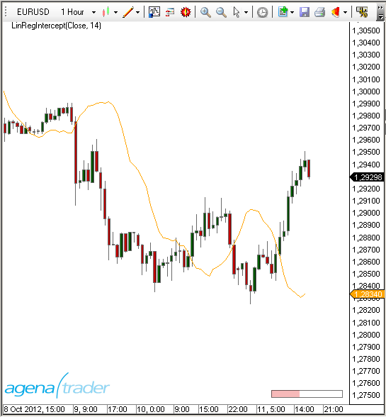

### Beispiel
```cs
//Anzeige des aktuellen Wertes für die Regressionskonstante berechnet auf 14 Perioden
Print("Der aktuelle Wert der Regressionskonstante ist: " + LinRegIntercept(14)[0]);
```

##LinRegSlope
### Beschreibung
Linear Regression Slope (LinRegSlope) liefert den Anstieg (Slope = Neigung) der linearen Regressionsgeraden. Er misst sozusagen die "Steilheit" der Regressionsgeraden.

Siehe auch[*Linear Regression*](#linearregression), [*R-Squared*](#r-squared), [*LinRegIntercept*](#linregintercept).

### Interpretation
Mit einfachen Worten gesagt, verhält es sich so: In einem Aufwärtstrend ist der Anstieg positiv und nach oben gerichtet, während er in einem Abwärtstrend negativ bzw. nach unten gerichtet ist.
Der Indikator ist nicht gut geeignet um überkauft/überverkauft Bereiche anzuzeigen, kann aber die Richtung und Stärke eines Trends messen. Er kann auch in Kombination mit anderen Indikatoren verwendet werden, um potenzielle Einstiegspunkte zu identifizieren.

### Verwendung
```cs
LinRegSlope(int period)
LinRegSlope(IDataSeries input, int period)
LinRegSlope(int period)[int barsAgo]
LinRegSlope(IDataSeries input, int period)[int barsAgo]
```

### Rückgabewert
**double**

Bei Verwendung der Methode mit einem Index ( z.B. **LinRegSlope**(14)\[**int** barsAgo\] ) wird der Wert des Indikators für den referenzierten Bar ausgegeben.

### Parameters
input			Eingangsdatenreihe für den Indikator

period			Anzahl der Bars, die in die Berechnung einbezogen werden

### Darstellung


### Beispiel
```cs
//Anzeige des aktuellen Wertes für den Anstieg der linearen Regressionsgeraden berechnet auf 14 Perioden
Print("Der aktuelle Wert des Anstiegs der linearen Regressionsgeraden ist:  " + LinRegSlope(14)[0]);
```

##LowestLowIndex()
### Beschreibung
LowestLowPrice liefert das tiefste Tief, das innerhalb einer bestimten Anzahl Perioden erreicht wurde.

Im Unterschied zu  GetSerieLowestValue() ist dies ein Indikator, der im Chart dargestellt werden kann.

Siehe auch [*HighestHighPrice()*](#highesthighprice), [*HighestHighIndex()*](#highesthighindex), [*LowestLowPrice()*](#lowestlowprice),
*GetSerieHighestValue()*, *GetSerieLowestValue()*.

### Verwendung
```cs
LowestLowIndex(int BarsBack)
LowestLowIndex(int BarsBack)[int barsAgo]
```

### Rückgabewert
**double**

Bei Verwendung der Methode mit einem Index ( z.B. **LowestLowIndex**(14)\[**int** barsAgo\] ) wird der Wert für den referenzierten Bar ausgegeben.

**Parameter**

BarsBack	Anzahl der Perioden, innerhalb derer nach dem tiefsten Tief gesucht wird

### Darstellung


### Beispiel
```cs
// Wieviel Bars zurück liegt der Bar mit dem tiefsten Tief der letzten 14 Bars?
Print("Das tiefste Tief der letzten 14 Bars liegt" + LowestLowIndex(14)[0] + " Bars zurück");
```

##LowestLowPrice()
### Beschreibung
LowestLowPrice liefert das tiefste Tief, das innerhalb einer bestimten Anzahl Perioden erreicht wurde.

Im Unterschied zu GetSerieLowestValue() ist dies ein Indikator, der im Chart dargestellt werden kann.

Siehe auch  [*HighestHighPrice()*](#highesthighprice), [*HighestHighIndex()*](#highesthighindex), *[LowestLowIndex]()*,
*GetSerieHighestValue()*, *GetSerieLowestValue()*.

### Verwendung
```cs
LowestLowPrice(int BarsBack)
LowestLowPrice(int BarsBack)[int barsAgo]
```

### Rückgabewert
**double**

Bei Verwendung der Methode mit einem Index ( z.B.  **LowestLowPrice**(14)\[**int** barsAgo\] ) wird der Wert für den referenzierten Bar ausgegeben.

### Parameter
BarsBack	Anzahl der Perioden, innerhalb derer nach dem tiefsten Tief gesucht wird

### Darstellung


### Beispiel
```cs
// Welchen Wert hatte das tiefste Tief der letzten 14 Bars?
Print("Das tiefste Tief der letzten 14 Bars ist " + LowestLowPrice(14)[0]);
```

##MACD
### Beschreibung
Der Moving Average Convergence/Divergence (MACD) wurde Ende der siebziger Jahre (des vergangenen Jahrhunderts) von Gerald Appel erfunden und ist einer der beliebtesten Instrumente der technischen Analyse geworden. 
Laut Gerald Appel ist „der MACD ein Indikator für alle Zeitebenen. Mit Monatsdaten kann er zur Analyse längerfristiger Börsentrends herangezogen werden, mit Wochen- oder Tagesdaten für mittel- und kürzerfristige Trends und mit Intraday-Daten sogar für stündlichen oder minütliche Marktentwicklungen. Damit ist er auch für den kurzfristigen Tageshandel geeignet. Der Indikator ist häufig in der Lage, genaue Signale für den Marktein- und ausstieg zu geben. Eine seiner stärksten Eigenschaften ist seine Fähigkeit, das nahende Ende größerer mittelfristiger Kursrückgänge festzustellen, die zugleich auch günstige Zeitpunkte für den Markteintritt darstellen.“

Die Unterscheidung zum Price Oscillator liegt im Verfahren der Durchschnittsberechnung und der Art der Signalerzeugung, sonst gelten dieselben Regeln. Statt arithmetischer Durchschnitte werden beim MACD exponentielle Durchschnitte (EMA) verwendet. (Quelle: VTAD)


### Interpretation
Der MACD liefert klare Signale hinsichtlich der Trendrichtung und der Trendstärke mit Überkauft-/Überverkauft-Zonen, er generiert Kauf- und Verkaufssignale und er liefert Signale für einen möglicherweise bevorstehenden Trendwechsel. 
Trendrichtung:
Ein steigender MACD zeigt einen Aufwärtstrend an, ein fallender MACD zeigt einen Abwärtstrend an.
Trendstärke:
Der Abstand des MACD von der Mittellinie gibt Hinweise auf die Stärke des Trends. Die Trendstärke erhöht sich, je weiter sich der MACD von seiner Mittellinie entfernt. Nähert sich der MACD der Mittellinie an, wird der Trend schwächer. Ein sehr großer Abstand weist auf Überkauft-/Überverkauft-Phasen hin. Da der MACD nicht in einer festen Skala von z.B. 0-100 wie der RSI oder die Stochastik angezeigt wird, muss der Begriff „sehr großer Abstand“ über den historischen Kursverlauf definiert werden. 
Ein Kaufsignal wird generiert, wenn die MACD-Linie die Richtung von abwärts gerichtet nach aufwärts gerichtet ändert.
Ein Verkaufssignal wird generiert, wenn die MACD-Linie die Richtung von aufwärts gerichtet nach abwärts gerichtet ändert. 
Die Bestätigung des Kauf- bzw. Verkaufsignals erfolgt, wenn die MACD-Linie die Signallinie kreuzt. 
Die generelle Regel lautet: Kreuzt die MACD-Linie die Signallinie von unten nach oben, wird das Kaufsignal bestätigt.
Kreuzt die MACD-Linie die Signallinie von oben nach unten, wird das Verkaufsignal bestätigt.

### Weitere Informationen
VTAD: <http://vtadwiki.vtad.de/index.php/MACD>

### Verwendung
```cs
MACD(int fast, int slow, int smooth)
MACD(IDataSeries input, int fast, int slow, int smooth)

//Für den Wert der MACD-Linie
MACD(int fast, int slow, int smooth)[int barsAgo]
MACD(IDataSeries input, int fast, int slow, int smooth)[int barsAgo]

//Für den Wert der Signal-Linie
MACD(int fast, int slow, int smooth).Avg[int barsAgo]
MACD(IDataSeries input, int fast, int slow, int smooth).Avg[int barsAgo]

//Für die Differenz zwischen MACD- und Signal-Linie
MACD(int fast, int slow, int smooth).Diff[int barsAgo]
MACD(IDataSeries input, int fast, int slow, int smooth).Diff[int barsAgo]
```

### Return value
**double**

Bei Verwendung der Methode mit einem Index ( z.B. **MACD**(12,26,9)\[**int** barsAgo\] ) wird der Wert des Indikators für den referenzierten Bar ausgegeben.

### Parameters
input		Eingangsdatenreihe für den Indikator

fast		Anzahl der Perioden zur Berechnung des fast-EMA

slow		Anzahl der Perioden zur Berechnung des slow-EMA

smooth	Anzahl der Perioden zur Berechnung des EMA für die Signallinie

### Darstellung


### Beispiel
```cs
//Anzeige der aktuellen Wertes des MACD in der Standardeinstellung
Print("Der aktuelle Wert der MACD-Linie ist: " + MACD(12,26,9)[0]);
Print("Der aktuelle Wert der Signal-Linie ist: " + MACD(12,26,9).Avg[0]);
Print("Die Differenz zw. MACD und Signallinie beträgt:" + MACD(12,26,9).Diff[0]);
```

##MAEnvelopes
### Beschreibung
Im Indikator MAEnvelopes werden durch einen passenden Gleitendern Durchschnitt Bänder (Envelop = Umschlag) gebildet, die, angemessen um einen bestimmte Prozentsatz nach oben und unten verschoben, die Kursentwicklung einhüllen. Dadurch sollen die wahrscheinlichen Kursschwankungen eingegrenzt werden. Envelopes markieren die obere und untere Bewegungsgrenze der Kurse. Dadurch entsteht eine Handelszone, die in Form zweier Bänder einen variablen Kanal nachbildet. Dieser Indikator ist gut in Seitwärtsbewegungen einzusetzen.

### Interpretation
Handeslsignale entstehen, wenn die obere bzw. untere Grenze des Bandes berührt, oder das Band verlassen wird. Hierbei sind zwei Varianten zu unterscheiden:
1. Handelssignal innerhalb der Envelopes
- Kauf = Bestätigung des unteren Bandes
	- Verkauf = Bestätigung des oberen Bandes (jedoch kein Verkauf bei gleichzeitig steigendem Gleitenden Durchschnitt) 
2. Handelssignal außerhalb der Envelopes
- Kauf = Ausbruch durch das obere Band (Verkauf dieser Position bei Durchbruch durch den Gleitenden Durchschnitt nach unten)
	- Verkauf = Ausbruch durch das untere Band (Rückkauf dieser Position bei Durchbruch durch den Gleitenden Durchschnitt nach oben)
(Quelle: www.chartundrat.de)


### Verwendung
```cs
MAEnvelopes(double envelopePercentage, MAEnvelopesMAType maType, int period)
MAEnvelopes(IDataSeries input, double envelopePercentage, MAEnvelopesMAType maType, int period)

//Für das obere Band
MAEnvelopes(double envelopePercentage, MAEnvelopesMAType maType, int period).Upper[int barsAgo]
MAEnvelopes(IDataSeries input, double envelopePercentage, MAEnvelopesMAType maType, int period).Upper[int barsAgo]

//Für das mittlere Band
MAEnvelopes(double envelopePercentage, MAEnvelopesMAType maType, int period).Middle[int barsAgo]
MAEnvelopes(IDataSeries input, double envelopePercentage, MAEnvelopesMAType maType, int period).Middle[int barsAgo]

//Für das untere Band
MAEnvelopes(double envelopePercentage, MAEnvelopesMAType maType, int period).Lower[int barsAgo]
MAEnvelopes(IDataSeries input, double envelopePercentage, MAEnvelopesMAType maType, int period).Lower[int barsAgo]
```

### Rückgabewert
**double**

Bei Verwendung der Methode mit einem Index ( z.B.  **MAEnvelopes**(14,SMA,1.5)\[**int** barsAgo\] ) wird der Wert des Indikators für den referenzierten Bar ausgegeben.

### Parameters
input			Eingangsdatenreihe für den Indikator

period			Anzahl der Bars, die in die Berechnung einbezogen werden

envelopePercentage	Abstand des oberen und unteren Bandes vom mittleren Band in Prozent

maType		verwendete Art des gleitenden Durchschnitts (MA=Moving Average) mögliche Werte sind
-   EMA
-   HMA
-   SMA (default)
-   TMA
-   TEMA
-   WMA

### Darstellung


### Beispiel
```cs
//Ausgabe des Wertes für das obere Band des MAEnvelope (Berechnung mit SMA)
Print("obere Band des MAEnvelope: " + MAEnvelopes(1.5, MAEnvelopesMAType.SMA, 14).Upper[0]);

//Ausgabe des Wertes für das mittlere Band des MAEnvelope (Berechnung mit SMA)
Print("mittlere Band des MAEnvelope:" + MAEnvelopes(1.5, MAEnvelopesMAType.SMA, 14).Middle[0]);

//Ausgabe des Wertes für das untere Band des MAEnvelope (Berechnung mit SMA)
Print("untere Band des MAEnvelope: " + MAEnvelopes(1.5, MAEnvelopesMAType.SMA, 14).Lower[0]);
```

##MarketPhases
**The installation of the Technical Analysis Package is required in order to access this indicator.**

### Description
The Market Phases Indicator is another important component of the Technical Analysis Package, and is based on integrated trend detection for the various relevant trading market phases.

The market phases are defined according to the book series “Der Händler” (“The Trader”) by Michael Voigt.

**Phase 3:**

The market is located far away from the movement; a correction is imminent.


**Phase 4:**

The market is in correction mode. The original trend direction has not yet resumed. During the uptrend, further lows may occur, and in a downtrend, further highs may occur.


**Phase 5:**

The market is coming out of the correction and will resume its trend direction.


**Phase 5+**

The market is in Phase 5. In addition, the sub-trend is confirming a 1-2-3 pattern.


**Phase 5+ (Prom Queen)**

The term Prom Queen is also taken from the book series “*Der Händler*”. A 5+ trend phase is classified by an uptrend correction move running up to point 2. The correction zone is marked in grey in the following image.


Market phases 1, 2, 6, and 9 are not relevant for successful trading.

### Depiction in the chart
No parameters are required.

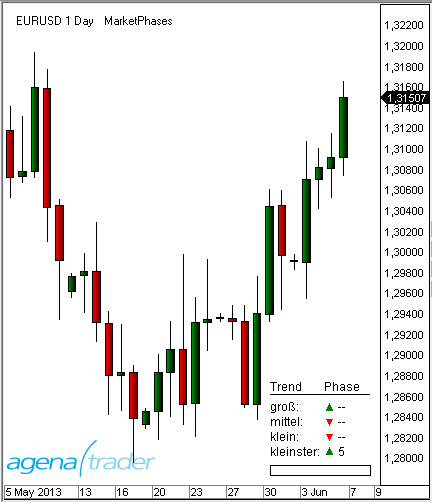

### Usage in AgenaScript
The indicator provides the following values for the market phases:

Phase 3: 3

Phase 4: 4

Phase 5: 5

Phase 5+ 55

Prom Queen 66

In a downtrend, the values are prefixed with a “-“ sign. If the market phase is not defined, then the value 0 is returned.
```cs
MarketPhases(int trendSize)[barsAgo]
```

**Parameter**

trendsize: trend size from 0 .. 3

**Caution:**

For a comparison of double values such as: **if** (**MarketPhases**(1)\[0\] == 55) ...we recommend that you use the following instead:
```cs
bool goLong = Math.Abs(MarketPhases(1)[0] - 55) <= Double.Epsilon;
```

### Usage within the Condition Escort
When using market phases within AgenaScript, the indicator provides a data series that has the aforementioned values of +/-3, 4, 5, 55, 66.

You can use the indicator as a filter by using the signals of other indicators when they are inside the market phases 55 or 66 (long):


##Momentum (MOM)
### Beschreibung
Das Momentum (MOM) ist einer der beliebtesten Indikatoren, der schon seit langer Zeit verwendet wird. Viele Trader schwören auf diesen simplen Indikator, weil er die Abschwächung der Bewegung misst, ohne mit einer zu komplizierten Formel das Letzte aus der Vorhersagbarkeit der Märkte herausholen zu wollen. Er ist ein einfaches Werkzeug und kann trotzdem gute Dienste leisten.
Der Momentum-Indikator ist ein Vertreter einer ganzen Familie von Indikatoren, die die Stärke einer Bewegung messen. Weitere Vertreter sind zum Beispiel der RSI und der CCI.
In der Darstellung zeigt der Indikator eine Kurve, die um einen Nullpunkt pendelt. Dabei hat sie keine feste Skala in Prozent. Der Wert kann sich also durchaus ungewöhnlich weit vom Nullpunkt entfernen. Dies geschieht immer dann, wenn der Kurs einen ungewöhnlich starken Sprung macht. Damit zeigt der Indikator in erster Linie die Richtung an, in die der aktuelle Kurs läuft.

### Interpretation
Einstiegssignale werden traditionell dann generiert, wenn der Indikator die Nulllinie durchkreuzt.

Siehe auch[*ROC*](#rate-of-change-roc).

### Weitere Informationen
Wikipedia: [http://de.wikipedia.org/wiki/Momentum_%28Chartanalyse%29](http://de.wikipedia.org/wiki/Momentum_%28Chartanalyse%29)

### Verwendung
```cs
Momentum(int period)
Momentum (IDataSeries input, int period)
Momentum (int period)[int barsAgo]
Momentum (IDataSeries input, int period)[int barsAgo]
```

###Rückgabewert
**double**

Bei Verwendung der Methode mit einem Index ( z.B.  **Momentum**(14)\[**int** barsAgo\] ) wird der Wert des Indikators für den referenzierten Bar ausgegeben.

### Parameters
input			Eingangsdatenreihe für den Indikator

period			Anzahl der Bars, die in die Berechnung einbezogen werden

### Darstellung
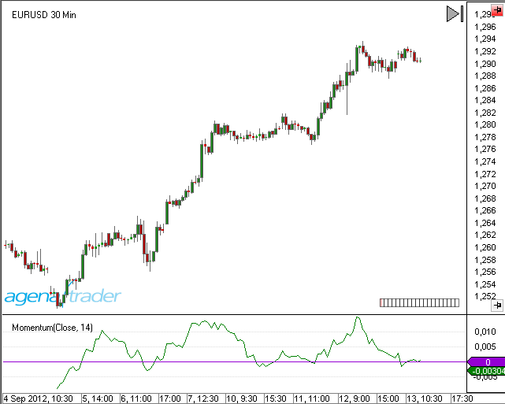

### Beispiel
```cs
//Ausgabe des Wertes für den Momentum-Indikator
Print("Der aktuelle Wert für das Momentum ist " + Momentum(14)[0]);
```

##Money Flow Index (MFI)
### Beschreibung
Der Money Flow Index (MFI) wurde von Gene Quong und Avrum Soudack veröffentlicht. Um den Relative Strength Index (RSI) zu verbessern wird eine Volumenkomponente eingebaut. Mit Hilfe des MFI soll die Stärke des in den Markt einfließenden Geldes messbar gemacht werden.
Der MFI wird wie der RSI errechnet, mit dem Unterschied, dass zuvor die Kurse mit dem Volumen multipliziert werden. Es werden wie beim RSI 14 Tage als Einstellung empfohlen. (Quelle: VTAD)


### Interpretation
Der MFI wird wie der RSI interpretiert. Der Ausschlag des MFI ist durch die Hinzuziehung des Volumens stärker als beim RSI, bei einem Verlauf in Trendrichtung.

### Weitere Informationen
VTAD: [http://vtadwiki.vtad.de/index.php/Money_Flow_Index](http://vtadwiki.vtad.de/index.php/Money_Flow_Index)

### Verwendung
```cs
MFI(int period)
MFI(IDataSeries input, int period)
MFI(int period)[int barsAgo]
MFI(IDataSeries input, int period)[int barsAgo]
```

### Rückgabewert
**double**

Bei Verwendung der Methode mit einem Index ( z.B. **MFI**(14)\[**int** barsAgo\] ) wird der Wert des Indikators für den referenzierten Bar ausgegeben.

### Parameters
input	Eingangsdatenreihe für den Indikator

period	Anzahl der Bars, die in die Berechnung einbezogen werden

### Darstellung


### Beispiel
```cs
//Anzeige des aktuellen MFI-Wertes
Print("Der aktuelle Wert des MFI ist: " + MFI(14)[0]);
```

##Moving Averages
### Varianten
[*DEMA*](#dema-double-exponential-moving-average) - Double Exponential Moving Average

[*EMA*](#ema-exponential-moving-average) - Exponential Moving Average

[*HMA*](#hma-hull-moving-average) - Hull Moving Average

[*KAMA*](#kama-kaufmans-adaptive-moving-average) - Kaufman's Adaptive Moving Average

[*MAMA*](#mama-mesa-adaptive-moving-average) - Mesa Adaptive Moving Average

[*SMA*](#sma-simple-moving-average) - Simple Moving Average

[*TEMA*](#tema-triple-exponential-moving-average) - Triple Exponential Moving Average

[*TMA*](#tma-triangular-moving-average) - Triangular Moving Average

[*TRIX*](#trix-triple-exponential-moving-average) - Triple Exponential Moving Average

[*T3*](#t3-triple-exponential-moving-average) - Triple Exponential Moving Average

[*VMA*](#vma-variable-moving-average) - Variable Moving Average

[*VWMA*](#vwma-volume-weighted-moving-average) - Volume Weighted Moving Average

[*WMA*](#wma-weighted-moving-average), [*VMA*](#vma-variable-moving-average) - Weighted Moving Average

[*ZLEMA*](#zlema-zero-lag-exponential-moving-average) - Zero Lag Exponential Moving Average

### Bedeutung
Der arithmetische Durchschnitt, der auch als einfacher Durchschnitt (Englisch: Simple Moving Average - SMA) oder Gleitender Durchschnitt (GD) bezeichnet wird (Englisch: Moving Average - MA), glättet den Kursverlauf für eine bessere Trenderkennung. Gleitende Durchschnitte sind Trendfolgeindikatoren, sie folgen dem Kurs und laufen nicht voraus. Steigende GD's zeigen Aufwärtstrends an, fallende GD's zeigen fallende Trends an.
Durch das Variieren der Berechnungsdauer, wird die zeitliche Verzögerung des gleitenden Durchschnitts verändert. Je kleiner der Berechnungszeitraum ist, desto kürzer wird die Reaktionsverzögerung, aber auch die glättende Wirkung wird geringer. Wird der Berechnungszeitraum vergrößert, ist der Verlauf genau umgekehrt. Die häufigsten Einstellungen, für gleitende Durchschnitte sind 38, 50, 100 und 200 Tage. Insbesondere der 200 Tage Durchschnitt hat bei institutionellen Anlegern große Bedeutung, da er den langfristigen Trend anzeigt. 200 (Handels-)Tage entsprechen ungefähr einem Jahr. Wird der 200 Tage Durchschnitt nachhaltig gebrochen, werden Kaufsignale (Kurs steigt über den 200 GD) bzw. Verkaufssignale (Kurs fällt unter 200 GD) generiert.

### Einsatzmöglichkeiten
**Kreuzung zweier gleitender Durchschnitte**

Die Integration von mehreren gleitenden Durchschnitten wird eingesetzt, um Trendfolgen besser zu erkennen und die Anzahl von Fehlsignalen zu minimieren. Bei der Benutzung von zwei arithmetischen Durchschnitten werden ein kurzfristiger und ein langfristiger Durchschnitt verwendet, z.B. benutzt Richard Donchian hier 5 und 20 Tage.
Bei der Double Cross Over Methode werden die Signale folgendermaßen generiert:

Kreuzt der kurze Durchschnitt den langen Durchschnitt von unten nach oben, wird diese Kreuzung Golden Cross genannt. Es wird ein Kaufsignal generiert. Hohes Handelsvolumen verstärkt das Signal. Der lange gleitende Durchschnitt fungiert im Aufwärtstrend als Unterstützungslinie.

Kreuzt der kurze Durchschnitt den langen Durchschnitt von oben nach unten, wird diese Kreuzung Death Cross genannt. Es wird ein Verkaufssignal generiert. Hohes Handelsvolumen verstärkt das Signal. Der lange gleitende Durchschnitt fungiert im Abwärtstrend als Widerstandslinie.

**Kreuzung dreier gleitender Durchschnitte**

Eine Erweiterung bietet die Benutzung von drei gleitenden Durchschnitten (= Triple Crossover Method). R.C. Allen verwendet den 4, 9 und 18 Tage Durchschnitt. Hierbei wird ein Trendwechsel angedeutet, wenn der 4-Tage-Durchschnitt den 9-Tage-Durchschnitt von unten nach oben schneidet. Jedoch erfolgt der Einstieg in eine Long-Position, wenn beide Durschnitte über dem 18-Tage-Durchschnitt liegen. Ein Ausstieg erfolgt wenn der 4-Tage-Durchschnitt unter den 9-Tage-Durchschnitt fällt. Genau Spiegelbildlich verhält es sich beim Ein- und Ausstieg in/aus eine(r) Short-Position.
(Quelle: VTAD)

##DEMA - Double Exponential Moving Average
### Beschreibung
Der DEMA ist ein technischer Indikator, der von Patrick Mulloy entwickelt wurde. Er erschien erstmals 1994 in der Februarausgabe der "Technical Analysis of Stocks & Commodities". Die Berechnung basiert sowohl auf einem einfachen als auch auf einem doppelten exponentiell gleitenden Durchschnitt (EMA).

### Interpretation
Der DEMA ist ein schnell arbeitender gleitenden Durchschnitt, der besser auf Marktveränderungen reagiert, als eine herkömmlicher gleitender Durchschnitt. Der DEMA kann als Standalone-Indikator oder in anderen Indikatoren bzw. Bedingungen (Conditions) verwendet werden, deren Logik auf gleitenden Durchschnitten beruht.
Zur generellen Interpretation von gleitenden Durchschnitten siehe auch unter Moving Averages.

### Verwendung
```cs
DEMA(int period)
DEMA(IDataSeries input, int period)
DEMA(int period)[int barsAgo]
DEMA(IDataSeries input, int period)[int barsAgo]
```

### Rückgabewert
**double**

Bei Verwendung der Methode mit einem Index ( z.B.  **DEMA**(20)\[**int** barsAgo\] ) wird der Wert des Indikators für den referenzierten Bar ausgegeben.

### Parameters
input		Eingangsdatenreihe für den Indikator

period		Anzahl der Bars, die in die Berechnung einbezogen werden

### Darstellung
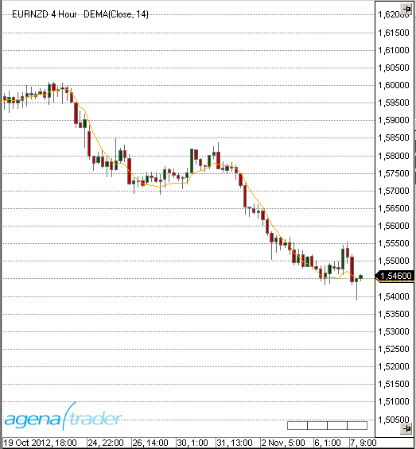

### Berechnung
```cs
Value.Set(2 * EMA(Inputs[0], Period)[0] - EMA(EMA(Inputs[0], Period), Period)[0]);
```

### Beispiel
```cs
//Ausgabe des Wertes für den Double Exponential Moving Average (DEMA)
Print("Der aktuelle Wert für DEMA ist " + DEMA(20)[0]);
```

##EMA - Exponential Moving Average
### Beschreibung
Der Exponential Moving Average (EMA) ist einem einfachen gleitenden Durchschnitt, wie z.B. dem SMA oder dem MACD sehr ähnlich. Im Unterschied zu den einfachen gleitenden Durchschnitten wird in der Berechnung den aktuelleren Kursdaten eine hohere Bedeutung beigemessen.

### Interpretation
Der EMA wird von vielen Trader in den unterschiedlichsten Zeiteinheiten benutzt. Bedeutung erhält der EMA insbesondere in 15, 60 und 240-Minuten-Charts. Sehr beliebt ist auch die EMA-200-Linie.
Steigt der Kurs eines Wertes stark an und entfernt sich deutlich von der jeweilig zuzuordnenden EMA-Linie, so ist es möglich, mit einer der Marktrichtung entgegengesetzten Position (im Bsp. einer Shortposition) von der wahrscheinlichen Rückkehr des Kurse an seinen Durchschnitt zu profitieren. 
Zur generellen Interpretation von gleitenden Durchschnitten siehe auch unter Moving Averages.

### Verwendung
```cs
EMA(int period)
EMA(IDataSeries input, int period)
EMA(int period)[int barsAgo]
EMA(IDataSeries input, int period)[int barsAgo]
```

###  Rückgabewert
**double**

Bei Verwendung der Methode mit einem Index ( z.B. **EMA**(20)\[**int** barsAgo\] ) wird der Wert des Indikators für den referenzierten Bar ausgegeben.

### Parameters
input		Eingangsdatenreihe für den Indikator

period		Anzahl der Bars, die in die Berechnung einbezogen werden

### Darstellung


### Berechnung
```cs
Value.Set(ProcessingBarIndex == 0 ? InSeries[0] : InSeries[0] * (2.0 / (1 + Period)) + (1 - (2.0 / (1 + Period))) * Value[1]);
```

### Beispiel
```cs
//Ausgabe des Wertes für den Exponential Moving Average (EMA)
Print("Der aktuelle Wert für EMA ist " + EMA(20)[0]);
```

##EMA MTF (MultiTimeFrame)
### Beschreibung
Der Indikator EmaMTF ist die Multi TimeFrame-Variante des Exponential Moving Average (EMA).
Er ist hauptsächlich für die Nutzung im Intraday-Bereich geeignet.
Multi TimeFrame bedeutet, dass der Indikator in einer anderen Zeiteinheit berechnet werden kann, als der Kurs im Chart angezeigt wird. Möchte man z.B. in einem 5-Minuten Chart den EMA des Stundencharts angezeigt bekommen, ist das mit dem Indikator EMA nicht möglich. Hier ist EmaMTF zu verwenden.
Im Indikator EmaMTF kommt ein weiterer Parameter (MTFMinutes) hinzu, der die Zeiteinheit angibt, auf der die Berechnung des EMA vorgenommen werden soll.
EmaMTF dienst nur zur Anzeige in einem Chart und kann nicht in AgenaScript verwendet werden.
Für die Programmierung mit Datenreihen aus mehreren Zeiteinheiten siehe unter Multibars.
Für alle weiteren Informationen bzgl. Anwendung und Interpretation des EMA siehe unter  [*EMA*](#ema-exponential-moving-average).

Siehe auch [*BollingerMTF*](#bollingermtf), [*SmaMTF*](#smamtf).


### Darstellung
Die Abbildung zeigt einen 5 Min.-Chart mit einem EMA(20) berechnet auf 1-Stunden-Bars.


##HMA - Hull Moving Average
### Beschreibung
Der Hull Moving Average wurde vom Trader Alan Hull entwickelt und ist ein sehr schnell arbeitender gleitender Durchschnitt, der Verzögerungen nahezu gänzlich eleminiert (Zero Lag). Für die Berechnung werden gewichtete gleitende Durchschnitte genutzt, weshalb die glättende Wirkung (und die daraus resultierende Verzögerung) herkömmlicher gleitender Durchschnitte abgemildert werden kann. Hull erreicht diese Verbesserung, indem er statt der Periode selbst, die Quadratwurzel aus der Zeit verwendet.

### Interpretation
Falls in einem Handelssystem zur Trendbestimmung ein gleitender Durchschnitt eingesetzt werden soll, muss die Verzögerung möglichst gering sein. Hier zeigt der Hull Moving Average seine Stärken. Die Durchschnittsberechnung ist deutlich weniger verzögert, als bei einem einfachen gleitenden Durchschnitt. Der Hull Moving Average bietet in Kombination z.B. mit einem SMA einen guten kurzfristiger Trendfilter.
Zur generellen Interpretation von gleitenden Durchschnitten siehe auch unter [*Moving Averages*](#moving-averages).

### Verwendung
```cs
HMA(int period)
HMA(IDataSeries InSeries, int period)
HMA(int period)[int barsAgo]
HMA(IDataSeries InSeries, int period)[int barsAgo]
```

###Rückgabewert
**double**

Bei Verwendung der Methode mit einem Index ( z.B. **HMA**(21)\[**int** barsAgo\] ) wird der Wert des Indikators für den referenzierten Bar ausgegeben.

### Parameters
input		Eingangsdatenreihe für den Indikator

period		Anzahl der Bars, die in die Berechnung einbezogen werden

### Darstellung


### Berechnung
```cs
double value1 = 2 * WMA(Inputs[0], (int)(Period / 2))[0];
double value2 = WMA(Inputs[0], Period)[0];
diffSeries.Set(value1 - value2);
Value.Set(WMA(diffSeries, (int) Math.Sqrt(Period))[0]);
```

### Beispiel
```cs
//Ausgabe des Wertes für den Hull Moving Average (HMA)
Print("Der aktuelle Wert für HMA ist " + HMA(21)[0]);
```

##KAMA - Kaufman's Adaptive Moving Average
### Beschreibung
Der von Perry Kaufman entwickelte Kaufmann's Adaptive Moving Average (KAMA) stellt einen adaptiven Gleitenden Durchschnitt dar, der als Trendfolgeinstrument konstruiert wurde.
Der KAMA beruht auf einem exponentiellen Durchschnitt (EMA), bei dem die Gewichtung des hinzukommenden Kurses über eine Trendeffizienz-Kennzahl, der Efficiency Ratio, gesteuert wird. Die Efficiency Ratio (der sog. quadrierte Effizienz-Faktor) ist eine Kennzahl, die auch eigenständig gute Dienste leisten kann. Die Trendeffizienz ist definiert als das Verhältnis der absoluten Kursänderung, von Anfang bis zum Ende des Betrachtungszeitraums, und der Summe der absoluten täglichen Kursänderungen. Bei hoher Trendeffizienz, also bei einer geradlinigen Bewegungen ohne starke Schwankungen, wird dem hinzukommenden Kurs ein hohes Gewicht eingeräumt, was einer kurzen Einstellung in Tagen entspricht. Bei geringer Trendeffizienz, also bei einer stark schwankenden Bewegung, wird dem hinzukommenden Kurs ein geringes Gewicht eingeräumt, dies entspricht einer langen Einstellung in Tagen. (Quelle: investor-verlag)

### Interpretation
Perry Kaufman sieht ein grundlegendes Signal für steigende Kurse, wenn der KAMA nach oben dreht und ein grundlegendes Signal für fallende Kurse, wenn der KAMA nach unten dreht.
Kaufman definiert noch einen Maximal- und einen Minimalwert für die Berechnung der jeweiligen Glättungskomponente. Die Efficiency Ratio wird mit Hilfe des definierten Maximal- und Minimalwerts in den Faktor umgerechnet, mit dem ein neu zum exponentiellen Durchschnitt hinzugefügter Kurs gewichtet wird. Als Minimalwert (fast) werden 2 und als Maximalwert (slow) 30 Tage von Perry Kaufman verwendet. Die Tageanzahl für die Ermittlung der Efficiency Ratio ist der wichtigste Parameter beim KAMA. Für kurzfristige Strategien hält Perry Kaufman einen Wert um die 10 Tage für empfehlenswert. Ein Wert von kleiner 5 sorgt dafür, das die Efficiency Ratio zu schnell zwischen 0 und 1 hin und her springt. Für langfristiges Positionstrading kann auch ein viel längerer Zeitraum attraktiv sein, da dies zu stabilerem Verhalten bei Nebengeräuschen im Trend führt.
Zur generellen Interpretation von gleitenden Durchschnitten siehe auch unter [*Moving Averages*](#moving-averages).

### Weitere Informationen
<http://www.investor-verlag.de/boersenwissen/kama/>

### Verwendung
```cs
KAMA(int fast, int period, int slow)
KAMA(IDataSeries input, int fast, int period, int slow)
KAMA(int fast, int period, int slow)[int barsAgo]
KAMA(IDataSeries input, int fast, int period, int slow)[int barsAgo]
```

### Rückgabewert
**double**

Bei Verwendung der Methode mit einem Index ( z.B. **KAMA**(2,10,30)\[**int** barsAgo\] ) wird der Wert des Indikators für den referenzierten Bar ausgegeben.

### Parameters
input		Eingangsdatenreihe für den Indikator

period		Anzahl der Bars, die in die Berechnung einbezogen werden

fast		kurze Periode (s. Interpretation)

slow		lange Periode (s. Interpretation)

### Darstellung


### Beispiel
```cs
//Ausgabe des Wertes für den Kaufman Moving Average (KAMA)
Print("Der aktuelle Wert für KAMA ist " + KAMA(2,10,30)[0]);
```

##MAMA - Mesa Adaptive Moving Average
### Beschreibung
Der MAMA (Mesa Adaptive Moving Average) ist ein auto adaptiver gleitender Durchschnitt, dessen Periodenlänge über komplexe Berechnungen bestimmt wird. Er basiert auf einem exponentiellen Moving Average, dessen Alpha - Glättungsparameter in verschiedenen Marktphasen verändert wird.
Dieser Indikator stammt aus Publikationen von John Ehlers und ist vor allem hinsichtlich der Berechnungen schwer zu verstehen. John Ehlers berechnet Zyklen in den Kursbewegungen, um Länge und Intensität einzelner Trendphasen zu ermitteln. An Hand der Länge der ermittelten Zyklen, kann dann der Gewichtungsfaktor des gleitenden Durchschnitts variabel gestaltet werden. Somit wird erreicht, dass der Indikator in Trendphasen möglichst lange mitläuft, ohne durch kleinen Gegenbewegungen zu sehr aus der Bahn geworfen zu werden. Somit steuert der Markt selbst die Agilität des gleitenden Durchschnitts.

**FAMA**
Der Indikator stellt neben dem eigentlichen MAMA, eine zweite Linie dar, die in den Publikationen als FAMA bezeichnet wird. Diese Linie dient als Triggerlinie und ist dem zu Grunde liegenden exponentiellen gleitenden Durchschnitt sehr ähnlich. (Quelle: tradesignalonline.com)

### Interpretation
Ehlers behauptet in seinen Publikationen, dass die von ihm entwickelten Indikatoren Handelssysteme ermöglichen, die wesentlich weniger Fehler produzieren, als herkömmliche Systeme. Die hier vorgestellten auto adaptivem Durchschnitte MAMA und FAMA, sollen weniger Fehlsignale produzieren, da sie sich an die vorherrschende Zyklenlänge und die Marktvolatilität anpassen. Im Grunde werden beide Linien als banales Cross Over System verwendet. Überkreuzt der langsamere MAMA den schnelleren FAMA, ist das ein Kaufsignale, umgekehrt ein Verkaufs- oder Leerverkaufssignal.
Zur generellen Interpretation von gleitenden Durchschnitten siehe auch unter  [*Moving Averages*](#moving-averages).

### Further information
<http://www.tradesignalonline.com/de/lexicon/view.aspx?id=MAMA+adaptive+Moving+Average>

### Verwendung
```cs
MAMA(double fastLimit, double slowLimit)
MAMA(IDataSeries input, double fastLimit, double slowLimit)
MAMA(double fastLimit, double slowLimit)[int barsAgo]
MAMA(IDataSeries input, double fastLimit, double slowLimit)[int barsAgo]

Für den Wert des Following Adaptive Moving Average (FAMA)
MAMA(double fastLimit, double slowLimit).Fama[int barsAgo]
MAMA(IDataSeries input, double fastLimit, double slowLimit).Fama[int barsAgo]
```

### Rückgabewert
**double**

Bei Verwendung der Methode mit einem Index ( z.B.  **MAMA**(0.5,0.05)\[**int** barsAgo\] ) wird der Wert des Indikators für den referenzierten Bar ausgegeben.

### Parameters
input		Eingangsdatenreihe für den Indikator

fastLimit	Oberes Limit für den Alpha-Wert

slowLimit	Unteres Limit für den Alpha-Wert

### Darstellung


### Beispiel
```cs
//Ausgabe des Wertes für den MESA Adaptive Moving Average (MAMA)
Print("Der aktuelle Wert für MAMA ist " + MAMA(0.5, 0.05)[0]);
//Ausgabe des Wertes für den Following Adaptive Moving Average (FAMA)
Print("Der aktuelle Wert für MAMA ist " + MAMA(0.5, 0.05).Fama[0]);
```

##SMA - Simple Moving Average
### Beschreibung
Der SMA ist die "Mutter aller gleitenden Durchschnitte" und stellt die einfachste Möglichkeit dar, einem Chartbild Informationen zum bereinigten Trendverlauf zu entnehmen. Von der mathematischen Seite her betrachtet handelt es sich um das arithmetische Mittel einer Zahlenreihe individueller Länge. 
Der Begriff “gleitend” leitet sich von der Tatsache ab, dass bei dieser Form der Durchschnittsbildung immer der älteste Kurs dem aktuell hinzugekommenen “geopfert” wird. Grundsätzlich festzustellen ist dass, die Länge der Periodenangabe die Intensität der Glättung beeinflusst. Kürzere Betrachtungszeiträume (beispielsweise 10 Tage) führen dazu, dass der Indikator dem Kursverlauf relativ eng folgt, die berühmte 200-Tage-Linie (also SMA mit Periodenangabe 200 Tage) weist hingegen eine sehr große Trägheit auf.
Der Simple Moving Avergage weist gewisse Nachteile auf weshalb auch diverse Abwandlungen des Orginalkonzeptes im Laufe der Jahre entstanden. An erster Stelle zu nennen ist die Trägheit des SMA (oft auch als “lag” bezeichnet) und die gleiche Gewichtung aller Datensätze im Betrachtungszeitraum. So hat der letzte Kurs bei einer 14-Tages-Linie die gleiche Wertigkeit für den Indikatorverlauf wie der erste Wert. (Quelle: forex-trading-online.de)

### Interpretation
Trotz der - im Vegleich zu anderen hochkomplexen Indikatorensystemen - simplen Herleitung ist die einfachste Form der Durchschnittsbildung nach wie vor von großer Praxisbedeutung, die wichtigsten Anwendungsbereiche sind die klassische Trendbestimmung, die Integration in automatische Handelssysteme sowie die Verwendung als Signallinie in Kombination mit anderen Indikatoren.
Zur generellen Interpretation von gleitenden Durchschnitten siehe auch unter : [*Moving Averages*](#moving-averages).


### Weitere Informationen
<http://www.forex-trading-online.de/indikatoren/simple-moving-average-sma>

<http://vtadwiki.vtad.de/index.php/SMA\#Average-Off-Berechnungsverfahren\_.28MMA.29>

### Verwendung
```cs
SMA(int period)
SMA(IDataSeries InSeries, int period)
SMA(int period)[int barsAgo]
SMA(IDataSeries InSeries, int period)[int barsAgo]
```

### Rückgabewert
**double**

Bei Verwendung der Methode mit einem Index ( z.B. **SMA**(14)\[**int** barsAgo\] ) wird der Wert des Indikators für den referenzierten Bar ausgegeben.

### Parameters
input		Eingangsdatenreihe für den Indikator

period		Anzahl der Bars, die in die Berechnung einbezogen werden

### Darstellung
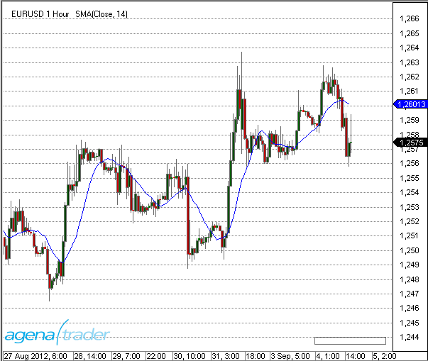

### Berechnung
Value.**Set**((last + InSeries\[0\] - InSeries\[Period\]) / Math.**Min**(ProcessingBarIndex, Period));

### Beispiel
```cs
//Output of the SMA value
Print("The current SMA value is " + SMA(14)[0]);
```

##SMA MTF (MultiTimeFrame)
### Beschreibung
Der Indikator SmaMTF ist die Multi TimeFrame-Variante des Simple Moving Average (SMA).
Er ist hauptsächlich für die Nutzung im Intraday-Bereich geeignet.
Multi TimeFrame bedeutet, dass der Indikator in einer anderen Zeiteinheit berechnet werden kann, als der Kurs im Chart angezeigt wird. Möchte man z.B. in einem 5-Minuten Chart den SMA des Stundencharts angezeigt bekommen, ist das mit dem Indikator SMA nicht möglich. Hier ist SmaMTF zu verwenden.
Im Indikator SmaMTF kommt ein weiterer Parameter (MTFMinutes) hinzu, der die Zeiteinheit angibt, auf der die Berechnung des SMA vorgenommen werden soll.
SmaMTF dienst nur zur Anzeige in einem Chart und kann nicht in AgenaScript verwendet werden.
Für die Programmierung mit Datenreihen aus mehreren Zeiteinheiten siehe unter Multibars.

Für alle weiteren Informationen bzgl. Anwendung und Interpretation des SMA siehe unter SMA.

Siehe auch [*BollingerMTF*](#bollingermtf), [*EmaMTF*](#ema-mtf-multitimeframe).

### Darstellung
Die Abbildung zeigt einen 5 Min.-Chart mit einem SMA(14) berechnet auf 4-Stunden-Bars.


##SMMA - Smoothed Moving Average
### Beschreibung
Der Smoothed Moving Average (SMMA) ist eine Art Mischung aus Simple Moving Average (SMA) und Exponential Moving Average (EMA).
Er wird i.d.R. nur für eine größere Periodenanzahl verwendet.
Als Richtwert kann die Hälfte der EMA-Perioden herangezogen werden.
Ein SMMA(20) entspricht annährend einem EMA(40).

### Interpretation
Der wichtigste Anwendungsbereich von gleitenden Durchschnitten generell ist die klassische Trendbestimmung. Gleitende Durchschnitte werden häufig in automatische Handelssysteme integriert oder als Signallinie in Kombination mit anderen Indikatoren verwendet.

Zur generellen Interpretation von gleitenden Durchschnitten siehe auch unter[*Moving Averages*](#moving-averages).

Der SMMA wird zudem häufig im Zusammenhang mit dem [*SuperTrend*](#supertrend)-Indikator verwendet.

### Weitere Informationen
<http://www2.wealth-lab.com/wiki/SMMA.ashx>

### Verwendung
```cs
SMMA(int period)
SMMA(IDataSeries input, int period)
SMMA(int period)[int barsAgo]
SMMA(IDataSeries input, int period)[int barsAgo]
```

### Rückgabewert
**double**

Bei Verwendung der Methode mit einem Index ( z.B.  **SMMA**(14)\[**int** barsAgo\] )wird der Wert des Indikators für den referenzierten Bar ausgegeben.

### Parameters
input		Eingangsdatenreihe für den Indikator

period		Anzahl der Bars, die in die Berechnung einbezogen werden

### Darstellung


### Beispiel
```cs
//Ausgabe des Wertes für den Smoothed Moving Average (SMMA)
Print("Der aktuelle Wert für SMMA ist" + SMMA(14)[0]);
```

##TEMA - Triple Exponential Moving Average
### Beschreibung
Der Triple Exponential Moving Average (TEMA) ist die Kombination aus einem einzelnen exponentiellen gleitenden Durchschnitt (EMA), einem doppelten EMA und einem dreifachen EMA. Die Kombination der Indikatoren hilft, Verzögerungen zwischen den Indikatoren und der Preisbewegung zu eliminieren. TEMA ist ein sehr effektiver Glättungsindikator.

### Interpretation
Der Indikator ist schneller und glatter als ein herkömmlicher gleitender Durchschnitt. Der TEMA wird häufig in Kombination mit anderen Indikatoren (z.B. MACD oder CCI) genutzt.
Ein starkes Kaufsignal würde auftreten, wenn der CCI nach oben durch 0 kreuzt, der TEMA Indikator nach oben tendiert und der Preis zurückkehrt zum TEMA.
Für ein Verkaufssignal sollte der TEMA unterhalb der Kurse verlaufen, wenn der CCI die 0 Ebene nach unten kreuzt, und der Preis zurück zum TEMA kehrt.
Zur generellen Interpretation von gleitenden Durchschnitten siehe auch unter [*Moving Averages*](#moving-averages).

### Verwendung
```cs
TEMA(int period)
TEMA(IDataSeries input, int period)
TEMA(int period)[int barsAgo]
TEMA(IDataSeries input, int period)[int barsAgo]
```

### Rückgabewert
**double**

Bei Verwendung der Methode mit einem Index ( z.B. **TEMA**(14)\[**int** barsAgo\] ) wird der Wert des Indikators für den referenzierten Bar ausgegeben.

### Parameters
input		Eingangsdatenreihe für den Indikator

period		Anzahl der Bars, die in die Berechnung einbezogen werden 

### Darstellung


### Beispiel
```cs
//Ausgabe des Wertes für den Triple Exponential Moving Average (TEMA) 
Print("Der aktuelle Wert für TEMA ist" + TEMA(14)[0]);
```

##TMA - Triangular Moving Average
### Beschreibung
Der Triangular Moving Average (TMA) ist ein speziell gewichteter gleitender Durchschnitt mit einer besonderen Glättung. Die Gewichte sind nicht wie bei anderen gewichteten Durschnitten linear, sondern nach einem dreieckigen Muster zugeordnet. Die Gewichte für einen 7 Perioden unfassenden Zeitraum sind beispielsweise 1, 2, 3, 4, 3, 2, 1. Die Mitte der Zeitreihe wird hierdurch höher, die neuesten resp. ältesten Daten entsprechend geringer gewichtet.

### Interpretation
Die Interpretation des Triangular Moving Average folgt im Wesentlichen der Interpretation anderer gleitender Durchnitte, wie dem SMA oder dem EMA. Es gibt hierbei keine weiteren Besonderheiten zu beachten.

Zur generellen Interpretation von gleitenden Durchschnitten siehe auch unter [*Moving Averages*](#moving-averages).

### Verwendung
```cs
TMA(int period)
TMA(IDataSeries input, int period)
TMA(int period)[int barsAgo]
TMA(IDataSeries input, int period)[int barsAgo]
```

### Rückgabewert
**double**

Bei Verwendung der Methode mit einem Index ( z.B.  **TMA**(14)\[**int** barsAgo\] ) wird der Wert des Indikators für den referenzierten Bar ausgegeben.

### Parameters
input		Eingangsdatenreihe für den Indikator

period		Anzahl der Bars, die in die Berechnung einbezogen werden 

### Darstellung


### Beispiel
```cs
//Ausgabe des Wertes für den Triangular Moving Average (TMA) 
Print("Der aktuelle Wert für TMA ist" + TMA(14)[0]);
```

##TRIX - Triple Exponential Moving Average
### Beschreibung
Der TRIX - Indikator wurde von Jack Hutson präsentiert. Es handelt sich dabei um einen 1-Tages-Rate of Change-Indikator (ROC), d.h. Tag 2 dividiert durch Tag 1, Tag 3 durch Tag 2 usw., eines dreifach exponentiell geglätteten gleitenden Durchschnittes der Schlusskurse eines Wertes. Das Ergebnis ist ein um seine Null-Linie schwankender Oszillator, der aufgrund seiner Stabilität als Trendindikator verwendet wird.


### Interpretation
Es entsteht ein Kaufsignal, wenn der TRIX-Indikator seine Null-Linie von unten nach oben schneidet. Ein Verkaufssignal wird generiert, wenn er die Null-Linie nach unten durchbricht. Divergenzen deuten auf einen Trendwechsel hin.

### Verwendung
```cs
TRIX(int period, int signalPeriod)
TRIX(IDataSeries input, int period, int signalPeriod)
TRIX(int period, int signalPeriod)[int barsAgo]
TRIX(IDataSeries input, int period, int signalPeriod)[int barsAgo]

Für die Signal-Linie
TRIX(int period, int signalPeriod).Signal[int barsAgo]
TRIX(IDataSeries input, int period, int signalPeriod).Signal[int barsAgo]
```

### Rückgabewert
**double**

Bei Verwendung der Methode mit einem Index ( z.B.  **TRIX**(14, 3)\[**int** barsAgo\] ) wird der Wert des Indikators für den referenzierten Bar ausgegeben.

### Parameters
input		Eingangsdatenreihe für den Indikator

period		Anzahl der Bars, die in die Berechnung einbezogen werden

signal period	Anzahl der Bars, die in die Berechnung der Signal-Linie einbezogen werden

### Darstellung


### Beispiel
```cs
//Ausgabe des Wertes für den Triple Exponential Moving Average (TRIX) 
Print("Der aktuelle Wert für TRIX ist" + TRIX(14, 3)[0]);

//Ausgabe des Wertes für die TRIX-Signallinie 
Print("Der aktuelle Wert für TRIX ist" + TRIX(14, 3).Signal[0]);
```

##T3 - Triple Exponential Moving Average
### Beschreibung
Der Triple Exponential Moving Average T3 (oder auch T3MA) ist ein Vertreter der extrem geglätteten Gleitenden Durchschnitte. Zur Berechnung wird eine gewichtete Summe eines einfachen EMA, eines doppelten EMA und eines dreifachen EMA verwendet. Dies ergibt einen sehr glatten und "weichen" Verlauf der Indikatorlinie.
Die Anzahl der Iterationen ist bei der vorliegenden T3-Implementation mit dem Parameter tCount einstellbar. Die Standardeinstellung ist 3.
Die Berechnung gleicht dem DEMA, wobei hier zusätzlich ein Volumen-Faktor (VFactor) hinzukommt. Er nimmt Werte zwischen 0 und 1 an (default =0,7).
Ist der VFactor = 0, entspricht der Verlauf einem EMA (mit TCount =1).
Ist der VFactor = 1, entspricht der Verlauf dem DEMA.

### Interpretation

Die Interpretation des T3 gleicht der Interpretation anderer gleitender Durchnitte. Es gibt hierbei keine weiteren Besonderheiten zu beachten.
Zur generellen Interpretation von gleitenden Durchschnitten siehe auch unter [*Moving Averages*](#moving-averages).

### Verwendung
```cs
T3(int period, int tCount, double vFactor)
T3(IDataSeries input, int period, int tCount, double vFactor)
T3(int period, int tCount, double vFactor)[int barsAgo]
T3(IDataSeries input, int period, int tCount, double vFactor)[int barsAgo]
```

###  Rückgabewert
**double**

Bei Verwendung der Methode mit einem Index ( z.B. **T3**(14,3,0.7)\[**int** barsAgo\] ) wird der Wert des Indikators für den referenzierten Bar ausgegeben.

### Parameters
input		Eingangsdatenreihe für den Indikator

period		Anzahl der Bars, die in die Berechnung einbezogen werden

tCount		Anzahl der Iterationen für die Glättung (default: 3)

vFactor	Volumen Factor (Multiplicator) (default: 0,7)

### Darstellung


### Beispiel
```cs
//Ausgabe des Wertes für den T3 Moving Average (T3) 
Print("TDer aktuelle Wert für T3 ist" + T3(14, 3, 0.7)[0]);
```

##VMA - Variable Moving Average
### Beschreibung
Der Variable Moving Average (VMA) ist ein EMA, der in der Lage ist, seine Glättung automatisch auf die Schwankungen im Markt einstellen kann. Die Empfindlichkeit wächst, indem mehr Gewicht auf die jüngeren Daten gelegt wird.
Durch die automatische Regulierung der Glättungskonstante wird versucht, den bekannten Nachteilen von gleitenden Durchschnitten zu begegnen. Der VMA soll auf diese Weise unter allen Marktbedingungen besser funktionieren.

**Verwechselungsgefahr!**
Die Abkürzung VMA wird in der Literatur bzw. in anderer Handelssoftware auch für Volume Moving Average (VolMA) verwendet.

### Interpretation
Der Indikator wird auf die übliche Art zur Identifizierung von Trends angewandt. Es gibt bei der Verwendung keine Besonderheiten zu beachten.
Zur generellen Interpretation von gleitenden Durchschnitten siehe auch unter [*Moving Averages*](#moving-averages).

### Verwendung
```cs
VMA(int period, int volatilityPeriod)
VMA(IDataSeries input, int period, int volatilityPeriod)
VMA(int period, int volatilityPeriod)[int barsAgo]
VMA(IDataSeries input, int period, int volatilityPeriod)[int barsAgo]
```

### Rückgabewert
**double**

Bei Verwendung der Methode mit einem Index ( z.B. **VMA**(9,9)\[**int** barsAgo\] ) wird der Wert des Indikators für den referenzierten Bar ausgegeben.

### Parameters
input			Eingangsdatenreihe für den Indikator

period			Anzahl der Bars, die in die Berechnung einbezogen werden

volatility period		Anzahl der Bars, die in die Berechnung der Signal-Linie einbezogen werden

### Darstellung


### Beispiel
```cs
//Ausgabe des Wertes für den Variable Moving Average (VMA) 
Print("Der aktuelle Wert für VMA ist  " + VMA(9, 9)[0]);
```

##VWMA - Volume Weighted Moving Average
### Beschreibung
Der Volume Weighted Moving Average (VWMA) ist ein gewichteter gleitender Durchschnitt, der zur Gewichtung der Perioden das entspr. Volumen verwendet, d.h. Tage (Perioden) mit höherem Volumen bekommen mehr Gewicht. VWMA ist ein nicht-kumulativer gleitenden Durchschnitt.
### Interpretation
VWAP wird v.a. verwendet, um die Liquidität zu identifizieren. Als volumengewichteter Indikator spiegelt er bestimmte Preisniveaus anhand ihres jeweiligen Volumens wider. Dies kann Institutionen mit großen Aufträgen helfen. Die Idee ist, den Markt beim Betreten mit großen Kauf-bzw. Verkaufsaufträgen nicht zu stören. VWAP hilft liquide und illiquide Preispunkte zu bestimmen
Intraday dient VWAP hauptsächlich zur Bestimmung des Trendes. VWAP hinkt dem Preis hinterher. Diese Verzögerung wird mit fortschreitender Handelszeit über den Tag hinweg größer.
Zur generellen Interpretation von gleitenden Durchschnitten siehe auch unter [*Moving Averages*](#moving-averages).

### Verwendung
```cs
VWMA(int period)
VWMA(IDataSeries input, int period)
VWMA(int period)[int barsAgo]
VWMA(IDataSeries input, int period)[int barsAgo]
```

### Rückgabewert
**double**

Bei Verwendung der Methode mit einem Index ( z.B.  **VWMA**(14)\[**int** barsAgo\] ) wird der Wert des Indikators für den referenzierten Bar ausgegeben.

### Parameters
input			Eingangsdatenreihe für den Indikator

period			Anzahl der Bars, die in die Berechnung einbezogen werden

### Darstellung


### Beispiel
```cs
//Ausgabe des Wertes für den Volume Weighted Moving Average (VWMA)
Print("Der aktuelle Wert für VWMA ist " + VWMA(14)[0]);
```

##WMA - Weighted Moving Average
### Beschreibung
Der Weighted Moving Average (WMA) ist der bekannteste Vertreter der gewichteten gleitenden Durchschnitte.
Gewichtete Durchschnitte werden verwendet um eine schnellere Reaktion auf die Kursverläufe zu erreichen. Dazu erhalten die aktuellen Kurse eine höhere Bewertung als ältere Werte. Ein weiterer Vorteil ist, daß Fehlsignale bei seitwärts gerichtetem Verlauf der Märkte minimiert werden. Der WMA glättet die Preiskurve und ermöglicht so eine bessere Trendidentifizierung.
### Interpretation
Der WMA liegt enger am Kurs als ein einfacher arithmetischer Durchschnitt. Die Verzögerung der Bewegungsmuster wird also auch geringer sein als beim arithmetischen Durchschnitt. Als Anwendungsgebiet erschließt sich deshalb der Einsatz als Signalgeber in einem System aus mehreren Durchschnitten oder als Signallinie eines Indikators. Der WMA stellt einen guten Kompromiss zwischen Glättung und Reagibilität dar. Er vollzieht Richtungswechsel in den Basisdaten schneller nach als ein SMA, weist aber trotzdem ein weiches Verlaufsmuster auf, was wichtig im Hinblick auf die Anzahl von Fehlsignalen ist.
Besonders bei Indikatoren mit weichem Verlauf ist der WMA als Signallinie zu empfehlen. Er folgt dem Indikator sehr eng, was bedeutet, dass er auf Richtungswechsel schnell reagiert.
Für Indikatoren mit sehr unruhigem Verlauf ist der WMA als Signallinie dagegen nicht geeignet, er würde mehr Fehlsignale produzieren als eine trägere Signallinie. (Quelle: tradesignalonline.com)
Zur generellen Interpretation von gleitenden Durchschnitten siehe auch unter [*Moving Averages*](#moving-averages).

### Weitere Informationen
<http://www.tradesignalonline.com/de/lexicon/view.aspx?id=Moving+Average+Weighted+%28WMA%29>

### Verwendung
```cs
WMA(int period)
WMA(IDataSeries input, int period)
WMA(int period)[int barsAgo]
WMA(IDataSeries input, int period)[int barsAgo]
```

### Rückgabewert
**double**

Bei Verwendung der Methode mit einem Index ( z.B.  **WMA**(14)\[**int** barsAgo\] ) wird der Wert des Indikators für den referenzierten Bar ausgegeben.

### Parameters
input	Eingangsdatenreihe für den Indikator

period Anzahl der Bars, die in die Berechnung einbezogen werden

### Darstellung


### Beispiel
```cs
//Ausgabe des Wertes für den Weighted Moving Average (WMA)
Print("Der aktuelle Wert für WMA ist " + WMA(14)[0]);
```

##ZLEMA - Zero Lag Exponential Moving Average
### Beschreibung
Der Zero-Lag Exponential Moving Average (ZLEMA) ist eine Variante des Exponential Moving Average (EMA). Zero-Lag bedeutet soviel wie "keine Verzögerung". D.h., der Indikator passt sich im Gegensatz zu den herkömmlichen gleitenden Durchschnitte (z.B. dem SMA) den Kursen sehr eng an. Der Effekt kommt von der stärkeren Gewichtung aktueller Werte. Es wird versucht, durch das Herausnehmen älterer Kursdaten die Verzögerung (durch den kummulativen Effekt) zu minimieren.

### Interpretation
Die Verwendung zur Identifizierung der Trendrichtung entspricht im Wesentlichen der des EMA-Indikators. Bei der Verwendung sind keine Besonderheiten zu beachten.
Zur generellen Interpretation von gleitenden Durchschnitten siehe auch unter [*Moving Averages*](#moving-averages).

### Weitere Informationen
FMLabs: <http://www.fmlabs.com/reference/default.htm?url=ZeroLagExpMA.htm>

### Verwendung
```cs
ZLEMA(int period)
ZLEMA(IDataSeries input, int period)
ZLEMA(int period)[int barsAgo]
ZLEMA(IDataSeries input, int period)[int barsAgo]
```

### Rückgabewert
**double**

Bei Verwendung der Methode mit einem Index ( z.B.  **ZLEMA**(14)\[**int** barsAgo\] ) wird der Wert des Indikators für den referenzierten Bar ausgegeben.

### Parameters
input	Eingangsdatenreihe für den Indikator

period	Anzahl der Bars, die in die Berechnung einbezogen werden

### Darstellung


### Beispiel
```cs
//Ausgabe des Wertes für den Zero-Lag Exponential Moving Average (ZLEMA)
Print("Der aktuelle Wert für ZLEMA ist " + ZLEMA(14)[0]);
```

##nBarsUp
### Beschreibung
Mit dem Indikator NBarsUp kann nach einer bestimmten Anzahl steigender Schlusskurse gesucht werden.
Zusätzlich können noch weitere Bedingungen an die Suche gestellt werden, wie 
- stetig steigende Bars, d.h. Close < Open (rote Candles)
- stetig steigende Hochs
- stetig steigende Tiefs

### Verwendung
```cs
NBarsUp(int barCount, bool BarUp, bool higherHigh, bool higherLow)
NBarsUp(IDataSeries input, int barCount, bool BarUp, bool higherHigh, bool higherLow)
NBarsUp(int barCount, int barCount, bool BarUp, bool higherHigh, bool higherLow)[int barsAgo]
NBarsUp(IDataSeries input, int barCount, bool BarUp, bool higherHigh, bool higherLow)[int barsAgo]
```

### Rückgabewert
**double**

Bei Verwendung der Methode mit einem Index ( z.B. **NBarsUp**(...)\[**int** barsAgo\] ) wird der Wert des Indikators für den referenzierten Bar ausgegeben.

1 - Die Bedingung trifft zu
0 - Die Bedingung trifft nicht zu

### Parameters
input		Eingangsdatenreihe für den Indikator

barCount	geforderte Anzahl der hintereinander höher liegenden Schlusskurse

BarUp		Zusatzbedingung, (true): Jedes Close muß größer sein als Open (grüner Bar)

higherHigh	Zusatzbedingung (true): stetig steigende Hochs

higherLow	Zusatzbedingung (true); stetig steigende Tiefs

### Darstellung


### Beispiel
```cs
// Suche nach 3 stetig steigenden Schlusskursen
if (NBarsUp(3, true, true, true)[0] == 1)
Print("Es sind 3 nacheinander höher liegende Schlusskurse aufgetreten.");
```

##nBarsDown
### Beschreibung
Mit dem Indikator NBarsDown kann nach einer bestimmten Anzahl fallender Schlusskurse gesucht werden.
Zusätzlich können noch weitere Bedingungen an die Suche gestellt werden, wie 
- stetig fallende Bars, d.h. Close < Open (rote Candles)
- stetig fallende Hochs
- stetig fallende Tiefs

### Verwendung
```cs
NBarsDown(int barCount, bool BarDown, bool lowerHigh, bool lowerLow)
NBarsDown(IDataSeries input, int barCount, bool BarDown, bool lowerHigh, bool lowerLow)
NBarsDown(int barCount, bool BarDown, bool lowerHigh, bool lowerLow)[int barsAgo]
NBarsDown(IDataSeries input, bool barCount, int BarDown, bool lowerHigh, bool lowerLow)[int barsAgo]
```

### Rückgabewert
**double**

Bei Verwendung der Methode mit einem Index ( z.B.  **NBarsDown**(...)\[**int** barsAgo\] )wird der Wert des Indikators für den referenzierten Bar ausgegeben.

1 - Die Bedingung trifft zu
0 - Die Bedingung trifft nicht zu

### Parameter
input		Eingangsdatenreihe für den Indikator

barCount	geforderte Anzahl der hintereinander tiefer liegenden Schlusskurse

BarDown	Zusatzbedingung, (true): Jedes Close muß kleiner sein als Open (roter Bar)

lowerHigh	Zusatzbedingung (true): stetig fallende Hochs

lowerLow	Zusatzbedingung (true); stetig fallende Tiefs

### Darstellung
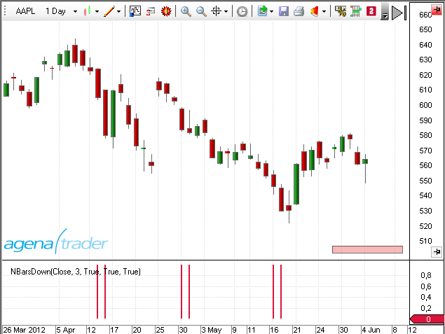

### Beispiel
```cs
NBarsDown(int barCount, bool BarDown, bool lowerHigh, bool lowerLow)
NBarsDown(IDataSeries input, int barCount, bool BarDown, bool lowerHigh, bool lowerLow)
NBarsDown(int barCount, bool BarDown, bool lowerHigh, bool lowerLow)[int barsAgo]
NBarsDown(IDataSeries input, bool barCount, int BarDown, bool lowerHigh, bool lowerLow)[int barsAgo]
```

##OnBalanceVolume (OBV)
### Beschreibung
TDer On Balance Volume Indikator (OBV) stellt den Kauf- bzw. Verkaufsdruck dar. Kumulativ wird das Volumen eines aufwärts gerichtetenTages (d. h. Open < Close, grüne Kerze) addiert und das Volumen aus abwärts gerichteten Tagen (rote Kerze) subtrahiert.
OBV wurde von Joe Granville entwickelt und 1963 in seinem Buch "Key to Stock Market Profits" vorgestellt. Es war einer der ersten Indikatoren für positive und negative Volumenstrommessungen

### Interpretation
OBV steigt, wenn das Volumen steigender Tage das Volumen fallender Tage übertrifft. Das OBV fällt, wenn das Volumen an Tagen mit fallenden Kursen überwiegt. Ein steigendes OBV spiegelt positiven Volumen Druck wider, der zu höheren Preisen führen kann. Umgekehrt deutet ein fallendes OBV auf tiefere Kurse hin. Granville stellte in seinen Forschungen fest, dass das OBV sich oft noch vor dem Kurs zu bewegen beginnt. Insofern handelt es sich um einen sog. vorauslaufenden Indikator.

Der absolute Wert des OBV ist unwichtig. Man sollte sich stattdessen auf die Eigenschaften der OBV-Linie konzentrieren. Zunächst definieren diese den Trend für das OBV. Anschließend ist zu bestimmen, ob der aktuelle Trend des OBV dem Trend des zugrunde liegenden Handelsinstrumentes entspricht. Drittens kann man nach potenziellen Unterstützungs bzw. Widerstandszonen suchen. Sobald der Trend des OBV einmal gebrochen ist, wird er sich wahrscheinlich ändern. Hieraus lassen sich Signale generieren.
Schließlich müssen auch Volumenspitzen bei der Suche nach einer bevorstehenden Trendwende Beachtung finden.

### Verwendung
```cs
OBV()
OBV(IDataSeries input)
OBV()[int barsAgo]
OBV(IDataSeries input)[int barsAgo]
```

### Rückgabewert
**double**

Bei Verwendung der Methode mit einem Index ( z.B. **OBV**()\[**int** barsAgo\] ) wird der Wert des Indikators für den referenzierten Bar ausgegeben.

### Parameter
input	Eingangsdatenreihe für den Indikator

### Darstellung


### Beispiel
```cs
//Ausgabe des Wertes für den On Balance Volume (OBV)
Print("The current value for the OBV is " + OBV()[0]);
```

##OutsideBars
### Beschreibung
Der Indikator OutsideBars ist eine veraltete Version von [*InsideBarsMT*](#insidebarsmt).

##P123
**The installation of the Technical Analysis Package is required in order to access this indicator.**

### Description
The goal of the P123 indicator is to automatically detect a 1-2-3 pattern.

**The following features make it stand out:**

Innovative recognition of 4 different trend sizes

It recognizes points 1, 2, and 3 at the bar

Recognition of a trend continuation in the same direction as a trend break

Completely automatic adjustment of the search algorithm for all possible market conditions (no additional settings/inputs required)

Adaptive workflow, adjusting to any volatility fluctuations

Clear overview while simultaneously displaying the various trend sizes

Can be implemented within the Condition Escort and AgenaScript

The trend sizes are defined as follows:

T0 = large trend

T1 = medium-sized trend

T2 = small trend

T3 = smallest trend size

The smallest trend size (T3) cannot be detected on all trading instruments. Point 2 is often situated at the high of a bar, and point 3 at the low of the same bar. Depending on the timeframe and fluctuation range, T0 and T1 can be fused into one.

The indicator determines the selected timeframe of the chart, and then labels all trends and trend sizes accordingly. When there is low volatility, trend recognition is more sensitive, and the vice versa for higher volatility. The P123’s adaptive methods make for a balanced recognition of trend sizes.

**Important tip:**

In some cases, the large trend (T0) cannot be seen with the naked eye, which may be due to the fact that not enough candles are visible within the chart. A minimum of 500 candles should be loaded to ensure this is not the case.


### Interpretation
Trading signals often form at points 2 & 3: at point 3 as entry signals into a correction phase within a confirmed trend, and at point 2 as a sub-trend in the trend direction of the superior trade. The definition of a trend at points 1 to 3 can be read in "*Das große Buch der Markttechnik*" by Michael Voigt (German only).

### Visualization in the chart
The parameter input settings define which trend sizes are shown in the chart and whether or not they are connected by a line.

For the default settings, the trend T2 is enabled by default.

The depiction in the chart may change with the changing market movements. If the market moves below the last point 3 and breaks the uptrend, the point is marked with a “3?”. The newly created low becomes the new point 2 and the last point 2 becomes point 1.


The parameter settings are not relevant for the display in the chart and are primarily used for the Condition Escort.

The depiction in the chart is primarily influenced by the settings “Display 123” and “Display Lines”.


The settings highlighted in yellow have no influence on the chart. No changes need to be made.

### Usage in AgenaScript
When using P123 in AgenaScript, multiple public variables are available.

A notation such as \[barsAgo\] is not available for this. Parameter occurrences are used in the following manner:

**P123**(**int** trendSize). ... &lt;&lt;a public variable, see below&gt;&gt;

**P123**(**int** trendSize, **int** occurrence). ...

|                   |                                                                                                                                   |
|-------------------|-----------------------------------------------------------------------------------------------------------------------------------|
| Trend Direction   | 1 = uptrend -1 = downtrend 0 = no trend                                                                                           |
| IsTrendValid      | true = confirmed trend with a point sequence of at least 1 - 2 - 3 - 2
                      false = no confirmed trend (phases 1 and 2)                                                                                        |
| LastPoint         | last point of a trend, 1, 2 or 3                                                                                                  |
| LastPointPrice    | outputs the price value of the last market point                                                                                  |
| LastPointDateTime | outputs the date and time of the last market point                                                                                |
| P1Price           | outputs the value of the last point 1                                                                                             |
| P1DateTime        | outputs the value and date/time of the last point 1                                                                               |
| P2Price           | outputs the value of the last point 2                                                                                             |
| P2DateTime        | outputs the time and date of point 2                                                                                              |
| TempP3Price       | putputs the value of the temporary point “3?”                                                                                     |
| TempP3DateTime    | outputs the time and date of the temporary point “3?”                                                                             |
| ValidP3Price      | outputs the value of the last point 3. This is used as a stop placement. When this point is breached, a trend change is confirmed |
| ValidP3DateTime   | outputs the date and time for the last valid point 3                                                                              |

**Parameters**

trendsize: trend size from 0 .. 3

occurrence the occurrences of the youngest to the oldest point

**Example**

```cs
private void PrintOutTrendProperties(int trendSize)
{
  // Reverse order of prints fills output window in correct order
  Print("");
  Print("valid P3 date: " + P123(trendSize).ValidP3DateTime);
  Print("valid P3 price: " + P123(trendSize).ValidP3Price);
  Print("temp P3 date: " + P123(trendSize).TempP3DateTime);
  Print("temp P3 price: " + P123(trendSize).TempP3Price);
  Print("P2 date: " + P123(trendSize).P2DateTime);
  Print("P2 price: " + P123(trendSize).P2Price);
  Print("P1 date: " + P123(trendSize).P1DateTime);
  Print("P1 price: " + P123(trendSize).P1Price);
  Print("last point date: " + P123(trendSize).LastPointDateTime);
  Print("last point price: " + P123(trendSize).LastPointPrice);
  Print("last point: " + P123(trendSize).LastPoint);
  Print("is trend valid: " + P123(trendSize).IsTrendValid);
  Print("trend direction: " + P123(trendSize).TrendDirection);
}
```

### Utilization within the Condition Escort
All public variables are available to you inside the Condition Escort as data series; they can be found under „Series & Output Values“.
The name has an underscore ("\_") suffix in order to differentiate it.

The parameters “trendSize” and “occurrence” can be found within the Condition Escort.

##Parabolic SAR
### Beschreibung
Das Parabolic Time/Price System wurde 1978 von Welles Wilder jr. in seinem Buch „New Concepts in Technical Trading Systems“ vorgestellt. Der Name Parabolic SAR ergibt sich aus der parabolischen Form der Kurve. SAR steht für „Stop and Reverse“, was bedeutet, dass nach Erreichen des Stopps die Position gedreht wird. Das System ist also immer investiert.
Der Stopp ist nicht nur in Relation zum Preis zu sehen, sondern auch in Relation zur Zeit. Je weiter der Trend voranschreitet, desto dichter wird der Stopp an den Preis herangezogen – was eine parabolische Kurve ergibt.
Wilders Parabolic SAR ist ein trendfolgender Indikator, der
- die Trendrichtung anzeigt
- Einstiegssignale generiert (long oder short)
- und Stopps erzeugt.
Damit werden prinzipiell die Bedingungen für ein Handelssystem erfüllt. (Quelle: VTAD)

### Interpretation
In einem Aufwärtstrend verläuft der Indikator unterhalb, in einem Abwärtstrend oberhalb des aktuellen Kurses. Zu Beginn des Signals läuft der SAR relativ weit weg vom Kurs. Je weiter der Trend voranschreitet, desto näher rückt der SAR an den Kurs heran. Kreuzt die Kurslinie den SAR, wird die Position ausgestoppt und in die Gegenposition gedreht. Der SAR ist wieder relativ weit weg und wird nachgezogen. Solange sich der Markt in einem ausgeprägten Trend befindet, liefert der Parabolic SAR gute Ergebnisse. In einem Seitwärtsmarkt ist er jedoch überfordert, erzeugt viele Fehlsignale und ist nicht profitabel.

### Weitere Informationen
VTAD: <http://vtadwiki.vtad.de/index.php/Parabolic\_SAR>

Wikipedia: <http://en.wikipedia.org/wiki/Parabolic\_SAR>

### Verwendung
```cs
ParabolicSAR(double acceleration, double accelerationStep, double accelerationMax)
ParabolicSAR(IDataSeries input, double acceleration, double accelerationStep, double accelerationMax)
ParabolicSAR(double acceleration, double accelerationStep, double accelerationMax)[int barsAgo]
ParabolicSAR(IDataSeries input, double acceleration, double accelerationStep, double accelerationMax)[int barsAgo]
```

### Rückgabewert
**double**

Bei Verwendung der Methode mit einem Index ( z.B.  **ParabolicSAR**(...)\[**int** barsAgo\] ) wird der Wert des Indikators für den referenzierten Bar ausgegeben.

### Parameters
|                  |                                     |
|------------------|-------------------------------------|
| acceleration     | Beschleunigung                      |
| accelerationStep | Inkrement der Beschleunigung        |
| accelerationMax  | Maximale Beschleunigung             |
| InSeries         | Eingangsdatenreihe für den Indikator|

### Darstellung


### Beispiel
```cs
//Ausgabe des Wertes für den Parabolic SAR
Print("Der aktuelle Wert des Parabolic SAR ist " + ParabolicSAR(0.02, 0.2, 0.02)[0]);
```

##Percentage Price Oscillator (PPO)
### Beschreibung
Der Percentage Price Oscillator (PPO) stellt die prozentuale Differenz zwischen 2 Exponential Moving Averages (EMA's) dar.
Der PPO gehört in die Klasse der Momentum-Indikatoren. Von der Konstruktion her ähnelt er sehr dem MACD. 

### Interpretation
Der PPO kann sehr gut für die Divergenzanalyse eingesetzt werden. Divergenzen haben einerseits den Vorteil, eine hohe Trefferquote zu haben, andererseits kommen sie häufig so früh, dass es für den unerfahrenen Akteur schwer einzuschätzen ist, wann er in den Markt eintreten bzw. diesen verlassen sollte.

### Verwendung
```cs
PPO(int fast, int slow, int smooth)
PPO(IDataSeries input, int fast, int slow, int smooth)
PPO(int fast, int slow, int smooth)[int barsAgo]
PPO(IDataSeries input, int fast, int slow, int smooth)[int barsAgo]

Für den geglätteten Wert -Smoothed value
PPO(int fast, int slow, int smooth).Smoothed[int barsAgo]
PPO(IDataSeries input, int fast, int slow, int smooth).Smoothed[int barsAgo]
```

### Rückgabewert
**double**

Bei Verwendung der Methode mit einem Index ( z.B. **PPO**(12,26,9)\[**int** barsAgo\] ) wird der Wert des Indikators für den referenzierten Bar ausgegeben.

### Parameters
input		Eingangsdatenreihe für den Indikator

fast		Anzahl der Bars, für die Berechnung des fast EMA

slow		Anzahl der Bars, für die Berechnung des slow EMA

smooth	Anzahl der Bars, für die Berechnung der EMA Signal-Linie

### Darstellung


### Beispiel
```cs
//Ausgabe des Wertes für den Percentage Price Oscillator (PPO)
Print("Der aktuelle Wert für PPO ist" + PPO(12, 26, 9)[0]);

//Ausgabe des Wertes für den Percentage Price Oscillator (PPO)
Print("Der aktuelle Wert für PPO ist " + PPO(12, 26, 9).Smoothed[0]);
```

##PercentEnvelopes
### Beschreibung
Der Indikator PercentEnvelopes zeichnet um einen vorgegebenen Wert im Abstand von einem Prozentwert ein oberes Band (Upper Band) und ein unteres Band (Lower Band).
Der Eingangswert kann dabei eine beliebige Datenserie sein, z.B. die Hochs, Tiefs, die Schlusskurse oder auch ein anderer Indikator.
Es ist z.B. möglich, als Eingangswert einen Simple Moving Average (SMA) zu verwenden. Um diesen lassen sich dann jeweils ein oberes und unteres Band im Abstand von 1.5 % zeichnen.

### Interpretation
Ähnlich den Bollinger Bändern kann auch der PercentEnvelope-Indikator unterstützend dazu verwendet werden, Kauf- bzw. Verkaufsentscheidungen zu treffen bzw. festzustellen, ob ein Kurs über- oder unterbewertet ist.
PercentEnvelope sollte nie als alleiniger Indikator für Handelsentscheidungen verantwortlich sein, sondern immer in Kombination mit weiteren Indikatoren verwendet werden.

### Verwendung
```cs
PercentEnvelopes(double percent)
PercentEnvelopes(IDataSeries input, double percent)

//Für das obere Band
PercentEnvelopes(double percent).UpperPercentBand[int barsAgo]
PercentEnvelopes(IDataSeries input, double percent).UpperPercentBand[int barsAgo]

//Für das untere Band
PercentEnvelopes(double percent).LowerPercentBand[int barsAgo]
PercentEnvelopes(IDataSeries input, double percent).LowerPercentBand[int barsAgo]
```

### Rückgabewert
**double**

Bei Verwendung der Methode mit einem Index ( z.B.**PercentEnvelopes**(2)\[**int** barsAgo\] ) wird der Wert des Indikators für den referenzierten Bar ausgegeben.

### Parameters
input		Eingangsdatenreihe für den Indikator

percent	Abstend der Bänder in Prozent (%) vom Eingangswert

### Darstellung


### Beispiel
```cs
//Ausgabe des Wertes des oberen Prozent Bandes
Print("Der Wert des oberen Prozent Bandes ist:  " + PercentEnvelopes(3).UpperPercentBand[0]);

//Ausgabe des Wertes des unteren Prozent Bandes
Print("Der Wert des unteren Prozent Bandes ist: " + PercentEnvelopes(3).LowerPercentBand[0]);
```

##Pivot Points
### Beschreibung
Futures-Händler kennen sie längst - die so genannten Pivot-Punkte (Pivot Points). Ursprünglich fanden sie Anwendung an den Commodity-Märkten, mittlerweile erobern sie sich aber mehr und mehr ihren festen Platz bei den Financial Futures.
Pivot Punkte basieren auf einem Preiszonenansatz, der von Dr. Bruce Gould entwickelt und im Laufe zunehmend verfeinert wurde. Während die Preiszonen ursprünglich auf die Kursverläufe der letzten zwei bis drei Jahre berechnet wurden, basiert das praktische Konzept der Pivot-Punkte auf der Errechnung von Preiszonen im Tageschart auf der Grundlage der Vortageskurse. Ziel ist es hierbei, Kursniveaus zu definieren, die intraday als potenzielle Widerstandsbereiche (Resistance: R1, R2 usw.) genutzt werden können, sowie Kursniveaus als Unterstützungsbereiche (Support: S1, S2 usw.) zu bestimmen. (Quelle: finanznachrichten.de)
Der Indikator kann nach folgenden Methoden berechnet werden:
Classic, Floor, Woodie, Camarilla und Fibonacci. Die Berechnungsvorschriften sind unten angegeben.
Die Methoden Classic und Floor weden in der Literatur gelegentlich vertauscht verwendet, d.h. die Methode Classic im AgenaTrader wird als Floor bezeichnet und umgekehrt.
Der Indikator zeigt auf intraday-Charts den Pivotpunkt und die Unterstützungs- und Widerstandszonen an.
In den Indikator-Einstellungen kann mit dem Parameter "ShowPrices" die Anzeige des Kurses neben den Linien erreicht werden.
Mit dem Parameter "DaysBack" werden die Pivotpunkte auch für die entsprechende Anzahl von Tagen in der Vergangenheit angezeigt.
Die Linienfarbe ist für den Pivotpunkt, die Wiederstands- und Unterstützungspunkte getrennt einstellbar.

### Interpretation
Klassischerweise bevorzugen Trader Kurse oberhalb der Widerstände 1 und 2 zu verkaufen (z.B. dem Aufbau von Short-Positionen), bzw. bei Unterschreiten der Unterstützungen 1 und 2 taktisch long zu gehen.
Ferner kann überlegt werden, die Widerstände bzw. Unterstützungen als Zielzonen zu verwenden und dort eine (Teil-) Positionsschließung vorzunehmen.

### Weitere Informationen
<http://www.finanznachrichten.de/nachrichten-2008-01/9833653-was-sind-pivot-punkte-und-wie-kann-ich-sie-handeln-005.htm>

<http://www.aktienboard.com/forum/f38/7-kapitel-pivot-points-t36428/>

<http://www.forexschule.com/schule/wie-man-mit-hilfe-von-pivot-punkten-handelt-50>

### Verwendung
```cs
PivotPoints()
PivotPoints(PivotPointsMode mode)
PivotPoints(PivotPointsMode mode, int LineWidth, bool ShowPrices, int DaysBack, Color RColor, Color PPColor, Color SColor)
PivotPoints(IDataSeries input, PivotPointsMode mode, int LineWidth, bool ShowPrices, int DaysBack, Color RColor, Color PPColor, Color SColor)
PivotPoints()[barsAgo]
PivotPoints(PivotPointsMode mode)[barsAgo]
PivotPoints(PivotPointsMode mode, int LineWidth, bool ShowPrices, int DaysBack, Color RColor, Color PPColor, Color SColor)[barsAgo]
PivotPoints(IDataSeries input, PivotPointsMode mode, int LineWidth, bool ShowPrices, int DaysBack, Color RColor, Color PPColor, Color SColor)[barsAgo]
```

### Rückgabewert
Die Klasse besitzt die folgenden public Methoden (als DataSeries), die jeweils einen double-Wert zurückgeben:

**PP, S1, S2, S3, R1, R2 ,R3**

### Beispiel:
```cs
PivotPoints().PP[int barsAgo]
PivotPoints(PivotPointsMode.Classic).S3[int barsAgo]
```

### Parameter
|                 |                                                                                   |
|-----------------|-----------------------------------------------------------------------------------|
| InSeries        | Eingangsdatenreihe für den Indikator                                              |
| PivotPointsMode | Berechnungsmodus  Mögliche Werte sind:
PivotPointsMode.Classic
PivotPointsMode.Floor
PivotPointsMode.Woodie
PivotPointsMode.Camarilla
PivotPointsMode.Fibonacci
Default: floor                                                                     |
| LineWidth       | Default: 1                                                                        |
| ShowPrices      | Shows prices next to the lines
Default: false                                                                     |
| DaysBack        | The number of historical periods to be included in the display of the pivot lines
                   Default: 0                                                                         |
| RColor          | Resistance line color                                                             |
| PPColor         | Pivot line color                                                                  |
| SColor          | Support line color                                                                |

### Darstellung


### Beispiel
```cs
//Ausgabe des aktuellen Pivot-Punktes
Print("Der Floor-Pivotpunkt befindet sich bei:" + PivotPoints()[0]);
//Ausgabe der 1. Unterstützung (S1)
Print("Die erste Pivot-Unterstützung (S1) befindet sich bei:  " + PivotPoints().S1[0]);
```

### Berechnung
H=Vortageshoch, L=Vortagestief, O=Vortagesopen, C=Vortagesclose
Range = H-L

**Classic**

pp = (H + L + C)/3

r1 = 2\*pp - L

s1 = 2\*pp - H

r2 = pp - s1 + r1

s2 = pp - r1 + s1

r3 = H + 2\*(pp - L)

s3 = L - 2\*(H - pp)

**Floor**

pp = (H + L + C)/3

r1 = 2\*pp - L

s1 = 2\*pp - H

r2 = pp + Range

s2 = pp - Range

r3 = pp + 2\*Range

s3 = pp - 2\*Range

**Woodie**

pp = (H + L + 2\*C)/4

r1 = 2\*pp - L

s1 = 2\*pp - H

r2 = pp + H - L

s2 = pp - H + L

r3 = 0.0

s3 = 0.0

**Camarilla**

pp = (H + L + C)/3

r1 = C + Range \* 1.1 / 12

s1 = C - Range \* 1.1 / 12

r2 = C + Range \* 1.1 / 6

s2 = C - Range \* 1.1 / 6

r3 = C + Range \* 1.1 / 4

s3 = C - Range \* 1.1 / 4

**Fibonacci**

pp = (H + L + C)/3

r1 = pp + 0.382 \* Range

s1 = pp - 0.382 \* Range

r2 = pp + 0.618 \* Range

s2 = pp - 0.618 \* Range

r3 = pp + 0.764 \* Range

s3 = pp - 0.764 \* Range

##Polarized Fractal Efficiency (PFE)
### Beschreibung
Der Polarized Fractal Efficiency (PFE) wurde von Hans Hannula entwickelt. Er gehört in die Klasse der Momentum-Indikatoren und verwendet Methoden der fraktalen Geometrie sowie der Chaostheorie, um zu bestimmen, mit welcher Effizienz der Preis sich bewegt.

### Interpretation
Wenn der PFE sich im Zickzack um die Null-Linie bewegt, dann liegt kein deutlicher Trend vor. Wenn der PFE gleichmäßig läuft und sich über bzw. unter der Null-Linie bewegt, befindet sich der Markt in einem Aufwärts bzw. Abwärtstrend. Je höher bzw. niedriger der PFE-Wert dabei ist, desto stärker ist der Trend (desto höher ist die Effizienz).

### Verwendung
```cs
PFE(int period)
PFE(IDataSeries input, int period)
PFE(int period)[int barsAgo]
PFE(IDataSeries input, int period)[int barsAgo]
```

### Rückgabewert
**double**

Bei Verwendung der Methode mit einem Index ( z.B. **PFE**(20)\[**int** barsAgo\] ) wird der Wert des Indikators für den referenzierten Bar ausgegeben.

### Parameters
input		Eingangsdatenreihe für den Indikator

period		Anzahl der Bars, die in die Berechnung einbezogen werden 

### Darstellung
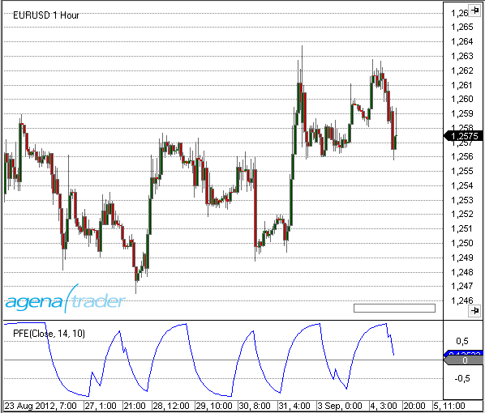

### Beispiel
```cs
//Ausgabe des Wertes für den Polarized Fractal Efficiency (PFE)
Print("Der aktuelle Wert für den PFE ist: " + PFE(20)[0]);
```

## Price Oscillator
### Beschreibung
Der PriceOscillator ist ein Indikator, der auf der Differenz zwischen zwei gleitenden Durchschnitten beruht. Die Differenz wird im Gegensatz zum Percent Price Oscillator (PPO) in absoluten Werten angegeben.

### Interpretation
Der Price Oscillator wird analog zum PPO bzw. zum MACD verwendet. 

### Verwendung
```cs
PriceOscillator(int fast, int slow, int smooth)
PriceOscillator(IDataSeries input, int fast, int slow, int smooth)
PriceOscillator(int fast, int slow, int smooth)[int barsAgo]
PriceOscillator(IDataSeries input, int fast, int slow, int smooth)[int barsAgo]
```

### Rückgabewert
**double**

Bei Verwendung der Methode mit einem Index ( z.B. **PriceOscillator**(12,26,9)\[**int** barsAgo\] ) wird der Wert des Indikators für den referenzierten Bar ausgegeben.

### Parameters
input		Eingangsdatenreihe für den Indikator

fast		Anzahl der Bars, für die Berechnung des fast EMA

slow		Anzahl der Bars, für die Berechnung des slow EMA

smooth	Anzahl der Bars, für die Berechnung der EMA Signal-Linie

### Darstellung
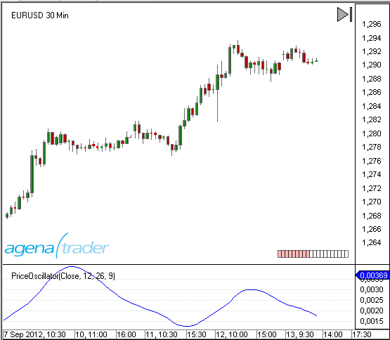

### Beispiel
```cs
//Ausgabe des Wertes für den PriceOscillator
Print("Der aktuelle Wert für PPO ist " + PriceOscillator(12, 26, 9)[0]);
//Ausgabe des Wertes für Smooth des PriceOscillators
Print("Der aktuelle Wert für Smooth ist" + PriceOscillator(12, 26, 9).Smoothed[0]);
```
## Rainbow
### Description
The rainbow indicator is represented by the set of the moving average indicator lines. Each of these lines is placed closer or further from the chart depending on the time period taken into the account for calculation of moving averages.

### Introduction
The rainbow indicator has some advantages comparing to the single moving average lines because it shows better, where the trend reversal occurs. When divergence in all lines is substantial - this is a signal of a strong up- or downtrend movement.
By default red lines are the closest to the chart and represent the moving average line with the smallest time period.  Yellow lines indicate short-term trends. Blue display the area for short-term traders’ activity. Green is typify for medium-term trends. Pink lines can be usefull for traders who hold positions for a long period.

### Return value
Colors:

Yellow ЕМА: 2,3, 4, 5, 6, 7, 8, 9, 10, 11, 12, 13, 14, 15;
Blue ЕМА: 17, 19, 21, 23, 25, 27, 29, 31, 33, 35, 37, 39, 41;
Green ЕМА: 44, 47, 50, 53, 56, 59, 62, 65, 68, 71, 74;
Red ЕМА: 78, 82, 86, 90, 94, 98, 102, 106, 110, 114, 118, 122;
Pink ЕМА: 125, 130, 135, 140, 145, 150, 155, 160, 165, 170, 175, 180, 185, 190, 195, 200.

### Parameters
|                |                                                                                                                    |
|----------------|--------------------------------------------------------------------------------------------------------------------|
| MA Type        | Allows to select between the types of the moving average lines that shape a rainbow indicator. Default setting is the EMA (exponential moving average) but it is possible to choose a simple (SMA), hull (HMA) and weighted (WMA) moving average lines  |
| Low MA Period  |  Shows the smallest amount of time periods for which the moving average will be calculated. For example, the setting “2” for the daily chart indicates the two latest daily closing prices.                                                                |
| High MA Period | Shows the largest amount of time periods for which the moving average will be calculated.                          |
| Step           | Defines the amount of moving average lines shown on a chart within the rainbow indicator. The smaller is this number the larger amount of lines will be plotted. In our example, step 2 would mean that the indicator will contain 80 EMA lines: EMA(2), EMA(4), EMA(6) and so on.                                                                                                             |

### Visualisation


##Range
### Beschreibung
Range liefert ist für jeden Bar die Spanne zwischen Hoch und Tief in Ticks. Range ist damit immer größer oder gleich 0.

### Verwendung
```cs
Range()
Range(IDataSeries input)
Range()[int barsAgo]
Range(IDataSeries input)[int barsAgo]
```

### Rückgabewert
**double**

Bei Verwendung der Methode mit einem Index ( z.B. **Range**()\[**int** barsAgo\] ) wird der Range-Wert für den referenzierten Bar ausgegeben.

### Parameter
input	Eingangsdatenreihe für den Indikator

### Darstellung


### Beispiel
```cs
//Ausgabe des Wertes für Range
Print("Der aktuelle Bar hat eine Range von: " + Range()[0]);

//identische Ausgabe
Print("Der aktuelle Bar hat eine Range von: " + High[0] - Low[0]);
```

##Range Indicator (RIND)
### Beschreibung
Der Range Indicator (RIND) wurde von Jack Weinberg entwickelt. Veröffentlicht wurde er erstmals 1954 in einem Artikel der Juni-Ausgabe des Magazins "Technical Analysis of Stocks & Commodities".
Der Indikator vergleicht die Spanne (Range) zwischen dem Hoch und Tief auf Intraday-Basis mit der Spanne zwischen dem aktuellen Schlusskurs und dem Vortages-Schlusskurs.

### Interpretation
Wenn die Spanne zwischen dem aktuellen Close und dem Vortages Close größer ist, als die Intradayspanne zwischen Hoch und Tief, zeigt der indikator einen hohen Wert an. Dies signalisiert ein mögliches Trendende. Wenn der Range Indicator im Gegensatz dazu auf einem niedrigen Niveau notiert, ist dies ein Hinweis auf den Beginn eines neuen Trends.

### Weitere Informationen
<http://www.fmlabs.com/reference/default.htm?url=RangeIndicator.htm>

### Verwendung
```cs
RIND(int periodQ, int smooth)
RIND(IDataSeries input, int periodQ, int smooth)
RIND(int periodQ, int smooth)[int barsAgo]
RIND(IDataSeries input, int periodQ, int smooth)[int barsAgo]
```

### Rückgabewert
**double**

Bei Verwendung der Methode mit einem Index ( z.B.  **RIND**(3,10)\[**int** barsAgo\] ) wird der Wert des Indikators für den referenzierten Bar ausgegeben.

### Parameters
input		Eingangsdatenreihe für den Indikator

periodQ	Anzahl der Bars, für die Berechnung der kurzfristigen Stochastik

smooth	Anzahl der Bars für die Glättung des Indikators mit einem EMA

### Darstellung


### Beispiel
```cs
//Ausgabe des Wertes für den Range Indikator (RIND)
Print("Der aktuelle Wert für den PFE ist: " + RIND(3, 10)[0]);
```

##Rate of Change (ROC)
### Beschreibung
Der Rate of Change Indikator (ROC, Rate of Change = Änderungsrate) ist ein ebenso einfacher wie effektiver Momentum-Oszillator, der die relative prozentuale Veränderung des Kurses von einer Periode zur nächsten Periode bzw. zu einer frei angegebenen Periode in der Vergangenheit misst. Der Indikator oszilliert um die Null-Linie.
Die Berechnung vergleicht hierfür den aktuellen Kurs mit dem Kurs von vor n Perioden.

### Interpretation
Solange der ROC über 0 bleibt ist der Aufwärtstrend intakt.
Solange der ROC unter 0 bleibt ist der Abwärtstrend intakt.
Divergenzen zwischen dem Indikator- und dem Kursverlauf lassen auf eine Trendänderung schließen.

### Weitere Informationen
VTAD: [http://vtadwiki.vtad.de/index.php/RoC](http://vtadwiki.vtad.de/index.php/RoC)

### Verwendung
```cs
ROC(int period)
ROC(IDataSeries input, int period)
ROC(int period)[int barsAgo]
ROC(IDataSeries input, int period)[int barsAgo]
```

### Rückgabewert
**double**

Bei Verwendung der Methode mit einem Index ( z.B. **ROC**(14)\[**int** barsAgo\] ) wird der Wert des Indikators für den referenzierten Bar ausgegeben.

### Parameters
input		Eingangsdatenreihe für den Indikator

period		Anzahl der Bars, die in die Berechnung einbezogen werden

### Darstellung
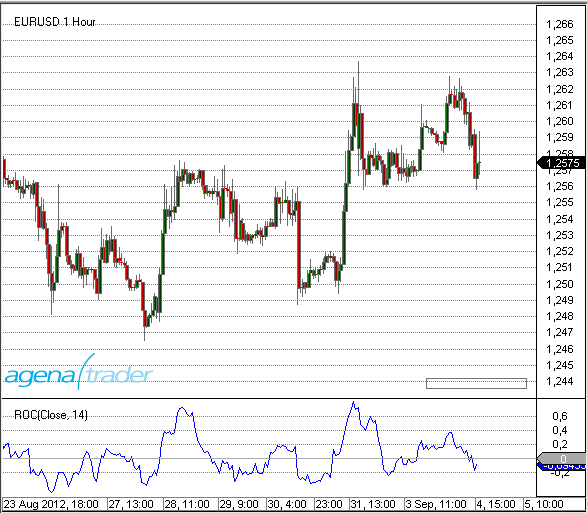

### Beispiel
```cs
//Ausgabe des Wertes für den Rate of Change Indikator (ROC)
Print("Der aktuelle Wert für den ROC ist: " + ROC(14)[0]);
```

##Relative Spread Strength (RSS)
### Beschreibung
Der Relative Spread Strength (RSS) Indikator wurde 2006 von Ian Copsey in einem Artikel der Oktoberausgabe des "Stocks & Commodities" Magazins vorgestellt.
Der RSS berechnet den Wert des RSI von der Differenz zwischen zwei SMA's.

### Interpretation
Bei Werten über 70 und unter 30 besitzt der Kurs das Potential, sich zu drehen. Hier sollte kein Trade eingegangen werden. Bei einem Extremwert sollte in einer kleineren Zeiteinheit nach Handelssignalen (Trendlinienbrüche, Reversals usw.) gesucht werden.

In der langfristigen Anwendung verhält es sich anders:

- unter 30:	Long Einstieg
- über 70	für mehr als 5 Tage: Ausstieg Long
- über 95:	Short Einstieg
- unter 30:	für mehr als 5 Tage: Short Ausstieg

### Verwendung
```cs
RSS(int eMA1, int eMA2, int length)
RSS(IDataSeries input, int eMA1, int eMA2, int length)
RSS(int eMA1, int eMA2, int length)[int barsAgo]
RSS(IDataSeries input, int eMA1, int eMA2, int length)[int barsAgo]
```

### Rückgabewert
**double**

Bei Verwendung der Methode mit einem Index ( z.B. **RSS**(10,40,5)\[**int** barsAgo\] ) wird der Wert des Indikators für den referenzierten Bar ausgegeben.

### Parameters
input	Eingangsdatenreihe für den Indikator

length	Anzahl der Bars, die in der Berechnung verwendet werden

eMA1	Periodenanzahl für den ersten EMA

eMA2	Periodenanzahl für den zweiten EMA

### Darstellung


### Beispiel
```cs
//Ausgabe des Wertes für den Relative Spread Strength (RSS)
Print("Der aktuelle Wert des RSS ist " + RSS (10, 40, 5)[0]);
```

##Relative Strength Index (RSI)
### Beschreibung
Der Relative Strength Index (RSI) wurde von J. Welles Wilder entwickelt und in seinem 1978 erschienenen Buch "New Concepts in Technical Trading Systems" erstmals vorgestellt. Der RSI ist ein äußerst nützlicher und beliebter Momentum-Oszillator. Er vergleicht die Größe der jüngsten Gewinne mit der Größe der jüngsten Verluste, bewertet also das Verhältnis der Aufwärts- zu den Abwärts-Schlusskursen innerhalb des Betrachtungszeitraums. Die Informationen werden in einer Zahl zwischen 0 und 100 abgebildet.

### Interpretation
Der RSI ist einfach zu interpretieren und er ist einer der am häufigsten verwendeten Indikatoren. Wertpapiere tendieren dazu, länger anhaltende aufwärts- oder abwärtsbewegungen zu vollziehen. Wenn in einem Zeitraum die Kursbewegung zu stark in eine Richtung verläuft, so wird häufig von einer Kursübertreibung gesprochen. Der RSI ist ein Hilsmittel, der darauf abzielt, diese Übertreibung zu messen und quantitativ in einer Skala zwischen 0 und 100 festzuhalten. 
Dabei gilt, dass ein Wertpapier überverkauft ist, wenn der Indikator sich unter 30 befindet, und überkauft, wenn der Wert mehr als 70 beträgt. Die Erfahrung zeigt, dass der Vorstoß in diese Grenzbereiche ein Warnsignal darstellt. Aber erst der Wendepunkt innerhalb der Gefahrenzonen warnt vor einer Trendwende. 

### Weitere Informationen
<http://technische-analyse.eu/index.php?title=RSI>

### Verwendung
```cs
RSI(int period, int smooth)
RSI(IDataSeries input, int period, int smooth)
RSI(int period, int smooth)[int barsAgo]
RSI(IDataSeries input, int period, int smooth)[int barsAgo]

//Für den Avg-Wert
RSI(int period, int smooth).Avg[int barsAgo]
RSI(IDataSeries input, int period, int smooth).Avg[int barsAgo]
```

### Rückgabewert
**double**

Bei Verwendung der Methode mit einem Index ( z.B. **RSI**(14,3)\[**int** barsAgo\] ) wird der Wert des Indikators für den referenzierten Bar ausgegeben.

### Parameters
input		Eingangsdatenreihe für den Indikator

period		Anzahl der Bars, die in die Berechnung einbezogen werden

smooth	Anzahl der Perioden für die Glättung

### Darstellung


### Beispiel
```cs
//Ausgabe des Wertes für den Relative Strength Index (RSI)
Print("Der aktuelle Wert für den RSI ist: " + RSI(14, 3)[0]);

//Ausgabe des Wertes für die Avg-Linie
Print("Der aktuelle Wert der Avg-Linie ist: " + RSI(14, 3).Avg[0]);
```

##Relative Strength Levy (RSL)
### Beschreibung
Dem Konzept der Relativen Stärke nach Levy, Relative Strength Levy (RSL) liegt die Annahme zugrunde, daß Titel, die in der Vergangenheit eine große relative Stärke aufwiesen, sich auch in Zukunft relativ stark entwickeln werden und umgekehrt. Man berechnet hier also nicht die Relative Stärke mehrerer Titel zueinander, sondern vergleicht die Performance der Vergangenheit mit der Performance von heute.
Zur Berechnung wird der Wochenschlußkurs (oder Tagesschluss) des Basistitels durch das arithmetische Mittel der Schlußkurse im Betrachtungszeitraum dividiert. Das Ergebnis wird um die Marke 1,0 herum aufgetragen. Anschließend wird eine sortierte Liste erstellt, deren erster Platz vom Titel mit der höchsten RSL belegt wird.

### Interpretation
Besitzt ein Titel eine RSL größer 1, so zeigt er heute eine größere Kursstärke als in der Vergangenheit, besitzt er eine kleinere RSL, so tendiert der Titel schwächer, als in der Vergangenheit. Einer Interpretation nach Levy folgend, werden nur die beiden ersten Titel der oben beschriebenen Ranking-Liste, gekauft, alle anderen gelten als Verkaufspositionen.
Einer zweiten Interpretation Levys folgend, sind zunächst die Standardabweichungen der letzten 27 Wochenschlußkurse durch das arithmetische Mittel der letzten 27 Wochenschlußkurse zu dividieren. Mit diesem Verfahren soll die Volatilität der beobachteten Aktien ermittelt werden. Aus dem Ergebnis dieser Operation ist nun wieder eine Ranking-Liste aufzustellen. Als Kauf bewertete Levy die Titel der Schnittmenge aus den ersten 5% der RSL-Rangfolge und den ersten 12,5% der Volatilitätsrangfolge. Die Titel, die zu den letzten 30% der RSL-Liste gehören, sind zum Verkauf zu stellen. Ebenso wie die Relative Stärke sollte man die RSL als Filter benutzen, um die gefundenen Titel mit anderen technischen Indikatoren näher zu untersuchen.

### Verwendung
```cs
RSL(int period)
RSLDataSeries input, int period)
RSLnt period)[int barsAgo]
RSL(IDataSeries input, int period)[int barsAgo]
```

### Rückgabewert
**double**

Bei Verwendung der Methode mit einem Index ( z.B. **RSL**(27)\[**int** barsAgo\] ) wird der Wert des Indikators für den referenzierten Bar ausgegeben.

### Parameters
input	Eingangsdatenreihe für den Indikator

period	Anzahl der Bars, die in die Berechnung einbezogen werden

### Darstellung


### Beispiel
```cs
//Ausgabe des aktuellen Wertes füt die RSL
Print("Die Relative Stärke nach Levy beträgt" + RSL(27)[0]);
```

##Relative Volatility Index (RVI)
### Description
The Relative Volatility Index (RVI) has many similarities to the RSI indicator. Donald Dorsey developed the RVI, which uses the standard deviation instead of the daily price span. To determine the underlying volatility of the instrument, the RVI uses the standard deviation over a period of 10. The RSI indicator is then used on the results, which normalizes them. What comes from this is displayed on a scale of 1 to 100.

### Interpretation
Values above 50 assume an increase in volatility. Values below 50 imply a drop in volatility. Dorsey recommends using the indicator as a filter for other indicators.

### Further information
<http://vtadwiki.vtad.de/index.php/Relative\_Volatility\_Index\_%28RVI%29>

### Usage
```cs
RVI(int period)
RVI(IDataSeries input, int period)
RVI(int period)[int barsAgo]
RVI(IDataSeries input, int period)[int barsAgo]
```

### Return value
**double**

When using this method with an index (e.g. **RVI**(14)\[**int** barsAgo\] ), the value of the indicator will be issued for the referenced bar.

### Parameters
input Input data series for the indicator

period Number of bars included in the calculations

### Visualization
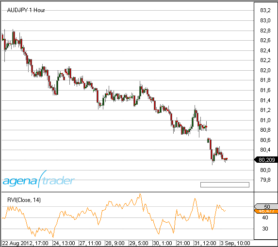

### Example
```cs
//Output of the RVI value
Print("The current value for the RVI is: " + RVI(14)[0]);
```

##ReversalBars
**The installation of the Technical Analysis Package is required in order to access this indicator.**

### Description
The Reversal Bars indicator helps the trader find reversal bars within a chart.
The indicator has a plot, and outputs the value 1 for long reversal bars, -1 for short reversal bars and 0 when there are none present. Traders can make several adjustments such as colors, arrows that are shown, etc.

### Interpretation
The interpretation of reversal bars is described in M. Voight’s book.

### Usage
```cs
Reversalbars()
Reversalbars(IDataSeries input)
Reversalbars()[int barsAgo]
Reversalbars(IDataSeries input)[int barsAgo]
Reversalbars(int tolerance)
Reversalbars(IDataSeries input, int tolreance)
Reversalbars(int tolerance)[int barsAgo]
Reversalbars(IDataSeries input, int tolerance)[int barsAgo]
```

### Return value
**double**

1 = long reversal bar

-1 = short reversal bar

0 = no reversal bar

When using this method with an index (e.g. **Reversalbars**()\[**int** barsAgo\] ), the value of the indicator will be issued for the referenced bar.

### Parameters
input Input data series for the indicator

tolerance See the following description below

### Visualization


### The tolerance parameter
The reversal bars must exceed their previous bars by at least 1 tick. The tolerance parameter allows you to define/add a certain number of ticks; the parameter is set to 0 by default, but in a sideways market this will lead to a relatively large number of reversal bars being marked.


### Example
```cs
// Set CalculateOnClosedBar = true !!
if (Reversalbars()[0] == 1.0)
Print("The last bar is a long reversal bar.");
```

##R-Squared
### Description
This indicator belongs to the linear regression series. R-Squared is the correlation coefficient that specifies the quality of the linear regression line.

It is the calculation that gives R-Squared its name – the value is the square of the correlation coefficient, which in mathematics is prefixed with the Greek letter Rho (P).

See [*Linear Regression*](#linearregression), [*LinRegSlope*](#linregslope), [*LinRegIntercept*](#linregintercept).

### Interpretation
The value of the oscillator fluctuates between 0 and 1. By default, the upper boundary line is located at 0.75, and the lower border is at 0.2.
If the prices are in a sideways movement, the data is scattered around the regression line. R-Squared will have a value of 0 in the aforementioned situation.
In a strong trend phase, the prices will remain within a tight range for an extended period of time; if these are located close to the regression line then the R-Squared indicator will have a value of 1. Stanley Kroll and Tuchar Chande used the correlation coefficient as a trend filter in their book “*The new technical trader*”.

### Further information
<http://www.blastchart.com/Community/IndicatorGuide/Indicators/LinearRegressionRSquared.aspx>

### Usage
```cs
RSquared(int period)
RSquared(IDataSeries input, int period)
RSquared(int period)[int barsAgo]
RSquared(IDataSeries input, int period)[int barsAgo]
```

### Return value
**double**

When using this method with an index (e.g. **RSquared**(8)\[**int** barsAgo\] ), the value of the indicator will be issued for the referenced bar.

### Parameters
input Input data series for the indicator

period Number of bars included in the calculations

### Visualization
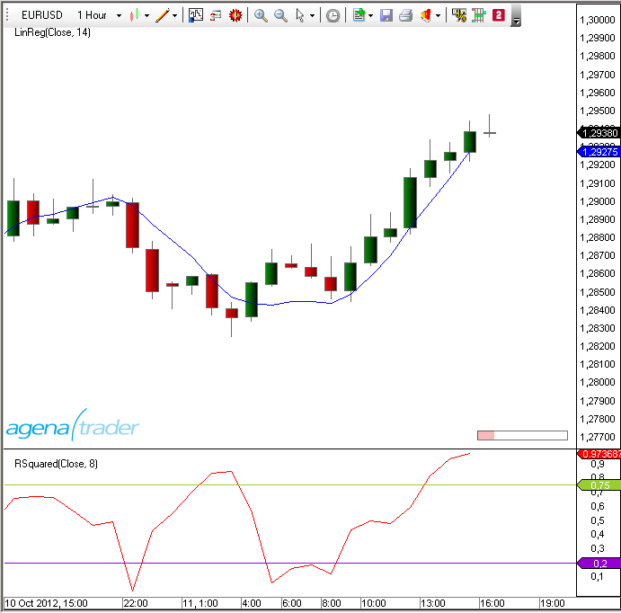

### Example
```cs
//Output for the value of R-Squared
Print("The current value of R-Squared is: " + RSquared(8)[0]);
```

##StandardDeviation(StdDev)
### Description
The Standard Deviation  (StdDev) is a tool used in statistics and probability calculation. It measures the dispersion of the values of a random variable around its median value. The Standard Deviation is used for the calculation of many indicators, such as, for example, the Bollinger Bands.

### Interpretation
A lower standard deviation implies that the data points are located very close to their median value. The trading application assumes that prices will return to their median value.

### Further information
VTAD: <http://vtadwiki.vtad.de/index.php/Standard\_Abweichung>

### Usage
```cs
StdDev (int period)
StdDev (IDataSeries input, int period)
StdDev (int period)[int barsAgo]
StdDev (IDataSeries input, int period)[int barsAgo]
```

### Return value
**double**

When using this method with an index (e.g. **StdDev**(14)\[**int** barsAgo\] ), the value of the indicator will be issued for the referenced bar.

### Parameters
input Input data series for the indicator

period Number of bars included in the calculations

### Visualization


### Example
```cs
//Output for the StdDev
Print("The current value for the standard deviation is: " + StdDev(14)[0]);
```

##Standard Error (StdError)
### Description
Jon Anderson came up with the Standard Error Bands, which are similar to the Bollinger Bands, but with a different calculation. An upper and a lower boundary around a middle line create the bands – this is also known as the linear regression. The lower standard error band results from the subtraction of two standard errors from the final value of the regression line. Because individual closing prices can have a huge influence on the values of the bands, it is necessary to use a Simple Moving Average to smooth the data.

### Interpretation
One of the applications of the standard error bands is the tightening of the bands when prices rise/fall. If the bands tighten, it signifies that a trend is currently in place. A strong trend will continue to tighten the bands.

### Further information
<http://www.forexrealm.com/technical-analysis/technical-indicators/standard-error-bands.html>

### Usage
```cs
StdError(int period)
StdError(IDataSeries input, int period)
StdError(int period)[int barsAgo]
StdError(IDataSeries input, int period)[int barsAgo]

//Upper band
StdError(int period).Upper[int barsAgo]
StdError(IDataSeries input, int period).Upper[int barsAgo]

//Lower band
StdError(int period).Lower[int barsAgo]
StdError(IDataSeries input, int period).Lower[int barsAgo]
```

### Return value
**double**

When using this method with an index (e.g. **StdError**(21)\[**int** barsAgo\] ), the value of the indicator will be issued for the referenced bar.

### Parameters
input Input data series for the indicator

period Number of bars included in the calculations

### Visualization


### Example
```cs
//Output for the values of the middle line
Print("The middle line is currently at: " + StdError(21)[0]);

//Output for the lower band
Print("The lower band of the standard error is currently at: " + StdError(21).Lower[0]);

//output for the upper band
Print("The upper band of the standard error is currently at: " + StdError(21).Upper[0]);
```

##Stochastics
### Description
The stochastic indicator was developed by George C. Lane in the 1950s. It belongs to the class “momentum indicators” (oscillators) and represents the current closing price in relation to a high or low area over a defined number of periods.
The stochastic indicator is based on the observation that in an uptrend, the closing price is close to the daily high, while in a downtrend, the closing price is closer to the daily low.
The stochastic indicator consists of two exponential Average Lines (%K and %D), both of which range between 0 and 100.
There are two types of stochastic: the classic slow stochastic and the fast stochastic.

**Fast stochastic:**
The %D line is the smoothing average of the %K line

**Slow stochastic:**
The %D is the basis on which the smoothing average is calculated. The slow stochastic smoothes the fast stochastic, thus stabilizing the oscillator.

### Interpretation
The closing prices found in the upper area imply an accumulation (buying pressure); the lower area represents selling pressure.
The stochastic indicator is a classic oscillator, and is primarily used in sideways markets in order to determine the reversal points. Days with a stable trend will not provide the indicator with any relevant or valuable results/information.

### Further information
VTAD: <http://vtadwiki.vtad.de/index.php/Stochastik>

### Usage
```cs
Stochastics(int periodD, int periodK, int smooth)
Stochastics(IDataSeries input, int periodD, int periodK, int smooth)

//For the %D line
Stochastics(int periodD, int periodK, int smooth).D[int barsAgo]
Stochastics(IDataSeries input, int periodD, int periodK, int smooth).D[int barsAgo]

//For the %K line
Stochastics(int periodD, int periodK, int smooth).K[int barsAgo]
Stochastics(IDataSeries input, int periodD, int periodK, int smooth).K[int barsAgo]
```

### Return value
**double**

When using this method with an index (e.g. **Stochastics**(7,14,3)\[**int** barsAgo\] ), the value of the indicator will be issued for the referenced bar.

### Parameters
input Input data series for the indicator

periodD Number of periods to be used for the %K smoothing

periodK Number of bars included in the %K calculation

smooth Number of periods for the smoothing of %D

### Visualization
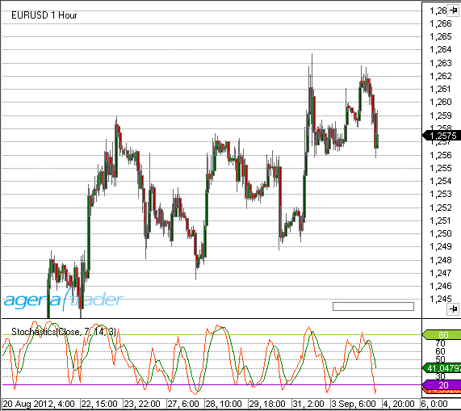

### Example
```cs
//Output for the %K line
Print("The stochastic line %K is currently at: " + Stochastics(3, 14, 7).K[0]);

//Output for the %D line
Print("The stochastic line %D is currently at: " + Stochastics(3, 14, 7).D[0]);
```

##Stochastics Fast
### Description
See [*stochastics*](#stochastics).

### Interpretation
Closing prices that are constantly in the upper area indicate accumulation (i.e. buying pressure), whilst the distribution (i.e. selling pressure) is shown by an indicator value in the lower area.

### Further information
VTAD: [http://vtadwiki.vtad.de/index.php/Stochastik](http://vtadwiki.vtad.de/index.php/Stochastik)

Charttec: [http://www.charttec.de/html/indikator_stochastics.php](http://www.charttec.de/html/indikator_stochastics.php)

### Usage
```cs
StochasticsFast(int periodD, int periodK)
StochasticsFast(IDataSeries input, int periodD, int periodK)

//For the %D line
StochasticsFast(int periodD, int periodK).D[int barsAgo]
StochasticsFast(IDataSeries input, int periodD, int periodK).D[int barsAgo]

//For the %K line
StochasticsFast(int periodD, int periodK).K[int barsAgo]
StochasticsFast(IDataSeries input, int periodD, int periodK).K[int barsAgo]
```

### Return value
**double**

When using this method with an index (e.g. **StochasticsFast**(7,14)\[**int** barsAgo\] ), the value of the indicator will be issued for the referenced bar.

### Parameters
input Input data series for the indicator

periodD Number of periods for the smoothing of %K

periodK Number of periods included in the calculation of %K

### Visualization


### Example
```cs
//Output for the %K line of the fast stochastic
Print("The stochastic line %K is currently at: " + StochasticsFast(3, 14).K[0]);

//Output %D line
Print("The stochastic line %D is currently at: " + StochasticsFast(3, 14).D[0]);
```

##Stochastics RSI (StochRSI)
### Description
Stochastics RSI is a calculation of the stochastic based on the RSI indicator.

### Interpretation
The indicator provides fast and precise extreme values/points in the price movements. The StochRSI can be used as a trend filter in higher timeframes as well as a tool for better entry timing.

### Further information
[http://www.investopedia.com/terms/s/stochrsi.asp#axzz263tizhIG](http://www.investopedia.com/terms/s/stochrsi.asp#axzz263tizhIG)

### Usage
```cs
StochRSI(int period)
StochRSI(IDataSeries input, int period)
StochRSI(int period)[int barsAgo]
StochRSI(IDataSeries input, int period)[int barsAgo]
```

### Return value
**double**

When using this method with an index (e.g. **StochRSI**(14)\[**int** barsAgo\] ), the value of the indicator will be issued for the referenced bar.

### Parameters
input Input data series for the indicator

period Number of bars included in the calculations

### Visualization


### Example
```cs
//Output for the StochRSI
Print("The current value for the StochRSI is: " + StochRSI(14)[0]);
```

##Summation (SUM)
### Description
Summation is the sum over a predefined number of periods.

### Usage
```cs
SUM(int period)
SUM(IDataSeries input, int period)
SUM(int period)[int barsAgo]
SUM(IDataSeries input, int period)[int barsAgo]
```

### Return value
**double**

When using this method with an index (e.g. **SUM**(14)\[**int** barsAgo\] ), the value of the indicator will be issued for the referenced bar.

### Parameters
input Input data series for the indicator

period Number of bars included in the calculations

### Visualization


### Example
```cs
// Sum of the volume for the last 10 trading days
Print(SUM(Volume,10)[0]);
```

##SuperTrend
### Description
The SuperTrend indicator was invented by a French trader. SuperTrend is similar to the Parabolic Stop and Reverse System (Parabolic SAR), and is based on the median values of the candles. It measures volatility as a span between high and low, not taking potential price gaps into account. The indicator, which originates from a starting value, continues to proceed in one direction until the market changes direction, combined with rising volatility. This causes the indicator to adjust its starting value to match that of the counter-direction. The indicator is programmed in such a way that nothing but the trend direction can bring about a change. Dropping volatility combined with movements against the trend direction cause the indicator to move horizontally.


### Interpretation
There are multiple interpretations and applications for the SuperTrend. Forex traders prefer to trade the crosses directly. This way, the system will continuously be inside the market and only needs to be complemented by a stop and further trading logic settings.
Analytically speaking, the SuperTrend indicator is only able to provide information about the current trend. If the market is above the indicator, then an uptrend exists, otherwise a downtrend is in force.
The indicator can be used as an exit for additional trading systems, meaning that an open position can be closed if a trend change occurs.

### Usage
```cs
SuperTrend(SuperTrendMode stMode, int length, double multiplier, SuperTrendMAType maType, int smooth)
SuperTrend(IDataSeries input, SuperTrendMode stMode, int length, double multiplier, SuperTrendMAType maType, int smooth)
SuperTrend(SuperTrendMode stMode, int length, double multiplier, SuperTrendMAType maType, int smooth)[int barsAgo]
SuperTrend(IDataSeries input, SuperTrendMode stMode, int length, double multiplier, SuperTrendMAType maType, int smooth)[int barsAgo]

//For the values of the uptrend:
SuperTrend(SuperTrendMode stMode, int length, double multiplier, SuperTrendMAType maType, int smooth).UpTrend[int barsAgo]
SuperTrend(IDataSeries input, SuperTrendMode stMode, int length, double multiplier, SuperTrendMAType maType, int smooth).UpTrend[int barsAgo]

//For the values of the downtrend:
SuperTrend(SuperTrendMode stMode, int length, double multiplier, SuperTrendMAType maType, int smooth).DownTrend[int barsAgo]
SuperTrend(IDataSeries input, SuperTrendMode stMode, int length, double multiplier, SuperTrendMAType maType, int smooth).DownTrend[int barsAgo]
```

### Return value
**double**

When using this method with an index (e.g. **SuperTrend**(...).UpTrend\[**int** barsAgo\] ), the value of the indicator will be issued for the referenced bar.

### Parameters
|            |                                                                                                                                                                        |
|------------|------------------------------------------------------------------------------------------------------------------------------------------------------------------------|
| InSeries   | Input data series for the indicator                                                                                                                                    |
| maType     | For the calculation of the MA, the following methods can be used:
SuperTrendMAType.HMA
SuperTrendMAType.SMA
SuperTrendMAType.SMMA
SuperTrendMAType.TEMA
SuperTrendMAType.TMA
SuperTrendMAType.VMA
SuperTrendMAType.VWMA
SuperTrendMAType.WMA

Also see: [*HMA*](#hma-hull-moving-average), [*SMA*](#sma-simple-moving-average), [*SMMA*](#smma-smoothed-moving-average), [*TEMA*](#tema-triple-exponential-moving-average), [*TMA*](#tma-triangular-moving-average), [*VMA*](#vma-variable-moving-average), [*VWMA*](#vwma-volume-weighted-moving-average), [*WMA*](#wma-weighted-moving-average).
Default:
              HMA  |
| multiplier | This is a multiplier for the internal calculation of the offset. This is only used when the method is set to ATR and DualThrust.
(In the adaptive mode, the multiplier uses the Homodyne Discriminator)
Default: 2.618      |
| Period     | Number of bars used for the calculation of the moving average
Default: 14    |
| smooth     | Values for additional smoothing
If no smoothing is necessary, this value can be set to 1
Default: 14     |
| stMode     | The following methods can be chosen:
SuperTrendMode.ATR, SuperTrendMode.DualThrust,  SuperTrendMode.Adaptive
The Period Parameter will have a huge influence when the DualThrustMode is selected. The smaller the period, the tighter the indicator will follow price developments.
Default: SuperTrendMode.ATR     |

### Visualization
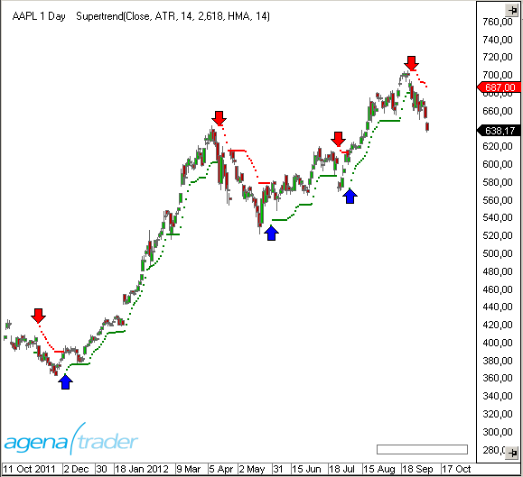

### Example
```cs
if (Close[0] > SuperTrend(SuperTrendMode.ATR, 14, 2.618, MovingAverageType.HMA, 14).UpTrend[0])
  Print("The market is in an uptrend.");
if (Close[0] < SuperTrend(SuperTrendMode.ATR, 14, 2.618, MovingAverageType.HMA, 14).DownTrend[0])
  Print("The market is in a downtrend.");
```

##SupportResistanceAreas
### Description
This indicator draws support and resistance areas in the chart. There are 4 different types of possible supports and resistances, which are differentiated by various colors.

Support due to a lower high (ColorLowerHigh)

Support due to a lower low (ColorLowerLow)

Resistance due to a higher high (ColorHigherHigh)

Resistance due to a higher low (ColorHigherLow)

### Interpretation
S/R zones play an important role in technical analysis. Clearly defined and identifiable support areas provide favorable entry opportunities, while resistance areas provide target zones to exit those trades.
Once broken, these areas tend to reverse their function, meaning that a broken support zone becomes a resistance zone.

<http://finanzportal.wiwi.uni-saarland.de/tech/Kapitel5\_4.htm>

### Parameters
|                   |                                                                                                  |
|-------------------|--------------------------------------------------------------------------------------------------|
| ATRRangeFactor    | Settings for the width of the support/resistance area as calculated by the ATR.                  
                     The smallest configurable value is 0.1; default is 0.3                                            |
| Levels            | This setting defines how many S/R zones of the same type are displayed. The default is 3         |
| Opacity           | Transparency of the bars to be drawn into the chart; 0 (transparent) – 255 (completely visible).
                     Default is 70                                                                                     |
| SensibilityFactor | Defines the sensitivity of the S/R search.                                                       
                     The smallest setting is 1; the default is 5                                                       |

### Visualization


##Swing
### Description
Based on the strength of the swing highs or the swing lows, the swing indicator draws a line at these points. The number of bars to the left and right of the extreme point is the determining factor for the strength. Methods for these indicators can also be implemented for other scripts.

### Interpretation
The methods for these indicators can be used in scripts to determine the last extreme point and its corresponding price value. The highs and lows of these points may then be used as entry, stop or target markers.

### Usage
```cs
//For a high
Swing(int strength).SwingHighBar(int barsAgo, int instance, int lookBackPeriod)
Swing(IDataSeries input, int strength).SwingHighBar(int barsAgo, int instance, int lookBackPeriod)

//For a low
Swing(int strength).SwingLowBar(int barsAgo, int instance, int lookBackPeriod)
Swing(IDataSeries input, int strength).SwingLowBar(int barsAgo, int instance, int lookBackPeriod)
```

### Return value
**double**

When using this method with an index (e.g. **Swing**(5)\[**int** barsAgo\] ), the value of the indicator will be issued for the referenced bar.

**When the current bar is smaller than the parameter strength, or if no swing high/low has been found, the return value is -1.**

### Parameters
|                |                                                                                                              |
|----------------|--------------------------------------------------------------------------------------------------------------|
| barsAgo        | Starting point for the search                                                                                |
| InSeries       | Input data series for the indicator                                                                          |
| instance       | The number of occurrences of extreme points (1 is the last occurrence, 2 is the second last occurrence etc.) |
| length         | Number of bars included in the calculation                                                                   |
| lookBackPeriod | Number of bars in the past in which swing points will be searched for (search area)                          |
| strength       | Number of bars to the left and right of the extreme points                                                   |

### Visualization


### Example
```cs
// Position and price of the last swing high
int barsAgo = Swing(5).SwingHighBar(0, 1, 10);
Print("The last swing high was " + barsAgo + " bars ago.");
Print("The last swing high was at " + High[barsAgo]);
```

##Time-Series-Forecast (TSF)
### Description
The Time-Series-Forecast is quite similar to a moving average. Here, the trend is established based on a regression equation that uses the smallest square formula. The goal of the TSF is to anticipate future price movements with the help of currently existing data.

### Interpretation
The TSF reacts faster than the moving averages. These always have time delays when depicting the pre-existing trends. The TSF formula never allows the distance to the current price to become too large, thus permitting sharper trade reversal recognition.

An entry is placed when the price breaks the TSF line from bottom to top.

### Further information
<http://en.wikipedia.org/wiki/Time\_series>

### Usage
```cs
TSF(int forecast, int period)
TSF(IDataSeries input, int forecast, int period)
TSF(int forecast, int period)[int barsAgo]
TSF(IDataSeries input, int forecast, int period)[int barsAgo]
```

### Return value
**double**

When using this method with an index (e.g. **TSF**(3,14)\[**int** barsAgo\] ), the value of the indicator will be issued for the referenced bar.

### Parameters
forecast Number of bars used for the forecast

input Input data series for the indicator

period Number of bars included in the calculations

### Visualization
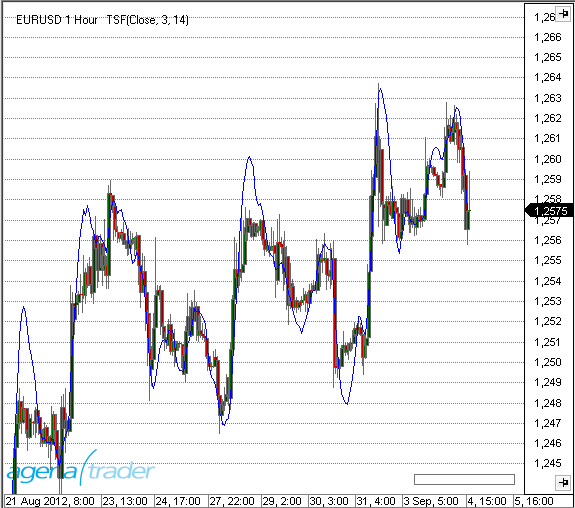

### Example
```cs
//Output the TSF values
Print("The current value for the TSF is: " + TSF(3, 14)[0]);
```

##Tools
##Constant Lines
### Description
The Constant Lines tool can draw a maximum of four freely configurable horizontal lines within a chart. In general, it is used to label certain price levels in order to keep an eye on them.

### Usage
```cs
ConstantLines(double line1Value, double line2Value, double line3Value, double line4Value)
ConstantLines(double line1Value, double line2Value, double line3Value, double line4Value)[barsAgo]
ConstantLines(double line1Value, double line2Value, double line3Value, double line4Value).Line1[barsAgo]
ConstantLines(double line1Value, double line2Value, double line3Value, double line4Value).Line2[barsAgo]
ConstantLines(double line1Value, double line2Value, double line3Value, double line4Value).Line3[barsAgo]
ConstantLines(double line1Value, double line2Value, double line3Value, double line4Value).Line4[barsAgo]
```

### Return value
**double**

When using this method with an index (e.g. **ConstantLines**(1,2,3,4)\[**int** barsAgo\] ), the value of the indicator will be issued for the referenced bar.

### Visualization


##CurrentDayOHL
### Description
This function delivers the values for the open, high and low of the current day i.e. session.

CurrentDayOHL is intended for use with intraday data series.

See [*PriorDayOHLC*](#priordayohlc), [*DayLines*](#daylines).

### Parameter
input Input data series for the indicator

### Return value
**double**

When using this method with an index (e.g. **CurrentDayOHL**.CurrentOpen(...)\[**int** barsAgo\] ), the value of the indicator will be issued for the referenced bar.

### Usage
```cs
CurrentDayOHL()
CurrentDayOHL(IDataSeries input)

//For the open value
CurrentDayOHL().CurrentOpen[int barsAgo]
CurrentDayOHL(IDataSeries input).CurrentOpen[int barsAgo]

//For the high value
CurrentDayOHL().CurrentHigh[int barsAgo]
CurrentDayOHL(IDataSeries input).CurrentHigh[int barsAgo]

//For the low value
CurrentDayOHL().CurrentLow[int barsAgo]
CurrentDayOHL(IDataSeries input).CurrentLow[int barsAgo]
```

### Visualization


### Example
```cs
Print("The low of the current session is at " + CurrentDayOHL().CurrentLow[0]);
```

##Daily Performance
### Description
This indicator delivers information concerning the changes in the price movements based on either a past close or a current-day open in comparison to the current price level.

The Daily Performance can be displayed in points, ticks, percent, or a currency value.

Colors and other settings can be freely adjusted.

See [*Momentum*](#momentum), [*ROC*](#rate-of-change-roc).

**Regarding usage with a scanner:**
To get a list of your favorite stocks and their daily percentual changes, please set CalculateOnClosedBar to “False”, TimeFrame to “1 Day”, Calculation mode to “Percent” and Days ago to “0”.


The result will look similar to this:


### Usage
```cs
DailyPerformance(DailyPerformanceReference reference, DailyPerformanceCalculationMode mode, int daysAgo)
DailyPerformance(IDataSeries input,DailyPerformanceReference reference, DailyPerformanceCalculationMode mode, int daysAgo)
DailyPerformance(DailyPerformanceReference reference, DailyPerformanceCalculationMode mode, int daysAgo)[int barsAgo]
DailyPerformance(IDataSeries input,DailyPerformanceReference reference, DailyPerformanceCalculationMode mode, int daysAgo)[int barsAgo]
```

### Return value
**double**

When using this method with an index (e.g. **DailyPerformance**(...)\[**int** barsAgo\] ), the value of the indicator will be issued for the referenced bar.

### Parameters
input Input data series for the indicator

reference Possible values are:
-   DailyPerformanceReference.Open
-   DailyPerformanceReference.PreviousClose

mode Possible values are:
-   DailyPerformanceCalculationMode.Points
-   DailyPerformanceCalculationMode.Ticks
-   DailyPerformanceCalculationMode.Percent
-   DailyPerformanceCalculationMode.Currency

daysAgo Number of days in the past

### Visualization
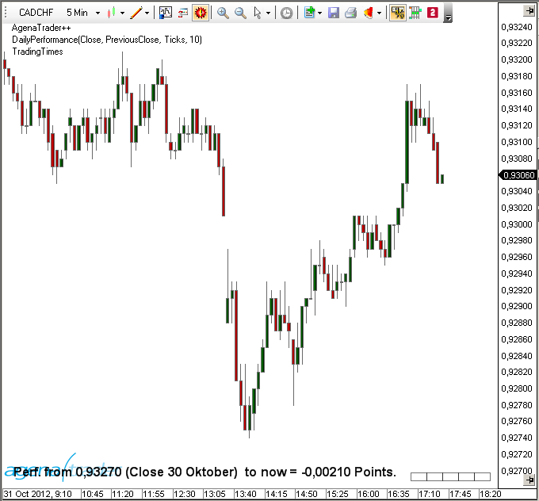

### Example
```cs
//How many ticks are between today’s open and the current price?
DailyPerformance(DailyPerformanceReference.Open, DailyPerformanceCalculationMode.Ticks, 1)[0]

//By how much percent did the stock rise/fall since the last closing price?
DailyPerformance(DailyPerformanceReference.PreviousClose, DailyPerformanceCalculationMode.Percent, 1)[0]

//By how many points/ticks did the future deviate from the start of the trading week to the current value?
DailyPerformance(DailyPerformanceReference.PreviousClose, DailyPerformanceCalculationMode.Points, 3)[0]

//How many EURO/USD does the performance equal?
DailyPerformance(DailyPerformanceReference.PreviousClose, DailyPerformanceCalculationMode.Currency, 3)[0]

//How big is the overnight gap in comparison to the opening price?
DailyPerformance(DailyPerformanceReference.PreviousClose, DailyPerformanceCalculationMode.Points, 1)[0]
```

##DayLines
### Description
The DayLines indicator draws lines for the previous day’s high, low, and close. It also draws a line for the current day’s open. These lines often show a reaction to the market.
Each line can be turned on or off, and the colors and line strengths can be freely set.

See [*CurrentDayOHL*](#currentdayohl), [*PriorDayOHLC*](#priordayohlc).

### Visualization


##DayLinesAdv
### Description
DayLinesAdv draws horizontal lines for the previous day’s high, low, and close, as well as the current day’s open.

[*CurrentDayOHL*](#currentdayohl), [*PriorDayOHLC*](#priordayohlc).

**DaysBack parameter**

The DaysBack parameter sets the number of days in the past for which the lines are to be placed onto the chart.

**Include Weekends parameter**
This parameter manages the interaction with weekend price data. If IncludeWeekends = true, the price data for a trading session resulting from the weekend data is added to the last trading session.

This is generally applicable to traders in different time zones. For example, a trader located in Germany will receive EURUSD data that beginning on Sunday evenings in America.
To add the couple of hours that are transcribed on Sunday to the previous Friday’s session, you simply need to set IncludeWeekends = true.
The first picture shows IncludeWeekends = false:


The second picture shows IncludeWeekends = true:


**Show Prices parameter**
If set to “true”, prices are displayed in addition to the line itself.


**Extend high lines and Extend low lines parameters.**
If set to “true”, the highs and lows that have not yet been „breached“ by the price will be extended onto the right-hand side of the chart using dotted lines.


##GetDayBar
### Description
The function GetDayBar() outputs all values (open, high, low, close, time, median, typical, volume, and weighted) for a specified past or current day i.e. session. GetDayBar() is not intended to be used inside the chart. For this purpose, DayLinesAdv should be used instead. GetDayBar is mainly used as a high-performance replacement for [*PriorDayOHLC*](#priordayohlc).

Several data feed providers also offer historical data, in which case we recommend that you use GetDayBar. If it is intraday data that is offered, it still works adequately to use [*PriorDayOHLC*](#priordayohlc).

If the outputted data varies, the main cause is normally assumed to be the difference between Session Begin and Session End.


### Parameters
daysAgo Number of days in the past
(0 for the current value)

### Return value
DateTime for time
double for all other values

For **daysAgo = 0,** the following applies:
Close = current price (for CalculateOnClosedBar = false)
Time = time of the current day’s open
All other values are calculated using intraday data.

### Usage
```cs
GetDayBar (int daysAgo)
```

### Example
```cs
[TimeFrameRequirements("1 day")]
public class xy : UserIndicator
{
  int daysAgo = 5;
  double historicalClose = Instrument.Round2TickSize(GetDayBar(daysAgo).Close);
}

protected override void OnStart()
{
  Print("The closing price from " + daysAgo + " days ago was at " + historicalClose);
}
```

**Important:**
The attribute *TimeFrameRequirements* must also always be used for the class doing the calling up (in the above example, class xy) if the indicator uses *Multibars*.

##Info
### Description
Info is not an indicator in the classic sense of the word, but is actually more similar to a tool. Depending on the underlying instrument, the background of the chart may show additional information.

### Visualization


##Maximum (MAX)
### Description
Max (MAX) delivers the highest value for a predefined number of periods.

### Usage
```cs
MAX(int period)
MAX (IDataSeries input, int period)
MAX (int period)[int barsAgo]
MAX (IDataSeries input, int period)[int barsAgo]
```

### Return value
**double**

When using this method with an index (e.g. **MAX**(Close, 10)\[**int** barsAgo\] ), the value of the indicator will be issued for the referenced bar.

### Parameters
input Input data series for the indicator

period Number of bars included in the calculations

### Visualization


### Example
```cs
// Output of the highest value of the last 20 periods
// The output is identical to high [GetSerieHighestValue(High,20)]
Print("The highest value of the last 20 periods is " + MAX(High, 20)[0]);
```

##Minimum (MIN)
### Description
Minimum (MIN) outputs the lowest value for a predefined number of periods.

### Usage
```cs
MIN (int period)
MIN (IDataSeries input, int period)
MIN (int period)[int barsAgo]
MIN (IDataSeries input, int period)[int barsAgo]
```

### Return value
**double**

When using this method with an index (e.g. **MIN**(Close, 10)\[**int** barsAgo\] ), the value of the indicator will be issued for the referenced bar.

### Parameters
input Input data series for the indicator

period Number of bars included in the calculations

### Visualization
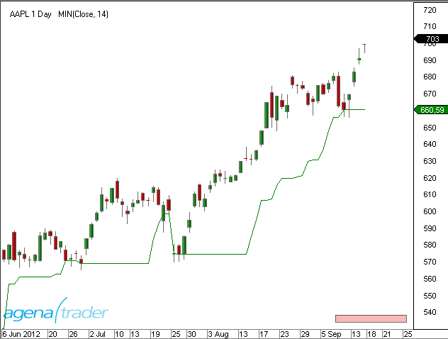

### Example
```cs
// Outputs the lowest value for the last 20 periods
Print("The lowest value of the last 20 periods is " + MIN(Low, 20)[0]);
```

##MTFBoxes
### Description
What MTFBoxes does is to draw a colored area behind the bars that signify a candle from a higher timeframe. This therefore makes it possible to depict an hourly candle inside a 5-minute chart. The area would contain all 5-minute bars that are located within said hourly candle.

The area turns greener if the candle of the higher timeframe is rising. A Doji would be shown in grey.

### Parameters
TimeFrame Timeframe of the “virtual” candle (second, minute, hour, day, week, month)
TimeFrameValue Value of the timeframe (number)

### Visualization


##PriceLine
### Description
PriceLine is not so much an indicator, but more of a tool.
It places a horizontal line on top of the current market price within the chart.
The colors and line widths are freely configurable.

### Visualization


##PriorDayOHLC
### Description
PriorDayOHLC shows the values for yesterday’s (i.e. the previous session’s) open, high, low, and close. PriorDayOHLC works best when used together with the intraday data series.

**PriorDayOHLCext**
PriorDayOHLCext For people in different time zones, PriorDayOHLCext makes it possible to set the IncludeWeekend parameter to “true”, which is helpful because all data originating from a Saturday or Sunday is treated as if it comes from the previous Friday’s session.

See [*CurrentDayOHL*](#currentdayohl), [*DayLines*](#daylines).

### Parameter
input Input data series for the indicator

### Return value
**double**

When using this method with an index (e.g. **PriorDayOHLC**().PriorHigh\[**int** barsAgo\] ), the value of the indicator will be issued for the referenced bar.

### Usage
```cs
PriorDayOHLC()
PriorDayOHLC(IDataSeries input)

//For the value of open
PriorDayOHLC().PriorOpen[int barsAgo]
PriorDayOHLC(IDataSeries input).PriorOpen[int barsAgo]

//For the value of high
PriorDayOHLC().PriorHigh[int barsAgo]
PriorDayOHLC(IDataSeries input).PriorHigh[int barsAgo]

//For the value of low
PriorDayOHLC().PriorLow[int barsAgo]
PriorDayOHLC(IDataSeries input).PriorLow[int barsAgo]

//For the value of close
PriorDayOHLC().PriorClose[int barsAgo]
PriorDayOHLC(IDataSeries input).PriorClose[int barsAgo]
```

### Visualization


### Example
```cs
// Value from the previous trading day
Print("Yesterday’s open was " + PriorDayOHLC().PriorOpen[0]);
Print("Yesterday’s high was " + PriorDayOHLC().PriorHigh[0]);
Print("Yesterday’s low was " + PriorDayOHLC().PriorLow[0]);
Print("Yesterday’s close was " + PriorDayOHLC().PriorClose[0]);
```

##PriorDayOHLCext
See [*PriorDayOHLC*](#priordayohlc).

##SessionBreakLines
### Description
The indicator SessionBreakLines draws a vertical line at the first candle of a new trading session.
What is special about this indicator is that you can manually set how the so-called “weekend sessions” should be handled. If the parameter IncludeWeekends is set to “true”, then the Sunday sessions will be added to the Friday’s session.
See [*PriorDayOHLC*](#priordayohlc).

### Visualization


##ShowBidAsk
### Description
The ShowBidAsk indicator displays the current bid and ask prices as well as the corresponding volume within the lower part of the chart. It also shows changes in volume even if a trade has not occurred.

### Visualization


##TickCounter
### Description
TickCounter provides information regarding the current number of ticks that are contained within the bar. The indicator can not only count starting from 0, but can also be set to count from a specified number down to 0. TickCounter can display the value either as absolute or as a percentage. It only works with candle charts in which the bars are established based on a fixed number of ticks.

When programming your own scripts, please use Bars, TicksCountForLastBar or Bars, LastBarCompleteness.

### Visualization


##True Strength Index (TSI)
### Description
The True Strength Index (TSI) is a momentum indicator. It is used as an indicator for trend direction and for displaying overbought or oversold conditions.
As a rule, momentum oscillators preemptively indicate price changes, whereas moving averages generally lag behind the price. The TSI brings together the advantages of these two indicator groups.

### Interpretation
The TSI line moves between 100 and -100. Most values are between +25 and -25. These trigger lines can be used to anticipate overbought or oversold situations. A rising TSI signals an uptrend, while falling TSI suggests a downtrend.

### Further information
[http://en.wikipedia.org/wiki/True_strength_index](http://en.wikipedia.org/wiki/True_strength_index)

### Usage
```cs
TSI(int fast, int slow)
TSI(IDataSeries input, int fast, int slow)
TSI(int fast, int slow)[int barsAgo]
TSI(IDataSeries input, int fast, int slow)[int barsAgo]
```

### Return value
**double**

When using this method with an index (e.g. **TSI**(3,14)\[**int** barsAgo\] ), the value of the indicator will be issued for the referenced bar.

### Parameters
input Input data series for the indicator

fast Number of bars included in the calculation of the fast EMA

slow Number of bars included in the calculation of the slow EMA

### Visualization


### Example
```cs
//Output of the current value for the True Strength Index (TSI)
Print("The current value for the TSI is " + TSI(3, 14)[0]);
```

##Ultimate Oscillator
### Description
Larry Williams developed the Ultimate Oscillator, which was first published in 1985. The Ultimate Oscillator is calculated by means of taking the weighted sum of three oscillators in different timeframes. These three timeframes are the short-term, middle and long-term market cycles. The typical period lengths used are 7, 14 and 28, and the value of the indicator moves between 0 and 100. Values above 70 signify an overbought situation, and values below 30 show that it is oversold.

### Interpretation
Williams defined the following criteria for a buy signal:

A bullish divergence between price and oscillator can be observed, meaning that the market makes a new low but the oscillator remains unchanged.

While this divergence is forming, the oscillator falls below 30.

The oscillator will then resume its upward move towards the high at which it peaked before the divergence began forming.

The buy signal is created when the price breaches that last high.

The long position is closed if the oscillator rises above 70 or if the oscillator rises above 50 and then falls back below 45.
A sell signal consists of bearish divergences forming above 70. These positions are closed once the 30 level marker is breached.

### Usage
```cs
UltimateOscillator(int fast, int intermediate, int slow)
UltimateOscillator(IDataSeries input, int fast, int intermediate, int slow)
UltimateOscillator(int fast, int intermediate, int slow)[int barsAgo]
UltimateOscillator(IDataSeries input, int fast, int intermediate, int slow)[int barsAgo]
```

### Return value
**double**

When using this method with an index (e.g. **UltimateOscillator** (5)\[**int** barsAgo\] ), the value of the indicator will be issued for the referenced bar.

### Parameters
|              |                                                                   |
|--------------|-------------------------------------------------------------------|
| input        | Input data series for the indicator                               |
| fast         | Number of bars for the calculation of the short-term oscillator   |
| intermediate | Number of bars for the calculation of the intermediate oscillator |
| slow         | Number of bars for the calculation of the slow indicator          |

### Visualization


### Example
```cs
// Output of the values for the UltimateOscillator with settings of 7,14,28
Print("The current value for the Ultimate Oscillator is " + UltimateOscillator(7, 14, 28)[0]);
```

##Volume (VOL)
### Description
This is the volume for the shares, futures, ETFs and so on that are traded within a specified time period.


### Further information
[http://de.wikipedia.org/wiki/Volumenanalyse](http://de.wikipedia.org/wiki/Volumenanalyse)

### Usage
```cs
VOL()
VOL(IDataSeries input)
VOL()[int barsAgo]
VOL(IDataSeries input)[int barsAgo]
```

### Return value
**double**

When using this method with an index (e.g. **VOL**()\[**int** barsAgo\] ), the value of the indicator will be issued for the referenced bar.

### Parameter
input Input data series for the indicator

### Visualization


### Example
```cs
//Output of the current volume
Print("The current volume is " + VOL()[0]);
```

##Volume Moving Average (VOLMA)
### Description
The VOLMA calculation is carried out by applying an exponential moving average to the respective volume of each period, that is to say its EMA (volume).

**Caution:**
In trading literature, the Volume Moving Average is often confused with the abbreviation for the Variable Moving Average (VMA).

### Interpretation
The VOLMA indicator helps you to find and assess the relative volume of a period.

Some simple guidelines should be followed:

The volume should be above the VOLMA at a break

After a volume spike (high), an exhaustion phase will kick in. The exhaustion can lead to a complete reversal of the price movement. Generally speaking, however, this is simply a resting phase

After three successive volume spikes, it becomes much less likely that the situation will continue in the same direction

Here, you can find more general information about *Moving Averages*.

### Further information
Volumen-Analyse.de: [http://www.volumen-analyse.de](http://www.volumen-analyse.de)

### Usage
```cs
VOLMA(int period)
VOLMA(IDataSeries input, int period)
VOLMA(int period)[int barsAgo]
VOLMA(IDataSeries input, int period)[int barsAgo]
```

### Return value
**double**

When using this method with an index (e.g. **VOLMA**(14)\[**int** barsAgo\] ), the value of the indicator will be issued for the referenced bar.

### Parameters
input Input data series for the indicator

period Number of bars included in the calculations

### Visualization
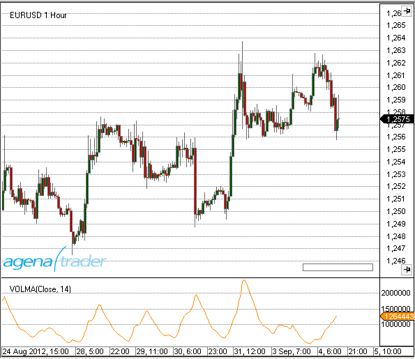

### Example
```cs
//Output for the value of the Volume Moving Average (VOLMA)
Print("The current VOLMA value is " + VOLMA(14)[0]);
```

##Volume Oscillator
### Description
The Volume Oscillator makes use of the difference between the moving averages based on the trading volume, with a similar result to the MACD or to any other oscillator in which moving averages are used for calculation.

### Interpretation
The Volume Oscillator is used to determine the trend strength. If developments in the price of the share are accompanied by disproportionate volume oscillator values, this should be regarded as highly relevant. In this way, the indicator can be used to filter out false signals.
Values above zero mean that the shortest moving average of the volume is above the long-term moving average. IsSerieRising prices with a higher short-term volume indicate a bullish scenario.

### Usage
```cs
VolumeOscillator(int fast, int slow)
VolumeOscillator(IDataSeries input, int fast, int slow)
VolumeOscillator(int fast, int slow)[int barsAgo]
VolumeOscillator(IDataSeries input, int fast, int slow)[int barsAgo]
```

### Return value
**double**

When using this method with an index (e.g. **VolumeOszillator**(12,26)\[**int** barsAgo\] ), the value of the indicator will be issued for the referenced bar.

### Parameters
input Input data series for the indicator

fast Number of bars for the calculation of the fast moving average

slow Number of bars for the calculation of the slow moving average

### Visualization


### Example
```cs
//Output of the current value for the Volume Oscillator
Print("The current value for the Volume Oscillator is: " + VolumeOszillator(12,26)[0]);
```

##Volume Profile
### Description
The VolumeProfile indicator displays the real-time volume profile as a vertical histogram on the chart. In this histogram, every bar depicts the cumulative traded volume for a certain price level. The starting bar for the calculations is labeled with a “#”.
These bars inside the histogram have various colors: green indicates executions at or above the ask, which are interpreted as buys. Red means trades at or below the bid, which are interpreted as sells. Grey signifies neutral executions.
It is important to note that the Volume Profile indicator only works together with a real-time data feed. After changes have been made in the properties window, the indicator is restarted and all values that have been calculated up to this point are lost.

See: [*VolumeZones*](#volumezones)

### Interpretation
Prices with especially high trading volume will have a more satiated accumulation and distribution at their respective levels. This leads to price resistance/support zones being formed.

### Visualization


##Volume Rate of Change (VROC)
### Description
The Volume Rate of Change (VROC) is almost exactly the same as the ROC indicator, with the exception that instead of price data, volume data (VOL) is used. A smoothing component is also applied.

### Further information
[http://www.shareholder24.de/boersensoftware-wiki/pages/viewpage.action?pageId=9207904](http://www.shareholder24.de/boersensoftware-wiki/pages/viewpage.action?pageId=9207904)

### Usage
```cs
VROC(int period, int smooth)
VROC(IDataSeries input, int period, int smooth)
VROC(int period, int smooth)[int barsAgo]
VROC(IDataSeries input, int period, int smooth)[int barsAgo]
```

### Return value
**double**

When using this method with an index (e.g. **VROC**(14,3)\[**int** barsAgo\] ), the value of the indicator will be issued for the referenced bar.

### Parameters
input Input data series for the indicator

period Number of bars included in the calculations

smooth Number of Bars included in the calculation for the smoothing

### Visualization


### Example
```cs
//Output of the current value for the Volume ROC
Print("The current value for the Volume ROC is: " + VROC(14, 3)[0]);
```

##VolumeUpDown
### Description
This indicator is a variation of the volume indicator, with the slight difference that the volume bars are shown in different colors depending on whether the price movement forms an up or down bar. An up (rising) bar shows the volume in green, while a down (falling) bar shows the volume in red. A Doji, where open = close, shows the volume in blue.

### Usage
```cs
VolumeUpDown()
VolumeUpDown(IDataSeries input)
VolumeUpDown()[int barsAgo]
VolumeUpDown(IDataSeries input)[int barsAgo]
```

### Return value
**double**

When using this method with an index (e.g. **VolumeUpDown**()\[**int** barsAgo\] ), the value of the indicator will be issued for the referenced bar.

### Parameter
input Input data series for the indicator

### Visualization


### Example
```cs
//Output of the current volume
Print("The current volume is " + VolumeUpDown()[0]);
```

##Volume Zones
### Description
This indicator draws a histogram on the left side of the chart. This histogram contains the historical volume, and inside the histogram, the length of the bars shows the cumulative volume. Traders can configure the price series (open, high, low etc.) with the help of the properties dialog box.
An up bar (where the close is above the open) shows the bar in green, and falling bars are displayed in red. The indicator is only designed to be used with historical data. In order to view volume changes in real-time, it is wise to consider using the VolumeProfile.


##Williams %R
### Description
Larry Williams developed the Williams %R. It is a momentum indicator, and is the inverse of the Fast Stochastic Oscillator. Williams %R, which is also called simply %R, reflects the level of the close relative to the highest high for the look-back period. The Stochastic Oscillator, on the other hand, reflects the level of the close relative to the lowest low. %R multiplies the raw value by -100 as a means of correcting for the inversion. This means that the Fast Stochastic Oscillator and Williams %R actually produce the exact same lines, with different scaling. The Williams %R fluctuates between 0 and -100. Values between 0 to -20 are deemed overbought, and values from -80 to -100 are seen as oversold. Naturally, signals taken from the Stochastic Oscillator can also be applied to Williams %R.

### Interpretation
As with the Stochastic Oscillator, Williams %R reflects the level of the close relative to the high-low range over a given period of time. Assume that the highest high equals 110, the lowest low equals 100 and the close equals 108. The high-low range is 10 (110 - 100), which is the denominator in the %R formula. The highest high less the close equals 2 (110 - 108), which is the numerator. 2 divided by 10 equals 0.20. Multiply this number by -100 to get -20 for %R. Williams %R would equal -30 if the close was 103 (0.30 x -100).

The centerline, -50, is an important level to watch. Williams %R moves between 0 and -100, which makes -50 the midpoint. Think of it as the 50 yard line in football. The offense has a higher chance of scoring when it crosses the 50 yard line. The defense has an edge as long as it prevents the offense from crossing the 50 yard line. A Williams %R cross above -50 signals that prices are trading in the upper half of their high-low range for the given look-back period. This suggests that the cup is half full. Conversely, a cross below -50 means prices are trading in the bottom half of the given look-back period. This suggests that the cup is half empty.

Low readings (below -80) indicate that the price is near its low for the given time period. High readings (above -20) indicate that the price is near its high for the given time period.

### Further information
<http://www.broker-test.de/finanzwissen/technische-analyse/williams-percent-r/>

### Usage
```cs
WilliamsR(int period)
WilliamsR(IDataSeries input, int period)
WilliamsR(int period)[int barsAgo]
WilliamsR(IDataSeries input, int period)[int barsAgo]
```

### Return value
**double**

When using this method with an index (e.g. **WilliamsR**(14)\[**int** barsAgo\] ), the value of the indicator will be issued for the referenced bar.

### Parameters
input Input data series for the indicator

period Number of bars included in the calculations

### Visualization


### Example
```cs
WilliamsR(int period)
WilliamsR(IDataSeries input, int period)
WilliamsR(int period)[int barsAgo]
WilliamsR(IDataSeries input, int period)[int barsAgo]
```

##ZigZag
### Description
The ZigZag indicator searched for extreme points in different timeframes. It finds the extreme points by using threshold values that traders themselves define. These specified threshold values determine the extent to which the market direction needs to change before the ZigZag line alters its orientation and forms a further extreme point.

### Interpretation
The previous extreme values (local highs or lows) are ideally suited for either entries or stop targets.

**Caution:** The ZigZag is not an indicator in the common sense. Position and direction of the zigzag can change retrospectively (repainting indicator).

### Further information
<http://www.robotrading.de/indikatoren/zig-zag-indikator-zeigt-hoch-und-tief-punkte-im-forex-markt>

### Usage
```cs
//For the upper extreme value
ZigZag(DeviationType deviationType, double deviationValue, bool useHighLow).ZigZagHigh[int barsAgo]
ZigZag(IDataSeries input, DeviationType deviationType, double deviationValue, bool useHighLow).ZigZagHigh[int barsAgo]

//For the lower extreme value
ZigZag(DeviationType deviationType, double deviationValue, bool useHighLow).ZigZagLow[int barsAgo]
ZigZag(IDataSeries input, DeviationType deviationType, double deviationValue, bool useHighLow).ZigZagLow[int barsAgo]
```

### Return value
**double**

When using this method with an index (e.g. **ZigZag**(...)\[**int** barsAgo\] ), the value of the indicator will be issued for the referenced bar.

A return value of 0 indicates that no high or low point has been found yet.

### Parameters
|                |                                                                                                                    |
|----------------|--------------------------------------------------------------------------------------------------------------------|
| input          | Input data series for the indicator                                                                                |
| deviationType  | The change in points or percent
DeviationType.Points and DeviationType.Percent       |
| deviationValue | Value of the deviation                                                                                             |
| useHighLow     | Defines whether the high/low of a bar will be used for extreme values or if you want to use closing prices instead |

### Visualization
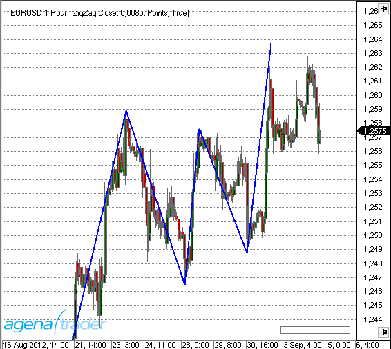

### Example
```cs
//Output of the market value for the last high point
Print("The last high of the ZigZag indicator was at " + ZigZag(DeviationType.Percent, 1, true).ZigZagHigh[0]);

// Output of the market value for the last low point
Print("The last low of the ZigZag indicator was at " + ZigZag(DeviationType.Percent, 1, true).ZigZagLow[0]);
```
