#Indikatoren & Oszillatoren

**Handeln wie die Profis!**

AgenaTrader stellt Ihnen eine Vielzahl von leistungsstarken Indikatoren zur Verfügung, die Sie bei Ihrer individuellen Marktanalyse unterstützen.

Indikatoren können Sie verwenden
-   in Charts
-   im Condition Escort
-   AgenaScript

Für jeden Indikator finden Sie eine kurze Beschreibung der Funktionsweise, Wissenswertes zur Interpretation, eine Darstellung im Chart und viele techn. Details zur Verwendung in AgenaScript

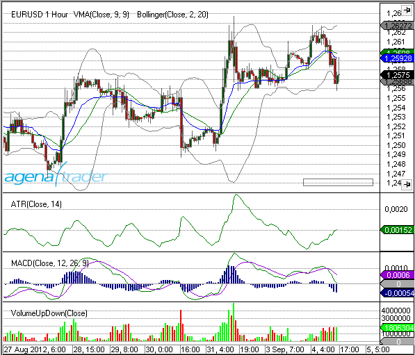

##Accumulation/Distribution (ADL)
### Beschreibung
Das Konzept des Indikators Accumulation Distribution Line (ADL) wurde von Marc Chaikin entwickelt. Der ADL ist ein Volumen Indikator. Er zeigt die Geldströme an.
Der ADL ist eine Weiterentwicklung des On Balance Volume (OBV). Das OBV von Joe Granville war einer der ersten Volumen Indikatoren.

### Interpretation
Es gibt zwei Varianten der Interpretation des ADL.

1.  The depiction of *divergence*
2. die Ausbildung einer Divergenz.

Steigt in einem Aufwärtstrend der ADL an, fließt Geld in Richtung der steigenden Kurse – der Aufwärtstrend wird bestätigt.
Fällt der ADL in einem Abwärtstrend, wird Geld aus der Aktie herausgezogen. Der Abwärtstrend wird bestätigt.

### Weitere Informationen
[vtadwiki.vtad.de](http://vtadwiki.vtad.de/index.php/Accumulation_Distribution_Linie)

### Verwendung
```cs
ADL()
ADL(IDataSeries input)
ADL()[int barsAgo]
ADL(IDataSeries input)[int barsAgo]
```

### Rückgabewert
**double**

Bei Verwendung der Methode mit einem Index (z.B. ADL()\[int barsAgo\] )  wird der Wert des Indikators für den referenzierten Bar ausgegeben.

### Parameter
input Eingangsdatenreihe für den Indikator

### Darstellung


### Beispiel
```cs
//Prüfung auf die Richtung des ADL
if (IsSerieRising(ADL())
Print("The ADL indicator is rising.");
```

##Adaptive Price Zone (APZ)
### Beschreibung
Der Adaptive Preis Zone Indikator wurde 2006 in dem S&C Artikel "Trading With An Adpative Price Zone" von Lee Leibfarth beschrieben. Es ist ein auf Unbeständigkeit basierender technischer Indikator, der dazu benutzt werden kann, Punkte zu identifizieren, an denen der Markt seine Richtung umkehren kann. Er ist eine Reihe von Bändern, die auf einem doppelt geglätteten exponentiell gleitenden Durchschnitt basieren. Die Bänder bilden einen Kanal, der den Durchschnittspreis umgibt und die Preisschwankungen verfolgt. Er bewährt sich besonders in volatilen Märkten. Überquert der Preis das obere Band der Zone kann dies eine Gelegenheit anzeigen, in Erwartung einer Umkehr zu verkaufen. Andererseits zeigt eine Überschreitung der unteren Begrenzung eine Gelegenheit an, in Erwartung einer Umkehr zu kaufen.

### Interpretation
The bigger the price movement, the greater the distance between the upper and lower band will be. The smaller the price movement, the Je größer die Preisbewegung, desto größer wird der Abstand zwischen dem oberen und dem unteren Band. Je kleiner die Preisbewegung, desto geringer ist der Abstand zwischen den Bändern. Weiter auseinanderliegende Bänder signalisieren gesteigerte Unbeständigkeit, enger zusammenliegende Bänder zeigen eine reduzierte Unbeständigkeit an.
Wenn die Preisbewegung das obere oder untere Band durchbricht, tendiert die APZ dazu, zu ihrem statistischen Durchschnitt zurückzukehren. Dieser Versuch, das Ungleichgewicht auszugleichen, wenn der Preis über die Bänder hinausschießt, führt zu Handelsgelegenheiten. Daher liefert eine Überschreitung des oberen Bandes eine Verkaufsgelegenheit, während eine Unterschreitung des unteren Bandes eine Kaufgelegenheit bedeutet. (Quelle: www.etoro.de)

### Weitere Informationen
<http://www.investopedia.com/articles/trading/10/adaptive-price-zone-indicator-explained.asp>

### Verwendung
```cs
APZ(double barPct, int period)
APZ(IDataSeries input, double barPct, int period)
Upper Band
APZ(double barPct, int period).Upper[int barsAgo]
APZ(IDataSeries input, double barPct, int period).Upper[int barsAgo]
Lower Band
APZ(double barPct, int period).Lower[int barsAgo]
APZ(IDataSeries input, double barPct, int period).Lower[int barsAgo]
```

### Rückgabewert
**double**

Bei Verwendung der Methode mit einem Index (z.B. **APZ**(2, 20)\[**int** barsAgo\] ) wird der Wert des Indikators für den referenzierten Bar ausgegeben.

### Parameters
barPct Standardabweichung

input Eingangsdatenreihe für den Indikator

period Number of bars included in the calculation

### Darstellung


### Beispiel
```cs
//Ausgabe des aktuellen Wertes für das obere und untere Band eines 20 Perioden APZ
Print("Value for the upper APZ band : " + APZ(2, 20).Upper[0]);
Print("Value for the lower APZ band: " + APZ(2, 20).Lower[0]);
```

##Aroon
### Beschreibung
Der Aroon, 1995 von Tushar Chande entwickelt, ist ein Indikator der technischen Analyse und dient der Trendbestimmung eines Kurses.
Der AROON besteht aus zwei Indikatorlinien - dem AROON-UP und dem AROON-DOWN. 
Die AROON-UP Linie misst die Tage, die seit dem letzten Kurshoch vergangen sind, die AROON-DOWN Linie misst die Tage, die seit dem letzten Kurstief vergangen sind. Die Linien oszillieren in einer Skala zwischen 0 und 100. 
Bei einem neuen 14-Tage Hoch nimmt der 14er AROON-UP den Wert 100 an, analog dazu nimmt bei einem neuen 14-Tage Tief der 14er AROON-DOWNs den Wert 100 an.
Beim AROON-UP subtrahiert man den Berechnungszeitraum (n) mit der Anzahl der Tage seit dem letzten Hoch (TsH) und dividiert diesen Wert durch n und multipliziert diesen wiederrum mit 100. (Quelle: VTAD)

### Interpretation
Wenn der AROON-UP oberhalb des AROON-DOWN notiert und sich die Linie im Extrembereich zwischen 80 und 100 befindet, signalisiert dies einen Aufwärtstrend. Ein Abwärtstrend wird signalisiert, wenn der AROON-DOWN über dem AROON-UP notiert und sich die Linie im Extrembereich zwischen 20 und 0 befindet.
In der Standardeinstellung liegt die Signallinie also bei 80. Der Grenzwert von 70 wurde von Tusher Chande vorgegeben, aber der kann auch verschoben werden, so z.B. benutzt Erich Florek den Wert 90. Befinden sich die beiden Indikatorlinien im neutralen Bereich - also unterhalb der Signallinie, deutet dies auf eine Seitwärtsbewegung hin. Trendfolger interessieren also nur Indikatorstände im Extrembereich oberhalb der Signallinie.
Ein Überkreuzen der beiden Linien ist ein erstes Anzeichen für einen möglichen Trendwechsel. Befindet sich einer der Indikatoren in der Extremzone, gilt der Trend als bestätigt. Je höher die jeweilige AROON-Linie notiert, desto kontinuierlicher verläuft ein Trend. Der AROON gibt über die Trendstärke keine Auskunft.

### Weitere Informationen
<http://stockcharts.com/school/doku.php?id=chart\_school:technical\_indicators:aroon>

### Verwendung
```cs
Aroon(int period)
Aroon(IDataSeries input, int period)
//For the upper value
Aroon(int period).Up[int barsAgo]
Aroon(IDataSeries input, int period).Up[int barsAgo]
//For the lower value
Aroon(int period).Down[int barsAgo]
Aroon(IDataSeries input, int period).Down[int barsAgo]
```

### Rückgabewert
**double**

Bei Verwendung der Methode mit einem Index  (z.B. **Aroon**(20)\[**int** barsAgo\] ) wird der Wert des Indikators für den referenzierten Bar ausgegeben.

### Parameters
input Eingangsdatenreihe für den Indikator

period Anzahl der Bars, die in die Berechnung einbezogen werden

### Darstellung


### Beispiel
```cs
//Ausgabe des aktuellen Up- und Down-Wertes für einen 20 Perioden Aroon
Print("Current value for Aroon Up is : " + Aroon(20).Up[0]);
Print("Current value for Aroon Down is: " + Aroon(20).Down[0]);
```

## Aroon Oscillator
### Beschreibung
Der Arron Oszillator ist ein trendfolgender Indikator, der auf dem Konzept des Aroon Indikators ("Aroon Up" und "Aroon Down") aufbaut. Er misst die Stärke eines Trendes und die Wahrscheinlichkeit dafür, dass dieser sich fortsetzt.
Der Aroon Oszillator berechnet sich aus der Substraktion Aroon Down von Aroon Up. Ergebnisse über der Null-Linie zeigen an, dass ein Aufwärtstrend vorliegt , Werte unter Null stehen für einen aktuellen Abwärtstrend.

### Interpretation
Der Arron Oszillator eignet sich als Trendfilter- und Trendstärke-Indikator. Er wird analog zum Average Directional Movement Indikator (ADX) verwendet.

### Verwendung
```cs
AroonOscillator(int period)
AroonOscillator(IDataSeries input, int period)
AroonOscillator(int period)[int barsAgo]
AroonOscillator(IDataSeries input, int period)[int barsAgo]
```

### Rückgabewert
**double**

Bei Verwendung der Methode mit einem Index (**AroonOcsillator**(20)\[**int** barsAgo\] ) wird der Wert des Indikators für den referenzierten Bar ausgegeben.

### Parameters
input Eingangsdatenreihe für den Indikator

period Anzahl der Bars, die in die Berechnung einbezogen werden

### Darstellung


### Beispiel
```cs
//Ausgabe des aktuellen Wertes für einen 20 Perioden Aroon Oszillator
Print("Value for the oscillator is: " + AroonOscillator(20)[0]);
```

##Average Directional Index (ADX)
### Beschreibung
Der Average Directional Movement Index ADX ist ein Indikator der technischen Analyse und dient der Trendstärkebestimmung eines Kurses. Er wurde von Welles Wilder 1978 entwickelt und in seinem Buch „New Concepts in Technical Trading Systems“ veröffentlicht. (Quelle: Wikipedia)


### Interpretation
Der ADX zeigt ausschließlich die Stärke eines Trends und nicht die Richtung. So deutet ein steigender ADX auf eine Trendphase und ein fallender ADX auf eine trendlose Phase hin. Viele Experten messen hierbei der Bewegungsrichtung oftmals größerer Bedeutung zu, als seiner absoluten Höhe. Zieht man die Höhe des ADX mit in Betracht, dann stehen im Allgemeinen Werte über 15 für eine Trendphase und Werte unterhalb für eine trendlose Phase.

### Weitere Informationen
<http://de.wikipedia.org/wiki/Average\_Directional\_Movement\_Index>

### Verwendung
```cs
ADX(int period)
ADX(IDataSeries input, int period)
ADX(int period)[int barsAgo]
ADX(IDataSeries input, int period)[int barsAgo]
```

### Rückgabewert
**double**

Bei Verwendung der Methode mit einem Index (z.B. **ADX**(20)\[**int** barsAgo\] ) wird der Wert des Indikators für den referenzierten Bar ausgegeben.

### Parameters
input Eingangsdatenreihe für den Indikator

period Anzahl der Bars, die in die Berechnung einbezogen werden

### Darstellung
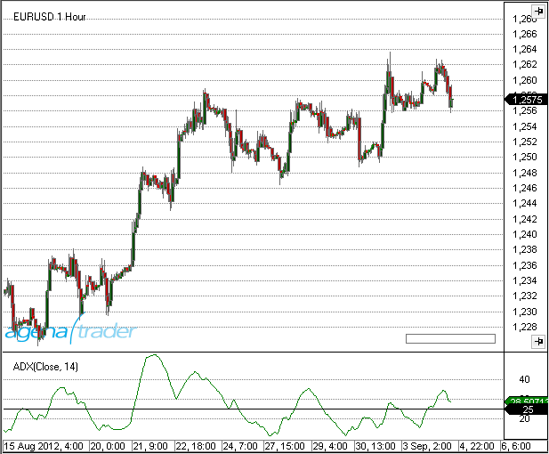

### Beispiel
```cs
//Ausgabe des aktuellen Wertes eines 20 Perioden ADX
Print("Value of the ADX: " + ADX(20)[0]);
```

##Average Directional Movement Rating (ADXR)
### Beschreibung
Der Indikator Average Directional Movement Rating (ADXR) entspricht dem aktuellen ADX addiert mit dem ADX von vor n Tagen geteilt durch 2.
( aktueller ADX + ADX vor n Tagen ) / 2

### Interpretation
Der Oszillator bewegt sich um eine Hilfslinie, die typischerweise auf dem Wert 20 liegt. Wenn der ADXR über 20 steigt, liegt ein Trend vor. Fällt der ADXR unter 20, existiert kein Trend, der Markt tendiert seitwärts.
Welles Wilder empfiehlt den Markt bei einem ADXR-Wert von 25 und größer zu kaufen, und solange der Wert über 20 bleibt, die Stücke zu halten.

### Verwendung
```cs
ADXR(int interval, int period)
ADXR(IDataSeries input, int interval, int period)
ADXR(int interval, int period)[int barsAgo]
ADXR(IDataSeries input, int interval, int period)[int barsAgo]
```

### Rückgabewert
**double**

Bei Verwendung der Methode mit einem Index (z.B. **ADXR**(10, 14)\[**int** barsAgo\]) wird der Wert des Indikators für den referenzierten Bar ausgegeben.

### Parameters
input Input Eingangsdatenreihe für den Indikator

interval Intervall zwischen dem ersten ADX-Wert und dem aktuellen ADX-Wert

period Anzahl der Bars, die in die Berechnung einbezogen werden

### Darstellung


### Beispiel
```cs
//Ausgabe des aktuellen Wertes des ADXR
Print("Value of the ADXR: " + ADXR(10, 14)[0]);
```

##Average True Range (ATR)
### Beschreibung & Interpretation
Die True Range (TR) - und ihre geglättete Variante, die Average True Range (ATR) - wurde von Welles Wilder 1978 in seinem Buch "New Concepts in Technical Trading Systems" vorgestellt. Die ATR wird auch "Wilders Volatility" genannt. Wilder suchte nach einer Möglichkeit, die Volatilität der Rohstoff- und Terminmärkte in einem Indikator darzustellen.

Laut Definition von Wilder ist die True Range = "wahre Handelsspanne" das Maximum aus folgenden drei Bedingungen:

1. Der heutigen Handelsspanne (Tagestief bis Tageshoch), oder
2. der Handelsspanne zwischen dem Schlusskurs von gestern und dem Hoch von heute, oder
3. der Handelsspanne zwischen dem Schlusskurs von gestern und dem Tief von heute.

Insbesondere mit Bedingung 2 und 3 werden Kurslücken (Gaps) in stark volatilen Märkten berücksichtigt.

Um die Average True Range zu erhalten, wird die True Range geglättet, sprich mit einem simplen gleitenden Durchschnitt (SMA) versehen. Laut Wilder ergibt die Glättung um 14 Tage den besten Volatilitäts-Indikator. (Quelle: VTAD)

Die ATR wird in vielfältigster Weise zur Volatilitätsbestimmung und insbesondere in Stopp-Strategien verwendet. Zur Bestimmung der Trendstärke ist die Volatilität allein nicht hinreichend, weshalb die ATR hierzu als Volatilitätsfilter in Kombination mit anderen Indikatoren verwendet werden muß.

### Weitere Informationen
VTAD: <http://vtadwiki.vtad.de/index.php/Average\_True\_Range>

### Verwendung
```cs
ATR(int period)
ATR(IDataSeries input, int period)
ATR(int period)[int barsAgo]
ATR(IDataSeries input, int period)[int barsAgo]
```

### Rückgabewert
**double**

Bei Verwendung der Methode mit einem Index(z.B. **ATR**(14)\[**int** barsAgo\] ) wird der Wert des Indikators für den referenzierten Bar ausgegeben.

### Parameters
input Eingangsdatenreihe für den Indikator

period Anzahl der Bars, die in die Berechnung einbezogen werden

### Darstellung


### Beispiel
```cs
//Ausgabe des aktuellen Wertes eines 14 Perioden ATR
Print("The current ATR value is: " + ATR(14)[0]);
```

##Balance of Power (BOP)
### Beschreibung
Der Balance of Power (BOP) wurde von Igor Livshin im August 2001 in der Ausgabe des "Stocks and Commodities Magazine" beschrieben.
Der BOP-Indikator gibt die Stärke der Käufer (Bullen) gegenüber den Verkäufern (Bären) an. Er oszilliert zwischen den Werten -100 und 100.
BOP=(Close-Open) / (High-Low)

### Interpretation
Eine Richtungsänderung des BOP kann als Warnsignal aufgefasst werden und zieht oftmals eine Preisänderung nach sich.

### Verwendung
```cs
BOP(int smooth)
BOP(IDataSeries input, int smooth)
BOP(int smooth)[int barsAgo]
BOP(IDataSeries input, int smooth)[int barsAgo]
```

### Rückgabewert
**double**

Bei Verwendung der Methode mit einem Index (z.B. **BOP**(5)\[**int** barsAgo\] ) wird der Wert des Indikators für den referenzierten Bar ausgegeben.

### Parameters
input Eingangsdatenreihe für den Indikator

smooth Einstellung zur Glättung

### Darstellung


### Beispiel
```cs
//Ausgabe des Wertes für die Balance of Power mit einer Glättung von 5 Perioden
Print("The Balance of Power value is: " + BOP(5));
```

##Bollinger Bands
### Beschreibung & Interpretation
Die Bollinger Bands (BB) wurden von John Bollinger 1983 entwickelt. Bollinger Bänder sind Kanallinien, die in und um die Preisstruktur in einem Chart gezeichnet werden. Der Unterschied zwischen Prozentbändern (Envelopes) und Bollinger Bändern liegt in der Volatilität. Prozentbänder verlaufen in einem konstanten Abstand zum Preis. Bollinger Bänder hingegen berücksichtigen die 20-Tage-Volatilität (in der Standardeinstellung). In Phasen geringer Volatilität liegen die Bänder eng am Preis, steigt die Volatilität an, weiten sich die beiden Bänder aus.

Die Basis der Bollinger Bänder ist ein gleitender Durchschnitt (GD, SMA), der den mittelfristigen Trend anzeigt. Dieser wird als mittleres Band bezeichnet und in der Standardeinstellung mit 20 Tagen berechnet. Die Breite des Kanals wird vom Ausmaß der Volatilität, der statistischen Methode der Standardabweichung, bestimmt. Das obere Band ergibt sich aus dem mittleren Band + 2 Standardabweichungen, das untere Band aus dem mittleren Band - 2 Standardabweichungen.

Die Berechnung erfolgt nach folgender Vorschrift:

Oberes Band = Mittleres Band + 2 Standardabweichungen
Mittleres Band = Durchschnitt von 20 Zeiteinheiten (Perioden)
Unteres Band = Mittleres Band - 2 Standardabweichungen

Der Faktor (Standard = 2) kann natürlich variiert werden und ist dafür verantwortlich, wieviel Prozent der Kurse (statistisch gesehen) innerhalb des oberen und unteren Bandes liegen. Bei einem Faktor von 1 sind es 68% der Kurse, bei Faktor = 2 sind es immerhin schon 95% und bei 3 Standardabweichungen 99% der Kurse.

Wenn man die Anzahl der Tage (Perioden) für die Berechnung des Bollinger Bandes variiert, empfiehlt es sich, gleichzeitig auch den Faktor anzupassen. Nach Bollinger sollten folgende Einstellungen verwendet werden:
bei Periode = 10 ist Faktor = 1,9
bei Periode = 50 ist Faktor = 2,1

In der Praxis werden für die Berechnung der Bollinger Bänder zumeist die Schlusskurse verwendet, obwohl Bollinger selbst den typischen Preis (Tageshoch + Tagestief + Tagesschluss) / 3 sowie den gewichteten Kurs (weighted close (Tageshoch + Tagestief + Tagesschluss) / 2+ g, g=Gewichtungsfaktor) empfiehlt, da die auf diese Weise berechneten Kurse das Tagesgeschehen besser widerspiegeln.

Siehe auch:  [*BollingerMTF*](#bollingermtf), [*Bollinger Percent %B*](#bollinger-percent-b-b), [*Bollinger Bands Width*](#bollinger-band-width-bbwidth)

### Interpretation
In der Praxis häufig (und erfolgreich) herangezogen, um Kauf- bzw. Verkaufsentscheidungen zu treffen. So ist es z.B. ziemlich einfach, anhand einer längerfristigen Entwicklung, den Kursverlauf auf außerordentliche Schwankungen zu überprüfen (trendfolgende Ausbruchssysteme).
Überschreitet der Kurs das obere Band, werden steigende Kurse erwartet, der sogenannten Long Position. Diese Long-Position wird wieder aufgelöst (geschlossen), wenn der Kurs entweder wieder unter das obere Band fällt, der Kurs unter das mittlere Band fällt oder wenn der Kurs unter das untere Band fällt.
Bei einem umgekehrten Verlauf werden folglich fallende Kurse erwartet und setzt auf diese indem eine Short-Position aufgebaut wird.
Jedoch sind die Bollinger Bänder in ihrem theoretischen Ansatz nicht dazu konstruiert, um Kauf- bzw. Verkaufsentscheidungen zu treffen. Sie sollen lediglich dazu dienen, festzustellen, ob ein Kurs über- bzw. unterbewertet ist.

### Weitere Informationen
VTAD: [http://vtadwiki.vtad.de/index.php/Bollinger_B%C3%A4nder](http://vtadwiki.vtad.de/index.php/Bollinger_B%C3%A4nder)

Buch "Technische Indikatoren - simplified" von Oliver Paesler (German only)

### Verwendung
```cs
Bollinger(double numStdDev, int period)
Bollinger(IDataSeries input, double numStdDev, int period)
//Für das obere Band
Bollinger(double numStdDev, int period).Upper[int barsAgo]
Bollinger(IDataSeries input, double numStdDev, int period).Upper[int barsAgo]
//Für das untere Band
Bollinger(double numStdDev, int period).Lower[int barsAgo]
Bollinger(IDataSeries input, double numStdDev, int period).Lower[int barsAgo]
```

### Rückgabewert
**double**

Bei Verwendung der Methode mit einem Index(z.B. **Bollinger**(2, 20)\[**int** barsAgo\] ) wird der Wert des Indikators für den referenzierten Bar ausgegeben.

### Parameters
input Eingangsdatenreihe für den Indikator

numStdDev Standardabweichung

period Anzahl der Bars, die in die Berechnung einbezogen werden

### Darstellung


### Beispiel
```cs
//Ausgabe des Wertes des oberen Bollinger Bandes
Print("Value of the upper band: " + Bollinger(2, 20).Upper[0]);
//Ausgabe des Wertes des mittleren Bollinger Bandes
Print("Value of the middle band: " + Bollinger(2, 20)[0]);
//Ausgabe des Wertes des unteren Bollinger Bandes
Print("Value of the lower band: " + Bollinger(2, 20).Lower[0]);
```

##Bollinger Percent B (%b)
### Beschreibung
Bänder Indikatoren, wie die Bollinger Bänder haben meist einen direkten Bezug zur Kursentwicklung, wodurch die Beziehung zwischen dem Kurs und den diesen Kurs umschließenden Bändern sehr anschaulich dargestellt werden kann. Aus dieser Beziehung lassen sich weitere Indikatoren (bzw. Oszillatoren) ableiten, die die die relative Position des Kurses in Bezug zu den Bändern darstellen. Diese Art Indikatoren werden unter dem Chart in einem separaten Chartpanel dargestellt. Ein Vertreter dieser Gruppe ist der Bollinger Bands %B (oder auch Bollinger Bands Oszillator - BBO bzw. nur b%)

Der Indikator %b erinnert in seiner Definition an den Stochastik-Indikator, wobei der Wertebereich nicht wie bei der Stochastik auf 0 - 100 begrenzt ist. Der Wert 1 (100%) zeigt das Schneiden des Kurses mit dem oberen Bollinger Band an. Bei einem Wert von 0,5 (50%) befindet sich der Kurs auf dem mittleren Bollinger Band. Der Wert 0 (0%) steht für den Schnittpunkt von Kurs und unterem Bollinger Band. Kurse können auch ausserhalb der Bollinger Bänder notieren, was vom %b-Indikator mit Werten über 100 bzw. unter 0 dargestellt wird. Der Wert -0,2 (-20%) wird angezeigt, wenn der Kurs sich um 20% der Bandbreite unterhalb des unteren Bandes befindet.

Die Berechnung wird nach folgender Formel vorgenommen:
%b = (Close - lower Bollinger band) / (upper Bollinger Band - lower Bollinger band) * 100

Siehe auch  [*Bollinger Bands*](#bollingerbands), [*BBWidth*](#bbwidth)

**Eine weitere Anwendung: Normalisieren von Indikatoren**

Bollinger Bands und damit auch der %b-Indikator können nicht nur auf die Kurse von Aktien und Indices, sondern auch auf Zeitreihen mit fundamentalen Daten, Volumendaten von Aktien und auf andere Indikatoren, angewendet werden. Immer dann, wenn es interessant zu wissen ist, ob ein Wert relativ hoch oder niedrig ist, kann der %b-Indikator eine neue Perspektive eröffnen. Wenn Sie wissen möchten, ob das Volumen einer Aktie relativ hoch oder niedrig liegt, können Sie die Bollinger Bänder oder %b auch auf die Volumendaten anwenden.
John Bollinger sieht in der Anwendung der %b auf andere Indikatoren eine der wichtigsten Einsatzgebiete des %b. Wenn Sie einen Indikator mit %b normalisieren, berechnen Sie zuerst den Indikator, z.B. den RSI und nutzen bei der Berechnung des %b die Daten des RSI anstelle der Kursdaten. Sie wenden also den %b auf den RSI an, wie es auch schon beim StochRSI, StochMACD und StochMomentum mit dem Stochastic %K getan wurde. Da zeigt sich die enge Verwandtschaft des %b mit dem Stochastic %K. Die Anwendung des %b auf einen Indikator wirkt genauso, als würden Sie Bollinger Bands über den Verlauf des Indikators legen und die Schnittpunkte der Bänder mit dem Indikator entsprechen folglich den Werten 1 und 0 eines mit %b normalisierten Indikators. Der mit %b normalisierte Indikator stellt die relative Position des Ursprungsindikators zu seinem oberen und unteren Band dar. Damit werden die starren Grenzen durch die Berücksichtigung der Beweglichkeit des Ursprungsindikators aufgehoben. John Bollinger formuliert es sehr treffend: „Sie definieren einen Hoch- oder Tiefstand auf einer relativen Basis. Dies kann oft zu tiefen Einblicken und Erkenntnissen führen, die von den traditionellen Richtlinien und Regelwerken nicht zu erwarten sind." ... 
John Bollinger gibt für einige Indikatoren die Parameter für die %b-Berechnung an. Für einen 9-Tage-RSI verwendet er 40 Tage und einen Faktor 2,0 und für einen 14-Tage-RSI nutzt er 50 Tage und einen Faktor von 2,1 zur Berechnung des %b. Für den über 10 Tage berechneten Volumenindikator Money Flow Index (MFI) gibt er für %b 40 Tage und einen Faktor von 2,0 an."

(Quelle: Oliver Paesler: "Technische Indikatoren - simplified" und John Bollinger: "Bollinger Bänder")

### Interpretation
Der BB-Oszillator (%b) bildet die Lage des aktuellen Schlusskurses innerhalb oder außerhalb der Bollinger - Bänder ab. Seine Skalenbreite reicht von Null bis 100, lässt aber auch Extremwerte darüber oder darunter zu. Befindet sich der aktuelle Kurs innerhalb der Bänder, liegt der Indikator zwischen Null und 100. Befindet sich der Kurs genau am oberen Band, hat der Indikator den Wert 100, liegt der Kurs über dem oberen Band hat der Indikator Werte über 100und zeigt damit einen Ausbruch aus dem Bollinger-Band an. Befindet sich der aktuelle Kurs am unteren Bollinger-Band, hat der Indikator den Wert Null, ist er unter das untere Bollinger Band ausgebrochen, hat der Indikator Werte kleiner Null.

Der Indikator %b wird ähnlich wie andere Oszillatoren verwendet:
Erkennen überdehnter Marktsituationen: Der Indikator lässt uns Situationen erkennen, in denen die Kurse weit überdehnt und somit Korrekturanfällig sind. Bricht der Indikator in eine der Extremzonen aus, wird unterstellt, dass diese Bewegung korrigiert wird. Somit gelten Bewegungen in die Extremzonen als Handelssignale. Der Eintritt oder der Austritt des Indikators in / aus eine(r) Extremzone kann als Signal gewertet werden. Ein solcher Ausbruch ist eine andere Darstellung des Kursausbruches aus den zu Grunde liegenden Bollinger – Bändern.

Richtungsänderungen des Indikators als Hinweis auf Änderungen im Kursmomentum: Durch anlegen einer Signallinie können Richtungsänderungen im Indikatorverlauf in Handelssignale umgewandelt werden. Schneidet der Indikator seine Signallinie nach oben, gilt dies als Kaufsignal, schneidet er sie nach unten, gilt dies als Verkaufssignal. Zusätzlich kann die Mittellinie als Trennung zwischen „nur Kaufsignale“ – Bereich und „nur Verkaufssignale“ – Bereich verwendet werden.

(Quelle: tradesignalonline)

### Weitere Informationen
VTAD: [http://vtadwiki.vtad.de/index.php/Bollinger_B%C3%A4nder](http://vtadwiki.vtad.de/index.php/Bollinger_B%C3%A4nder)

Buch "Technische Indikatoren - simplified" von Oliver Paesler (German only)

### Verwendung
```cs
BollingerPercentB(int period, double numStdDev)
BollingerPercentB(IDataSeries input, int period, double numStdDev)
BollingerPercentB(int period, double numStdDev) [int barsAgo]
BollingerPercentB(IDataSeries input, int period, double numStdDev)[int barsAgo]
```

### Rückgabewert
**double**

Bei Verwendung der Methode mit einem Index  (z.B.  **BollingerPercentB**(20, 2)\[**int** barsAgo\] ) wird der Wert des Indikators für den referenzierten Bar ausgegeben.

### Parameters
input		Eingangsdatenreihe für den Indikator

period		Anzahl der Bars, die in die Berechnung einbezogen werden

numStdDev	Standardabweichung

### Darstellung


### Beispiel
//Ausgabe des Wertes des BollingerPercentB

**Print**("Value of the Bollinger Percent B is: " + **BollingerPercentB**(20, 2)\[0\]);

##Bollinger Band Width (BBWidth)
### Beschreibung
Bollinger Bands Width (BBWidth) ist neben dem Bollinger Percent B (%b) ein weiterer aus den Bollinger Bändern abgeleiteter Indikator.
Die Bandweite gibt die Breite der Bänder im Verhältnis zum gleitenden Durchschnitt an und ist damit ein Indikator, der die Volatilität anzeigt. Die Bandweite errechnet sich, indem die Differenz aus dem oberen und dem unteren Band durch das mittlere Band (dem Durchschnitt) geteilt wird.
Der Indikator wird im Chart mit einer Signallinie dargestellt. Die Signallinie ist ein SMA(150) über die Bandweite, anschließend dividiert durch 1,9.

### Interpretation
John Bollinger verwendet die BandWidth, um einen steigenden oder fallenden Trend zu erkennen. Viele Trends haben ihren Ursprung in einer seitwärtsgerichteten Kursbewegung bei der die Volatilität und damit auch der BandWidth-Indikator niedrig ist. Wird ein Ausbruch aus dieser seitlichen Schiebezone durch ein plötzliches Ansteigen der BandWidth begleitet, deutet dies auf den Beginn eines nachhaltigen Trends in Richtung des Ausbruchs hin.

(Quelle: Oliver Paesler: "Technische Indikatoren - simplified" und John Bollinger: "Bollinger Bänder")

Kreuzungen mit der Signallinie können ebenfalls als Signalgeber Verwendung finden. Hier entspricht die Signalgebung der von den gleitenden Durchschnitten bekannten Weise.

### Weitere Informationen
VTAD: [*http://vtadwiki.vtad.de/index.php/Bollinger\_B%C3%A4nder*](http://vtadwiki.vtad.de/index.php/Bollinger_B%C3%A4nder)

Buch "Technische Indikatoren - simplified" von Oliver Paesler (German only)

### Verwendung
```cs
BBWidth(double numStdDev, int period)
BBWidth(IDataSeries input, double numStdDev, int period)
BBWidth(double numStdDev, int period)[int barsAgo]
BBWidth(IDataSeries input, double numStdDev, int period)[int barsAgo]

//für den Wert der BandBreite (wie oben)
BBWidth(double numStdDev, int period).BandWidth
BBWidth(IDataSeries input, double numStdDev, int period).BandWidth
BBWidth(double numStdDev, int period).BandWidth[int barsAgo]
BBWidth(IDataSeries input, double numStdDev, int period).BandWidth[int barsAgo]

//für den Wert der Triggerlinie (Threshold)
BBWidth(double numStdDev, int period).Threshold
BBWidth(IDataSeries input, double numStdDev, int period).Threshold
BBWidth(double numStdDev, int period).Threshold[int barsAgo]
BBWidth(IDataSeries input, double numStdDev, int period).Threshold[int barsAgo]
```

### Rückgabewert
**double**

Bei Verwendung der Methode mit einem Index  (z.B **BBWidth**(2, 20)\[**int** barsAgo\] ) wird der Wert des Indikators für den referenzierten Bar ausgegeben.

### Parameters
input		Eingangsdatenreihe für den Indikator

period		Anzahl der Bars, die in die Berechnung einbezogen werden

numStdDev	Standardabweichung

### Darstellung


### Beispiel
```cs
//Ausgabe des Wertes für BollingerBandWidth
Print("The value of the Bollinger Band Width is: " + BBWidth(2, 20).BandWidth[0]);
//Ausgabe des Wertes der Signallinie
Print("The value of the signal line is: " + BBWidth(2, 20).Threshold[0]);
```

##Bollinger MTF (MultiTimeFrame)
### Beschreibung
Der Indikator BollingerMTF ist die Multi TimeFrame-Variante der Bollinger Bänder (Bollinger Bands).
Er ist hauptsächlich für die Nutzung im Intraday-Bereich geeignet.
Multi TimeFrame bedeutet, dass der Indikator in einer anderen Zeiteinheit berechnet werden kann, als der Kurs im Chart angezeigt wird. Möchte man z.B. in einem 5-Minuten Chart die Bollinger Bänder des Stundencharts angezeigt bekommen, ist das mit dem Indikator Bollinger Bands nicht möglich. Hier ist BollingerMTF zu verwenden.
Im Indikator BollingerMTF kommt ein weiterer Parameter (MTFMinutes) hinzu, der die Zeiteinheit angibt, auf der die Berechnung der Bollinger-Bänder vorgenommen werden soll.

### Darstellung
Die Abbildung zeigt einen 5 Min.-Chart mit einem 60-Min.Bollinger Band


## BuySellPressure
### Beschreibung
Der Indikator BuySellPressure zeigt für den aktuellen Bar den Kauf- und den Verkaufsdruck als prozentualen Wert an. Dazu werden Trades als "Kauf" bzw. als "Verkauf" klassifiziert. Für diese Klassifizierung wird ein "Kauf" immer dann angenommen, wenn die Transaktion am oder über dem Ask ausgeführt wurde. Als "Verkauf" wird ein Umsatz am oder unter dem Bid gewertet. Trades im Inside Market werden ignoriert.

**Achtung:
Dies ist ein Realtime-Indikator. Er funktioniert nur auf Realtime-Daten und wird deshalb nicht für historische Daten gezeichnet.**

**Wenn Sie den Eigenschaften-Dialog des Indikators aufrufen und dort Änderungen vornehmen, wird der Indikator im Anschluß neu gestartet und alle bisher in den Chart gezeichneten Daten gehen verloren..**

See [*BuySellVolume*](#buysellvolume).

### Verwendung
```cs
BuySellPressure()
BuySellPressure(IDataSeries input)

//Für den Wert von buy pressure
BuySellPressure().BuyPressure[int barsAgo]
BuySellPressure(IDataSeries input).BuyPressure[int barsAgo]

//Für den Wert von sell pressure
BuySellPressure().SellPressure[int barsAgo]
BuySellPressure(IDataSeries input).SellPressure[int barsAgo]
```

### Rückgabewert
**double**

Bei Verwendung der Methode mit einem Index ( z.B. **BuySellPressure**().BuyPressure\[**int** barsAgo\] ) wird der Wert des Indikators für den referenzierten Bar ausgegeben.

**Hinweis:**
**Wird BuySellPressure mit EOD-Daten verwendet, wird immer der Wert 50 ausgegeben.**
-   BuySellPressure().SellPressure\[0\] = 50
-   BuySellPressure().SellPressure\[0\] = 50

### Parameters
input	Eingangsdatenreihe für den Indikator

### Darstellung


### Beispiel
```cs
protected override void OnInit()
{
  // Die Eigenschaft CalculateOnBarClose sollte unbedingt hier gesetzt werden,
    // da im Eigenschaften-Dialog des Indikators bzw. der Strategie
    // CalculateOnBarClose = true gesetzt sein kann.
    // Mit CalculateOnBarClose = true werden keine Werte berechnet und angezeigt.

  BuySellPressure().CalculateOnClosedBar = false;
}

protected override void OnCalculate()
{
 // Suche nach einem Long Breakout Signal
  if (Close[0] > DonchianChannel(20).Upper[5])
  {
  // Der Indikator BuySellPressure kann nur für Realtime-Daten berechnet werden.
     // Um eine Strategie, in der BuySellPressure verwendet wird, dennoch einem Backtest 
     // unterziehen zu können, muß mit if (Historical ... geprüft werden,
     // ob die Strategie mit Realtime- oder historischen Daten aufgerufen wurde.
     // Im Beispiel wird ein Breakout-Signal mit dem DonchianChannel(20) generiert.
     // Wenn Realtime-Daten zur Verfügung stehen, soll zusätzlich sichergestellt sein,
     // dass mindestens 70% der Umsätze im Ausbruchbar am bzw. über dem Ask stattgefunden haben.
    if (IsHistoricalMode || BuySellPressure().BuyPressure[0] > 70)
    OpenLong();
  }
}
```

##BuySellVolume
### Beschreibung
Der Indikator BuySellVolume zeigt für den aktuellen Bar den Kauf- und den Verkaufsdruck als Umsatzbar ähnlich dem Volumen (Vol) unter dem Chart an. Dazu werden Trades als "Kauf" bzw. als "Verkauf" klassifiziert. Für diese Klassifizierung wird ein "Kauf" immer dann angenommen, wenn die Transaktion am oder über dem Ask ausgeführt wurde. Als "Verkauf" wird ein Umsatz am oder unter dem Bid gewertet. Trades im Inside Market werden ignoriert.

**Achtung: Dies ist ein Realtime-Indikator. Er funktioniert nur auf Realtime-Daten und wird deshalb nicht für historische Daten gezeichnet. Wenn Sie den Eigenschaften-Dialog des Indikators aufrufen und dort Änderungen vornehmen, wird der Indikator im Anschluß neu gestartet und alle bisher in den Chart gezeichneten Daten gehen verloren.**

Siehe auch [*BuySellPressure*](#buysellpressure) 

### Verwendung
```cs
BuySellVolume BuySellVolume()
BuySellVolume BuySellVolume(IDataSeries input)
```

### Rückgabewert
**double**

Bei Verwendung der Methode mit einem Index (z.B. **BuySellVolume**().BuyVolume\[**int** barsAgo\] ) wird der Wert des Indikators für den referenzierten Bar ausgegeben.

### Parameter
input	Eingangsdatenreihe für den Indikator

### Darstellung


### Beispiel
```cs
//Output für die  BuySellVolume
Print("The BuySellVolume is: " + BuySellVolume()[0]);
```

##CandleStickPattern
### Beschreibung
Der Indikator CandleStickPattern sucht nach bestimmten Candlestick-Formationen.


### Weitere Informationen
Erklärung der einzelnen Formationen und ihrer jeweiligen Interpretation finden sich z.B. unter: [http://en.wikipedia.org/wiki/Candlestick_pattern](http://en.wikipedia.org/wiki/Candlestick_pattern)

### Verwendung
```cs
CandleStickPattern(ChartPattern pattern, int trendStrength)
CandleStickPattern(IDataSeries input, ChartPattern pattern, int trendStrength)
CandleStickPattern(ChartPattern pattern, int trendStrength)[int barsAgo]
CandleStickPattern(IDataSeries input, ChartPattern pattern, int trendStrength)[int barsAgo]
```

### Rückgabewert
**double**

0 - Pattern nicht vorhanden
1 - Pattern vorhanden

Bei Verwendung der Methode mit einem Index ( z.B. **CandleStickPattern**(...)\[**int** barsAgo\] )  wird der Wert des Indikators für den referenzierten Bar ausgegeben.

### Parameters
|               |                                                                                                                                                                                                                    |
|---------------|-------------------------------------------------------------------------------------------------------------------------------------------------------------------------------------------------------------------|
| InSeries      | Eingangsdatenreihe für den Indikator
|
| pattern       | Mögliche Werte sind:
                ChartPattern.BearishBeltHold
                 ChartPattern.BearishEngulfing
                 ChartPattern.BearishHarami
                 ChartPattern.BearishHaramiCross
                 ChartPattern.BullishBeltHold
                ChartPattern.BullishEngulfing
                ChartPattern.BullishHarami
                ChartPattern.BullishHaramiCross  
                ChartPattern.DarkCloudCover
                ChartPattern.Doji
                ChartPattern.DownsideTasukiGap
                ChartPattern.EveningStar
                ChartPattern.FallingThreeMethods
                ChartPattern.Hammer
                ChartPattern.HangingMan
                ChartPattern.InvertedHammer
                ChartPattern.MorningStart
                ChartPattern.PiercingLine
                ChartPattern.RisingThreeMethods
                ChartPattern.ShootingStar
                ChartPattern.StickSandwich
                ChartPattern.ThreeBlackCrows
                ChartPattern.ThreeWhiteSoldiers
                ChartPattern.UpsideGapTwoCrows
                ChartPattern.UpsideTasukiGap    |
| trendStrength | Die Anzahl der Bars links und rechts neben dem Umkehrpunkt (Swing High bzw. Low), die zur Identifizierung eines Trends verwendet werden. Der Wert 0 schaltet die Trendsuche ab, d.h. es wird ausschließlich nach den Chartmustern gesucht. |

### Darstellung


### Beispiel
```cs
if (CandelStickPattern(ChartPattern.ShootingStar, 5)[0] == 1)
Print("Pattern ShootingStar found!");
```

##ChaikinMoneyFlow (CMF)
### Beschreibung
Der Chaikin Money Flow Index (CMF) wurde von Marc Chaikin entwickelt. Es ist ein Volumen-Indikator der versucht, folgende Frage zu beantworten: Wohin fließt das Geld? In die Aktie rein = Akkumulation oder aus der Aktie raus = Distribution. Wobei der CMF nicht nur Anwendung bei Aktien findet. Es können andere Instrumente wie Rohstoffe oder Devisen analysiert werden – sofern Umsätze publiziert werden. Chaikin wollte mit seinem CMF das On Balance Volume (OBV) von Granville erweitern und verbessern. Beim CMF wird die Position der Schlusskurse innerhalb der gehandelten Tagesrange (Handelsspanne) in Relation zum Volumen gestellt. Konkret gesagt geht es um das Handelsvolumen, also die Summe der gehandelten Aktien, multipliziert mit dem jeweiligen Kurs. Denn nur das Handelsvolumen zeigt die Geldmengen an, die in einen Wert geflossen sind oder abgezogen wurden. Der Indikator zeigt an, ob „akkumuliert“ wurde – sprich Kaufdruck aufgebaut wurde, welcher sich in der Regel in steigenden Kurse ausdrückt, oder ob „distributiert“ wurde. In diesem Fall wird Verkaufsdruck aufgebaut und in der Regel fallen die Kurse. (Quelle: VTAD)

### Interpretation
Der CMF oszilliert um eine Nulllinie, er wird in einem separaten Fenster mit nach oben und unten offener Skala abgetragen.
Befindet sich der CMF über der Nulllinie, zeigt er an, dass das Wertpapier nachgefragt wird, es wird also akkumuliert. Im beigefügten Beispiel (Abbildung 1) ist der Indikatorwert dann im grünen Bereich. Werden höhere Hochs ausgebildet, nimmt der Kaufdruck zu.
Ein CMF unterhalb der Nulllinie deutet auf Abgabedruck hin, es wird also distributiert. Der Indikatorwert befindet sich dann im roten Bereich. Werden tiefere Tiefs ausgebildet, nimmt der Verkaufsruck zu. Im beigefügten Beispiel hat der Verkaufsdruck in den letzten Tagen deutlich zugenommen, obwohl der Kurs (noch) kein tieferes Tief ausgebildet hat, ist der CMF regelrecht abgestürzt.
Werden über Wochen hinweg Divergenzen zwischen Kursverlauf und Indikatorverlauf ausgebildet, ist dies als ernstes Warnsignal zu betrachten.
Der Chaikin Money Flow sollte immer in Kombination mit anderen Methoden der Technischen Analyse verwendet werden.
Chaikin schlägt folgende Indikator-Kombination vor:
Chaikin Money Flow: Ein Volumen-Indikator, er zeigt den Kauf- oder Verkaufsdruck an.
RSI: Ein Momentum-Indikator, welcher potentielle überkauft- oder überverkauft-Levels anzeigt.
Gleitende Durchschnitte: Sind Trendfolge-Indikatoren und zeigen den aktuell vorherrschenden Trend an.
Verhältnis-Chart oder auch Ratio-Chart: Damit wird die Relative Stärke einer Aktie gegen einen Index berechnet. Dabei wird der Kurs der Aktie durch den Kurs des Index geteilt.
Diese Indikatoren gehören unterschiedlichen Indikatorkategorien an und ergänzen sich gut.

### Weitere Informationen
VTAD: <http://vtadwiki.vtad.de/index.php/Chaikin\_Money\_Flow>

### Verwendung
```cs
ChaikinMoneyFlow(int period)
ChaikinMoneyFlow(IDataSeries input, int period)
ChaikinMoneyFlow(int period)[int barsAgo]
ChaikinMoneyFlow(IDataSeries input, int period)[int barsAgo]
```

### Rückgabewert
**double**

Bei Verwendung der Methode mit einem Index (z.B.  **ChaikinMoneyFlow**(21)\[**int** barsAgo\] ),  wird der Wert des Indikators für den referenzierten Bar ausgegeben.

### Parameters
input		Eingangsdatenreihe für den Indikator

period		Anzahl der Bars, die in die Berechnung einbezogen werden

### Darstellung


### Beispiel
```cs
//Ausgabe des ChaikinMoneyFlow Wertes
Print("Der ChaikinMoneyFlow Wert ist: " + ChaikinMoneyFlow(21)[0]);
```

##Chaikin Oscillator
### Beschreibung
Der Chaikin Oszillator ist ein Volumenindikator, der anzeigt, ob neue Highs von erhöhten Volumen begleitet werden. Nachdem Larry Williams das OBV-Konzept von Joe Granville weiterentwickelt hatte, machte sich Marc Chaikin daran, das Konzept der Accumulation/ Distribution zu verfeinern.
Der Chaikin Oszillator ist einfach der Moving Average Convergence Divergence Indicator (MACD) angewendet auf die Accumulation/Distribution Linie. Berechnet wird die Differenz zwischen einem 3-Tage exp. gleitenden Durchschnitt und einem 10-Tage exp. gleitenden Durchschnitt der Accumulation/Distribution Linie.

### Interpretation
Die Interpretation des Chaikin Oscillator folgt dem Prinzip der Accumulation/Distribution. Wie bei allen Volumenindikatoren ist auch beim Chaikin Oscillator eine der Hauptanwendung die Suche nach Divergenzen, die häufig auf Trendbrüche hinweisen.
Als Oszillator zeigt er Veränderungen in der Liquidität an, die in eine Aktie hinein oder heraus fließt. Chaikin hat empfohlen, die Oszillator- Signale nur in Trendrichtung zu nutzen: In einem Aufwärtstrend gelten nur die Kaufsignale, in einem Abwärtstrend finden nur die Verkaufssignale Berücksichtigung. Dennoch kann der Chaikin-Oscillator auch gemäß der klassischen Oszillator-Anwendung als Indikator von überkauften bzw. überverkauften Situationen angewendet werden.

### Verwendung
```cs
ChaikinOscillator(int fast, int slow)
ChaikinOscillator(IDataSeries input, int fast, int slow)
ChaikinOscillator(int fast, int slow)[int barsAgo]
ChaikinOscillator(IDataSeries input, int fast, int slow)[int barsAgo]
```

### Rückgabewert
**double**

Bei Verwendung der Methode mit einem Index  (z.B. **ChaikinOscillator**(3, 10)\[**int** barsAgo\] ) wird der Wert des Indikators für den referenzierten Bar ausgegeben.

### Parameters
input		Eingangsdatenreihe für den Indikator

fast		Anzahl der Bars, für die Berechnung des Fast EMA

slow		Anzahl der Bars, für die Berechnung des Slow EMA

### Darstellung


### Beispiel
```cs
//Ausgabe des ChaikinOscillator Wertes für die Parameter fast=3 und slow=10
Print("The Chaikin Oscillator value is: " + ChaikinOscillator(3, 10)[0]);
```

##ChaikinVolatility (CVL)
### Beschreibung
Der Indikator ChaikinVolatility (CVL) ist einer von mehreren Indikatoren, die das Ziel haben, die Schwankungsbreite von Kursbewegungen zu messen. Andere Vertreter dieser Indikatorengruppe sind z.B. die Bollinger-Bänder, die Standardabweichung (StdDev) oder die Average True Range (ATR).
In seinem Volatilitätsindikator verwendet Marc Chaikins die tägliche Handelsspanne (Tageshöchstkurs minus Tagestiefstkurs) als grundlegendes Maß für die Volatilität. Damit unterstellt er, dass bei steigender Volatilität die Handelsspanne größer wird und bei nachlassender Volatilität die Handelsspanne kleiner wird. (Quelle: VTAD)

### Interpretation
Der Indikator oszilliert um eine Nulllinie und schwankt zwischen einer Werteskala von +100 bis -100. Er kann sowohl im Tageschart, als auch im Wochen- oder Monatschart verwendet werden.
Er zeigt bei einem Wert über der Nulllinie an, dass die Volatilität steigt, bei einem Wert unter der Nulllinie fällt die Volatilität.
Nach Chaikin zeigt ein sehr steiler Anstieg seines Indikators, dass bald mit einer Bodenbildungsphase zu rechnen ist. Ein Rückgang des Indikators, der sich über einen längeren Zeitraum erstreckt, deutet auf eine bevorstehende Topbildung hin.
Bodenbildungen des Indikators im negativen Bereich deuten auf mögliche Ausbruchsbewegungen aus einer Range hin, die oftmals den Beginn einer Trendphase einleitet.
Die Chaikin´s Volatility dient in der Regel nicht zur Herleitung konkreter Signale, sondern vielmehr zur "Abrundung" eines Handelssystems. Er ist viel zu hippelig und lässt damit viel Interpretationsspielraum zu. Hinzu kommt, dass Kursverluste fast immer mit steigender Volatilität begleitet werden, Kursgewinne hingegen aber nicht zwingend von ansteigender Volatilität begleitet werden. Auch fehlen - insbesondere in langanhaltenden Trendphasen - eindeutige Signale.

### Verwendung
```cs
ChaikinVolatility(int fast, int slow)
ChaikinVolatility(IDataSeries input, int fast, int slow)
ChaikinVolatility(int fast, int slow)[int barsAgo]
ChaikinVolatility(IDataSeries input, int fast, int slow)[int barsAgo]
```

### Rückgabewert
**double**

Bei Verwendung der Methode mit einem Index  (z.B. **ChaikinVolatility**(14)\[**int** barsAgo\] )  wird der Wert des Indikators für den referenzierten Bar ausgegeben.

### Parameters
input		Eingangsdatenreihe für den Indikator

period		Anzahl der Bars, die in die Berechnung einbezogen werden
### Darstellung


### Beispiel
```cs
//Ausgabe der ChaikinVolatility berechnet auf 14 Perioden
Print("The value of the Chaikin Volatility is: " + ChaikinVolatility(14)[0]);
```

##Chande Momentum Oscillator (CMO)
### Beschreibung
Der Chande Momentum Oscillator (CMO) wurde von Tushar Chande entwickelt und in dem Buch "The New Technical Trader" (Wiley, 1994) von Chande/Kroll präsentiert. Der CMO ähnelt dem herkömmlichen Momentum und auch dem RSI. Während der RSI mit einem Up-Momentum und einer Glättungskomponente arbeitet, werden beim CMO sowohl auf- als auch abwärtsgerichtete Momentum-Daten berücksichtigt. Da auf eine Glättung verzichtet wird, kommt das kurzfristige Momentum besser zur Geltung. Die Formel kreiert einen Oszillator, dessen Range zwischen +100 und -100 schwankt. (Quelle: http://www.boersenwissen.de)

### Interpretation
**Tals Oszillator**
Bei einem CMO-Wert über + 50 ist ein Markt überkauft, unter -50 dagegen überverkauft. Ein Wert von + 50 drückt aus, dass das Up -Momentum dreimal so hoch ist wie das Down-Momentum und umgekehrt.
**zur Trendbestimmung**
Je höher / tiefer der CMO ist, desto stärker ist der jeweilige Trend. Schwankt der CMO um seine Null-Linie herum, liegt ein Seitwärtsmarkt vor. Die Mittellinie stellt die Grenze zwischen dem aufwärts- und abwärtsgerichteten Momentum dar. Liegt der CMO darüber, kann man steigende Kurse erwarten, ansonsten eher fallende.**

### Weitere Informationen
<http://www.boersenwissen.de/content/content\_bin/cont\_bin18.html>

### Verwendung
```cs
CMO(int period)
CMO(IDataSeries input, int period)
CMO(int period)[int barsAgo]
CMO(IDataSeries input, int period)[int barsAgo]
```

### Rückgabewert
**double**

Bei Verwendung der Methode mit einem Index  (z.B.. **CMO**(14)\[**int** barsAgo\] ) wird der Wert des Indikators für den referenzierten Bar ausgegeben.

### Parameters
input		Eingangsdatenreihe für den Indikator

period		Anzahl der Bars, die in die Berechnung einbezogen werden

### Darstellung
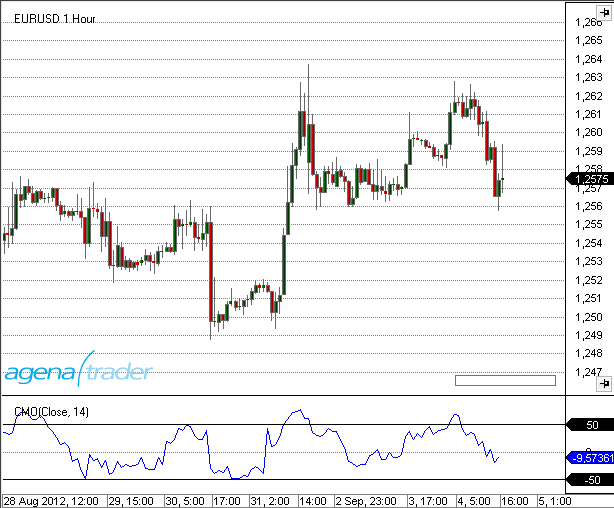

### Beispiel
```cs
//Ausgabe des Wertes für den Chande Momentum Oscillator
Print("The current value for the Chande Momentum Oscillator is: " + CMO(14)[0]);
```
##Climactic Distance
### Beschreibung
Der Climactic Distance-Indikator wurde von Gilbert Kreuzthaler, Geschäftsführer von Include IT GmbH und Gründer von AgenaTrader.com, erfunden und entwickelt. Dieser Indikator wird im Location Point Trading-System eingesetzt. Er berechnet den durchschnittlichen (Median-) Kurs der aktuellen und historischen Kerze mit einem Abstand zum einfachen gleitenden Durchschnitt (SMA) der letzten 20 Perioden. Zusätzlich misst er auch die durchschnittliche Kursabweichung innerhalb der letzten 80 Perioden. Wenn der durchschnittliche (Median-) Kurs die oberste oder unterste Kursabweichung übertrifft, gilt der Markt als climactic (kulminierend), und dies beeinflusst die Handelsentscheidungen, die im Location Point Trading gemacht werden.

### Berechnung
Mittlere schwarze Linie: SMA 20
Bewegte grüne Linie: Durchschnittlicher (Median-) Kurs
Rote obere und untere Linie: Durchschnittliche Kursabweichung der letzten 80 Perioden.

### Weitere Informationen
[https://www.facebook.com/Location-Point-Trading-344217482287592/?fref=ts](https://www.facebook.com/Location-Point-Trading-344217482287592/?fref=ts)

### Verwendung
```cs
ClimacticDistance(int sMAPeriod, int thresholdPercent)
ClimacticDistance(IDataSeries InSeries, int sMAPeriod, int thresholdPercent)
ClimacticDistance(int period, int tresholdPercent, Color climacticColor)
ClimacticDistance(IDataSeries InSeries, int sMAPeriod, int thresholdPercent, Color climacticColor)
//Obere  band
ClimacticDistance(int sMAPeriod, int thresholdPercent).Upper[int barsAgo]
ClimacticDistance(IDataSeries InSeries, int sMAPeriod, int thresholdPercent).Upper[int barsAgo]
ClimacticDistance(int period, int tresholdPercent, Color climacticColor).Upper[int barsAgo]
ClimacticDistance(IDataSeries InSeries, int sMAPeriod, int thresholdPercent, Color climacticColor).Upper[int barsAgo]
//Untere band
ClimacticDistance(int sMAPeriod, int thresholdPercent).Lower[int barsAgo]
ClimacticDistance(IDataSeries InSeries, int sMAPeriod, int thresholdPercent).Lower[int barsAgo]
ClimacticDistance(int period, int tresholdPercent, Color climacticColor).Lower[int barsAgo]
ClimacticDistance(IDataSeries InSeries, int sMAPeriod, int thresholdPercent, Color climacticColor).Lower[int barsAgo]

//Gleitender Durchschnitt
ClimacticDistance(int sMAPeriod, int thresholdPercent).MovingAverage[int barsAgo]
ClimacticDistance(IDataSeries InSeries, int sMAPeriod, int thresholdPercent).MovingAverage[int barsAgo]
ClimacticDistance(int period, int tresholdPercent, Color climacticColor).MovingAverage[int barsAgo]
ClimacticDistance(IDataSeries InSeries, int sMAPeriod, int thresholdPercent, Color climacticColor).MovingAverage[int barsAgo]
//Distanz
ClimacticDistance(int sMAPeriod, int thresholdPercent).Distance[int barsAgo]
ClimacticDistance(IDataSeries InSeries, int sMAPeriod, int thresholdPercent).Distance[int barsAgo]
ClimacticDistance(int period, int tresholdPercent, Color climacticColor).Distance[int barsAgo]
ClimacticDistance(IDataSeries InSeries, int sMAPeriod, int thresholdPercent, Color climacticColor).Distance[int barsAgo]
```
### Rückgabewert
**double**

### Parameters
Int

### Darstellung
**IMAGE**

### Beispiel
```cs
//Output of the value for the Upper climactic distance line
Print(“Value of the upper band: “ + ClimacticDistnance(20, 80).Upper[0]);
//Output of the value for the Lower climactic distance line
Print(“Value of the upper band: “ + ClimacticDistnance(20, 80).Lower[0]);
//Output of the value for the Distance climactic distance line
Print(“Value of the upper band: “ + ClimacticDistnance(20, 80).Distance[0]);
//Output of the value for the Moving Average climactic distance line
Print(“Value of the upper band: “ + ClimacticDistnance(20, 80).MovingAverage[0]);
```

##Commodity Channel Index (CCI)
### Beschreibung
Der Commodity Channel Index (CCI) wurde 1980 von Donald Lambert entwickelt und fand seine erste Verwendung am Warenterminmarkt. Der CCI ist ein recht komplexer, trendfolgend ausgerichteter Indikator. Er funktioniert besonders gut in Seitwärtsbewegungen mit einem deutlichen Seitwärtstrendkanal. Er wird verwendet, um Beginn und Ende von Kurstrends, von saisonalen Trends und Zyklen zu erkennen. (Quelle: VTAD)

### Interpretation
Der CCI misst den Unterschied zwischen einer Preisänderung eines Wertpapieres und seiner durchschnittlichen Preisänderung. Hohe positive Messungen deuten darauf hin, dass Preise hoch über ihrem Durchschnitt liegen, was Stärke zeigt. Tiefe negative Messungen deuten darauf hin, dass Preise tief unter ihrem Durchschnitt liegen, was wiederum Schwäche zeigt.

Der Commodity Channel Index (CCI) kann entweder als koinzidenten oder als führenden Indikator verwendet werden. Als koinzidenter Indikator spiegeln Anstiege über +100 starke Preisaktion wider, die den Anfang eines Aufwärtstrends signalisieren kann. Abstürze unter -100 spiegeln schwache Preisaktion wider, die den Anfang eines Abwärtstrends signalisieren kann.

Als *führender Indikator*, *Momentum-Oszillatoren*, können Chartisten nach überkauften oder überverkauften Conditionen suchen, die einen Rückkehr zum Mittelwert andeuten könnten. Ebenso können bullische und bearische Divergenzen dazu verwendet werden, frühe Momentumwechsel aufzuspüren und Trendumkehrungen vorauszuahnen.


### Weitere Informationen
VTAD: [http://vtadwiki.vtad.de/index.php/Commodity_Channel_Index](http://vtadwiki.vtad.de/index.php/Commodity_Channel_Index)

### Verwendung
```cs
CCI(int period)
CCI(IDataSeries input, int period)
CCI(int period)[int barsAgo]
CCI(IDataSeries input, int period)[int barsAgo]
```

### Rückgabewert
**double**

Bei Verwendung der Methode mit einem Index  (z.B **CCI**(14)\[**int** barsAgo\] )  wird der Wert des Indikators für den referenzierten Bar ausgegeben.

### Parameters
input		Eingangsdatenreihe für den Indikator

period		Anzahl der Bars, die in die Berechnung einbezogen werden

### Darstellung


### Beispiel
```cs
//Ausgabe des CCI-Wertes berechnet auf 14 Perioden
Print("The value of the Commodity Channel Index is: " + CCI(14));
```

##COTAggregatedIndexPositionDisaggregated
**Die Installation des Technical Analysis-Pakets ist erforderlich, um auf diesen Indikator zugreifen zu können.**

### Beschreibung
Dieser Indikator hat ebenfalls dieselbe Funktionsweise wie der COTAggregatedndexPositionsLegacy, für die Interpretation und nähere Informationen lesen Sie bitte unter [*COTAggregatedIndexPositionLegacy*](#COTAggregatedIndexPositionLegacy) nach. Der Unterschied besteht wiederum in der Verwendung der detaillierteren Disaggregated-Daten für die Berechnung des Indikators.

Für den COTAggregatedIndexPositionDisaggregated stehen folgende Parameter zur Verfügung:

- AddIndices: 
  - **DowJones:** wählen Sie [True], wenn die Positionen des DowJones dem Gesamtergebnis zugezählt werden sollen. 
  - **Nasdaq100:** wählen Sie [True], wenn die Positionen des Nasdaq100 dem Gesamtergebnis zugezählt werden sollen.
  - **Russell2000:** wählen Sie [True], wenn die Positionen des Russell2000 dem Gesamtergebnis zugezählt werden sollen 
  - **SP500:** wählen Sie [True], wenn die Positionen des SP500 dem Gesamtergebnis zugezählt werden sollen.
  
- Categories: Financial
  - Sie können hier nur die Kategorien der Financials auswählen, da mit diesem Indikator 4 Financial-Märkte angesprochen werden. Sie können den Indikator aber in Financial- UND Commoditie-Charts laden. 
  - Wählen Sie [True] für die Kategorien aus, für die die Positionen für die ausgewählten Märkte zusammengezählt und angezeigt werden sollen.
  
- Data base:
  - **ReportType:** siehe [*COTReportLegacy*](#COTReportLegacy) – CotType
  
- Display:
  - **LongPosition:** wählen Sie [True] um die Long-Positionen der gewünschten Marktteilnehmer anzuzeigen
  - **ShortPosition:** wählen Sie [True] um die Short-Positionen der gewünschten Marktteilnehmer anzuzeigen
  - **NetPosition:** wählen Sie [True] um die Netto-Positionen der gewünschten Marktteilnehmer anzuzeigen


### Parameters
angekündigt werden

### Rückgabewert
angekündigt werden

### Verwendung
angekündigt werden

### Darstellung


### Beispiel
angekündigt werden


##COTCommercialIndex
**Die Installation des Technical Analysis-Pakets ist erforderlich, um auf diesen Indikator zugreifen zu können.**

### Beschreibung
Der CommercialIndex ist ein sehr aussagekräftiger COT-Indikator. Er setzt zwei der wichtigsten COT-Kenngrößen ins Verhältnis – die Nettopositionen der Commercials zum gesamten OpenInterest. Dieser Werte werden normalisiert und danach ausgegeben. Ein hoher Wert des CommercialIndex zeigt starkes Kaufverhalten der Commercials an, vice versa zeigt ein niedriger Wert starken Verkaufsdruck von Seiten der Commercials. 

Die Parameter sind ähnlich wie beim COTReport gestaltet. 

Folgende Parameter stehen beim COTCommercialIndex zur Verfügung:

- **CotType**: siehe [*COTReportLegacy*](#COTReportLegacy) – CotType
- **ReportType:** siehe [*COTReportLegacy*](#COTReportLegacy) – ReportType
- **StochasticPeriod:** siehe [*COTReportLegacy*](#COTReportLegacy)  – ComparativePeriod
- **OpenInterestType:** Hier können Sie zwischen [Native/Stochastic] wählen, ob die absoluten Werte oder die stochastischen Werte der Positionen der Commercials zur Berechnung herangezogen werden. Die Standardeinstellung ist „Native“, verändern Sie diese nicht, um die Aussagekraft des Indikators beizubehalten. 

### Parameters
angekündigt werden

### Rückgabewert
angekündigt werden

### Verwendung
angekündigt werden

### Darstellung


### Example
to be announced


##COTOpenInterestDisaggregated
**Die Installation des Technical Analysis-Pakets ist erforderlich, um auf diesen Indikator zugreifen zu können.**

### Beschreibung
Dieser Indikator entspricht der Funktionsweise des COTOpenInterestLegacy, jedoch wiederrum mit den feiner aufgespaltenen Daten der Disaggregated-Reports. Für die Funktionsweise und Interpretation des OpenInterest lesen Sie bitte unter 2 [*COTOpenInterestLegacy*](#COTOpenInterestLegacy).
Auch die Berechnung erfolgt analog zu den Legacy-Berichten, da es zu jedem LongKontrakt auch einen Marktteilnehmer auf der Short-Seite geben muss, sind zwei Berechnungsmethoden möglich (hier für Commodity-Futures):
 
1) Producer[Long] + SwapDealer[Long] + SwapDealer[Spread] + ManagedMoney[Long] + ManagedMoney[Spread] + OtherReportables[Long] + OtherReportables[Spread] + NonReportable[Long] = OpenInterest

2) Producer[Short] + SwapDealer[Short] + SwapDealer[Spread] + ManagedMoney[Short] + ManagedMoney[Spread] + OtherReportables[Short] + OtherReportables[Spread] + NonReportable[Short] = OpenInterest

Folgende Parameter stehen für den COTOpenInterestDisaggregated zur Verfügung:

- **Categories: Commodity** 
  - **OpenInterest_Comm:** (=gesamtes OpenInterest für Commodities) 
      - [Absolute]:  gibt das OpenInterest als absolute Zahl aus
      - [Stochastic]:  OpenInterest als Oszillator mit Werten zw. 0-100 
      - [None]: keine Ausgabe des OpenInterests.
  - **%ofOIProd Long/Short/Spread:** (=Percent of OpenInterest for Producer Long/Short/Spread – Position) – wählen Sie [True], wenn dieser Wert angezeigt warden soll. Hierbei handelt es sich um den Anteil, den die Positionen der Producer am gesamten OpenInterest haben. Ein Wert von 0,5 bedeutet z.B. dass die Producer Long-Positionen in der Größe von 50% des gesamten OpenInterest aufgebaut haben. 
  -  **%ofOISwapDealer Long/Short/Spread:** (=Percent of OpenInterest for SwapDealers Long/Short/Spread – Position)  – wählen Sie [True], wenn dieser Wert angezeigt warden soll.
  - **%ofOIManagedMoney Long/Short/Spread**: (=Percent of OpenInterest for ManagedMoney Long/Short/Spread – Position)  – wählen Sie [True], wenn dieser Wert angezeigt warden soll.
  - **%ofOIComOther Long/Short/Spread:** (=Percent of OpenInterest for Other Traders in Commodities Long/Short/Spread – Position) – wählen Sie [True], wenn dieser Wert angezeigt warden soll. 
  - **%ofOIComNonreportables Long/Short/Spread**: (=Percent of OpenInterest for NonReportables in Commodites Long/Short/Spread – Position)  – wählen Sie [True], wenn dieser Wert angezeigt warden soll.
- **Categories: Financial**
  - Alle Parameter funktionieren analog zu den Einstellungen unter„Categories: Commodity“, der einzige Unterschied liegt in der Aufteilung in unterschiedliche Gruppen der Marktteilnehmer

- **Database:** 
  - **CotType:** siehe [*COTReportLegacy*](#COTReportLegacy) - CotType 
  - **ReportType:** siehe [*COTReportLegacy*](#COTReportLegacy) - ReportType 
  - **StochasticPeriod:** siehe [*COTReportLegacy*](#COTReportLegacy) – ComparativePeriod

### Parameters
angekündigt werden

### Rückgabewert
angekündigt werden

### Verwendung
angekündigt werden

### Darstellung


### Beispiel
angekündigt werden

##COTOpenInterestLegacy
**Die Installation des Technical Analysis-Pakets ist erforderlich, um auf diesen Indikator zugreifen zu können.**

### Beschreibung
Das OpenInterest gibt die Anzahl aller aktuell gehaltenen Kontrakte an, ein hohes OpenInterest zeugt also von großem Interesse der Marktteilnehmer in diesen Markt, vice versa steht ein niedriges OpenInterest für nur wenig gehaltene Kontakte eines Wertes und damit geringe Aktivität der Marktteilnehmer.

Es gibt zwei Möglichkeiten das OpenInterest zu berechnen:

 1) Commercial[Long] + NonCommercial[Long] + NonCommercial[Spread] + NonReportable[Long] = OpenInterest
 2) Commercial[Short] + NonCommercial[Short] + NonCommercial[Spread] + NonReportable[Short] = OpenInterest

Da es zu jedem Long-Kontrakt auch einen Marktteilnehmer auf der Short-Seite gibt, ergeben beide Berechnungsmethoden den exakt gleichen Wert. Zusatzinfo: Bei der CFTC wird nicht das OpenInterest berechnet - die CFTC kann das OpenInterest einsehen, indem alle am Markt offenen Kontrakte registriert und gezählt werden. Mit dadurch bekanntem OpenInterest können die NonReportable-Positionen berechnet werden, da die folgende Gleichung gelten muss: TotalReportable + NonReportable = OpenInterest. TotalReportable und OpenInterest sind bekannt, wodurch die NonReportables berechnet werden können. 

Folgende Parameter sind beim OpenInterestLegacy verfügbar:

- **CotType:** siehe [*COTReportLegacy*](#COTReportLegacy) – CotType

- **ReportType:** siehe [*COTReportLegacy*](#COTReportLegacy) – ReportType

- **StochasticPeriod:** siehe  [*COTReportLegacy*](#COTReportLegacy)– ComparativePeriod 

- **IsNative:** gibt das OpenInterest als absolute Zahl aus, so wie die Daten aus den Reports der CFTC ausgelesen werden.

- **IsStochastic:** das OpenInterest wird als Oszillator mit Werten zwischen 0-100 ausgegeben und berechnet. Mit der StochasticPeriod können Sie einstellen, mit welcher Periode die Stochastik berechnet werden soll.

- **IsCommercialLong/IsCommercialShort:** wählen Sie [True], wenn Sie die Daten der Commercials angezeigt habe möchten. Die ausgegebenen Werte sind Prozentzahlen, wenn Sie z.B. IsCommercialLong=True setzten, wird der Prozentsatz ausgegeben, den die Long-Positionen der Commercials am gesamten OpenInterest haben. Ein Wert von z.B. 0,5 bedeutet, dass das OpenInterest aus 50% Long-Positionen der Commercials besteht, was als sehr große Long-Position der Commercials angesehen werden kann. 

- **IsNonCommercialLong/IsNonCommercialShort:** wenn Sie [True] wählen, wird der Prozentsatz ausgegeben, den die NonCommercial-LongPositionen bzw. NonCommercial-ShortPositionen am gesamten OpenInterest haben.

- **IsNonReportableLong/IsNonReportableShort:** wenn Sie [True] wählen, wird der Prozentsatz ausgegeben, den die NonReportable-LongPositionen bzw. NonReportable-ShortPositionen am gesamten OpenInterest haben

- **IsTotalReportableLong/IsTotalReportableShort:**wenn Sie [True] wählen, wird der Prozentsatz ausgegeben, den die TotalReportable-LongPositionen bzw. TotalReportable-ShortPositionen am gesamten OpenInterest haben. (TotalReportable = Commercials+NonCommercials).

### Parameters
angekündigt werden

### Rückgabewert
angekündigt werden

### Verwendung
angekündigt werden

### Darstellung


### Beispiel
angekündigt werden


##COTReportDisaggregated
**Die Installation des Technical Analysis-Pakets ist erforderlich, um auf diesen Indikator zugreifen zu können.**

### Beschreibung
Der COTReportDisaggregated greift auf die detaillierteren Disaggregated-Berichteder CFTC zu, die seit 2009 veröffentlicht werden und als Weiterentwicklung derLegacy-Berichte angesehen werden können. Die Notwendigkeit zu Verbesserungenresultierte aus dem sich stark verändernden und weiterentwickelten Marktumfeld seit der Einführung der COT-Berichte 1986.  

Die Marktteilnehmer werden nun feiner unterschieden und sind in 5 Kategorien eingeteilt. Diese 5 Kategorien unterscheiden sich je nachdem, ob es sich um einen Commodity-Future oder einen Financial-Future handelt. 


Die **commodity futures** sind in folgende Gruppen aufgeteilt:

- Producer/Merchant/Processor/User 
- SwapDealers o ManagedMoney 
- Other Reportables 
- Nonreportables 
- Nähere Infos zur Klassifizierung der Commodities finden Sie [HIER](http://www.cftc.gov/idc/groups/public/@commitmentsoftraders/documents/file/disaggregatedcotexplanatorynot.pdf)

Bei den **financial futures** gibt es folgende Gruppen:

- Dealer/Intermediary 
- AssetManager/Institutional 
- Leveraged Funds 
- Other Reportables 
- Nonreportabes
- Nähere Infos zur Klassifizierung der Financials finden Sie [HIER](http://www.cftc.gov/idc/groups/public/@commitmentsoftraders/documents/file/tfmexplanatorynotes.pdf)

Folgende Parameter stehen beim COTReportDisaggregated zur Verfügung:

- **Categories Commodity/Categories Financial:**
  - Wählen Sie [True] für die Gruppen, die Sie im Chart angezeigt bekommen möchten. Wenn Sie einen Commodity-Chart geöffnet haben, werden nur die Einstellungen unter „Categories Commodity“ beachtet, vice versa wenn Sie einen Financial-Chart geöffnet haben.

- **Database:** 
  - **CotType:** siehe [*COTReportLegacy*](#COTReportLegacy) - CotType 
  - **IndexType::** siehe [*COTReportLegacy*](#COTReportLegacy) - IndexType 
  - **ReportType:** siehe [*COTReportLegacy*](#COTReportLegacy) - ReportType 
  - **StochasticPeriod:** siehe [*COTReportLegacy*](#COTReportLegacy) – ComparativePeriod
  
 - **Display:**
   - **LongPosition**: wählen Sie [True] um die Long-Positionen der gewünschten Marktteilnehmer anzuzeigen
   - **ShortPosition**: wählen Sie [True] um die Short-Positionen der gewünschten Marktteilnehmer anzuzeigen
   - **NetPosition**: wählen Sie [True] um die Netto-Positionen der gewünschten Marktteilnehmer anzuzeigen


### Parameters
angekündigt werden

### Rückgabewert
angekündigt werden

### Verwendung
angekündigt werden

### Darstellung


### Beispiel
angekündigt werden

##COTReportLegacy
**Die Installation des Technical Analysis-Pakets ist erforderlich, um auf diesen Indikator zugreifen zu können.**

### Beschreibung
Dieser Indikator ist das Herzstück der COT-Analyse, mit dem direkt die reinen Daten angezeigt werden können, die der Indikator aus den wöchentlich veröffentlichten Berichten der CFTCC (www.cftc.gov/CommitmentsofTraders) ausliest. Die veröffentlichten Reports können von jedem Marktteilnehmer eingesehen werden. Die Legacy-Daten entsprechen den Short-Reports auf der CFTC-Website. Folgende Parameter sind beim COTReportLegacy verfügbar:

- **Comparative Period:** mit dieser Einstellung können Sie eine Vergleichsperiode eingeben, mit der die stochastische Darstellung berechnet wird (=StochasticPeriod). Dieser Parameter wird nur angesteuert, wenn auf „IndexType = Stochastic“ gestellt ist. 

- **CotType:** wählen Sie unter [All/Other/Old] welche Kontrakte zur Anzeige genutzt werden sollen, nähere Infos finden Sie [HIER](http://www.cftc.gov/MarketReports/CommitmentsofTraders/ExplanatoryNotes/index.htm)

- **IndexType:** wählen Sie zwischen [Absolute/Stochastic], wie die Werte ausgegeben werden sollen.
  - Absolute = die Werte werden in ganzen Zahlen ausgegeben, genauso wie Sie aus den Reports gelesen werden. 
  - Stochastic =  die Werte werden als Oszillator mit Werten zwischen 0-100 ausgegeben und berechnet. Mit der ComparativePeriod können Sie einstellen, mit welcher Periode die Stochastik berechnet werden soll. 
 
- **ReportType:** : unter diesem Parameter wählen Sie, ob die Daten aus den Reports nur für Futures oder für Futures+Optionen gelesen werden sollen.

- **ReturnType:** 
  - Netto: gibt die Nettoposition (=LongKontrakte – ShortKontrakte) der gewählten Marktteilnehmer aus
  - Long/Short: gibt die Anzahl der Long bzw. Short-Kontrakte der gewählten Marktteilnehmer aus
  - OI: gibt das gesamte OpenInterest dieses Instruments aus, zur genaueren und fortgeschrittenen Anzeige des OpenInterests nutzen Sie bitte den Indikator OpenInterestLegacy

  
 - **ShowCommercials:** swählen Sie [True], wenn Sie die Daten der Commercials angezeigt habe möchten. Nähere Infos zur Definition, welche Marktteilnehmer als Commercials eingestuft werden lesen Sie [HIER](http://www.cftc.gov/MarketReports/CommitmentsofTraders/ExplanatoryNotes/index.htm)
 
 - **ShowNonCommercials:** wählen Sie [True], wenn Sie die Daten der NonCommercials angezeigt habe möchten. Nähere Infos zur Definition, welche Marktteilnehmer als Commercials eingestuft werden entnehmen Sie bitte dem oben angeführten Link.
 
 - **ShowNonReportables:** wählen Sie [True], wenn Sie die Daten der NonReportables angezeigt habe möchten. Nähere Infos zur Definition, welche Marktteilnehmer als Commercials eingestuft werden entnehmen Sie bitte dem oben angeführten Link.

### Parameters
angekündigt werden

### Rückgabewert
angekündigt werden

### Verwendung
angekündigt werden

### Darstellung


### Beispiel
angekündigt werden


##COTStockDummy
**Die Installation des Technical Analysis-Pakets ist erforderlich, um auf diesen Indikator zugreifen zu können.**

### Beschreibung
Dieser Indikator versucht mit einem speziellen Algorithmus, das Verhalten der Commercials in Aktienmärkten zu simulieren. Die Werte können Absolut oder als Stochastik ausgegeben werden. Die Interpretation dieses Indikators erfolgt analog zur Interpretation der Commercial-Daten in den Standard-COT-Indikatoren. Die Ausgabe dieses Indikators sollte mit anderen Indikatoren bestätigt werden. Sie
müssen sich bewusst sein, dass es sich nicht um echte COT Daten von Marktteilnehmern handelt, sondern um Berechnungen aus den Preisdaten. Um die Aussagekraft des COTStockDummy zu verbessern, bietet sich eine Analyse in Kombination mit dem LargeTraderActivity-Indikator an. Wie bei den COT-Daten ist auch für den COTStockDummy die Analyse im Wochenchart zu empfehlen. 

Folgende Parameter stehen für den COTStockDummy zur Verfügung:

- **ComparativePeriod:** Input-Periode für die Stochastische Berechnung
- **Stochastic:**  [True] gibt die Werte normalisiert aus (Werte zwischen 0-100)
- **Period:**  hierbei handelt es sich um eine Periode, die zur Berechnung der Daten notwendig ist. Sofern Sie nicht detaillierte Informationen zur Funktionsweise dieses Indikators besitzen, belassen Sie diese Periode bitte in den Standardeinstellungen.

### Parameters
angekündigt werden

### Rückgabewert
angekündigt werden

### Verwendung
angekündigt werden

### Darstellung


### Beispiel
angekündigt werden

##COTLargeTraderActivity

**Die Installation des Technical Analysis-Pakets ist erforderlich, um auf diesen Indikator zugreifen zu können.**

### Beschreibung
Der COTLargeTraderActivity-Indikator basiert wie auch der COTStockDummy nicht auf echten COT-Daten, sondern auf algorithmisch berechneten Outputs. Dieser Indikator versucht das Verhalten der LargeTrader in Märkten zu simulieren, für die keine COT-Daten vorhanden sind. Die Interpretation erfolgt hier nun analog zur Analyse der NonCommercials in den Standard-COT-Indikatoren. Wie auch beim COTStockDummy weisen wir darauf hin, dass noch weitere Indikatoren zurate gezogen werden sollten, da es sich nicht um echte COT-Daten handelt. Eine Analyse in Kombination mit den Werten des COTStockDummy ist zu empfehlen.

Folgende Parameter stehen für den COTLargeTraderActivity zur Verfügung:

- **Period:**  hierbei handelt es sich um eine Periode, die zur Berechnung der Daten notwendig ist. Sofern Sie nicht detaillierte Informationen zur Funktionsweise dieses Indikators besitzen, belassen Sie diese Periode bitte in den Standardeinstellungen.

### Parameters
angekündigt werden

### Rückgabewert
angekündigt werden

### Verwendung
angekündigt werden

### Darstellung


### Beispiel
angekündigt werden

## Darvas Boxes
### Beschreibung
Die Darvas Boxes sind ein Teil der Handelsstrategie des ungarischen Tänzers Nicolas Darvas. Im stark steigenden Aktienmarkt 1957/58 generierte Darvas mit seinem System innerhalb von 18 Monaten aus etwa 20.000 US$ mehr als 2.000.000 US$. Vorgestellt wurde das Handelssystem erstmals in seinem Buch "How I made 2.000.000$ in the Stock Market". 
Eine Box besteht aus einer oberen ("Deckel") und einer unteren Begrenzung ("Boden"). Jede neue Box setzt auf der vorhergeneden Box auf, so dass eine treppenförmige Darstellung entsteht.
Im ersten Schritt wird der "Deckel" bestimmt.  Wenn eine Aktie an drei aufeinanderfolgenden Tagen kein neues Hoch markiert, wird dieses zurückliegende Hoch die obere Begrenzung der Box.
Anschließend wird der "Boden" der Box bestimmt, der sich als niedrigster Kurs ergibt, auf den die Aktie nachgab. Dieser Tiefstkurs darf dann an den drei Folgetagen nicht mehr unterschritten werden. 

### Interpretation
Das System gleicht einem trendfolgenden Channel-Breakout-System. 
Sobald der Kurs aus eine dieser Boxen ausbricht, entsteht ein Kauf- bzw. Verkauf-Signal.

Wenn der Kurs (in einer Long-Position) durch eine untere Begrenzung fällt, wird die Position geschlossen.

Für Short-Positionen ist der Ablauf analog. 

### Weitere Informationen
Ein Handelssystem basierend auf Darvas Boxes:
[http://www.eusdoni.de/index.php?option=com_content&view=article&catid=13:eusdoni-version-3&id=42:darvas-boxen](http://www.eusdoni.de/index.php?option=com_content&view=article&catid=13:eusdoni-version-3&id=42:darvas-boxen)

### Verwendung
```cs
Darvas()
Darvas(IDataSeries input)

//For the upper Box boundary
Darvas().Upper[int barsAgo]
Darvas(IDataSeries input).Upper[int barsAgo]

//Returns the lower value
Darvas().Lower[int barsAgo]
Darvas(IDataSeries input).Lower[int barsAgo]
```

### Rückgabewert
**double**

Bei Verwendung der Methode mit einem Index (z.B. **Darvas**()\[**int** barsAgo\] ) wird der Wert des Indikators für den referenzierten Bar ausgegeben.

### Parameter
input		Eingangsdatenreihe für den Indikator

### Darstellung


### Beispiel
```cs
//Ausgabe des Wertes für die obere Begrenzung der Box (Deckel)
Print("The upper boundary for the Darvas box is: " + Darvas().Upper[0]);
//Ausgabe des Wertes für die untere Begrenzung der Box (Boden)
Print("The lower boundary for the Darvas box is: " + Darvas().Lower[0]);
```

##Directional Movement (DM)
### Beschreibung
Der Directional Movement Indikator (DM) ist identisch mit dem ADX Indikator, wobei hier zusätzlich die Werte +DM und -DM berechnet werden. Diese Werte fließen später in die Berechnung des Directional Movement Index (DMI) ein.

### Interpretation
Der Directional Movement Indikator ist positiv, wenn die Differenz zwischen den Hochpunkten am größten ist. Er ist nach unten gerichtet (oder negativ), wenn die Differenz zwischen den Kurstiefs den größten Wert hat. Somit ist die nach oben gerichtete Bewegung +DM, und die nach unten gerichtete Bewegung ist -DM.
Die Plus- bzw. Minus-Zeichen sind nicht im math. Sinne zu verstehen. Sie geben nur nach oben oder unten gerichtete Bewegung an. Der Wert ist immer eine positive Zahl, unabhängig von Aufwärts- oder Abwärtsbewegung.

### Further information
siehe Directional Movement Index ([*DMI*](#directional-movement-index-dmi))

### Verwendung
```cs
DM(int period)
DM(IDataSeries input, int period)
DM(int period)[int barsAgo]
DM(IDataSeries input, int period)[int barsAgo]
//Für den Wert von +DM
DM(int period).DiPlus[int barsAgo]
DM(IDataSeries input, int period).DiPlus[int barsAgo]
//Für den Wert von -DM
DM(int period).DiMinus[int barsAgo]
DM(IDataSeries input, int period).DiMinus[int barsAgo]
```

### Rückgabewert
**double**

Bei Verwendung der Methode mit einem Index (z.B. **DM**(14).DiPlus\[**int** barsAgo\] ) wird der Wert des Indikators für den referenzierten Bar ausgegeben.

### Parameters
input		Eingangsdatenreihe für den Indikator

period		Anzahl der Bars, die in die Berechnung einbezogen werden

### Darstellung
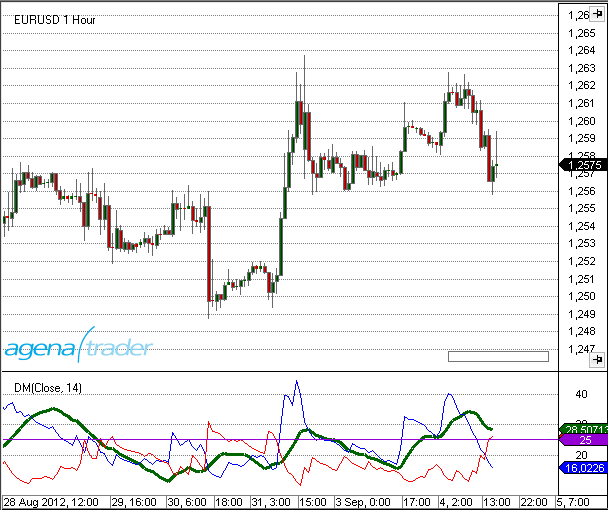

### Beispiel
```cs
//Ausgabe der Directional Movement-Werte +DM und -DM
Print("The current +DM value is: " + DM(14).DiPlus[0]);
Print("The current –DM value is: " + DM(14).DiMinus[0]);
```

##Donchian Channel
### Beschreibung
Der Donchian Channel ist unter dem Begriff 4-Wochen-Regel bekannt geworden und funktioniert folgendermaßen: Wenn der aktuelle Kurs den Höchstkurs der letzten vier Wochen übersteigt, wird eine Long-Position eröffnet. Besteht zur gleichen Zeit eine Short-Position, wird diese geschlossen. Fällt der Kurs unter den Tiefstkurs der letzten vier Wochen, wird eine Long-Position geschlossen bzw. eine Short-Position aufgebaut. 
Der Handelsansatz des Donchian Channel ist ein reines Trendfolgesystem und setzt das Prinzip „Bei Stärke kaufen, bei Schwäche verkaufen“ direkt um. Es ist ein Breakout System und wurde von den "Turtles" verwendet. 
Bei diesem Indikator werden die Höchst- und Tiefstkurse der letzten n-Tage als Linien über und unter den Kursverlauf gezeichnet. Die vier Wochen entsprechen 20 Handelstagen.

### Interpretation
**Früher**
Zu seiner Anfangszeit verwendete man beim Donchian Channel beim kurzfristigen System für den Einstieg in eine Long-Position das Überschreiten des 20-Tage-Höchstkurses und für den Ausstieg das Unterschreiten des 10-Tage-Tiefstkurses. Umgekehrt erfolgte der Einstieg in eine Short-Position bei einem 20-Tage-Tief und der Ausstieg bei einem 10-Tage-Hoch. Bei langfristigen Systemen verwendete man anstellen der 20 Tage beim Einstieg 55 Tage und anstatt 10 Tage beim Ausstieg nahm man 20 Tage. Zudem benutzte man volatilitätsbasierte Stopps und eine ebenso volatilitätsbasierte Methode zur Positionsbestimmung.
**Heute**
Aktuelle Forschungsergebnisse zeigen, dass heute die langfristigen Ausbrüche zwischen 40 und 100 Tagen besser funktionieren als die kurzfristigen. Der Ansatz aus den vergangenen Jahrzehnten ist mittlerweile zu populär geworden.

### Weitere Informationen
VTAD: <http://vtadwiki.vtad.de/index.php/Donchian\_Channel>

### Verwendung
```cs
DonchianChannel(int period)
DonchianChannel(IDataSeries input, int period)

//Für das obere Band
DonchianChannel(int period).Upper[int barsAgo]
DonchianChannel(IDataSeries input, int period).Upper[int barsAgo]

//Für das mittlere Band
DonchianChannel(int period)[int barsAgo]
DonchianChannel(IDataSeries input, int period)[int barsAgo]

//Für das untere Band
DonchianChannel(int period).Lower[int barsAgo]
DonchianChannel(IDataSeries input, int period).Lower[int barsAgo]
```

### Rückgabewert
**double**

Bei Verwendung der Methode mit einem Index  (z.B. **DonchianChannel**(14)\[**int** barsAgo\] ) wird der Wert des Indikators für den referenzierten Bar ausgegeben.

### Parameters
input		Eingangsdatenreihe für den Indikator

period		Anzahl der Bars, die in die Berechnung einbezogen werden

### Darstellung


### Beispiel
```cs
//Ausgabe der Werte für den DDonchianChannel
Print("The upper band is at: " + DonchianChannel(14).Upper[0]);
Print("The middle band is at: " + DonchianChannel(14)[0]);
Print("The lower band is at: " + DonchianChannel(14).Lower[0]);
```

##Directional Movement Index (DMI)
### Beschreibung
Das Directional Movement Konzept wurde 1978 von Welles Wilder jr. in seinem Buch „New Concepts in Technical Trading Systems“ vorgestellt. Dieses Konzept beinhaltet folgende Komponenten:

Directional Movement Index (DMI)

Average Directional Movement Index ([*ADX*](#average-directional-index-adx))

True Range (TR)

Der Directional Movement Index ist eine Vorstufe des Average Directional Movement Index (ADX). Der DMI zeigt die prozentuale Stärke einer trendgerichteten Bewegung an. Verwendet wird in der Regel die geglättete Variante, der ADX. (Quelle: VTAD)

### Interpretation
Der DMI zeigt die Trendstärke an, nicht aber die Trendrichtung. Damit eignet er sich als Filter für trendfolgende Handelssysteme, z.B. den Parabolic SAR, um Seitwärtsphasen herauszufiltern. Bei einem steigenden DMI und ins besondere Werten über 25 wird ein Trend angezeigt, darunter liegt eine Seitwärtsphase vor. +DI und –DI weisen auf die Trendrichtung hin. Im Aufwärtstrend liegt der +DI über dem –DI, im Abwärtstrend entsprechend umgekehrt. Bei Kreuzungen des +DI und –DI wechselt der Trend. Je weiter +DI und –DI auseinander driften, desto stärker ist der Trend. Pendeln +DI und –DI eher lustlos um einander herum und taucht der DMI nach unten ab, liegt eine Seitwärtsphase vor. DMI sowie +DI und –DI eignen sich für Trendlinien- und Divergenzanalyse.

### Weitere Informationen
VTAD: [http://vtadwiki.vtad.de/index.php/DMI_-_Directional_Movement_Index](http://vtadwiki.vtad.de/index.php/DMI_-_Directional_Movement_Index)

### Verwendung
```cs
DMI(int period)
DMI(IDataSeries input, int period)
DMI(int period)[int barsAgo]
DMI(IDataSeries input, int period)[int barsAgo]
```

### Rückgabewert
**double**

Bei Verwendung der Methode mit einem Index (z.B. **DMI**(20)\[**int** barsAgo\] )  wird der Wert des Indikators für den referenzierten Bar ausgegeben.

### Parameters
input		Eingangsdatenreihe für den Indikator

period		Anzahl der Bars, die in die Berechnung einbezogen werden

### Darstellung


### Beispiel
```cs
//Ausgabe des Wertes für den Directional Movement Index
Print("The current DMI value is: " + DMI(20)[0]);
```

##Double Stochastics (DSS)
### Beschreibung
Die Double Smothed Stochastic (DSS) wurde zuerst von W. Blau vorgestellt. Es handelt sich um einen doppelt geglätteten Stochastic-Indikator. Einige Zeit später wurde von W. Bressert eine weitere Variante einer doppelt geglätteten Stochastik vorgestellt. Diese auch als DSS Bressert bekannte Variante konnte die Qualität der Signale gegenüber der Variante von Blau deutlich verbessern.  Der Indikator reagiert sensibler auf kleinere Kursbewegungen und erzeugt mehr Signale als die Version von W. Blau. Die Bressert-Version taucht wesentlich deutlicher in die Extremzonen ein als die Blau-Version.

Von der Blau-Version existiert eine weitere Variante, die mit 2 EMA's berechnet wird. Diese Version ist in AgenaTrader mit "Blau2" bezeichnet. 

Unabhängig von der konkreten Berechnungsvariante bewegt sich der Indikator DSS immer in einer Skala von 0 bis 100. Für die Extremzonen gelten die gleichen Werte wie bei Lanes Original-Stochastik und den Blau-Versionen. Der obere Extrembereich wird bei 80 und der untere Extrembereich bei 20 festgelegt. Diese Werte können variiert werden. Es kann oft sehr profitabel sein, die Extremzonen zu verändern. Für diverse Anwendungen ist es sinnvoll, eine zusätzliche Linie als Mittellinie bei 50 einzuzeichnen.
Die Glättung hat in Bresserts Version nicht die herausragende Bedeutung wie bei Blau. Das soll heißen, der Aufwand zum Auffinden der optimalen Einstellung kann gering gehalten werden. Bei den Blau-Versionen ist es wichtiger, verschiedene Parameter zu testen. (Quelle: z.T. tradesignalonline)

### Interpretation
Hier gilt das gleiche, was auch zu Lanes Original-Stochastik geschrieben wurde.
Als Interpretation gilt zunächst, dass Indikatorwerte von über 80 als überkaufter Zustand gelten. Indikatorwerte von unter 20 gelten als überverkaufter Zustand. Solchen Situationen wird zunächst unterstellt, dass sie vom Markt korrigiert werden.
Hauptanwendung ist jedoch das Generieren von Handelssignalen aus Schnittpunkten einer Signallinie oder einer Linie der Extrembereiche. Als Signallinie kann ein gleitender Durchschnitt variabler Berechnungsmethoden auf den Indikator berechnet werden. In der Regel werden hier Periodeneinstellungen von 3 bis 5 Tagen verwendet.

Da der Indikator ein nahezu „eckenloses“ Verlaufsmuster bildet, bieten sich für die Signallinie eng anliegende Varianten, wie der Kaufmann's Adaptive Moving Average (KAMA), der Weighted Moving Average (WMA) oder ein anderer, sehr reagibler Durchschnitt an. Die Gefahr von ungewollten Überkreuzungen ist bei diesem Indikator sehr gering. Als Signale werden die Schnittpunkte mit der Signallinie verwendet. Schneidet der Indikator die Signallinie nach oben, gilt dies als Kaufsignal, schneidet er sie nach unten als Verkaufssignal.
Mit Hilfe der Mittellinie oder den Extremzonen können die Signale zusätzlich gefiltert werden. Bullishe Signale können nur dann verwendet werden, wenn sie unter der Mittellinie oder in der unteren Extremzone entstehen. Bearishe Signale werden dann nur verwendet, wenn sie in der oberen Extremzone oder über der Mittellinie entstehen.

Eine andere Variante der Signalerzeugung ist, die direkte Bewegung des Indikators in eine Extremzone hinein oder aus ihr heraus als Signal zu werten. Läuft der Indikator aus der unteren Überverkauft - Zone heraus, kann dies als Kaufsignal gelten, läuft er aus der oberen Überkauft - Zone heraus, gilt das als Verkaufssignal.
In trendstarken Phasen läuft dieser Indikator relativ oft die entgegengesetzte Extremzone an und liefert so brauchbare Signale.

### Verwendung
```cs
DoubleStochastics(int period)
DoubleStochastics(int period)[int barsAgo]
DoubleStochastics(int period, DoubleStochasticsMode mode, int EMA-Period1)
DoubleStochastics(IDataSeries input, int period, DoubleStochasticsMode mode, int EMA-Period1)
DoubleStochastics(int period, DoubleStochasticsMode mode, int EMA-Period1)[int barsAgo]
DoubleStochastics(IDataSeries input, int period, DoubleStochasticsMode mode, int EMA-Period1)[int barsAgo]
DoubleStochastics(int period, DoubleStochasticsMode mode, int EMA-Period1, int EMA-Period2)
DoubleStochastics(IDataSeries input, int period, DoubleStochasticsMode mode, int EMA-Period1, int EMA-Period2)
DoubleStochastics(int period, DoubleStochasticsMode mode, int EMA-Period1, int EMA-Period2)[int barsAgo]
DoubleStochastics(IDataSeries input, int period, DoubleStochasticsMode mode, int EMA-Period1, int EMA-Period2)[int barsAgo]

//Für den Wert von %K   (Signaturen sind nur noch aus Gründen der Kompatibilität vorhanden)
DoubleStochastics(int period).K[int barsAgo]
DoubleStochastics(IDataSeries input, int period).K[int barsAgo]
DoubleStochastics(int period, DoubleStochasticsMode mode, int EMA-Period1).K[int barsAgo]
DoubleStochastics(IDataSeries input, int period, DoubleStochasticsMode mode, int EMA-Period1).K[int barsAgo]
DoubleStochastics(int period, DoubleStochasticsMode mode, int EMA-Period1, int EMA-Period2).K[int barsAgo]
DoubleStochastics(IDataSeries input, int period, DoubleStochasticsMode mode, int EMA-Period1, int EMA-Period2).K[int barsAgo]
```

### Rückgabewert
**double**

Bei Verwendung der Methode mit einem Index (z.B. **DoubleStochastics**(...)\[**int** barsAgo\] bzw **DoubleStochastics**(...).K\[**int** barsAgo\]) wird der Wert des Indikators für den referenzierten Bar ausgegeben.

### Parameters
input		Eingangsdatenreihe für den Indikator

period		Anzahl der Bars, die in die Berechnung einbezogen werden. (default: 10)

mode		Berechnungsmethode, mögliche Werte sind: Blau, Blau2 und Bressert. (default: Bressert)

EMA-Period1	Periode für den EMA in der Berechnung nach Bressert. (default: 2) 

EMA-Period2	Periode für den zweiten EMA in der Berechnung für Variante Blau2. (default: 5) 

### Darstellung


### Beispiel
```cs
//Ausgabe des Wertes für %K des DSS-Bressert
Print("The value of the DSS Bressert %K is: " + DoubleStochastics(10, DoubleStochasticsMode.Bressert, 2)[0]);
```

##Dynamic Momentum Index (DMIndex)
### Beschreibung
Hyperlink+Keywords
Der Dynamic Momentum Index (DMIndex), wurde von Tushar Chande entwickelt. Es handelt sich hierbei um eine spezielle Variante des Relative Strength Index (RSI).

Chande veränderte den Dynamic Momentum Index so, dass dieser die Periodeneinstellung je nach Marktsituation automatisch selbst verändert. Dies erreichte er durch die Kopplung des RSI an eine Volatilitätskomponente. Diese Volatilitätskomponente des Dynamic Momentum Index bestimmt sich aus einer 5-tägigen Standardabweichung der Schlusskurse, die in das Verhältnis zu einem 10-tätigen Durchschnitt einer 5-tägigen Standardabweichung gesetzt wird. 

Als Basis werden werden beim RSI üblicherweise 14 Tage zur Berechnung gewählt, diese Konstante wird nun durch den Volatilitätsquotienten (V) geteilt. Das Ergebnis wird nun mit einem Minimal- und einem Maximalwert verglichen und darf nicht außerhalb des festgelegten Bereichs von minimal 5 Tagen und maximal 30 Tagen liegen.

### Interpretation
Zeigt der Dynamic Momentum Index den Überkauftbereich an, so wird auf fallende Kurse gesetzt, zeigt der Dynamic Momentum Index den Überverkauftbereich an, so wird auf steigende Kurse gesetzt. Ein solches Handeln ist sinnvoll, wenn andere Indikatoren eine trendlose Phase anzeigen, es soll also gegen den Trend gehandelt werden. Während einer starken Trendphase empfiehlt sich ein Handeln in Trendrichtung, in der Phase eines Aufwärtstrends wird auf eine Überverkauftsituation gewartet bis ein Kaufsignal erfolgt.

### Weitere Informationen
VTAD: <http://vtadwiki.vtad.de/index.php/Dynamic\_Momentum\_Index>

### Verwendung
```cs
DMIndex(int smooth)
DMIndex(IDataSeries input, int smooth)
DMIndex(int smooth)[int barsAgo]
DMIndex(IDataSeries input, int smooth)[int barsAgo]
```

### Rückgabewert
**double**

Bei Verwendung der Methode mit einem Index  (z.B. **DMIndex**(3)\[**int** barsAgo\] ) wird der Wert des Indikators für den referenzierten Bar ausgegeben.

### Parameters
input		Eingangsdatenreihe für den Indikator

smooth	Einstellung zur Glättung

### Darstellung


### Beispiel
```cs
//Ausgabe des Wertes für den DMIndex Indikator mit einer Glättung von 3
Print("The current value for the DMIndex is: " + DMIndex(3)[0]);
```

##Ease of Movement (EOM)
### Beschreibung
Der Ease of Movement (EOM) ist ein interessanter Indikator, der von Richard W. Arms entworfen wurde. Der EOM versucht die Bewegung des Preises, in ein Verhältnis zum aufgewendeten Volumen zu setzen. Je stärker der Indikator ausschlägt, desto größer war der Kursfortschritt mit hohem Volumen. Der EOM ist ein sensibler Seismograph von Angebot und Nachfrage.
Arms glättet den EOM mit einem 13-tägigen SMA. Man kann ihn aber auch völlig ungeglättet benutzen. (Quelle: http://www.volumen-analyse.de)

### Interpretation
Die Nulllinie ist praktisch die Stelle, wo eine gewisse Entspannung zwischen Angebot und Nachfrage eingetreten ist. Wenn sich der EOM von der Nulllinie wegbewegt, dann ist ein Impuls in dieser Richtung entstanden. Den EOM kann man sich als Tischtennisspiel vorstellen, wo die Spieler “Angebot” und “Nachfrage” heißen. Die Nulllinie ist das Tischtennisnetz. Auf jeden Schlag kommt eine Gegenreaktion. Die Kraft des Schlages ist definiert durch das Volumen.
Wenn man nun den EOM in ein Handelssystem einbauen möchte, dann muss man den EOM auf unterschiedliche Art und Weise benutzen.
In einem Trend ist das entgegengesetzte Kreuzen der Nulllinie ein Einstiegssignal in Trendrichtung.
Bei einem Ausbruch muss der EOM einen heftigen Ausschlag zeigen. Jede nicht entschlossene Bewegung des EOM deutet auf einen Fehlausbruch hin.
Die Beobachtung von neues Hochs bzw. neuen Tiefs im EOM zeigt die vorzeitige Umkehr von Angebots- und Nachfragemenge.

### Weitere Informationen
<http://www.volumen-analyse.de>

### Verwendung
```cs
EaseOfMovement(int smoothing, int volDivisor)
EaseOfMovement(IDataSeries input, int smoothing, int volDivisor)
EaseOfMovement(int smoothing, int volDivisor)[int barsAgo]
EaseOfMovement(IDataSeries input, int smoothing, int volDivisor)[int barsAgo]
```

### Rückgabewert
**double**

Bei Verwendung der Methode mit einem Index (z.B. **EaseOfMovement**(14, 10000)\[**int** barsAgo\] )  wird der Wert des Indikators für den referenzierten Bar ausgegeben.

### Parameters
input		Eingangsdatenreihe für den Indikator

smoothing	Einstellung zur Glättung

volDivisor	Zur Berechnung der Box Ratio (s. unten Berechnung)

### Darstellung


### Berechnung
Midpoint = (High + Low) / 2
MidpointMove = Midpoint \[today\] – Midpoint \[yesterday\]
BoxRatio = Volume / (High – Low)
Ease = MidpointMove / Box Ratio

### Beispiel
```cs
//Ausgabe der Werte für den EaseOfMovement;
Print("The value for the Ease of Movement is: " + EaseOfMovement(14, 10000)[0]);
```

##Fisher Transform
### Beschreibung
Der Indikator FisherTransform wurde im November 2002 vom Physiker John Ehlers in einem Artikel im "Stocks and Commodities Magazine" veröffentlicht. Der Indikator soll große Wendepunkte signalisieren.
Viele Indikatoren reagieren in seitwärts gerichteten Marktphasen mit chaotischen Bewegungsmustern, die entweder gar nicht oder nur mir vielen Fehlsignalen versetzt, verwendet werden können. Mit Hilfe der „Inverse Fisher Transformation“ können diese Indikatoren derart verändert werden, dass die Bewegungen weniger zufällig und die Signalqualität dadurch verbessert wird. Die Transformation komprimiert, streckt oder staucht die Eingangswerte der Funktion derart, dass diese mit großer Wahrscheinlichkeit zwischen -1 und 1 ausgegeben werden. Daraus resultier ein nahezu eindeutiges Bewegungsmuster, selbst bei Indikatoren wie dem RSI, der normalerweise sehr unruhige und chaotische Bewegungen vollzieht. (Quelle: tradesignalonline.com)

### Interpretation
Ein System unter Verwendung des Indikators FisherTransform wird z.B. unter
<https://www.prorealtime.com/de/pdf/probacktest.pdf> beschrieben.

### Parameters
input		Eingangsdatenreihe für den Indikator

period		Anzahl der Bars, die in die Berechnung einbezogen werden

### Rückgabewert
**double**

Bei Verwendung der Methode mit einem Index (z.B. **FisherTransform**(10)\[**int** barsAgo\] ) wird der Wert des Indikators für den referenzierten Bar ausgegeben.

### Verwendung
```cs
FisherTransform(int period)
FisherTransform(IDataSeries input, int period)
FisherTransform(int period)[int barsAgo]
FisherTransform(IDataSeries input, int period)[int barsAgo]
```

### Darstellung


### Beispiel
```cs
//Ausgabe des Wertes für FisherTransform
Print("The current value for the Fisher Transform is: " + FisherTransform(10)[0]);
```

##Forecast Oscillator (FOSC)
### Beschreibung
Der Forecast Oscillator (FOSC) vergleicht den aktuellen Kurs mit dem Ergebnis des Time-Series-Forecast (TSF). Angegeben wird das prozentuale Verhältnis der Differenz zwischen dem Schlusskurs und dem Wert des Time Series Forecast für den vorhergegangenen Bar.

### Interpretation
Der Oszillator eignet sich gut als moderne Alternative zum bekannten Momentum-Oszillator bzw. zum MACD.
Positive Werte des Oszillators deuten darauf hin, dass die tatsächliche Höhe des Kurses vom Time Series Forecast nicht korrekt (zu niedrig) eingeschätz wurde und negative Werte bedeuten, dass die Kurse tatsächlich niedriger sind, als die vom TSF vorausgesagten.
Meist wird zusätzlich zur Linie des FOSC eine SMA-Linie eingezeichnet, um Reversals des Oszillators leichter erkennen zu können.

### Weitere Informationen
FMLabs: <http://www.fmlabs.com/reference/default.htm?url=ForecastOscillator.htm>

### Parameters
input		Eingangsdatenreihe für den Indikator

period		Anzahl der Bars, die in die Berechnung einbezogen werden

### Rückgabewert
**double**

Bei Verwendung der Methode mit einem Index (z.B. **FOSC**(14)\[**int** barsAgo\] ) wird der Wert des Indikators für den referenzierten Bar ausgegeben.

### Verwendung
```cs
FOSC(int period)
FOSC(IDataSeries input, int period)
FOSC(int period)[int barsAgo]
FOSC(IDataSeries input, int period)[int barsAgo]
```

### Darstellung


### Beispiele
```cs
//Ausgabe des Wertes für den Forecast Oscillator (FOSC) 
Print("The current value for the Forecast Oscillator is: " + FOSC(14)[0]);

//Bestimmung der zukünftigen Marktrichtung mit dem FOSC
if (FOSC(14)[0] > 0)
Print("The FOSC is bigger than zero, which indicates rising price movements.");
```

##HighestHighIndex()
### Beschreibung
HighestHighIndex liefert den Index des Bars mit dem höchsten Hoch, das innerhalb einer bestimten Anzahl Perioden erreicht wurde.
Im Unterschied zu HighestBar() ist dies ein Indikator, der im Chart dargestellt werden kann.

Siehe auch [*HighestHighPrice()*](#highesthighprice), [*LowestLowPrice()*](#lowestlowprice), [*LowestLowIndex*](#lowestlowindex), [*GetSerieHighestValue()*](#getseriehighestvalue), [*GetSerieLowestValue()*](#getserielowestvalue).

### Verwendung
```cs
HighestHighIndex(int BarsBack)
HighestHighIndex(int BarsBack)[int barsAgo]
```

### Rückgabewert
**double**

Bei Verwendung der Methode mit einem Index ( z.B. **HighestHighIndex**(14)\[**int** barsAgo\] ) wird der Wert für den referenzierten Bar ausgegeben.

### **Parameter**
BarsBack	Anzahl der Perioden, innerhalb derer nach dem höchsten Hoch gesucht wird

### Darstellung


### Beispiel
```cs
// Wieviel Bars zurück liegt der Bar mit dem höchsten Hoch der letzten 14 Bars?
Print("The highest high in the last 14 bars was " + HighestHighIndex(14)[0] + " bars ago.");
```

##HighestHighPrice()
### Beschreibung
HighestHighPrice liefert das höchste Hoch, das innerhalb einer bestimten Anzahl Perioden erreicht wurde.

Im Unterschied zu  GetSerieHighestValue(),ist dies ein Indikator, der im Chart dargestellt werden kann.

Siehe auch  [*HighestHighIndex()*](#highesthighindex), [*LowestLowPrice()*](#lowestlowprice), [*LowestLowIndex*](#lowestlowindex), [*GetSerieHighestValue()*](#getseriehighestvalue), [*GetSerieLowestValue()*](#getserielowestvalue).

### Verwendung
```cs
HighestHighPrice(int BarsBack)
HighestHighPrice(int BarsBack)[int barsAgo]
```

### Rückgabewert
**double**

Bei Verwendung der Methode mit einem Index ( z.B. **HighestHighPrice**(14)\[**int** barsAgo\] )  wird der Wert für den referenzierten Bar ausgegeben.

### Parameter
BarsBack	Anzahl der Perioden, innerhalb derer nach dem höchsten Hoch gesucht wird

### Darstellung


### Beispiel
```cs
// Welchen Wert hatte das höchste Hoch der letzten 14 Bars?
Print("The highest high for the last 14 bars is " + HighestHighPrice(14)[0]);
```

##IchimokuCloud
### Beschreibung
Der Ichimoku-Indikator wurde in den 30er Jahren entwickelt und erst 1968 von dem japanischen Journalist Goichi Hosada, der sich „Ichimoku Sanjin“ nannte, vorgestellt.
Der Indikator besteht aus fünf Linien:
**1. Tenkan Sen - die drehende Linie**
Sie ist der Mittelwert vom höchsten und niedrigsten Kurs der letzten neun Stunden und man errechnet sie aus dem höchsten Hoch und aus dem tiefsten Tief geteilt durch zwei. Zur Berechnung werden also die letzten 9 Perioden verwendet.
**2. Kinjun Sen - die Standard Linie**
Sie ist der Mittelwert vom höchsten und vom niedrigsten Kurs der letzten 26 Perioden. Diese Linie wird genauso berechnet wie die drehende Linie nur, dass keine 9 Perioden zur Berechnung verwendet werden, sondern 26 Perioden. Das bedeutet, sie ist wesentlich langsamer, was die Marktveränderungen betrifft, als die drehende Linie.
**3. Chikou Span - die verzögerte Linie**
Sie stellt eine Rückwärtsprojektion des aktuellen Kurses um 26 Perioden dar. Sie endet also auch bei 26 Zeiteinheiten in der Vergangenheit. Das ist der ganz normale Kurverlauf nur 26 Perioden nach hinten versetzt.
**4. Senkou Span A  - die erste vorauseilende Linie**
Die erste vorauseilende Linie (1st preceeding Line) ist der Mittelwert aus Standard Linie und drehender Linie, der 26 Perioden in die Zukunft projiziert wird.
**5. Senkou Span B - die zweite vorauseilende Linie**
Die zweite vorauseilende Linie (2nd preceeding Line) ist der Mittelwert aus höchstem und tiefstem Kurs der letzten 52 Perioden, der ebenfalls 26 Perioden in die Zukunft projiziert wird.
**Kumo - Wolke **
Die Wolke (Cloud) ist der Bereich zwischen Senkou Span A und Senkou Span B.
Der Bereich wird i.d.R. farblich hervorgehoben und hat so die Form einer Wolke.

Die Linien und die Wolke können jeweils einzeln zu- bzw. abgeschaltet werden.

**Wichtiger Hinweis:**
Die Wolke wird z.T. "in die Zukunft" gezeichnet, d.h. über den letzten Bar rechts im Chart hinaus.
Um diesen Teil der Wolke im Chart zu sehen, muß der Chart mit der Maus auf der Zeitachse nach links verschoben werden.


### Interpretation
Similarly to the smoothing averages, the Ichimoku indicator will create a bullish signal when the Tenkan Sen crosses over the Kinjun Sen from below. Ein bärisches Signal entsteht, wenn der Tenkan Sen den Kinjun Sen von oben kreuzt.

### Weitere Informationen
<http://de.wikipedia.org/wiki/Ichimoku>

<http://www.forexabode.com/technical-analysis/ichimoku-cloud>

<http://stockcharts.com/school/doku.php?id=chart\_school:technical\_indicators:ichimoku\_cloud>

<http://www.forexonlinegeheimnisse.com/ichimoku-kinko-hyo-teil-i\#top> (Part 1, German)

<http://www.forexonlinegeheimnisse.com/ichimoku-kinko-hyo-teil-ii-das-perfekte-kauf-oder-verkaufssignal\#top> (Part 2, German)

### Verwendung
```cs
IchimokuCloud(int periodFast, int periodMedium, int periodSlow)
IchimokuCloud(IDataSeries input, int periodFast, int periodMedium, int periodSlow)

//TenkanSen
IchimokuCloud(int periodFast, int periodMedium, int periodSlow).TenkanSen[int barsAgo]
IchimokuCloud(IDataSeries input, int periodFast, int periodMedium, int periodSlow).TenkanSen[int barsAgo]

//KijunSen
IchimokuCloud(int periodFast, int periodMedium, int periodSlow).KijunSen[int barsAgo]
IchimokuCloud(IDataSeries input, int periodFast, int periodMedium, int periodSlow).KijunSen[int barsAgo]

//ChikouSpan
IchimokuCloud(int periodFast, int periodMedium, int periodSlow).ChikouSpan[int barsAgo]
IchimokuCloud(IDataSeries input, int periodFast, int periodMedium, int periodSlow).ChikouSpan[int barsAgo]

//SenkouSpanA
IchimokuCloud(int periodFast, int periodMedium, int periodSlow).SenkouSpanA[int barsAgo]
IchimokuCloud(IDataSeries input, int periodFast, int periodMedium, int periodSlow).SenkouSpanA[int barsAgo]

//SenkouSpanB
IchimokuCloud(int periodFast, int periodMedium, int periodSlow).SenkouSpanB[int barsAgo]
IchimokuCloud(IDataSeries input, int periodFast, int periodMedium, int periodSlow).SenkouSpanB[int barsAgo]
```

### Rückgabewert
**double**

Bei Verwendung der Methode mit einem Index ( z.B. **IchimokuCloud**(9,26,52)\[**int** barsAgo\] ) wird der Wert des Indikators für den referenzierten Bar ausgegeben.

### Parameters
input		Eingangsdatenreihe für den Indikator

periodFast		Anzahl der Perioden zur Berechnung der Tenkan Linie, (default: 9)

periodMedium		Anzahl der Perioden zur Berechnung der Kijun Linie, (default: 26)

periodSlow		Anzahl der Perioden zur Berechnung von Chikou Linie, (default: 52)

### Darstellung


##InsideBarsMT
**Für diesen Indikator ist die Installation des Markttechnik-Paketes Voraussetzung.**

### Beschreibung
Der Indikator InsideBarsMT stellt markttechnische Innenstäbe in einem Chart graphisch dar.
Innenstäbe werden hier exakt so definiert, wie sie von Michael Voigt in seinem Buch ("Das große Buch der Markttechnik")  vorgestellt wurden.
Die Darstellung ist änderbar und es sind zusätzliche Anpassungen möglich.
Zudem gibt es einige Datenreihen zur Verwendung in Stopp-Berechnungen für selbsterstellte Indikatoren bzw. Strategien.

### Interpretation
Als Innenstab (InsideBar) wird ein Bar bezeichnet, dessen Körper (die Spanne zwischen Open und Close) innerhalb der Hoch-Tief-Spanne eines vorausgegangenen Bars liegt. Dieser vorausgegangene Bar wird als Außenstab (OutsideBar) bezeichnet .
Innenstäbe ähneln zumeist einer Seitwärtsphase und bilden Trendkorrekturen tieferliegender Zeiteinheiten ab. Beim "Handel der Bewegung" wird der Stop nach dem Auftreten von Innenstäben an das Hoch bzw. Tief der Vorperiode gelegt. Ist das Hoch bzw. Tief der Vorperiode für eine Stoppversetzung ungeeignet (zu dicht), wird das Hoch bzw. Tief einer älteren Kerze für die Stopversetzung herangezogen.

### Verwendung
```cs
InsideBarsMT().isInsideBar[int barsAgo]
InsideBarsMT().isOutsideBar[int barsAgo]
InsideBarsMT().HighBeforeOutsideBar[int barsAgo]
InsideBarsMT().LowBeforeOutsideBar[int barsAgo]
```

### Parameter
input		Eingangsdatenreihe für den Indikator

unit		Mögliche Werte sind:
		InsideBarsMTToleranceUnit.Ticks
		InsideBarsMTToleranceUnit.Points
		InsideBarsMTToleranceUnit.Percent
		InsideBarsMTToleranceUnit.ATR
    
value		ein Wert vom Typ double.  (z.B. 5 Ticks,  0,1 ATR,  0,3 Percent ... )

**Hinweis:**
1. Im Modus "InsideBarsMTToleranceUnit.Percent" wird der Prozentwert immer vom Schlusskurs der Kerze (Close) berechnet.
2. Wenn kein Parameter angegeben wird, ist die Toleranz = 0.

### Eigenschaften
-   **InsideBarsMT**().isInsideBar\[**int** barsAgo\]

liefert den Wert 1 (double-Wert), wenn der referenzierte Bar ein Innenstab ist, sonst 0.

-   **InsideBarsMT**().isOutsideBar\[**int** barsAgo\]

liefert den Wert 1 (double-Wert) , wenn der referenzierte  Bar ( Index [1] oder größer) ein Außenstab ist, sonst 0.
(Für den aktuellen Bar (Index [0]) ist eine Entscheidung darüber, ob er ein Aussenstab ist, erst nach dem folgenden Bar möglich.
Der Wert für den aktuellen Bar ist daher immer 0.)

-   **InsideBarsMT**().HighBeforeOutsideBar\[**int** barsAgo\]

liefert für einen Innenstab das Hoch (double-Wert) des Bars vor dem zugehörigen Außenstab oder ein noch weiter zurückliegendes "sinnvolles" Hoch. Ist der aktuelle Bar kein Innenstab, enthält dieser Wert 0.

-   **InsideBarsMT**().LowBeforeOutsideBar\[**int** barsAgo\]

liefert für einen Innenstab das Tief (double-Wert) des Bars vor dem zugehörigen Außenstaboder ein noch weiter zurückliegendes "sinnvolles" Tief. Ist der aktuelle Bar kein Innenstab, enthält dieser Wert 0.


### Darstellung


### Die Parameter "ToleranceUnit" und "ToleranceValue"
Im Bild ist eine längere Phase zu erkennen, in der sich der Markt in Innenstäben befindet.
Der mit dem Pfeil markierte Bar öffnet genau am Tief des roten Außenstabes.
Würde das Open der grünen Kerze nur einen Tick tiefer liegen, wäre der markierte Bar kein Innenstab und damit der rote Bar auch kein Außenstab.
Die Parameter "ToleranceUnit" und "ToleranceValue" legen einen Wert fest, um den die Innenstäbe die Hoch/Tief-Spanne ihres Außenstabes noch über- bzw. unterschreiten dürfen, um dennoch als Innenstäbe zu gelten.
Diese Toleranz kann in Ticks, Punkten, Prozent oder einem ATR-Vielfachen angegeben werden.

In der Defaulteinstellung ist der Parametzer "Tolerance" =  0. 


### Beispiel
```cs
double StopPrice;
protected override void OnCalculate()
{
// Position beim Kreuzen der GD's öffnen
if (CrossAbove(SMA(10),SMA(20),1) && Position.PositionType == PositionType.Flat)
OpenLong();
// Wenn der aktuelle Bar ein Innenstab ist, Stop zurückversetzen
if (InsideBarsMT().isInsideBar[0])
StopPrice = InsideBarsMT().LowBeforeOutsideBar[0];
else
// andere Stopmethode anwenden
}
```

##Keltner Channel
### Beschreibung
Im Jahr 1960 veröffentliche Chester W. Keltner sein Buch „How to Make Money in Commodities“ und präsentierte seine Keltner-Channels.
Kanäle oder Bänder bestehen aus zwei Komponenten: einem gleitenden Durchschnitt (GD) als Trendfolger, wobei der GD mit unterschiedlichen Methoden berechnet werden kann und eine diesen GD umhüllende Komponente. Komponente Eins gibt die Trendrichtung und die Trendstärke an, Komponente Zwei definiert Unterstützungs- und Widerstandszonen und zeigt Extrembewegungen des Kurses an.
Es lässt sich die Aussagekraft eines einzelnen gleitenden Durchschnitts erhöhen, indem man ihn mit Prozentbändern oder Kanälen umgibt. Die Prozentbänder werden mit einem festen Prozentsatz über und unter einem gleitenden Durchschnitt (GD) platziert. Wenn der Kurs vom GD zu weit abweicht, werden extreme Marktsituationen angezeigt. Bei kurzfristig orientierten Anlegern werden oft 3% Bänder um die 21-Tage Linien verwendet. Für langfristige Analysen werden 5% Bänder und der 10-Wochen Durchschnitt, oder 10% Bänder und der 40-Wochen Durchschnitt verwendet. Nachteile der Prozentbänder sind, dass sie gemäß ihrer Berechnung immer einen festen Abstand zu ihrem GD haben - ohne Berücksichtigung der Handelsspanne oder Volatilität.
Keltner hat durch die Berücksichtigung der täglichen Handelsspanne die Volatilität in seiner Channel-Konstuktion mit eingebaut. (Quelle: VTAD)


### Interpretation
Der Keltner Channel wird als klassisches Trendfolgesystem verwendet:
Bricht der Kurs aus dem oberen Band aus, so wird das als Kaufsignal gewertet.
Bricht der Kurs aus dem unteren Band aus, so wird das als Verkaufssignal gewertet.

### Weitere Informationen
VTAD: <http://vtadwiki.vtad.de/index.php/Keltner\_Channel>

### Verwendung
```cs
KeltnerChannel(double offsetMutiplier, int period)
KeltnerChannel(IDataSeries input, double offsetMutiplier, int period)

//Returns midline value
KeltnerChannel(double offsetMutiplier, int period)[int barsAgo]
KeltnerChannel(IDataSeries input, double offsetMutiplier, int period)[int barsAgo]

//Returns upper band value
KeltnerChannel(double offsetMutiplier, int period).Upper[int barsAgo]
KeltnerChannel(IDataSeries input, double offsetMutiplier, int period).Upper[int barsAgo]

//Returns lower band value
KeltnerChannel(double offsetMutiplier, int period).Lower[int barsAgo]
KeltnerChannel(IDataSeries input, double offsetMutiplier, int period).Lower[int barsAgo]
```

### Rückgabewert
**double**

Bei Verwendung der Methode mit einem Index ( z.B. **KeltnerChannel**(1.5, 15)\[**int** barsAgo\] ) wird der Wert des Indikators für den referenzierten Bar ausgegeben.

### Parameters
input			Eingangsdatenreihe für den Indikator

offsetMultiplier		Multiplikator für den SMA (siehe Berechnung)

period			Anzahl der Bars, die in die Berechnung einbezogen werden

### Darstellung


### Berechnung
diff.**Set**(High\[0\] - Low\[0\]);

**double** middle = **SMA**(Typical, Period)\[0\];

**double** offset = **SMA**(diff, Period)\[0\] \* offsetMultiplier;

**double** upper = middle + offset;

**double** lower = middle - offset;

### Beispiel
```cs
//Die aktuellen Werte für den KelterChannel berechnet auf 15 Perioden
Print("Current value of the upper Keltner Channel band: " + KeltnerChannel(1.5, 15).Upper[0]);
Print("Current value of the middle Keltner Channel band: " + KeltnerChannel(1.5, 15)[0]);
Print("Current value of the lower Keltner Channel band: " + KeltnerChannel(1.5, 15).Lower[0]);
```

##KeyReversalUp
### Beschreibung
KeyReversalUp sucht in einer vorgegebenen Anzahl von Perioden nach einer wie folgt definierten Umkehrformation:
1.  Das aktuelle Close ist höher als das vorhergegangene Close
2.  Das aktuelle Tief ist kleiner oder gleich dem tiefsten Tief der letzten n Bars.

Siehe auch  [*KeyReversalDown*](#keyreversaldown), [*KeyReversalUpAtSMA*](#keyreversalupatsma), [*KeyReversalDownAtSMA*](#keyreversaldownatsma), [*KeyReversalUpAtEMA*](#keyreversalupatema), [*KeyReversalDownAtEMA*](#keyreversaldownatema).


### Parameter
input		Eingangsdatenreihe für den Indikator
period		Anzahl der Bars, die in die Berechnung einbezogen werden

### Rückgabewert
**double**

0 - keine Umkehrformation vorhanden
1 - Umkehrformation vorhanden

### Verwendung
```cs
KeyReversalUp(int period)
KeyReversalUp(IDataSeries input, int period)
KeyReversalUp(int period)[int barsAgo]
KeyReversalUp(IDataSeries input, int period)[int barsAgo]
```

### Beispiel
```cs
// Suche nach Möglichkeiten für einen Long-Einstieg
if (KeyReversalUp(10)[0] == 1)
Print("Es ist eine Long-Umkehrformation aufgetreten.");
```

##KeyReversalDown
### Beschreibung
KeyReversalDown sucht in einer vorgegebenen Anzahl von Perioden nach einer wie folgt definierten Umkehrformation:

1.  Das aktuelle Close ist tiefer als das vorhergegangene Close
2.  Das aktuelle Hoch ist größer oder gleich dem höchsten Hoch der letzten n Bars.

Siehe auch [*KeyReversalUp*](#keyreversalup), [*KeyReversalUpAtSMA*](#keyreversalupatsma), [*KeyReversalDownAtSMA*](#keyreversaldownatsma), [*KeyReversalUpAtEMA*](#keyreversalupatema), [*KeyReversalDownAtEMA*](#keyreversaldownatema).


### Parameters
input		Eingangsdatenreihe für den Indikator
period		Anzahl der Bars, die in die Berechnung einbezogen werden

### Rückgabewert
**double**

0 - keine Umkehrformation vorhanden
1 - Umkehrformation vorhanden

### Verwendung
```cs
KeyReversalDown(int period)
KeyReversalDown(IDataSeries input, int period)
KeyReversalDown(int period)[int barsAgo]
KeyReversalDown(IDataSeries input, int period)[int barsAgo]
```

### Beispiel
```cs
// Suche nach Möglichkeiten für einen Short-Einstieg
if (KeyReversalDown(10)[0] == 1)
Print("Es ist eine Short-Umkehrformation aufgetreten.");
```

##KeyReversalUpAtSMA
### Beschreibung
KeyReversalUpAtSMA sucht in einer vorgegebenen Anzahl von Perioden nach einer wie folgt definierten Umkehrformation:

1.  Das aktuelle Close ist höher als das vorhergegangene Close
2.  Das aktuelle Tief ist kleiner oder gleich dem tiefsten Tief der letzten n Bars
3.  Das aktuelle Tief hat einen SMA berührt bzw. unterschritten.

Siehe auch [*KeyReversalUp*](#keyreversalup), [*KeyReversalDown*](#keyreversaldown), [*KeyReversalDownAtSMA*](#keyreversaldownatsma), [*KeyReversalUpAtEMA*](#keyreversalupatema), [*KeyReversalDownAtEMA*](#keyreversaldownatema).


### Parameters
input		Eingangsdatenreihe für den Indikator
period		Anzahl der Bars, die in die Berechnung einbezogen werden
SMAperiod	Anzahl der Perioden zur Berechnung des SMA

### Rückgabewert
**double**

0 - keine Umkehrformation vorhanden
1 - Umkehrformation vorhanden

### Verwendung
```cs
KeyReversalUpAtSMA(int period, int SMAperiod)
KeyReversalUpAtSMA(IDataSeries input, int period, int SMAperiod)
KeyReversalUpAtSMA(int period, int SMAperiod)[int barsAgo]
KeyReversalUpAtSMA(IDataSeries input, int period, int SMAperiod)[int barsAgo]
```

### Beispiel
```cs
// Suche nach Möglichkeiten für einen Long-Einstieg
if (KeyReversalUpAtSMA(10)[0] == 1)
Print("Es ist eine Long-Umkehrformation aufgetreten.");
```

##KeyReversalDownAtSMA
### Beschreibung
KeyReversalDownAtSMA sucht in einer vorgegebenen Anzahl von Perioden nach einer wie folgt definierten Umkehrformation:

1.  Das aktuelle Close ist tiefer als das vorhergegangene Close
2.  Das aktuelle Hoch ist größer oder gleich dem höchsten Hoch der letzten n Bars
3.  Das aktuelle Hoch hat einen SMA berührt bzw. überschritten.

Siehe auch  [*KeyReversalUp*](#keyreversalup), [*KeyReversalDown*](#keyreversaldown), [*KeyReversalUpAtSMA*](#keyreversalupatsma), [*KeyReversalUpAtEMA*](#keyreversalupatema), [*KeyReversalDownAtEMA*](#keyreversaldownatema).


### Parameters
input		Eingangsdatenreihe für den Indikator
period		Anzahl der Bars, die in die Berechnung einbezogen werden
SMAperiod	Anzahl der Perioden zur Berechnung des SMA

### Rückgabewert
**double**

0 - keine Umkehrformation vorhanden
1 - Umkehrformation vorhanden

### Verwendung
```cs
KeyReversalDownAtSMA(int period, int SMAperiod)
KeyReversalDownAtSMA(IDataSeries input, int period, int SMAperiod)
KeyReversalDownAtSMA(int period, int SMAperiod)[int barsAgo]
KeyReversalDownAtSMA(IDataSeries input, int period, int SMAperiod)[int barsAgo]
```

### Beispiel
```cs
// Suche nach Möglichkeiten für einen Short-Einstieg
if (KeyReversalDownAtSMA(10)[0] == 1)
Print("Es ist eine Short-Umkehrformation aufgetreten.");
```

##KeyReversalUpAtEMA
### Beschreibung
KeyReversalUpAtEMA sucht in einer vorgegebenen Anzahl von Perioden nach einer wie folgt definierten Umkehrformation:

1.  Das aktuelle Close ist höher als das vorhergegangene Close
2.  Das aktuelle Tief ist kleiner oder gleich dem tiefsten Tief der letzten n Bars
3.  Das aktuelle Tief hat einen EMA berührt bzw. unterschritten.

Siehe auch [*KeyReversalUp*](#keyreversalup), [*KeyReversalDown*](#keyreversaldown), [*KeyReversalUpAtSMA*](#keyreversalupatsma), [*KeyReversalDownAtSMA*](#keyreversaldownatsma), [*KeyReversalDownAtEMA*](#keyreversaldownatema).

### Parameters
input		Eingangsdatenreihe für den Indikator
period		Anzahl der Bars, die in die Berechnung einbezogen werden
EMAperiod	Anzahl der Perioden zur Berechnung des EMA

### Rückgabewert
**double**

0 - keine Umkehrformation vorhanden
1 - Umkehrformation vorhanden

### Verwendung
```cs
KeyReversalUpAtEMA(int period, int EMAperiod)
KeyReversalUpAtEMA(IDataSeries input, int period, int EMAperiod)
KeyReversalUpAtEMA(int period, int EMAperiod)[int barsAgo]
KeyReversalUpAtEMA(IDataSeries input, int period, int EMAperiod)[int barsAgo]
```

### Beispiel
```cs
// Suche nach Möglichkeiten für einen Long-Einstieg
if (KeyReversalUpAtEMA(10)[0] == 1)
Print("Es ist eine Long-Umkehrformation aufgetreten.");
```

##KeyReversalDownAtEMA
### Beschreibung
KeyReversalDownAtEMA sucht in einer vorgegebenen Anzahl von Perioden nach einer wie folgt definierten Umkehrformation:

1.  Das aktuelle Close ist tiefer als das vorhergegangene Close
2.  Das aktuelle Hoch ist größer oder gleich dem höchsten Hoch der letzten n Bars
3.  Das aktuelle Hoch hat einen EMA berührt bzw. überschritten.

Siehe auch [*KeyReversalUp*](#keyreversalup), [*KeyReversalDown*](#keyreversaldown), [*KeyReversalUpAtSMA*](#keyreversalupatsma), [*KeyReversalDownAtSMA*](#keyreversaldownatsma), [*KeyReversalUpAtEMA*](#keyreversalupatema).

### Parameters
input		Eingangsdatenreihe für den Indikator
period		Anzahl der Bars, die in die Berechnung einbezogen werden
EMAperiod	Anzahl der Perioden zur Berechnung des EMA

### Rückgabewert
**double**

0 - keine Umkehrformation vorhanden
1 - Umkehrformation vorhanden

### Verwendung
```cs
KeyReversalDownAtEMA(int period, int EMAperiod)
KeyReversalDownAtEMA(IDataSeries input, int period, int EMAperiod)
KeyReversalDownAtEMA(int period, int EMAperiod)[int barsAgo]
KeyReversalDownAtEMA(IDataSeries input, int period, int EMAperiod)[int barsAgo]
```

### Beispiel
```cs
// Suche nach Möglichkeiten für einen Short-Einstieg
if (KeyReversalDownAtEMA(10)[0] == 1)
Print("Es ist eine Short-Umkehrformation aufgetreten.");
```

##KlingerVolumeOscillator
**Die Installation des Technical Analysis-Pakets ist erforderlich, um auf diesen Indikator zugreifen zu können.**

### Beschreibung
Der KlingerVolumeOszillator ist ein technischer Indikator, der von Stephen Klinger entwickelt wurde, um Langzeit-Trends des Geldflusses zu bestimmen. Gleichzeitig ist der Indikator empfindlich genug, um auch kurzzeitige Fluktuationen festzustellen und gibt dem Trader so die Möglichkeit, auch Kurzfrist-Reversals im Markt aufzuspüren. Der Indikator vergleicht das ein- und ausfließende Volumen eines Instruments mit dessen Preisbewegungen und wird als Oszillator ausgegeben. Eine Signallinie (13-Perioden gleitender Durchschnitt) wird zur Signalgenerierung verwendet. Auch Divergenzen im KlingerVolumeOscillator im Vergleich zur Preisbewegung können für Ein- und Ausstiegsentscheidungen genutzt werden. Ein bullisches Signal entsteht, wenn der KlingerVolumeOscillator beginnt zu steigen, während der Preis weiter fällt, vice versa für ein bearisches Signal. 

### Parameters
angekündigt werden

### Rückgabewert
angekündigt werden

### Verwendung
angekündigt werden

### Darstellung


### Beispiel
angekündigt werden

##Linear Regression
### Beschreibung
Die Lineare Regression wird zur Trendbestimmung eingesetzt. Dabei werden die Kurse als abhängige und die Zeit als unabhängige Variablen verwendet. Mit Hilfe der Methode des kleinsten Quadrats wird eine gerade Linie so durch den Kursverlauf gelegt, dass der Abstand der Kurse zur Linie minimal ist. Mit dieser Methode lässt sich ein Trend zwischen zwei Zeitpunkten quantitativ darstellen. Die Regressionsgerade befindet sich nach der Berechnung in der Mitte des Kursverlaufs.
Der Indikator Linear Regression stellt die Endwerte multipler linearer Regressionstrendlinien dar. Jeder Punkt entlang des Indikators ist ein Endwert einer linearen Regressionstrendline. Das Ergebnis erinnert so an einen gleitenden Durchschnitt. Im Gegensatz zu einem gleitenden Durchschnitt, weist die resultierende Linie des Lineare Regression Indikators jedoch weniger Verzögerung auf.

Siehe auch [*R-Squared*](#r-squared), [*LinRegSlope*](#linregslope), [*LinRegIntercept*](#linregintercept).

### Weitere Informationen
<http://www.vtad.de/sites/files/forschung/vtad\_Award\_2011\_Joachim\_Lenz\_Veroeffentlichung.pdf>

### Interpretation
Der Lineare Regression Indikator versteht sich als eine Prognose des zukünftigen Kurses, der heute bereits abgebildet wird. Wenn die Preise anhaltend höher oder niedriger als die prognostizierten Kurse sind, ist zu erwarten, dass sie schnell wieder auf ein realistischeres Niveau zurückzukehren. Mit anderen Worten: Der Indikator zeigt an, wo die Preise (nach statistischem Verständnis) sein sollten.Eine übermäßige Abweichung von der Regression ist wahrscheinlich kurzlebig und wird in naher Zukunft korrigiert.

### Verwendung
```cs
LinReg(int period)
LinReg(IDataSeries input, int period)
LinReg(int period)[int barsAgo]
LinReg(IDataSeries input, int period)[int barsAgo]
```

### Rückgabewert
**double**

Bei Verwendung der Methode mit einem Index ( z.B.  **LinReg**(14)\[**int** barsAgo\] ) wird der Wert des Indikators für den referenzierten Bar ausgegeben.

### Parameters
input			Eingangsdatenreihe für den Indikator

period			Anzahl der Bars, die in die Berechnung einbezogen werden

### Darstellung


### Beispiel
```cs
//Anzeige des aktuellen Wertes für die lineare Regression berechnet auf 14 Perioden
Print("Der aktuelle Wert der linearen Regression ist: " + LinReg(14)[0]);
```

##LinRegIntercept
### Beschreibung
Linear Regression Intercept (LinRegIntercept) liefert den Wert der Regressionskonstante, d.h. aus mathematischer Sicht den jeweiligen Schnittpunkt der Regressionsgeraden mit der Preisachse.

Mit den beiden Werten Slope und Intercept ist eine Gerade eindeutig festgelegt.

Siehe auch [*Linear Regression*](#linearregression), [*R-Squared*](#r-squared) [*LinRegSlope*](#linregslope).

### Interpretation
Der Indikator wird nicht eigenständig verwendet, sondern ist ein Bestandteil von Handelssystemen, die ihre Trenderkennung mit Mitteln der Linearen Regression vornehmen.

### Verwendung
```cs
LinRegIntercept(int period)
LinRegIntercept(IDataSeries input, int period)
LinRegIntercept(int period)[int barsAgo]
LinRegIntercept(IDataSeries input, int period)[int barsAgo]
```

### Rückgabewert
**double**

Bei Verwendung der Methode mit einem Index ( z.B.  **LinRegIntercept**(14)\[**int** barsAgo\] ) wird der Wert des Indikators für den referenzierten Bar ausgegeben.

### Parameters
input			Eingangsdatenreihe für den Indikator

period			Anzahl der Bars, die in die Berechnung einbezogen werden

### Darstellung


### Beispiel
```cs
//Anzeige des aktuellen Wertes für die Regressionskonstante berechnet auf 14 Perioden
Print("Der aktuelle Wert der Regressionskonstante ist: " + LinRegIntercept(14)[0]);
```

##LinRegSlope
### Beschreibung
Linear Regression Slope (LinRegSlope) liefert den Anstieg (Slope = Neigung) der linearen Regressionsgeraden. Er misst sozusagen die "Steilheit" der Regressionsgeraden.

Siehe auch[*Linear Regression*](#linearregression), [*R-Squared*](#r-squared), [*LinRegIntercept*](#linregintercept).

### Interpretation
Mit einfachen Worten gesagt, verhält es sich so: In einem Aufwärtstrend ist der Anstieg positiv und nach oben gerichtet, während er in einem Abwärtstrend negativ bzw. nach unten gerichtet ist.
Der Indikator ist nicht gut geeignet um überkauft/überverkauft Bereiche anzuzeigen, kann aber die Richtung und Stärke eines Trends messen. Er kann auch in Kombination mit anderen Indikatoren verwendet werden, um potenzielle Einstiegspunkte zu identifizieren.

### Verwendung
```cs
LinRegSlope(int period)
LinRegSlope(IDataSeries input, int period)
LinRegSlope(int period)[int barsAgo]
LinRegSlope(IDataSeries input, int period)[int barsAgo]
```

### Rückgabewert
**double**

Bei Verwendung der Methode mit einem Index ( z.B. **LinRegSlope**(14)\[**int** barsAgo\] ) wird der Wert des Indikators für den referenzierten Bar ausgegeben.

### Parameters
input			Eingangsdatenreihe für den Indikator

period			Anzahl der Bars, die in die Berechnung einbezogen werden

### Darstellung


### Beispiel
```cs
//Anzeige des aktuellen Wertes für den Anstieg der linearen Regressionsgeraden berechnet auf 14 Perioden
Print("Der aktuelle Wert des Anstiegs der linearen Regressionsgeraden ist:  " + LinRegSlope(14)[0]);
```

##LowestLowIndex()
### Beschreibung
LowestLowPrice liefert das tiefste Tief, das innerhalb einer bestimten Anzahl Perioden erreicht wurde.

Im Unterschied zu  GetSerieLowestValue() ist dies ein Indikator, der im Chart dargestellt werden kann.

Siehe auch [*HighestHighPrice()*](#highesthighprice), [*HighestHighIndex()*](#highesthighindex), [*LowestLowPrice()*](#lowestlowprice),
*GetSerieHighestValue()*, *GetSerieLowestValue()*.

### Verwendung
```cs
LowestLowIndex(int BarsBack)
LowestLowIndex(int BarsBack)[int barsAgo]
```

### Rückgabewert
**double**

Bei Verwendung der Methode mit einem Index ( z.B. **LowestLowIndex**(14)\[**int** barsAgo\] ) wird der Wert für den referenzierten Bar ausgegeben.

**Parameter**
BarsBack  Anzahl der Perioden, innerhalb derer nach dem tiefsten Tief gesucht wird

### Darstellung


### Beispiel
```cs
// Wieviel Bars zurück liegt der Bar mit dem tiefsten Tief der letzten 14 Bars?
Print("Das tiefste Tief der letzten 14 Bars liegt" + LowestLowIndex(14)[0] + " Bars zurück");
```

##LowestLowPrice()
### Beschreibung
LowestLowPrice liefert das tiefste Tief, das innerhalb einer bestimten Anzahl Perioden erreicht wurde.

Im Unterschied zu GetSerieLowestValue() ist dies ein Indikator, der im Chart dargestellt werden kann.

Siehe auch  [*HighestHighPrice()*](#highesthighprice), [*HighestHighIndex()*](#highesthighindex), *[LowestLowIndex]()*,
*GetSerieHighestValue()*, *GetSerieLowestValue()*.

### Verwendung
```cs
LowestLowPrice(int BarsBack)
LowestLowPrice(int BarsBack)[int barsAgo]
```

### Rückgabewert
**double**

Bei Verwendung der Methode mit einem Index ( z.B.  **LowestLowPrice**(14)\[**int** barsAgo\] ) wird der Wert für den referenzierten Bar ausgegeben.

### Parameter
BarsBack	Anzahl der Perioden, innerhalb derer nach dem tiefsten Tief gesucht wird

### Darstellung


### Beispiel
```cs
// Welchen Wert hatte das tiefste Tief der letzten 14 Bars?
Print("Das tiefste Tief der letzten 14 Bars ist " + LowestLowPrice(14)[0]);
```

##MACD
### Beschreibung
Der Moving Average Convergence/Divergence (MACD) wurde Ende der siebziger Jahre (des vergangenen Jahrhunderts) von Gerald Appel erfunden und ist einer der beliebtesten Instrumente der technischen Analyse geworden. 
Laut Gerald Appel ist „der MACD ein Indikator für alle Zeitebenen. Mit Monatsdaten kann er zur Analyse längerfristiger Börsentrends herangezogen werden, mit Wochen- oder Tagesdaten für mittel- und kürzerfristige Trends und mit Intraday-Daten sogar für stündlichen oder minütliche Marktentwicklungen. Damit ist er auch für den kurzfristigen Tageshandel geeignet. Der Indikator ist häufig in der Lage, genaue Signale für den Marktein- und ausstieg zu geben. Eine seiner stärksten Eigenschaften ist seine Fähigkeit, das nahende Ende größerer mittelfristiger Kursrückgänge festzustellen, die zugleich auch günstige Zeitpunkte für den Markteintritt darstellen.“

Die Unterscheidung zum Price Oscillator liegt im Verfahren der Durchschnittsberechnung und der Art der Signalerzeugung, sonst gelten dieselben Regeln. Statt arithmetischer Durchschnitte werden beim MACD exponentielle Durchschnitte (EMA) verwendet. (Quelle: VTAD)


### Interpretation
Der MACD liefert klare Signale hinsichtlich der Trendrichtung und der Trendstärke mit Überkauft-/Überverkauft-Zonen, er generiert Kauf- und Verkaufssignale und er liefert Signale für einen möglicherweise bevorstehenden Trendwechsel. 
Trendrichtung:
Ein steigender MACD zeigt einen Aufwärtstrend an, ein fallender MACD zeigt einen Abwärtstrend an.
Trendstärke:
Der Abstand des MACD von der Mittellinie gibt Hinweise auf die Stärke des Trends. Die Trendstärke erhöht sich, je weiter sich der MACD von seiner Mittellinie entfernt. Nähert sich der MACD der Mittellinie an, wird der Trend schwächer. Ein sehr großer Abstand weist auf Überkauft-/Überverkauft-Phasen hin. Da der MACD nicht in einer festen Skala von z.B. 0-100 wie der RSI oder die Stochastik angezeigt wird, muss der Begriff „sehr großer Abstand“ über den historischen Kursverlauf definiert werden. 
Ein Kaufsignal wird generiert, wenn die MACD-Linie die Richtung von abwärts gerichtet nach aufwärts gerichtet ändert.
Ein Verkaufssignal wird generiert, wenn die MACD-Linie die Richtung von aufwärts gerichtet nach abwärts gerichtet ändert. 
Die Bestätigung des Kauf- bzw. Verkaufsignals erfolgt, wenn die MACD-Linie die Signallinie kreuzt. 
Die generelle Regel lautet: Kreuzt die MACD-Linie die Signallinie von unten nach oben, wird das Kaufsignal bestätigt.
Kreuzt die MACD-Linie die Signallinie von oben nach unten, wird das Verkaufsignal bestätigt.

### Weitere Informationen
VTAD: <http://vtadwiki.vtad.de/index.php/MACD>

### Verwendung
```cs
MACD(int fast, int slow, int smooth)
MACD(IDataSeries input, int fast, int slow, int smooth)

//Für den Wert der MACD-Linie
MACD(int fast, int slow, int smooth)[int barsAgo]
MACD(IDataSeries input, int fast, int slow, int smooth)[int barsAgo]

//Für den Wert der Signal-Linie
MACD(int fast, int slow, int smooth).Avg[int barsAgo]
MACD(IDataSeries input, int fast, int slow, int smooth).Avg[int barsAgo]

//Für die Differenz zwischen MACD- und Signal-Linie
MACD(int fast, int slow, int smooth).Diff[int barsAgo]
MACD(IDataSeries input, int fast, int slow, int smooth).Diff[int barsAgo]
```

### Rückgabewert
**double**

Bei Verwendung der Methode mit einem Index ( z.B. **MACD**(12,26,9)\[**int** barsAgo\] ) wird der Wert des Indikators für den referenzierten Bar ausgegeben.

### Parameters
input		Eingangsdatenreihe für den Indikator

fast		Anzahl der Perioden zur Berechnung des fast-EMA

slow		Anzahl der Perioden zur Berechnung des slow-EMA

smooth	Anzahl der Perioden zur Berechnung des EMA für die Signallinie

### Darstellung


### Beispiel
```cs
//Anzeige der aktuellen Wertes des MACD in der Standardeinstellung
Print("Der aktuelle Wert der MACD-Linie ist: " + MACD(12,26,9)[0]);
Print("Der aktuelle Wert der Signal-Linie ist: " + MACD(12,26,9).Avg[0]);
Print("Die Differenz zw. MACD und Signallinie beträgt:" + MACD(12,26,9).Diff[0]);
```

##MAEnvelopes
### Beschreibung
Im Indikator MAEnvelopes werden durch einen passenden Gleitendern Durchschnitt Bänder (Envelop = Umschlag) gebildet, die, angemessen um einen bestimmte Prozentsatz nach oben und unten verschoben, die Kursentwicklung einhüllen. Dadurch sollen die wahrscheinlichen Kursschwankungen eingegrenzt werden. Envelopes markieren die obere und untere Bewegungsgrenze der Kurse. Dadurch entsteht eine Handelszone, die in Form zweier Bänder einen variablen Kanal nachbildet. Dieser Indikator ist gut in Seitwärtsbewegungen einzusetzen.

### Interpretation
Handeslsignale entstehen, wenn die obere bzw. untere Grenze des Bandes berührt, oder das Band verlassen wird. Hierbei sind zwei Varianten zu unterscheiden:
1. Handelssignal innerhalb der Envelopes
- Kauf = Bestätigung des unteren Bandes
	- Verkauf = Bestätigung des oberen Bandes (jedoch kein Verkauf bei gleichzeitig steigendem Gleitenden Durchschnitt) 
2. Handelssignal außerhalb der Envelopes
- Kauf = Ausbruch durch das obere Band (Verkauf dieser Position bei Durchbruch durch den Gleitenden Durchschnitt nach unten)
	- Verkauf = Ausbruch durch das untere Band (Rückkauf dieser Position bei Durchbruch durch den Gleitenden Durchschnitt nach oben)
(Quelle: www.chartundrat.de)


### Verwendung
```cs
MAEnvelopes(double envelopePercentage, MAEnvelopesMAType maType, int period)
MAEnvelopes(IDataSeries input, double envelopePercentage, MAEnvelopesMAType maType, int period)

//Für das obere Band
MAEnvelopes(double envelopePercentage, MAEnvelopesMAType maType, int period).Upper[int barsAgo]
MAEnvelopes(IDataSeries input, double envelopePercentage, MAEnvelopesMAType maType, int period).Upper[int barsAgo]

//Für das mittlere Band
MAEnvelopes(double envelopePercentage, MAEnvelopesMAType maType, int period).Middle[int barsAgo]
MAEnvelopes(IDataSeries input, double envelopePercentage, MAEnvelopesMAType maType, int period).Middle[int barsAgo]

//Für das untere Band
MAEnvelopes(double envelopePercentage, MAEnvelopesMAType maType, int period).Lower[int barsAgo]
MAEnvelopes(IDataSeries input, double envelopePercentage, MAEnvelopesMAType maType, int period).Lower[int barsAgo]
```

### Rückgabewert
**double**

Bei Verwendung der Methode mit einem Index ( z.B.  **MAEnvelopes**(14,SMA,1.5)\[**int** barsAgo\] ) wird der Wert des Indikators für den referenzierten Bar ausgegeben.

### Parameters
input			Eingangsdatenreihe für den Indikator

period			Anzahl der Bars, die in die Berechnung einbezogen werden

envelopePercentage	Abstand des oberen und unteren Bandes vom mittleren Band in Prozent

maType		verwendete Art des gleitenden Durchschnitts (MA=Moving Average) mögliche Werte sind
-   EMA
-   HMA
-   SMA (default)
-   TMA
-   TEMA
-   WMA

### Darstellung


### Beispiel
```cs
//Ausgabe des Wertes für das obere Band des MAEnvelope (Berechnung mit SMA)
Print("obere Band des MAEnvelope: " + MAEnvelopes(1.5, MAEnvelopesMAType.SMA, 14).Upper[0]);

//Ausgabe des Wertes für das mittlere Band des MAEnvelope (Berechnung mit SMA)
Print("mittlere Band des MAEnvelope:" + MAEnvelopes(1.5, MAEnvelopesMAType.SMA, 14).Middle[0]);

//Ausgabe des Wertes für das untere Band des MAEnvelope (Berechnung mit SMA)
Print("untere Band des MAEnvelope: " + MAEnvelopes(1.5, MAEnvelopesMAType.SMA, 14).Lower[0]);
```

##MarketPhases
**Die Installation des Technical Analysis-Pakets ist erforderlich, um auf diesen Indikator zugreifen zu können.**

### Beschreibung
Der Market Phases-Indikator ist ein weiterer wichtiger Bestandteil des Technical Analysis-Pakets, und beruht auf integrierte Trenderkennung für die unterschiedlichen relevanten Handelsmarktphasen.

Die Marktphasen werden nach der Buchserie „Der Händler“ von Michael Voigt definiert.

**Wichtiger Hinweis** 
Marktphase-Indikatoren sind im Bezug auf die Historien sehr sensibel, für gute Ergebnisse müssen mindestens 2000 Intraday-Candles geladen werden.


**Phase 3:**

Der Markt ist von der Bewegung weit entfernt; eine Korrektur steht unmittelbar bevor.


**Phase 4:**

Der Markt ist im Korrekturmodus. Die originale Trendrichtung wurde noch nicht wieder aufgenommen. Während des Aufwärtstrends können weitere Tiefs auftreten, und in einem Abwärtstrend können weitere Hochs entstehen.


**Phase 5:**

Der Markt kommt aus der Korrektur heraus und wird seine Trendrichtung wieder aufnehmen.

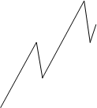

**Phase 5+**

Der Markt ist in Phase 5. Dazu bestätigt der Untertrend ein 1-2-3 Muster.


**Phase 5+ (Ballkönigin)**

Der Begriff Ballkönigin ist auch der Buchserie „*Der Händler“ entnommen. Eine 5+ Trendphase wird durch eine Korrekturbewegung eines Aufwärtstrends klassifiziert, die zum Punkt 2 hinaufläuft. Im folgenden Bild wird die Korrekturzone in grau markiert.


Marktphasen 1, 2, 6, und 9 sind für erfolgreiches Handeln nicht relevant.

### Darstellung im Chart
Keine Parameter erforderlich.


### Verwendung in AgenaScript
Der Indikator bietet folgende Werte für die Marktphasen:

Phase 3: 3

Phase 4: 4

Phase 5: 5

Phase 5+ 55

Ballkönigin 66

In einem Abwärtstrend wird ein „-„ Zeichen vor den Werten gesetzt. Ist der Marktphase nicht definiert, wird der Wert 0 zurückgegeben.
```cs
MarketPhases(int trendSize)[barsAgo]
```

**Parameter**

trendsize: Trendgröße von 0 .. 3

**Achtung:**

Für einen Vergleich von Doppelwerten wie z.B.: **if** (**MarketPhases**(1)\[0\] == 55) ...empfehlen wir, stattdessen folgendes zu verwenden:
```cs
bool goLong = Math.Abs(MarketPhases(1)[0] - 55) <= Double.Epsilon;
```

### Verwendung innerhalb des Condition Escorts
Bei der Verwendung von Marktphasen innerhalb von AgenaScript bietet der Indikator eine Datenserie an, die die oben genannten Werte von +/-3, 4, 5, 55, 66 hat.

Sie können den Indikator als Filter verwenden, indem Sie die Signale von anderen Indikatoren hernehmen, wenn diese innerhalb den Marktphasen 55 oder 66 (long) sind:


**Wichtiger Hinweis** 
Wenn Sie den Market Phases (auch Pro und Advanced Versionen) Indikator in Verbindung mit dem Scanner nutzen möchten, sind folgende Einstellungen erforderlich::

- Charteinstellung:
  - Bars count
  - Time frame

- SpaltenEintellung Scanner:
  - Bars required
  - Time frame
  
Die ChartEinstellungen und Spalteneinstellungen müssen identlisch sein.
Hier ein paar Screenshots:


### MarketPhases Pro Beschreibung

**Phase5Level**
Wie weit der Preis korrigieren muss, um eine gültige Marktphase 5 zu erhalten.

**Phase4Level**
Wie weit der Preis korrigieren muss, um eine gültige Marktphase 4 zu erhalten.


##MarketValue
**Die Installation des Technical Analysis-Pakets ist erforderlich, um auf diesen Indikator zugreifen zu können.**

### Description
Dieser Indikator vergleicht den Wert eines Marktes zum aktuellen Preis von Gold oder dem Dollar Index. Es werden also Märkte in Relation zum Goldpreis oder dem Dollar Index gesetzt, wodurch sehr gut Über- bzw. Unterbewertungen in Instrumenten festgestellt werden können. Niedrige Werte des MarketValues bedeuten, dass ein Markt relativ zu Gold bzw. dem DollarIndex günstig ist, vice versa bedeutet ein hoher Wert das der betrachtete Markt relativ teuer ist. 

Grundsätzlich sollten Commodities mit dem Goldpreis verglichen werden und Financials mit dem DollarIndex. Je nach Marktumfeld kann es aber auch sinnvoll sein, von dieser Regel abzuweichen. 

Folgende Parameter stehen für den MarketValue zur Verfügung:

- **CompareTo:** wählen Sie [Gold/Dollar Index], je nachdem zu welchem Markt das aktuelle Symbol in Relation gesetzt werden soll.

- **EMA1:**  hierbei handelt es sich um eine Periode, die zur Berechnung der Daten notwendig ist. Sofern Sie nicht detaillierte Infos zur Funktionsweise dieses Indikators besitzen, belassen Sie diese Periode bitte in den Standardeinstellungen. (Standardwert = 21)

- **EMA2:**  hierbei handelt es sich um eine EMA-Periode, die zur Berechnung der Daten notwendig ist. Sofern Sie nicht detaillierte Infos zur Funktionsweise dieses Indikators besitzen, belassen Sie diese Periode bitte in den Standardeinstellungen. (Standardwert = 3)

Die Verwendung des MarketValue-Indikators im ConditionEscort ist aktuell noch nicht möglich, da darin ein Multi-Instrument-Indikator nicht abgebildet werden kann. Da der MarketValue die Preisdaten vom aktuellen Chart und ebenso von Gold bzw dem DollarIndex benötigt, handelt es sich hierbei um einen Multi-Instrument Indikator, der wie erwähnt aktuell im ConditionEscort nicht verwendet werden kann. 

### Parameters
angekündigt werden

### Rückgabewert
angekündigt werden

### Verwendung
angekündigt werden

### Darstellung


### Beispiel
angekündigt werden

##Momentum (MOM)
### Beschreibung
Das Momentum (MOM) ist einer der beliebtesten Indikatoren, der schon seit langer Zeit verwendet wird. Viele Trader schwören auf diesen simplen Indikator, weil er die Abschwächung der Bewegung misst, ohne mit einer zu komplizierten Formel das Letzte aus der Vorhersagbarkeit der Märkte herausholen zu wollen. Er ist ein einfaches Werkzeug und kann trotzdem gute Dienste leisten.
Der Momentum-Indikator ist ein Vertreter einer ganzen Familie von Indikatoren, die die Stärke einer Bewegung messen. Weitere Vertreter sind zum Beispiel der RSI und der CCI.
In der Darstellung zeigt der Indikator eine Kurve, die um einen Nullpunkt pendelt. Dabei hat sie keine feste Skala in Prozent. Der Wert kann sich also durchaus ungewöhnlich weit vom Nullpunkt entfernen. Dies geschieht immer dann, wenn der Kurs einen ungewöhnlich starken Sprung macht. Damit zeigt der Indikator in erster Linie die Richtung an, in die der aktuelle Kurs läuft.

### Interpretation
Einstiegssignale werden traditionell dann generiert, wenn der Indikator die Nulllinie durchkreuzt.

Siehe auch[*ROC*](#rate-of-change-roc).

### Weitere Informationen
Wikipedia: [http://de.wikipedia.org/wiki/Momentum_%28Chartanalyse%29](http://de.wikipedia.org/wiki/Momentum_%28Chartanalyse%29)

### Verwendung
```cs
Momentum(int period)
Momentum (IDataSeries input, int period)
Momentum (int period)[int barsAgo]
Momentum (IDataSeries input, int period)[int barsAgo]
```

###Rückgabewert
**double**

Bei Verwendung der Methode mit einem Index ( z.B.  **Momentum**(14)\[**int** barsAgo\] ) wird der Wert des Indikators für den referenzierten Bar ausgegeben.

### Parameters
input			Eingangsdatenreihe für den Indikator

period			Anzahl der Bars, die in die Berechnung einbezogen werden

### Darstellung


### Beispiel
```cs
//Ausgabe des Wertes für den Momentum-Indikator
Print("Der aktuelle Wert für das Momentum ist " + Momentum(14)[0]);
```

##Money Flow Index (MFI)
### Beschreibung
Der Money Flow Index (MFI) wurde von Gene Quong und Avrum Soudack veröffentlicht. Um den Relative Strength Index (RSI) zu verbessern wird eine Volumenkomponente eingebaut. Mit Hilfe des MFI soll die Stärke des in den Markt einfließenden Geldes messbar gemacht werden.
Der MFI wird wie der RSI errechnet, mit dem Unterschied, dass zuvor die Kurse mit dem Volumen multipliziert werden. Es werden wie beim RSI 14 Tage als Einstellung empfohlen. (Quelle: VTAD)


### Interpretation
Der MFI wird wie der RSI interpretiert. Der Ausschlag des MFI ist durch die Hinzuziehung des Volumens stärker als beim RSI, bei einem Verlauf in Trendrichtung.

### Weitere Informationen
VTAD: [http://vtadwiki.vtad.de/index.php/Money_Flow_Index](http://vtadwiki.vtad.de/index.php/Money_Flow_Index)

### Verwendung
```cs
MFI(int period)
MFI(IDataSeries input, int period)
MFI(int period)[int barsAgo]
MFI(IDataSeries input, int period)[int barsAgo]
```

### Rückgabewert
**double**

Bei Verwendung der Methode mit einem Index ( z.B. **MFI**(14)\[**int** barsAgo\] ) wird der Wert des Indikators für den referenzierten Bar ausgegeben.

### Parameters
input	Eingangsdatenreihe für den Indikator

period	Anzahl der Bars, die in die Berechnung einbezogen werden

### Darstellung


### Beispiel
```cs
//Anzeige des aktuellen MFI-Wertes
Print("Der aktuelle Wert des MFI ist: " + MFI(14)[0]);
```

##Moving Averages
### Varianten
[*DEMA*](#dema-double-exponential-moving-average) - Double Exponential Moving Average

[*EMA*](#ema-exponential-moving-average) - Exponential Moving Average

[*HMA*](#hma-hull-moving-average) - Hull Moving Average

[*KAMA*](#kama-kaufmans-adaptive-moving-average) - Kaufman's Adaptive Moving Average

[*MAMA*](#mama-mesa-adaptive-moving-average) - Mesa Adaptive Moving Average

[*SMA*](#sma-simple-moving-average) - Simple Moving Average

[*TEMA*](#tema-triple-exponential-moving-average) - Triple Exponential Moving Average

[*TMA*](#tma-triangular-moving-average) - Triangular Moving Average

[*TRIX*](#trix-triple-exponential-moving-average) - Triple Exponential Moving Average

[*T3*](#t3-triple-exponential-moving-average) - Triple Exponential Moving Average

[*VMA*](#vma-variable-moving-average) - Variable Moving Average

[*VWMA*](#vwma-volume-weighted-moving-average) - Volume Weighted Moving Average

[*WMA*](#wma-weighted-moving-average), [*VMA*](#vma-variable-moving-average) - Weighted Moving Average

[*ZLEMA*](#zlema-zero-lag-exponential-moving-average) - Zero Lag Exponential Moving Average

### Bedeutung
Der arithmetische Durchschnitt, der auch als einfacher Durchschnitt (Englisch: Simple Moving Average - SMA) oder Gleitender Durchschnitt (GD) bezeichnet wird (Englisch: Moving Average - MA), glättet den Kursverlauf für eine bessere Trenderkennung. Gleitende Durchschnitte sind Trendfolgeindikatoren, sie folgen dem Kurs und laufen nicht voraus. Steigende GD's zeigen Aufwärtstrends an, fallende GD's zeigen fallende Trends an.
Durch das Variieren der Berechnungsdauer, wird die zeitliche Verzögerung des gleitenden Durchschnitts verändert. Je kleiner der Berechnungszeitraum ist, desto kürzer wird die Reaktionsverzögerung, aber auch die glättende Wirkung wird geringer. Wird der Berechnungszeitraum vergrößert, ist der Verlauf genau umgekehrt. Die häufigsten Einstellungen, für gleitende Durchschnitte sind 38, 50, 100 und 200 Tage. Insbesondere der 200 Tage Durchschnitt hat bei institutionellen Anlegern große Bedeutung, da er den langfristigen Trend anzeigt. 200 (Handels-)Tage entsprechen ungefähr einem Jahr. Wird der 200 Tage Durchschnitt nachhaltig gebrochen, werden Kaufsignale (Kurs steigt über den 200 GD) bzw. Verkaufssignale (Kurs fällt unter 200 GD) generiert.

### Einsatzmöglichkeiten
**Kreuzung zweier gleitender Durchschnitte**

Die Integration von mehreren gleitenden Durchschnitten wird eingesetzt, um Trendfolgen besser zu erkennen und die Anzahl von Fehlsignalen zu minimieren. Bei der Benutzung von zwei arithmetischen Durchschnitten werden ein kurzfristiger und ein langfristiger Durchschnitt verwendet, z.B. benutzt Richard Donchian hier 5 und 20 Tage.
Bei der Double Cross Over Methode werden die Signale folgendermaßen generiert:

Kreuzt der kurze Durchschnitt den langen Durchschnitt von unten nach oben, wird diese Kreuzung Golden Cross genannt. Es wird ein Kaufsignal generiert. Hohes Handelsvolumen verstärkt das Signal. Der lange gleitende Durchschnitt fungiert im Aufwärtstrend als Unterstützungslinie.

Kreuzt der kurze Durchschnitt den langen Durchschnitt von oben nach unten, wird diese Kreuzung Death Cross genannt. Es wird ein Verkaufssignal generiert. Hohes Handelsvolumen verstärkt das Signal. Der lange gleitende Durchschnitt fungiert im Abwärtstrend als Widerstandslinie.

**Kreuzung dreier gleitender Durchschnitte**

Eine Erweiterung bietet die Benutzung von drei gleitenden Durchschnitten (= Triple Crossover Method). R.C. Allen verwendet den 4, 9 und 18 Tage Durchschnitt. Hierbei wird ein Trendwechsel angedeutet, wenn der 4-Tage-Durchschnitt den 9-Tage-Durchschnitt von unten nach oben schneidet. Jedoch erfolgt der Einstieg in eine Long-Position, wenn beide Durschnitte über dem 18-Tage-Durchschnitt liegen. Ein Ausstieg erfolgt wenn der 4-Tage-Durchschnitt unter den 9-Tage-Durchschnitt fällt. Genau Spiegelbildlich verhält es sich beim Ein- und Ausstieg in/aus eine(r) Short-Position.
(Quelle: VTAD)

##DEMA - Double Exponential Moving Average
### Beschreibung
Der DEMA ist ein technischer Indikator, der von Patrick Mulloy entwickelt wurde. Er erschien erstmals 1994 in der Februarausgabe der "Technical Analysis of Stocks & Commodities". Die Berechnung basiert sowohl auf einem einfachen als auch auf einem doppelten exponentiell gleitenden Durchschnitt (EMA).

### Interpretation
Der DEMA ist ein schnell arbeitender gleitenden Durchschnitt, der besser auf Marktveränderungen reagiert, als eine herkömmlicher gleitender Durchschnitt. Der DEMA kann als Standalone-Indikator oder in anderen Indikatoren bzw. Bedingungen (Conditions) verwendet werden, deren Logik auf gleitenden Durchschnitten beruht.
Zur generellen Interpretation von gleitenden Durchschnitten siehe auch unter Moving Averages.

### Verwendung
```cs
DEMA(int period)
DEMA(IDataSeries input, int period)
DEMA(int period)[int barsAgo]
DEMA(IDataSeries input, int period)[int barsAgo]
```

### Rückgabewert
**double**

Bei Verwendung der Methode mit einem Index ( z.B.  **DEMA**(20)\[**int** barsAgo\] ) wird der Wert des Indikators für den referenzierten Bar ausgegeben.

### Parameters
input		Eingangsdatenreihe für den Indikator

period		Anzahl der Bars, die in die Berechnung einbezogen werden

### Darstellung


### Berechnung
```cs
Value.Set(2 * EMA(Inputs[0], Period)[0] - EMA(EMA(Inputs[0], Period), Period)[0]);
```

### Beispiel
```cs
//Ausgabe des Wertes für den Double Exponential Moving Average (DEMA)
Print("Der aktuelle Wert für DEMA ist " + DEMA(20)[0]);
```

##EMA - Exponential Moving Average
### Beschreibung
Der Exponential Moving Average (EMA) ist einem einfachen gleitenden Durchschnitt, wie z.B. dem SMA oder dem MACD sehr ähnlich. Im Unterschied zu den einfachen gleitenden Durchschnitten wird in der Berechnung den aktuelleren Kursdaten eine hohere Bedeutung beigemessen.

### Interpretation
Der EMA wird von vielen Trader in den unterschiedlichsten Zeiteinheiten benutzt. Bedeutung erhält der EMA insbesondere in 15, 60 und 240-Minuten-Charts. Sehr beliebt ist auch die EMA-200-Linie.
Steigt der Kurs eines Wertes stark an und entfernt sich deutlich von der jeweilig zuzuordnenden EMA-Linie, so ist es möglich, mit einer der Marktrichtung entgegengesetzten Position (im Bsp. einer Shortposition) von der wahrscheinlichen Rückkehr des Kurse an seinen Durchschnitt zu profitieren. 
Zur generellen Interpretation von gleitenden Durchschnitten siehe auch unter Moving Averages.

### Verwendung
```cs
EMA(int period)
EMA(IDataSeries input, int period)
EMA(int period)[int barsAgo]
EMA(IDataSeries input, int period)[int barsAgo]
```

###  Rückgabewert
**double**

Bei Verwendung der Methode mit einem Index ( z.B. **EMA**(20)\[**int** barsAgo\] ) wird der Wert des Indikators für den referenzierten Bar ausgegeben.

### Parameters
input		Eingangsdatenreihe für den Indikator

period		Anzahl der Bars, die in die Berechnung einbezogen werden

### Darstellung


### Berechnung
```cs
Value.Set(ProcessingBarIndex == 0 ? InSeries[0] : InSeries[0] * (2.0 / (1 + Period)) + (1 - (2.0 / (1 + Period))) * Value[1]);
```

### Beispiel
```cs
//Ausgabe des Wertes für den Exponential Moving Average (EMA)
Print("Der aktuelle Wert für EMA ist " + EMA(20)[0]);
```

##EMA MTF (MultiTimeFrame)
### Beschreibung
Der Indikator EmaMTF ist die Multi TimeFrame-Variante des Exponential Moving Average (EMA).
Er ist hauptsächlich für die Nutzung im Intraday-Bereich geeignet.
Multi TimeFrame bedeutet, dass der Indikator in einer anderen Zeiteinheit berechnet werden kann, als der Kurs im Chart angezeigt wird. Möchte man z.B. in einem 5-Minuten Chart den EMA des Stundencharts angezeigt bekommen, ist das mit dem Indikator EMA nicht möglich. Hier ist EmaMTF zu verwenden.
Im Indikator EmaMTF kommt ein weiterer Parameter (MTFMinutes) hinzu, der die Zeiteinheit angibt, auf der die Berechnung des EMA vorgenommen werden soll.
EmaMTF dienst nur zur Anzeige in einem Chart und kann nicht in AgenaScript verwendet werden.
Für die Programmierung mit Datenreihen aus mehreren Zeiteinheiten siehe unter Multibars.
Für alle weiteren Informationen bzgl. Anwendung und Interpretation des EMA siehe unter  [*EMA*](#ema-exponential-moving-average).

Siehe auch [*BollingerMTF*](#bollingermtf), [*SmaMTF*](#smamtf).


### Darstellung
Die Abbildung zeigt einen 5 Min.-Chart mit einem EMA(20) berechnet auf 1-Stunden-Bars.


##HMA - Hull Moving Average
### Beschreibung
Der Hull Moving Average wurde vom Trader Alan Hull entwickelt und ist ein sehr schnell arbeitender gleitender Durchschnitt, der Verzögerungen nahezu gänzlich eleminiert (Zero Lag). Für die Berechnung werden gewichtete gleitende Durchschnitte genutzt, weshalb die glättende Wirkung (und die daraus resultierende Verzögerung) herkömmlicher gleitender Durchschnitte abgemildert werden kann. Hull erreicht diese Verbesserung, indem er statt der Periode selbst, die Quadratwurzel aus der Zeit verwendet.

### Interpretation
Falls in einem Handelssystem zur Trendbestimmung ein gleitender Durchschnitt eingesetzt werden soll, muss die Verzögerung möglichst gering sein. Hier zeigt der Hull Moving Average seine Stärken. Die Durchschnittsberechnung ist deutlich weniger verzögert, als bei einem einfachen gleitenden Durchschnitt. Der Hull Moving Average bietet in Kombination z.B. mit einem SMA einen guten kurzfristiger Trendfilter.
Zur generellen Interpretation von gleitenden Durchschnitten siehe auch unter [*Moving Averages*](#moving-averages).

### Verwendung
```cs
HMA(int period)
HMA(IDataSeries InSeries, int period)
HMA(int period)[int barsAgo]
HMA(IDataSeries InSeries, int period)[int barsAgo]
```

### Rückgabewert
**double**

Bei Verwendung der Methode mit einem Index ( z.B. **HMA**(21)\[**int** barsAgo\] ) wird der Wert des Indikators für den referenzierten Bar ausgegeben.

### Parameters
input		Eingangsdatenreihe für den Indikator

period		Anzahl der Bars, die in die Berechnung einbezogen werden

### Darstellung


### Berechnung
```cs
double value1 = 2 * WMA(Inputs[0], (int)(Period / 2))[0];
double value2 = WMA(Inputs[0], Period)[0];
diffSeries.Set(value1 - value2);
Value.Set(WMA(diffSeries, (int) Math.Sqrt(Period))[0]);
```

### Beispiel
```cs
//Ausgabe des Wertes für den Hull Moving Average (HMA)
Print("Der aktuelle Wert für HMA ist " + HMA(21)[0]);
```

##KAMA - Kaufman's Adaptive Moving Average
### Beschreibung
Der von Perry Kaufman entwickelte Kaufmann's Adaptive Moving Average (KAMA) stellt einen adaptiven Gleitenden Durchschnitt dar, der als Trendfolgeinstrument konstruiert wurde.
Der KAMA beruht auf einem exponentiellen Durchschnitt (EMA), bei dem die Gewichtung des hinzukommenden Kurses über eine Trendeffizienz-Kennzahl, der Efficiency Ratio, gesteuert wird. Die Efficiency Ratio (der sog. quadrierte Effizienz-Faktor) ist eine Kennzahl, die auch eigenständig gute Dienste leisten kann. Die Trendeffizienz ist definiert als das Verhältnis der absoluten Kursänderung, von Anfang bis zum Ende des Betrachtungszeitraums, und der Summe der absoluten täglichen Kursänderungen. Bei hoher Trendeffizienz, also bei einer geradlinigen Bewegungen ohne starke Schwankungen, wird dem hinzukommenden Kurs ein hohes Gewicht eingeräumt, was einer kurzen Einstellung in Tagen entspricht. Bei geringer Trendeffizienz, also bei einer stark schwankenden Bewegung, wird dem hinzukommenden Kurs ein geringes Gewicht eingeräumt, dies entspricht einer langen Einstellung in Tagen. (Quelle: investor-verlag)

### Interpretation
Perry Kaufman sieht ein grundlegendes Signal für steigende Kurse, wenn der KAMA nach oben dreht und ein grundlegendes Signal für fallende Kurse, wenn der KAMA nach unten dreht.
Kaufman definiert noch einen Maximal- und einen Minimalwert für die Berechnung der jeweiligen Glättungskomponente. Die Efficiency Ratio wird mit Hilfe des definierten Maximal- und Minimalwerts in den Faktor umgerechnet, mit dem ein neu zum exponentiellen Durchschnitt hinzugefügter Kurs gewichtet wird. Als Minimalwert (fast) werden 2 und als Maximalwert (slow) 30 Tage von Perry Kaufman verwendet. Die Tageanzahl für die Ermittlung der Efficiency Ratio ist der wichtigste Parameter beim KAMA. Für kurzfristige Strategien hält Perry Kaufman einen Wert um die 10 Tage für empfehlenswert. Ein Wert von kleiner 5 sorgt dafür, das die Efficiency Ratio zu schnell zwischen 0 und 1 hin und her springt. Für langfristiges Positionstrading kann auch ein viel längerer Zeitraum attraktiv sein, da dies zu stabilerem Verhalten bei Nebengeräuschen im Trend führt.
Zur generellen Interpretation von gleitenden Durchschnitten siehe auch unter [*Moving Averages*](#moving-averages).

### Weitere Informationen
<http://www.investor-verlag.de/boersenwissen/kama/>

### Verwendung
```cs
KAMA(int fast, int period, int slow)
KAMA(IDataSeries input, int fast, int period, int slow)
KAMA(int fast, int period, int slow)[int barsAgo]
KAMA(IDataSeries input, int fast, int period, int slow)[int barsAgo]
```

### Rückgabewert
**double**

Bei Verwendung der Methode mit einem Index ( z.B. **KAMA**(2,10,30)\[**int** barsAgo\] ) wird der Wert des Indikators für den referenzierten Bar ausgegeben.

### Parameters
input		Eingangsdatenreihe für den Indikator

period		Anzahl der Bars, die in die Berechnung einbezogen werden

fast		kurze Periode (s. Interpretation)

slow		lange Periode (s. Interpretation)

### Darstellung


### Beispiel
```cs
//Ausgabe des Wertes für den Kaufman Moving Average (KAMA)
Print("Der aktuelle Wert für KAMA ist " + KAMA(2,10,30)[0]);
```

##MAMA - Mesa Adaptive Moving Average
### Beschreibung
Der MAMA (Mesa Adaptive Moving Average) ist ein auto adaptiver gleitender Durchschnitt, dessen Periodenlänge über komplexe Berechnungen bestimmt wird. Er basiert auf einem exponentiellen Moving Average, dessen Alpha - Glättungsparameter in verschiedenen Marktphasen verändert wird.
Dieser Indikator stammt aus Publikationen von John Ehlers und ist vor allem hinsichtlich der Berechnungen schwer zu verstehen. John Ehlers berechnet Zyklen in den Kursbewegungen, um Länge und Intensität einzelner Trendphasen zu ermitteln. An Hand der Länge der ermittelten Zyklen, kann dann der Gewichtungsfaktor des gleitenden Durchschnitts variabel gestaltet werden. Somit wird erreicht, dass der Indikator in Trendphasen möglichst lange mitläuft, ohne durch kleinen Gegenbewegungen zu sehr aus der Bahn geworfen zu werden. Somit steuert der Markt selbst die Agilität des gleitenden Durchschnitts.

**FAMA**
Der Indikator stellt neben dem eigentlichen MAMA, eine zweite Linie dar, die in den Publikationen als FAMA bezeichnet wird. Diese Linie dient als Triggerlinie und ist dem zu Grunde liegenden exponentiellen gleitenden Durchschnitt sehr ähnlich. (Quelle: tradesignalonline.com)

### Interpretation
Ehlers behauptet in seinen Publikationen, dass die von ihm entwickelten Indikatoren Handelssysteme ermöglichen, die wesentlich weniger Fehler produzieren, als herkömmliche Systeme. Die hier vorgestellten auto adaptivem Durchschnitte MAMA und FAMA, sollen weniger Fehlsignale produzieren, da sie sich an die vorherrschende Zyklenlänge und die Marktvolatilität anpassen. Im Grunde werden beide Linien als banales Cross Over System verwendet. Überkreuzt der langsamere MAMA den schnelleren FAMA, ist das ein Kaufsignale, umgekehrt ein Verkaufs- oder Leerverkaufssignal.
Zur generellen Interpretation von gleitenden Durchschnitten siehe auch unter  [*Moving Averages*](#moving-averages).

### Further information
<http://www.tradesignalonline.com/de/lexicon/view.aspx?id=MAMA+adaptive+Moving+Average>

### Verwendung
```cs
MAMA(double fastLimit, double slowLimit)
MAMA(IDataSeries input, double fastLimit, double slowLimit)
MAMA(double fastLimit, double slowLimit)[int barsAgo]
MAMA(IDataSeries input, double fastLimit, double slowLimit)[int barsAgo]

Für den Wert des Following Adaptive Moving Average (FAMA)
MAMA(double fastLimit, double slowLimit).Fama[int barsAgo]
MAMA(IDataSeries input, double fastLimit, double slowLimit).Fama[int barsAgo]
```

### Rückgabewert
**double**

Bei Verwendung der Methode mit einem Index ( z.B.  **MAMA**(0.5,0.05)\[**int** barsAgo\] ) wird der Wert des Indikators für den referenzierten Bar ausgegeben.

### Parameters
input		Eingangsdatenreihe für den Indikator

fastLimit	Oberes Limit für den Alpha-Wert

slowLimit	Unteres Limit für den Alpha-Wert

### Darstellung


### Beispiel
```cs
//Ausgabe des Wertes für den MESA Adaptive Moving Average (MAMA)
Print("Der aktuelle Wert für MAMA ist " + MAMA(0.5, 0.05)[0]);
//Ausgabe des Wertes für den Following Adaptive Moving Average (FAMA)
Print("Der aktuelle Wert für MAMA ist " + MAMA(0.5, 0.05).Fama[0]);
```

##SMA - Simple Moving Average
### Beschreibung
Der SMA ist die "Mutter aller gleitenden Durchschnitte" und stellt die einfachste Möglichkeit dar, einem Chartbild Informationen zum bereinigten Trendverlauf zu entnehmen. Von der mathematischen Seite her betrachtet handelt es sich um das arithmetische Mittel einer Zahlenreihe individueller Länge. 
Der Begriff “gleitend” leitet sich von der Tatsache ab, dass bei dieser Form der Durchschnittsbildung immer der älteste Kurs dem aktuell hinzugekommenen “geopfert” wird. Grundsätzlich festzustellen ist dass, die Länge der Periodenangabe die Intensität der Glättung beeinflusst. Kürzere Betrachtungszeiträume (beispielsweise 10 Tage) führen dazu, dass der Indikator dem Kursverlauf relativ eng folgt, die berühmte 200-Tage-Linie (also SMA mit Periodenangabe 200 Tage) weist hingegen eine sehr große Trägheit auf.
Der Simple Moving Avergage weist gewisse Nachteile auf weshalb auch diverse Abwandlungen des Orginalkonzeptes im Laufe der Jahre entstanden. An erster Stelle zu nennen ist die Trägheit des SMA (oft auch als “lag” bezeichnet) und die gleiche Gewichtung aller Datensätze im Betrachtungszeitraum. So hat der letzte Kurs bei einer 14-Tages-Linie die gleiche Wertigkeit für den Indikatorverlauf wie der erste Wert. (Quelle: forex-trading-online.de)

### Interpretation
Trotz der - im Vegleich zu anderen hochkomplexen Indikatorensystemen - simplen Herleitung ist die einfachste Form der Durchschnittsbildung nach wie vor von großer Praxisbedeutung, die wichtigsten Anwendungsbereiche sind die klassische Trendbestimmung, die Integration in automatische Handelssysteme sowie die Verwendung als Signallinie in Kombination mit anderen Indikatoren.
Zur generellen Interpretation von gleitenden Durchschnitten siehe auch unter : [*Moving Averages*](#moving-averages).


### Weitere Informationen
<http://www.forex-trading-online.de/indikatoren/simple-moving-average-sma>

<http://vtadwiki.vtad.de/index.php/SMA\#Average-Off-Berechnungsverfahren\_.28MMA.29>

### Verwendung
```cs
SMA(int period)
SMA(IDataSeries InSeries, int period)
SMA(int period)[int barsAgo]
SMA(IDataSeries InSeries, int period)[int barsAgo]
```

### Rückgabewert
**double**

Bei Verwendung der Methode mit einem Index ( z.B. **SMA**(14)\[**int** barsAgo\] ) wird der Wert des Indikators für den referenzierten Bar ausgegeben.

### Parameters
input		Eingangsdatenreihe für den Indikator

period		Anzahl der Bars, die in die Berechnung einbezogen werden

### Darstellung


### Berechnung
Value.**Set**((last + InSeries\[0\] - InSeries\[Period\]) / Math.**Min**(ProcessingBarIndex, Period));

### Beispiel
```cs
//Ausgabe des Wertes für den Simple Moving Average (SMA)
Print("Der aktuelle Wert für SMA ist " + SMA(14)[0]);
```

##SMA MTF (MultiTimeFrame)
### Beschreibung
Der Indikator SmaMTF ist die Multi TimeFrame-Variante des Simple Moving Average (SMA).
Er ist hauptsächlich für die Nutzung im Intraday-Bereich geeignet.
Multi TimeFrame bedeutet, dass der Indikator in einer anderen Zeiteinheit berechnet werden kann, als der Kurs im Chart angezeigt wird. Möchte man z.B. in einem 5-Minuten Chart den SMA des Stundencharts angezeigt bekommen, ist das mit dem Indikator SMA nicht möglich. Hier ist SmaMTF zu verwenden.
Im Indikator SmaMTF kommt ein weiterer Parameter (MTFMinutes) hinzu, der die Zeiteinheit angibt, auf der die Berechnung des SMA vorgenommen werden soll.
SmaMTF dienst nur zur Anzeige in einem Chart und kann nicht in AgenaScript verwendet werden.
Für die Programmierung mit Datenreihen aus mehreren Zeiteinheiten siehe unter Multibars.

Für alle weiteren Informationen bzgl. Anwendung und Interpretation des SMA siehe unter SMA.

Siehe auch [*BollingerMTF*](#bollingermtf), [*EmaMTF*](#ema-mtf-multitimeframe).

### Darstellung
Die Abbildung zeigt einen 5 Min.-Chart mit einem SMA(14) berechnet auf 4-Stunden-Bars.


##SMMA - Smoothed Moving Average
### Beschreibung
Der Smoothed Moving Average (SMMA) ist eine Art Mischung aus Simple Moving Average (SMA) und Exponential Moving Average (EMA).
Er wird i.d.R. nur für eine größere Periodenanzahl verwendet.
Als Richtwert kann die Hälfte der EMA-Perioden herangezogen werden.
Ein SMMA(20) entspricht annährend einem EMA(40).

### Interpretation
Der wichtigste Anwendungsbereich von gleitenden Durchschnitten generell ist die klassische Trendbestimmung. Gleitende Durchschnitte werden häufig in automatische Handelssysteme integriert oder als Signallinie in Kombination mit anderen Indikatoren verwendet.

Zur generellen Interpretation von gleitenden Durchschnitten siehe auch unter[*Moving Averages*](#moving-averages).

Der SMMA wird zudem häufig im Zusammenhang mit dem [*SuperTrend*](#supertrend)-Indikator verwendet.

### Weitere Informationen
<http://www2.wealth-lab.com/wiki/SMMA.ashx>

### Verwendung
```cs
SMMA(int period)
SMMA(IDataSeries input, int period)
SMMA(int period)[int barsAgo]
SMMA(IDataSeries input, int period)[int barsAgo]
```

### Rückgabewert
**double**

Bei Verwendung der Methode mit einem Index ( z.B.  **SMMA**(14)\[**int** barsAgo\] )wird der Wert des Indikators für den referenzierten Bar ausgegeben.

### Parameters
input		Eingangsdatenreihe für den Indikator

period		Anzahl der Bars, die in die Berechnung einbezogen werden

### Darstellung


### Beispiel
```cs
//Ausgabe des Wertes für den Smoothed Moving Average (SMMA)
Print("Der aktuelle Wert für SMMA ist" + SMMA(14)[0]);
```

##TEMA - Triple Exponential Moving Average
### Beschreibung
Der Triple Exponential Moving Average (TEMA) ist die Kombination aus einem einzelnen exponentiellen gleitenden Durchschnitt (EMA), einem doppelten EMA und einem dreifachen EMA. Die Kombination der Indikatoren hilft, Verzögerungen zwischen den Indikatoren und der Preisbewegung zu eliminieren. TEMA ist ein sehr effektiver Glättungsindikator.

### Interpretation
Der Indikator ist schneller und glatter als ein herkömmlicher gleitender Durchschnitt. Der TEMA wird häufig in Kombination mit anderen Indikatoren (z.B. MACD oder CCI) genutzt.
Ein starkes Kaufsignal würde auftreten, wenn der CCI nach oben durch 0 kreuzt, der TEMA Indikator nach oben tendiert und der Preis zurückkehrt zum TEMA.
Für ein Verkaufssignal sollte der TEMA unterhalb der Kurse verlaufen, wenn der CCI die 0 Ebene nach unten kreuzt, und der Preis zurück zum TEMA kehrt.
Zur generellen Interpretation von gleitenden Durchschnitten siehe auch unter [*Moving Averages*](#moving-averages).

### Verwendung
```cs
TEMA(int period)
TEMA(IDataSeries input, int period)
TEMA(int period)[int barsAgo]
TEMA(IDataSeries input, int period)[int barsAgo]
```

### Rückgabewert
**double**

Bei Verwendung der Methode mit einem Index ( z.B. **TEMA**(14)\[**int** barsAgo\] ) wird der Wert des Indikators für den referenzierten Bar ausgegeben.

### Parameters
input		Eingangsdatenreihe für den Indikator

period		Anzahl der Bars, die in die Berechnung einbezogen werden 

### Darstellung


### Beispiel
```cs
//Ausgabe des Wertes für den Triple Exponential Moving Average (TEMA) 
Print("Der aktuelle Wert für TEMA ist" + TEMA(14)[0]);
```

##TMA - Triangular Moving Average
### Beschreibung
Der Triangular Moving Average (TMA) ist ein speziell gewichteter gleitender Durchschnitt mit einer besonderen Glättung. Die Gewichte sind nicht wie bei anderen gewichteten Durschnitten linear, sondern nach einem dreieckigen Muster zugeordnet. Die Gewichte für einen 7 Perioden unfassenden Zeitraum sind beispielsweise 1, 2, 3, 4, 3, 2, 1. Die Mitte der Zeitreihe wird hierdurch höher, die neuesten resp. ältesten Daten entsprechend geringer gewichtet.

### Interpretation
Die Interpretation des Triangular Moving Average folgt im Wesentlichen der Interpretation anderer gleitender Durchnitte, wie dem SMA oder dem EMA. Es gibt hierbei keine weiteren Besonderheiten zu beachten.

Zur generellen Interpretation von gleitenden Durchschnitten siehe auch unter [*Moving Averages*](#moving-averages).

### Verwendung
```cs
TMA(int period)
TMA(IDataSeries input, int period)
TMA(int period)[int barsAgo]
TMA(IDataSeries input, int period)[int barsAgo]
```

### Rückgabewert
**double**

Bei Verwendung der Methode mit einem Index ( z.B.  **TMA**(14)\[**int** barsAgo\] ) wird der Wert des Indikators für den referenzierten Bar ausgegeben.

### Parameters
input		Eingangsdatenreihe für den Indikator

period		Anzahl der Bars, die in die Berechnung einbezogen werden 

### Darstellung


### Beispiel
```cs
//Ausgabe des Wertes für den Triangular Moving Average (TMA) 
Print("Der aktuelle Wert für TMA ist" + TMA(14)[0]);
```

##TRIX - Triple Exponential Moving Average
### Beschreibung
Der TRIX - Indikator wurde von Jack Hutson präsentiert. Es handelt sich dabei um einen 1-Tages-Rate of Change-Indikator (ROC), d.h. Tag 2 dividiert durch Tag 1, Tag 3 durch Tag 2 usw., eines dreifach exponentiell geglätteten gleitenden Durchschnittes der Schlusskurse eines Wertes. Das Ergebnis ist ein um seine Null-Linie schwankender Oszillator, der aufgrund seiner Stabilität als Trendindikator verwendet wird.


### Interpretation
Es entsteht ein Kaufsignal, wenn der TRIX-Indikator seine Null-Linie von unten nach oben schneidet. Ein Verkaufssignal wird generiert, wenn er die Null-Linie nach unten durchbricht. Divergenzen deuten auf einen Trendwechsel hin.

### Verwendung
```cs
TRIX(int period, int signalPeriod)
TRIX(IDataSeries input, int period, int signalPeriod)
TRIX(int period, int signalPeriod)[int barsAgo]
TRIX(IDataSeries input, int period, int signalPeriod)[int barsAgo]

Für die Signal-Linie
TRIX(int period, int signalPeriod).Signal[int barsAgo]
TRIX(IDataSeries input, int period, int signalPeriod).Signal[int barsAgo]
```

### Rückgabewert
**double**

Bei Verwendung der Methode mit einem Index ( z.B.  **TRIX**(14, 3)\[**int** barsAgo\] ) wird der Wert des Indikators für den referenzierten Bar ausgegeben.

### Parameters
input		Eingangsdatenreihe für den Indikator

period		Anzahl der Bars, die in die Berechnung einbezogen werden

signal period	Anzahl der Bars, die in die Berechnung der Signal-Linie einbezogen werden

### Darstellung


### Beispiel
```cs
//Ausgabe des Wertes für den Triple Exponential Moving Average (TRIX) 
Print("Der aktuelle Wert für TRIX ist" + TRIX(14, 3)[0]);

//Ausgabe des Wertes für die TRIX-Signallinie 
Print("Der aktuelle Wert für TRIX ist" + TRIX(14, 3).Signal[0]);
```

##T3 - Triple Exponential Moving Average
### Beschreibung
Der Triple Exponential Moving Average T3 (oder auch T3MA) ist ein Vertreter der extrem geglätteten Gleitenden Durchschnitte. Zur Berechnung wird eine gewichtete Summe eines einfachen EMA, eines doppelten EMA und eines dreifachen EMA verwendet. Dies ergibt einen sehr glatten und "weichen" Verlauf der Indikatorlinie.
Die Anzahl der Iterationen ist bei der vorliegenden T3-Implementation mit dem Parameter tCount einstellbar. Die Standardeinstellung ist 3.
Die Berechnung gleicht dem DEMA, wobei hier zusätzlich ein Volumen-Faktor (VFactor) hinzukommt. Er nimmt Werte zwischen 0 und 1 an (default =0,7).
Ist der VFactor = 0, entspricht der Verlauf einem EMA (mit TCount =1).
Ist der VFactor = 1, entspricht der Verlauf dem DEMA.

### Interpretation

Die Interpretation des T3 gleicht der Interpretation anderer gleitender Durchnitte. Es gibt hierbei keine weiteren Besonderheiten zu beachten.
Zur generellen Interpretation von gleitenden Durchschnitten siehe auch unter [*Moving Averages*](#moving-averages).

### Verwendung
```cs
T3(int period, int tCount, double vFactor)
T3(IDataSeries input, int period, int tCount, double vFactor)
T3(int period, int tCount, double vFactor)[int barsAgo]
T3(IDataSeries input, int period, int tCount, double vFactor)[int barsAgo]
```

###  Rückgabewert
**double**

Bei Verwendung der Methode mit einem Index ( z.B. **T3**(14,3,0.7)\[**int** barsAgo\] ) wird der Wert des Indikators für den referenzierten Bar ausgegeben.

### Parameters
input		Eingangsdatenreihe für den Indikator

period		Anzahl der Bars, die in die Berechnung einbezogen werden

tCount		Anzahl der Iterationen für die Glättung (default: 3)

vFactor	Volumen Factor (Multiplicator) (default: 0,7)

### Darstellung


### Beispiel
```cs
//Ausgabe des Wertes für den T3 Moving Average (T3) 
Print("TDer aktuelle Wert für T3 ist" + T3(14, 3, 0.7)[0]);
```

##VMA - Variable Moving Average
### Beschreibung
Der Variable Moving Average (VMA) ist ein EMA, der in der Lage ist, seine Glättung automatisch auf die Schwankungen im Markt einstellen kann. Die Empfindlichkeit wächst, indem mehr Gewicht auf die jüngeren Daten gelegt wird.
Durch die automatische Regulierung der Glättungskonstante wird versucht, den bekannten Nachteilen von gleitenden Durchschnitten zu begegnen. Der VMA soll auf diese Weise unter allen Marktbedingungen besser funktionieren.

**Verwechselungsgefahr!**
Die Abkürzung VMA wird in der Literatur bzw. in anderer Handelssoftware auch für Volume Moving Average (VolMA) verwendet.

### Interpretation
Der Indikator wird auf die übliche Art zur Identifizierung von Trends angewandt. Es gibt bei der Verwendung keine Besonderheiten zu beachten.
Zur generellen Interpretation von gleitenden Durchschnitten siehe auch unter [*Moving Averages*](#moving-averages).

### Verwendung
```cs
VMA(int period, int volatilityPeriod)
VMA(IDataSeries input, int period, int volatilityPeriod)
VMA(int period, int volatilityPeriod)[int barsAgo]
VMA(IDataSeries input, int period, int volatilityPeriod)[int barsAgo]
```

### Rückgabewert
**double**

Bei Verwendung der Methode mit einem Index ( z.B. **VMA**(9,9)\[**int** barsAgo\] ) wird der Wert des Indikators für den referenzierten Bar ausgegeben.

### Parameters
input			Eingangsdatenreihe für den Indikator

period			Anzahl der Bars, die in die Berechnung einbezogen werden

volatility period	Anzahl der Bars, die in die Berechnung der Signal-Linie einbezogen werden

### Darstellung


### Beispiel
```cs
//Ausgabe des Wertes für den Variable Moving Average (VMA) 
Print("Der aktuelle Wert für VMA ist  " + VMA(9, 9)[0]);
```

##VWMA - Volume Weighted Moving Average
### Beschreibung
Der Volume Weighted Moving Average (VWMA) ist ein gewichteter gleitender Durchschnitt, der zur Gewichtung der Perioden das entspr. Volumen verwendet, d.h. Tage (Perioden) mit höherem Volumen bekommen mehr Gewicht. VWMA ist ein nicht-kumulativer gleitenden Durchschnitt.
### Interpretation
VWAP wird v.a. verwendet, um die Liquidität zu identifizieren. Als volumengewichteter Indikator spiegelt er bestimmte Preisniveaus anhand ihres jeweiligen Volumens wider. Dies kann Institutionen mit großen Aufträgen helfen. Die Idee ist, den Markt beim Betreten mit großen Kauf-bzw. Verkaufsaufträgen nicht zu stören. VWAP hilft liquide und illiquide Preispunkte zu bestimmen
Intraday dient VWAP hauptsächlich zur Bestimmung des Trendes. VWAP hinkt dem Preis hinterher. Diese Verzögerung wird mit fortschreitender Handelszeit über den Tag hinweg größer.
Zur generellen Interpretation von gleitenden Durchschnitten siehe auch unter [*Moving Averages*](#moving-averages).

### Verwendung
```cs
VWMA(int period)
VWMA(IDataSeries input, int period)
VWMA(int period)[int barsAgo]
VWMA(IDataSeries input, int period)[int barsAgo]
```

### Rückgabewert
**double**

Bei Verwendung der Methode mit einem Index ( z.B.  **VWMA**(14)\[**int** barsAgo\] ) wird der Wert des Indikators für den referenzierten Bar ausgegeben.

### Parameters
input			Eingangsdatenreihe für den Indikator

period			Anzahl der Bars, die in die Berechnung einbezogen werden

### Darstellung


### Beispiel
```cs
//Ausgabe des Wertes für den Volume Weighted Moving Average (VWMA)
Print("Der aktuelle Wert für VWMA ist " + VWMA(14)[0]);
```

##WMA - Weighted Moving Average
### Beschreibung
Der Weighted Moving Average (WMA) ist der bekannteste Vertreter der gewichteten gleitenden Durchschnitte.
Gewichtete Durchschnitte werden verwendet um eine schnellere Reaktion auf die Kursverläufe zu erreichen. Dazu erhalten die aktuellen Kurse eine höhere Bewertung als ältere Werte. Ein weiterer Vorteil ist, daß Fehlsignale bei seitwärts gerichtetem Verlauf der Märkte minimiert werden. Der WMA glättet die Preiskurve und ermöglicht so eine bessere Trendidentifizierung.
### Interpretation
Der WMA liegt enger am Kurs als ein einfacher arithmetischer Durchschnitt. Die Verzögerung der Bewegungsmuster wird also auch geringer sein als beim arithmetischen Durchschnitt. Als Anwendungsgebiet erschließt sich deshalb der Einsatz als Signalgeber in einem System aus mehreren Durchschnitten oder als Signallinie eines Indikators. Der WMA stellt einen guten Kompromiss zwischen Glättung und Reagibilität dar. Er vollzieht Richtungswechsel in den Basisdaten schneller nach als ein SMA, weist aber trotzdem ein weiches Verlaufsmuster auf, was wichtig im Hinblick auf die Anzahl von Fehlsignalen ist.
Besonders bei Indikatoren mit weichem Verlauf ist der WMA als Signallinie zu empfehlen. Er folgt dem Indikator sehr eng, was bedeutet, dass er auf Richtungswechsel schnell reagiert.
Für Indikatoren mit sehr unruhigem Verlauf ist der WMA als Signallinie dagegen nicht geeignet, er würde mehr Fehlsignale produzieren als eine trägere Signallinie. (Quelle: tradesignalonline.com)
Zur generellen Interpretation von gleitenden Durchschnitten siehe auch unter [*Moving Averages*](#moving-averages).

### Weitere Informationen
<http://www.tradesignalonline.com/de/lexicon/view.aspx?id=Moving+Average+Weighted+%28WMA%29>

### Verwendung
```cs
WMA(int period)
WMA(IDataSeries input, int period)
WMA(int period)[int barsAgo]
WMA(IDataSeries input, int period)[int barsAgo]
```

### Rückgabewert
**double**

Bei Verwendung der Methode mit einem Index ( z.B.  **WMA**(14)\[**int** barsAgo\] ) wird der Wert des Indikators für den referenzierten Bar ausgegeben.

### Parameters
input	Eingangsdatenreihe für den Indikator

period Anzahl der Bars, die in die Berechnung einbezogen werden

### Darstellung


### Beispiel
```cs
//Ausgabe des Wertes für den Weighted Moving Average (WMA)
Print("Der aktuelle Wert für WMA ist " + WMA(14)[0]);
```

##ZLEMA - Zero Lag Exponential Moving Average
### Beschreibung
Der Zero-Lag Exponential Moving Average (ZLEMA) ist eine Variante des Exponential Moving Average (EMA). Zero-Lag bedeutet soviel wie "keine Verzögerung". D.h., der Indikator passt sich im Gegensatz zu den herkömmlichen gleitenden Durchschnitte (z.B. dem SMA) den Kursen sehr eng an. Der Effekt kommt von der stärkeren Gewichtung aktueller Werte. Es wird versucht, durch das Herausnehmen älterer Kursdaten die Verzögerung (durch den kummulativen Effekt) zu minimieren.

### Interpretation
Die Verwendung zur Identifizierung der Trendrichtung entspricht im Wesentlichen der des EMA-Indikators. Bei der Verwendung sind keine Besonderheiten zu beachten.
Zur generellen Interpretation von gleitenden Durchschnitten siehe auch unter [*Moving Averages*](#moving-averages).

### Weitere Informationen
FMLabs: <http://www.fmlabs.com/reference/default.htm?url=ZeroLagExpMA.htm>

### Verwendung
```cs
ZLEMA(int period)
ZLEMA(IDataSeries input, int period)
ZLEMA(int period)[int barsAgo]
ZLEMA(IDataSeries input, int period)[int barsAgo]
```

### Rückgabewert
**double**

Bei Verwendung der Methode mit einem Index ( z.B.  **ZLEMA**(14)\[**int** barsAgo\] ) wird der Wert des Indikators für den referenzierten Bar ausgegeben.

### Parameters
input	Eingangsdatenreihe für den Indikator

period	Anzahl der Bars, die in die Berechnung einbezogen werden

### Darstellung
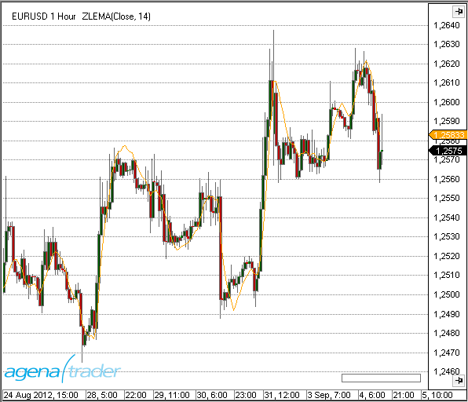

### Beispiel
```cs
//Ausgabe des Wertes für den Zero-Lag Exponential Moving Average (ZLEMA)
Print("Der aktuelle Wert für ZLEMA ist " + ZLEMA(14)[0]);
```

##nBarsUp
### Beschreibung
Mit dem Indikator NBarsUp kann nach einer bestimmten Anzahl steigender Schlusskurse gesucht werden.
Zusätzlich können noch weitere Bedingungen an die Suche gestellt werden, wie 
- stetig steigende Bars, d.h. Close < Open (rote Candles)
- stetig steigende Hochs
- stetig steigende Tiefs

### Verwendung
```cs
NBarsUp(int barCount, bool BarUp, bool higherHigh, bool higherLow)
NBarsUp(IDataSeries input, int barCount, bool BarUp, bool higherHigh, bool higherLow)
NBarsUp(int barCount, int barCount, bool BarUp, bool higherHigh, bool higherLow)[int barsAgo]
NBarsUp(IDataSeries input, int barCount, bool BarUp, bool higherHigh, bool higherLow)[int barsAgo]
```

### Rückgabewert
**double**

Bei Verwendung der Methode mit einem Index ( z.B. **NBarsUp**(...)\[**int** barsAgo\] ) wird der Wert des Indikators für den referenzierten Bar ausgegeben.

1 - Die Bedingung trifft zu
0 - Die Bedingung trifft nicht zu

### Parameters
input		Eingangsdatenreihe für den Indikator

barCount	geforderte Anzahl der hintereinander höher liegenden Schlusskurse

BarUp		Zusatzbedingung, (true): Jedes Close muß größer sein als Open (grüner Bar)

higherHigh	Zusatzbedingung (true): stetig steigende Hochs

higherLow	Zusatzbedingung (true); stetig steigende Tiefs

### Darstellung


### Beispiel
```cs
// Suche nach 3 stetig steigenden Schlusskursen
if (NBarsUp(3, true, true, true)[0] == 1)
Print("Es sind 3 nacheinander höher liegende Schlusskurse aufgetreten.");
```

##nBarsDown
### Beschreibung
Mit dem Indikator NBarsDown kann nach einer bestimmten Anzahl fallender Schlusskurse gesucht werden.
Zusätzlich können noch weitere Bedingungen an die Suche gestellt werden, wie 
- stetig fallende Bars, d.h. Close < Open (rote Candles)
- stetig fallende Hochs
- stetig fallende Tiefs

### Verwendung
```cs
NBarsDown(int barCount, bool BarDown, bool lowerHigh, bool lowerLow)
NBarsDown(IDataSeries input, int barCount, bool BarDown, bool lowerHigh, bool lowerLow)
NBarsDown(int barCount, bool BarDown, bool lowerHigh, bool lowerLow)[int barsAgo]
NBarsDown(IDataSeries input, bool barCount, int BarDown, bool lowerHigh, bool lowerLow)[int barsAgo]
```

### Rückgabewert
**double**

Bei Verwendung der Methode mit einem Index ( z.B.  **NBarsDown**(...)\[**int** barsAgo\] )wird der Wert des Indikators für den referenzierten Bar ausgegeben.

1 - Die Bedingung trifft zu
0 - Die Bedingung trifft nicht zu

### Parameter
input		Eingangsdatenreihe für den Indikator

barCount	geforderte Anzahl der hintereinander tiefer liegenden Schlusskurse

BarDown	Zusatzbedingung, (true): Jedes Close muß kleiner sein als Open (roter Bar)

lowerHigh	Zusatzbedingung (true): stetig fallende Hochs

lowerLow	Zusatzbedingung (true); stetig fallende Tiefs

### Darstellung


### Beispiel
```cs
NBarsDown(int barCount, bool BarDown, bool lowerHigh, bool lowerLow)
NBarsDown(IDataSeries input, int barCount, bool BarDown, bool lowerHigh, bool lowerLow)
NBarsDown(int barCount, bool BarDown, bool lowerHigh, bool lowerLow)[int barsAgo]
NBarsDown(IDataSeries input, bool barCount, int BarDown, bool lowerHigh, bool lowerLow)[int barsAgo]
```

##OnBalanceVolume (OBV)
### Beschreibung
TDer On Balance Volume Indikator (OBV) stellt den Kauf- bzw. Verkaufsdruck dar. Kumulativ wird das Volumen eines aufwärts gerichtetenTages (d. h. Open < Close, grüne Kerze) addiert und das Volumen aus abwärts gerichteten Tagen (rote Kerze) subtrahiert.
OBV wurde von Joe Granville entwickelt und 1963 in seinem Buch "Key to Stock Market Profits" vorgestellt. Es war einer der ersten Indikatoren für positive und negative Volumenstrommessungen

### Interpretation
OBV steigt, wenn das Volumen steigender Tage das Volumen fallender Tage übertrifft. Das OBV fällt, wenn das Volumen an Tagen mit fallenden Kursen überwiegt. Ein steigendes OBV spiegelt positiven Volumen Druck wider, der zu höheren Preisen führen kann. Umgekehrt deutet ein fallendes OBV auf tiefere Kurse hin. Granville stellte in seinen Forschungen fest, dass das OBV sich oft noch vor dem Kurs zu bewegen beginnt. Insofern handelt es sich um einen sog. vorauslaufenden Indikator.

Der absolute Wert des OBV ist unwichtig. Man sollte sich stattdessen auf die Eigenschaften der OBV-Linie konzentrieren. Zunächst definieren diese den Trend für das OBV. Anschließend ist zu bestimmen, ob der aktuelle Trend des OBV dem Trend des zugrunde liegenden Handelsinstrumentes entspricht. Drittens kann man nach potenziellen Unterstützungs bzw. Widerstandszonen suchen. Sobald der Trend des OBV einmal gebrochen ist, wird er sich wahrscheinlich ändern. Hieraus lassen sich Signale generieren.
Schließlich müssen auch Volumenspitzen bei der Suche nach einer bevorstehenden Trendwende Beachtung finden.

### Verwendung
```cs
OBV()
OBV(IDataSeries input)
OBV()[int barsAgo]
OBV(IDataSeries input)[int barsAgo]
```

### Rückgabewert
**double**

Bei Verwendung der Methode mit einem Index ( z.B. **OBV**()\[**int** barsAgo\] ) wird der Wert des Indikators für den referenzierten Bar ausgegeben.

### Parameter
input	Eingangsdatenreihe für den Indikator

### Darstellung


### Beispiel
```cs
//Ausgabe des Wertes für den On Balance Volume (OBV)
Print("The current value for the OBV is " + OBV()[0]);
```

##OutsideBars
### Beschreibung
Der Indikator OutsideBars ist eine veraltete Version von [*InsideBarsMT*](#insidebarsmt).

##P123
**Die Installation des Technical Analysis-Pakets ist erforderlich, um auf diesen Indikator zugreifen zu können.**

### Beschreibung
Ziel des P123-Indikators ist es, ein 1-2-3 Muster automatisch zu erkennen.

**Er zeichnet sich durch folgenden Features aus:**

Innovative Erkennung von 4 verschiedenen Trendgrößen

Er erkennt Punkte 1, 2, und 3 am Balken

Erkennung einer Trendfortsetzung in gleicher Richtung wie ein Trendbruch

Komplett automatische Anpassung des Suchalgorithmus für alle möglichen Marktkonditionen (keine zusätzlichen Einstellungen/Eingaben nötig)

Adaptiver Arbeitsablauf, passt sich auf alle Volatilitätsschwankungen an

Klare Übersicht mit gleichzeitiger Anzeige der verschiedenen Trendgrößen

Kann innerhalb vom Condition Escort und AgenaScript eingesetzt werden

Die Trendgrößen werden wie folgt definiert:

T0 = großer trend

T1 = mittelgroßer trend

T2 = kleiner trend

T3 = kleinste trend size

Die kleinste Trendgröße (T3) kann nicht auf allen Handelsinstrumenten festgestellt werden. Punkt 2 liegt oft am Hoch eines Balkens, und Punkt 3 am Tief des gleichen Balkens. Je nach Zeiteinheit und Schwankungsbereich können T0 und T1 zu einem vereinigt werden.

Der Indikator bestimmt die ausgewählte Zeiteinheit des Charts und kennzeichnet dann alle Trends und Trendgrößen dementsprechend. Wenn niedrige Volatilität vorhanden ist, ist die Trenderkennung sensibler, und umgekehrt für höhere Volatilität. Die adaptiven Methoden des P123 schaffen eine ausgeglichene Erkennung von Trendgrößen.

**Wichtiger Tipp:**

In manchen Fällen kann der große Trend (T0) nicht mit bloßem Auge erkannt werden, was vielleicht daran liegt, dass nicht genug Kerzen im Chart sichtbar sind. Ein Minimum von 500 Kerzen sollte geladen werden, um sicherzugehen, dass dies nicht der Fall ist.


### Interpretation
Handelssignale bilden sich oft an den Punkten 2 & 3: am Punkt 3 als Einstiegssignale in eine Korrekturphase innerhalb eines bestätigten Trends, und am Punkt 2 als Untertrend in Trendrichtung des übergeordneten Trades. Die Definition eines Trends am Punkt 1 bis 3 kann man in „* "*Das große Buch der Markttechnik*" von Michael Voigt nachlesen.

### Visualisierung im Chart
Die Einstellungen für die Parametereingaben bestimmen, welche Trendgrößen im Chart angezeigt werden und ob sie durch eine Linie verbunden sind.

Für die Standardeinstellungen ist der Trend T2 standardmäßig aktiviert.

Die Darstellung im Chart kann sich mit den wechselnden Marktbewegungen verändern. Wenn der Markt sich unter dem letzten Punkt 3 bewegt und den Aufwärtstrend bricht, wird dieser Punkt mit einem „3?“ markiert. Der neu gebildete Tief wird zum neuen Punkt 2, und der letzte Punkt 2 wird zum Punkt 1.


Die Parametereinstellungen sind für die Anzeige im Chart nicht relevant, und werden hauptsächlich für den Condition Escort verwendet.

Die Darstellung im Chart wird hauptsächlich von den Einstellungen „Display 123“ und „Display Lines“ beeinflusst.


Die gelb markierten Einstellungen haben keinen Einfluss auf den Chart. Es müssen keine Änderungen gemacht werden.

### Verwendung in AgenaScript
Bei der Verwendung von P123 in AgenaScript sind mehrere öffentliche Variablen verfügbar.

Ein Vermerk wie z. B.\[barsAgo\] ist hierfür nicht verfügbar. Parametervorkommnisse werden wie folgt verwendet:

**P123**(**int** trendSize). ...&lt;&lt;eine öffentliche Variabel; siehe unten&gt;&gt;

**P123**(**int** trendSize, **int** occurrence). ...

|                   |                                                                                                                                   |
|-------------------|-----------------------------------------------------------------------------------------------------------------------------------|
| Trend Direction   | 1 = Aufwärtstrend -1 = Abwärtstrend  0 = kein Tren                                                              |
| IsTrendValid      | true = bestätigter Trend mit einer Punktfolge von mindestens 1 - 2 - 3 - 2
                      false = kein bestätigter Trend (Phasen 1 und 2)                                                             |
| LastPoint         | Letzter Punkt eines Trends 1, 2 oder 3                                                                                                 |
| LastPointPrice    | Gibt den Preiswert des letzten Marktpunkts aus                                                                                  |
| LastPointDateTime | Gibt das Datum und die Zeit des letzten Marktpunkts aus                                                                                |
| P1Price           | Gibt den Wert des letzten Punkt 1 aus                                                                                             |
| P1DateTime        | Gibt den Wert und Datum/Zeit des letzten Punkt 1 aus                                                                               |
| P2Price           | Gibt den Wert des letzten Punkt 2 aus                                                                                              |
| P2DateTime        | Gibt das Datum und die Zeit des letzten Punkt 2 aus                                                                                              |
| TempP3Price       | Gibt den Wert des provisorischen Punkt “3?” aus                                                                                     |
| TempP3DateTime    |Gibt das Datum und die Zeit des provisorischen Punkt “3?” aus                                                                              |
| ValidP3Price      | Gibt den Wert des letzten Punkt 3 aus. Dies wird als Stoppsetzung verwendet. Wenn dieser Punkt durchbrochen wird, ist eine Trendwende bestätigt |
| ValidP3DateTime   | Gibt das Datum und die Zeit für den letzten gültigen Punkt 3 aus                                                                               |

**Parameters**

trendsize: Trendgröße von  0 .. 3

occurrence: Die Vorkommnisse des jüngsten bis ältesten Punktes

**Beispiel**

```cs
private void PrintOutTrendProperties(int trendSize)
{
  // Umgekehrte Reihenfolge von Zeilen füllt Ausgabefenster in richtiger Reihenfolge
  Print("");
  Print("valid P3 date: " + P123(trendSize).ValidP3DateTime);
  Print("valid P3 price: " + P123(trendSize).ValidP3Price);
  Print("temp P3 date: " + P123(trendSize).TempP3DateTime);
  Print("temp P3 price: " + P123(trendSize).TempP3Price);
  Print("P2 date: " + P123(trendSize).P2DateTime);
  Print("P2 price: " + P123(trendSize).P2Price);
  Print("P1 date: " + P123(trendSize).P1DateTime);
  Print("P1 price: " + P123(trendSize).P1Price);
  Print("last point date: " + P123(trendSize).LastPointDateTime);
  Print("last point price: " + P123(trendSize).LastPointPrice);
  Print("last point: " + P123(trendSize).LastPoint);
  Print("is trend valid: " + P123(trendSize).IsTrendValid);
  Print("trend direction: " + P123(trendSize).TrendDirection);
}
```
### Verwendung im Condition Escort
Alle öffentlichen Variablen stehen Ihnen im Condition Escort als Datenserien zur Verfügung, diese finden Sie unter „Series & Output Values“. Der Name hat einen Unterstrich („\_“) am Ende, damit Sie diesen unterscheiden können.

Die Parameter “trendSize” und “occurrence” finden Sie im Condition Escort.


### P123Pro
Unter den Parametereinstellungen (s. Abb.) findet sich der Parameter TrendSize.
Dieser ist nur für die Verwendung im Condition Escort vorgesehen. Für die Darstellung im Chart ist dieser Paramenet nicht relevant.
Die Darstellung wird ausschließlich mit den Einstellungen unter "Display 123" und "Display Lines" gesteuert.


Inwieweit die jeweiligen Parameter Einfluss auf den Chart bzw. ConditionEscort und AgenaScript haben können Sie dem jeweiligen Beschreibungfeld für jeden Parameter entnehmen.

### Verwendung in AgenaScript
Zur Verwendung in AgenaScript sind mehrere Datenserien vom Type double vorhanden.
Es kann für jede dieser Datenserien die übliche Notation mit ...[barsAgo]  verwendet werden.

|                |                                                                                         |
|----------------|-----------------------------------------------------------------------------------------|
| TrendDirection | 1 = Uptrend      -1 = Downtrend       0 = kein markttechnisch definierter Trend         |
| IsP21          | Wenn eine Kerze ein alter Punkt 2 und gleichzeitig ein neuer Punkt 1 ist, wird sie im Chart mit "(2) 1" beschriftet. Der Wert  für diese Kerze (und alle Folgekerzen bis zum nächsten Punkt 2) wird 1, sonst 0.                 |
| IsTrendValid   | 1 = es handelt sich um einen bestätigten Trend, also mindesten eine Punktfolge 1 - 2 - 3 - 2. 0 = es liegt noch kein bestätigter Trend vor. (markttechnische Phase 1 und 2)                                                     |
| LastPoint      | liefert den letzten Punkt des Trends, also eine 1, 2, oder 3                            |
| LastPointPrice | liefert den zum letzen markttechnischen Punkt gehörenden Kurswert                       |
| LastPointDateTime | liefert die zum letzen markttechnischen Punkt gehörende Datums- und Zeitangabe       |
| LastPointExtInfo | liefert das zum letzten markttechnischen Punkt gehörende Labeling. Das Labeling muss zusätzlich im Parameter definiert werden.Die Winkelbestimmung (Slope) ist ein ChartOnly-Feature und steht weder für Conditions, noch in AgenaScript zur Verfügung.                                                                                                 |
| P1Price        | liefert den Kurswert des letzten Punkt 1                                                |
| P1DateTime     | liefert die Datums- und Zeitangabe des letzten Punkt 2                                  |
| PriorP2Price   | efert die Datums- und Zeitangabe des vorletzten Punkt 2                                 |
| TempP3Price    | liefert den Kurswert des letzten vorläufigen Punkt 3. Dieser Punkt wird im Chart mit "3?" dargestellt und kann sich im weiteren Marktverlauf noch verändern                                                                    |
| TempP3DateTime | liefert die Datums- und Zeitangabe des letzten vorläufigen Punkt 3                      |
| ValidP3Price    | liefert den Kurswert des letzten gültigen Punkt 3. Dieser Kurswert wird in der Markttechnik zur Stopversetzung genutzt. Bei Durchschreiten dieses Punktes liegt aus markttechnischer Sicht ein Trendbruch vor.            |
| ValidP3DateTime| liefert die Datums- und Zeitangabe des letzten gültigen Punkt 3                         |

### Parameters
|                |                                                                                         |
|----------------|-----------------------------------------------------------------------------------------|
| trendsize      | TrendGröße von 0 .. 3                                                                   |
| breakageP2     | Zeigt im Chart einen Pfeil, wenn ein Bruch des P2 ansteht bzw. ausgeführt wurde. Die Angabe erfolgt in Prozent zwischen -100 und +100. -20 warnt z. B. 20% vor erreichen des P2                                           |
| extInfo        | Wahl des Labelings                                                                      |
| p2Distance     | **Unschärfe:** Das ist der Faktor (zwischen 0 und 1), der definiert, wie weit der neue P2 vom "alten" validen P2 entfernt sein muss um gültig zu sein. Ausschlaggebend ist die vorhergehende Bewegung.                      |
| p3Distance     | **Unschärfe:** Das ist der Faktor (zwischen 0 und 1), der definiert, wie weit der neue P3 vom "alten" validen P2 entfernt sein muss um gültig zu sein. Ausschlaggebend ist die vorhergehende Bewegung.                      |
| p3BreakageDistance | **Unschärfe:**Das ist der Faktor (zwischen 0 und 1), der definiert, wann ein Trendbruch gültig ist. Ausschlaggebend ist die vorhergehende Bewegung. Auf diese Weise ist beispielsweise ein Durchbruch des letzten P3 (mit nur einem Tick) kein Durchbruch mehr.                                  |

### Beispiel
```cs
private void PrintOutTrendProperties(int trendSize)
private void PrintOutTrendProperties(int trendSize)
{
	// revers order of prints fills output window in correct order
	Print("");
	Print("IsP21: " +  P123Pro(trendSize).IsP21[0]);
	Print("valid P3 date: " +  P123Pro(trendSize).ValidP3DateTime[0]);
	Print("valid P3 price: " +  P123Pro(trendSize).ValidP3Price[0]);
	Print("temp P3 date: " +  P123Pro(trendSize).TempP3DateTime[0]);
	Print("temp P3 price: " +  P123Pro(trendSize).TempP3Price[0]);
	Print("P2 date: " +  P123Pro(trendSize).P2DateTime[0]);
	Print("P2 price: " +  P123Pro(trendSize).P2Price[0]);
	Print("P1 date: " +  P123Pro(trendSize).P1DateTime[0]);
	Print("P1 price: " +  P123Pro(trendSize).P1Price[0]);
	Print("last point date: " +  P123Pro(trendSize).LastPointDateTime[0]);
	Print("last point price: " +  P123Pro(trendSize).LastPointPrice[0]);
	Print("last point: " +  P123Pro(trendSize).LastPoint[0]);
	Print("Is trend valid: " +  P123Pro(trendSize).IsTrendValid[0]);
	Print("Trend direction: " +  P123Pro(trendSize).TrendDirection[0]);
	Print("P2Breakout: " +  P123Pro(trendSize).P2Breakout[0]);
	Print("Extended Information: " +  P123Pro(trendSize).LastPointExtInfo[0]);
}
```
### Verwendung im Condition Escort
Alle Datenserien (mit Ausnahme der DateTime Serien) stehen im Condition Escort unter "Series & Output Values" zur Verfügung.

Logische Variablen (true und false) werden durch die Zahlen 1 und 0 ersetzt.
Im Condition Escort steht ebenfalls der Parameter "TrendSize" zur Verfügung. Beschreibung s. oben.

### Beispiele
Abfrage, ob der aktuell laufende mittlere Trend im Chart ein Aufwärstrend ist:
P123Pro(Close, 1).TrendDirection[0] - Inh. TimeFrame   ==   1

Abfrage, ob im aktuell laufenden kleinsten Trend im Chart der letzte Punkt ein Punkt2 ist:
P123Pro(Close, 3).LastPoint[0] - Inh. TimeFrame   ==   2

Abfrage, ob der letzte Bar unter einem gültigen Punkt 3 (also nicht 3?) eines kleinen Trends geschlossen hat:
P123Pro(Close, 2).isTrendValid[0] - Inh. TimeFrame   ==   1 
UND (also neue Zeile)
Close[0] - Inh. TimeFrame   <   P123Pro(Close, 2).ValidP3Price[0] - Inh. TimeFrame 

##Parabolic SAR
### Beschreibung
Das Parabolic Time/Price System wurde 1978 von Welles Wilder jr. in seinem Buch „New Concepts in Technical Trading Systems“ vorgestellt. Der Name Parabolic SAR ergibt sich aus der parabolischen Form der Kurve. SAR steht für „Stop and Reverse“, was bedeutet, dass nach Erreichen des Stopps die Position gedreht wird. Das System ist also immer investiert.
Der Stopp ist nicht nur in Relation zum Preis zu sehen, sondern auch in Relation zur Zeit. Je weiter der Trend voranschreitet, desto dichter wird der Stopp an den Preis herangezogen – was eine parabolische Kurve ergibt.
Wilders Parabolic SAR ist ein trendfolgender Indikator, der
- die Trendrichtung anzeigt
- Einstiegssignale generiert (long oder short)
- und Stopps erzeugt.
Damit werden prinzipiell die Bedingungen für ein Handelssystem erfüllt. (Quelle: VTAD)

### Interpretation
In einem Aufwärtstrend verläuft der Indikator unterhalb, in einem Abwärtstrend oberhalb des aktuellen Kurses. Zu Beginn des Signals läuft der SAR relativ weit weg vom Kurs. Je weiter der Trend voranschreitet, desto näher rückt der SAR an den Kurs heran. Kreuzt die Kurslinie den SAR, wird die Position ausgestoppt und in die Gegenposition gedreht. Der SAR ist wieder relativ weit weg und wird nachgezogen. Solange sich der Markt in einem ausgeprägten Trend befindet, liefert der Parabolic SAR gute Ergebnisse. In einem Seitwärtsmarkt ist er jedoch überfordert, erzeugt viele Fehlsignale und ist nicht profitabel.

### Weitere Informationen
VTAD: <http://vtadwiki.vtad.de/index.php/Parabolic\_SAR>

Wikipedia: <http://en.wikipedia.org/wiki/Parabolic\_SAR>

### Verwendung
```cs
ParabolicSAR(double acceleration, double accelerationStep, double accelerationMax)
ParabolicSAR(IDataSeries input, double acceleration, double accelerationStep, double accelerationMax)
ParabolicSAR(double acceleration, double accelerationStep, double accelerationMax)[int barsAgo]
ParabolicSAR(IDataSeries input, double acceleration, double accelerationStep, double accelerationMax)[int barsAgo]
```

### Rückgabewert
**double**

Bei Verwendung der Methode mit einem Index ( z.B.  **ParabolicSAR**(...)\[**int** barsAgo\] ) wird der Wert des Indikators für den referenzierten Bar ausgegeben.

### Parameters
|                  |                                     |
|------------------|-------------------------------------|
| acceleration     | Beschleunigung                      |
| accelerationStep | Inkrement der Beschleunigung        |
| accelerationMax  | Maximale Beschleunigung             |
| InSeries         | Eingangsdatenreihe für den Indikator|

### Darstellung


### Beispiel
```cs
//Ausgabe des Wertes für den Parabolic SAR
Print("Der aktuelle Wert des Parabolic SAR ist " + ParabolicSAR(0.02, 0.2, 0.02)[0]);
```

##Percentage Price Oscillator (PPO)
### Beschreibung
Der Percentage Price Oscillator (PPO) stellt die prozentuale Differenz zwischen 2 Exponential Moving Averages (EMA's) dar.
Der PPO gehört in die Klasse der Momentum-Indikatoren. Von der Konstruktion her ähnelt er sehr dem MACD. 

### Interpretation
Der PPO kann sehr gut für die Divergenzanalyse eingesetzt werden. Divergenzen haben einerseits den Vorteil, eine hohe Trefferquote zu haben, andererseits kommen sie häufig so früh, dass es für den unerfahrenen Akteur schwer einzuschätzen ist, wann er in den Markt eintreten bzw. diesen verlassen sollte.

### Verwendung
```cs
PPO(int fast, int slow, int smooth)
PPO(IDataSeries input, int fast, int slow, int smooth)
PPO(int fast, int slow, int smooth)[int barsAgo]
PPO(IDataSeries input, int fast, int slow, int smooth)[int barsAgo]

Für den geglätteten Wert -Smoothed value
PPO(int fast, int slow, int smooth).Smoothed[int barsAgo]
PPO(IDataSeries input, int fast, int slow, int smooth).Smoothed[int barsAgo]
```

### Rückgabewert
**double**

Bei Verwendung der Methode mit einem Index ( z.B. **PPO**(12,26,9)\[**int** barsAgo\] ) wird der Wert des Indikators für den referenzierten Bar ausgegeben.

### Parameters
input		Eingangsdatenreihe für den Indikator

fast		Anzahl der Bars, für die Berechnung des fast EMA

slow		Anzahl der Bars, für die Berechnung des slow EMA

smooth	Anzahl der Bars, für die Berechnung der EMA Signal-Linie

### Darstellung


### Beispiel
```cs
//Ausgabe des Wertes für den Percentage Price Oscillator (PPO)
Print("Der aktuelle Wert für PPO ist" + PPO(12, 26, 9)[0]);

//Ausgabe des Wertes für den Percentage Price Oscillator (PPO)
Print("Der aktuelle Wert für PPO ist " + PPO(12, 26, 9).Smoothed[0]);
```

##PercentEnvelopes
### Beschreibung
Der Indikator PercentEnvelopes zeichnet um einen vorgegebenen Wert im Abstand von einem Prozentwert ein oberes Band (Upper Band) und ein unteres Band (Lower Band).
Der Eingangswert kann dabei eine beliebige Datenserie sein, z.B. die Hochs, Tiefs, die Schlusskurse oder auch ein anderer Indikator.
Es ist z.B. möglich, als Eingangswert einen Simple Moving Average (SMA) zu verwenden. Um diesen lassen sich dann jeweils ein oberes und unteres Band im Abstand von 1.5 % zeichnen.

### Interpretation
Ähnlich den Bollinger Bändern kann auch der PercentEnvelope-Indikator unterstützend dazu verwendet werden, Kauf- bzw. Verkaufsentscheidungen zu treffen bzw. festzustellen, ob ein Kurs über- oder unterbewertet ist.
PercentEnvelope sollte nie als alleiniger Indikator für Handelsentscheidungen verantwortlich sein, sondern immer in Kombination mit weiteren Indikatoren verwendet werden.

### Verwendung
```cs
PercentEnvelopes(double percent)
PercentEnvelopes(IDataSeries input, double percent)

//Für das obere Band
PercentEnvelopes(double percent).UpperPercentBand[int barsAgo]
PercentEnvelopes(IDataSeries input, double percent).UpperPercentBand[int barsAgo]

//Für das untere Band
PercentEnvelopes(double percent).LowerPercentBand[int barsAgo]
PercentEnvelopes(IDataSeries input, double percent).LowerPercentBand[int barsAgo]
```

### Rückgabewert
**double**

Bei Verwendung der Methode mit einem Index ( z.B.**PercentEnvelopes**(2)\[**int** barsAgo\] ) wird der Wert des Indikators für den referenzierten Bar ausgegeben.

### Parameters
input	Eingangsdatenreihe für den Indikator

percent	 Abstend der Bänder in Prozent (%) vom Eingangswert

### Darstellung


### Beispiel
```cs
//Ausgabe des Wertes des oberen Prozent Bandes
Print("Der Wert des oberen Prozent Bandes ist:  " + PercentEnvelopes(3).UpperPercentBand[0]);

//Ausgabe des Wertes des unteren Prozent Bandes
Print("Der Wert des unteren Prozent Bandes ist: " + PercentEnvelopes(3).LowerPercentBand[0]);
```

##Pivot Points
### Beschreibung
Futures-Händler kennen sie längst - die so genannten Pivot-Punkte (Pivot Points). Ursprünglich fanden sie Anwendung an den Commodity-Märkten, mittlerweile erobern sie sich aber mehr und mehr ihren festen Platz bei den Financial Futures.
Pivot Punkte basieren auf einem Preiszonenansatz, der von Dr. Bruce Gould entwickelt und im Laufe zunehmend verfeinert wurde. Während die Preiszonen ursprünglich auf die Kursverläufe der letzten zwei bis drei Jahre berechnet wurden, basiert das praktische Konzept der Pivot-Punkte auf der Errechnung von Preiszonen im Tageschart auf der Grundlage der Vortageskurse. Ziel ist es hierbei, Kursniveaus zu definieren, die intraday als potenzielle Widerstandsbereiche (Resistance: R1, R2 usw.) genutzt werden können, sowie Kursniveaus als Unterstützungsbereiche (Support: S1, S2 usw.) zu bestimmen. (Quelle: finanznachrichten.de)
Der Indikator kann nach folgenden Methoden berechnet werden:
Classic, Floor, Woodie, Camarilla und Fibonacci. Die Berechnungsvorschriften sind unten angegeben.
Die Methoden Classic und Floor weden in der Literatur gelegentlich vertauscht verwendet, d.h. die Methode Classic im AgenaTrader wird als Floor bezeichnet und umgekehrt.
Der Indikator zeigt auf intraday-Charts den Pivotpunkt und die Unterstützungs- und Widerstandszonen an.
In den Indikator-Einstellungen kann mit dem Parameter "ShowPrices" die Anzeige des Kurses neben den Linien erreicht werden.
Mit dem Parameter "DaysBack" werden die Pivotpunkte auch für die entsprechende Anzahl von Tagen in der Vergangenheit angezeigt.
Die Linienfarbe ist für den Pivotpunkt, die Wiederstands- und Unterstützungspunkte getrennt einstellbar.

### Interpretation
Klassischerweise bevorzugen Trader Kurse oberhalb der Widerstände 1 und 2 zu verkaufen (z.B. dem Aufbau von Short-Positionen), bzw. bei Unterschreiten der Unterstützungen 1 und 2 taktisch long zu gehen.
Ferner kann überlegt werden, die Widerstände bzw. Unterstützungen als Zielzonen zu verwenden und dort eine (Teil-) Positionsschließung vorzunehmen.

### Weitere Informationen
<http://www.finanznachrichten.de/nachrichten-2008-01/9833653-was-sind-pivot-punkte-und-wie-kann-ich-sie-handeln-005.htm>

<http://www.aktienboard.com/forum/f38/7-kapitel-pivot-points-t36428/>

<http://www.forexschule.com/schule/wie-man-mit-hilfe-von-pivot-punkten-handelt-50>

### Verwendung
```cs
PivotPoints()
PivotPoints(PivotPointsMode mode)
PivotPoints(PivotPointsMode mode, int LineWidth, bool ShowPrices, int DaysBack, Color RColor, Color PPColor, Color SColor)
PivotPoints(IDataSeries input, PivotPointsMode mode, int LineWidth, bool ShowPrices, int DaysBack, Color RColor, Color PPColor, Color SColor)
PivotPoints()[barsAgo]
PivotPoints(PivotPointsMode mode)[barsAgo]
PivotPoints(PivotPointsMode mode, int LineWidth, bool ShowPrices, int DaysBack, Color RColor, Color PPColor, Color SColor)[barsAgo]
PivotPoints(IDataSeries input, PivotPointsMode mode, int LineWidth, bool ShowPrices, int DaysBack, Color RColor, Color PPColor, Color SColor)[barsAgo]
```

### Rückgabewert
Die Klasse besitzt die folgenden public Methoden (als DataSeries), die jeweils einen double-Wert zurückgeben:

**PP, S1, S2, S3, R1, R2 ,R3**

### Beispiel:
```cs
PivotPoints().PP[int barsAgo]
PivotPoints(PivotPointsMode.Classic).S3[int barsAgo]
```

### Parameter
|                 |                                                                                   |
|-----------------|-----------------------------------------------------------------------------------|
| InSeries        | Eingangsdatenreihe für den Indikator                                              |
| PivotPointsMode | Berechnungsmodus  Mögliche Werte sind:
PivotPointsMode.Classic
PivotPointsMode.Floor
PivotPointsMode.Woodie
PivotPointsMode.Camarilla
PivotPointsMode.Fibonacci
Default: floor                                                                     |
| LineWidth       | Default: 1                                                                        |
| ShowPrices      | Zeigt die Preise neben den Linien
Default: false                                                                     |
| DaysBack        | Die Anzahl der historischen Perioden, die in die Anzeige der Pivot Linien einbezogen werden sollen
                   Default: 0                                                                         |
| RColor          | Widerstandslinie Farbe                                                            |
| PPColor         | Farbe der Pivot-Linie                                                                  |
| SColor          | Unterstützung Linienfarbe                                                               |

### Darstellung


### Beispiel
```cs
//Ausgabe des aktuellen Pivot-Punktes
Print("Der Floor-Pivotpunkt befindet sich bei:" + PivotPoints()[0]);
//Ausgabe der 1. Unterstützung (S1)
Print("Die erste Pivot-Unterstützung (S1) befindet sich bei:  " + PivotPoints().S1[0]);
```

### Berechnung
H=Vortageshoch, L=Vortagestief, O=Vortagesopen, C=Vortagesclose
Range = H-L

**Classic**

pp = (H + L + C)/3

r1 = 2\*pp - L

s1 = 2\*pp - H

r2 = pp - s1 + r1

s2 = pp - r1 + s1

r3 = H + 2\*(pp - L)

s3 = L - 2\*(H - pp)

**Floor**

pp = (H + L + C)/3

r1 = 2\*pp - L

s1 = 2\*pp - H

r2 = pp + Range

s2 = pp - Range

r3 = pp + 2\*Range

s3 = pp - 2\*Range

**Woodie**

pp = (H + L + 2\*C)/4

r1 = 2\*pp - L

s1 = 2\*pp - H

r2 = pp + H - L

s2 = pp - H + L

r3 = 0.0

s3 = 0.0

**Camarilla**

pp = (H + L + C)/3

r1 = C + Range \* 1.1 / 12

s1 = C - Range \* 1.1 / 12

r2 = C + Range \* 1.1 / 6

s2 = C - Range \* 1.1 / 6

r3 = C + Range \* 1.1 / 4

s3 = C - Range \* 1.1 / 4

**Fibonacci**

pp = (H + L + C)/3

r1 = pp + 0.382 \* Range

s1 = pp - 0.382 \* Range

r2 = pp + 0.618 \* Range

s2 = pp - 0.618 \* Range

r3 = pp + 0.764 \* Range

s3 = pp - 0.764 \* Range

##Polarized Fractal Efficiency (PFE)
### Beschreibung
Der Polarized Fractal Efficiency (PFE) wurde von Hans Hannula entwickelt. Er gehört in die Klasse der Momentum-Indikatoren und verwendet Methoden der fraktalen Geometrie sowie der Chaostheorie, um zu bestimmen, mit welcher Effizienz der Preis sich bewegt.

### Interpretation
Wenn der PFE sich im Zickzack um die Null-Linie bewegt, dann liegt kein deutlicher Trend vor. Wenn der PFE gleichmäßig läuft und sich über bzw. unter der Null-Linie bewegt, befindet sich der Markt in einem Aufwärts bzw. Abwärtstrend. Je höher bzw. niedriger der PFE-Wert dabei ist, desto stärker ist der Trend (desto höher ist die Effizienz).

### Verwendung
```cs
PFE(int period)
PFE(IDataSeries input, int period)
PFE(int period)[int barsAgo]
PFE(IDataSeries input, int period)[int barsAgo]
```

### Rückgabewert
**double**

Bei Verwendung der Methode mit einem Index ( z.B. **PFE**(20)\[**int** barsAgo\] ) wird der Wert des Indikators für den referenzierten Bar ausgegeben.

### Parameters
input		Eingangsdatenreihe für den Indikator

period		Anzahl der Bars, die in die Berechnung einbezogen werden 

### Darstellung


### Beispiel
```cs
//Ausgabe des Wertes für den Polarized Fractal Efficiency (PFE)
Print("Der aktuelle Wert für den PFE ist: " + PFE(20)[0]);
```

## Price Oscillator
### Beschreibung
Der PriceOscillator ist ein Indikator, der auf der Differenz zwischen zwei gleitenden Durchschnitten beruht. Die Differenz wird im Gegensatz zum Percent Price Oscillator (PPO) in absoluten Werten angegeben.

### Interpretation
Der Price Oscillator wird analog zum PPO bzw. zum MACD verwendet. 

### Verwendung
```cs
PriceOscillator(int fast, int slow, int smooth)
PriceOscillator(IDataSeries input, int fast, int slow, int smooth)
PriceOscillator(int fast, int slow, int smooth)[int barsAgo]
PriceOscillator(IDataSeries input, int fast, int slow, int smooth)[int barsAgo]
```

### Rückgabewert
**double**

Bei Verwendung der Methode mit einem Index ( z.B. **PriceOscillator**(12,26,9)\[**int** barsAgo\] ) wird der Wert des Indikators für den referenzierten Bar ausgegeben.

### Parameters
input		Eingangsdatenreihe für den Indikator

fast		Anzahl der Bars, für die Berechnung des fast EMA

slow		Anzahl der Bars, für die Berechnung des slow EMA

smooth	Anzahl der Bars, für die Berechnung der EMA Signal-Linie

### Darstellung


### Beispiel
```cs
//Ausgabe des Wertes für den PriceOscillator
Print("Der aktuelle Wert für PPO ist " + PriceOscillator(12, 26, 9)[0]);
//Ausgabe des Wertes für Smooth des PriceOscillators
Print("Der aktuelle Wert für Smooth ist" + PriceOscillator(12, 26, 9).Smoothed[0]);
```
## Rainbow
### Beschreibung 
Der Rainbow-Indikator wird durch die Serie von Linien der Indikatoren des gleitenden Durchschnitts dargestellt. Jede dieser Linien wird näher oder weiter vom Chart entfernt gesetzt, abhängig von der Zeitperiode, die für die Berechnung der gleitenden Durchschnitte berücksichtigt wird.

### Einführung
Der Rainbow-Indikator hat einige Vorteile im Vergleich zu den einzelnen Linien der gleitenden Durchschnitte, weil er besser anzeigt, wo der Trendumkehr stattfindet. Wenn die Divergenz in allen Linien wesentlich ist, ist dies ein Zeichen einer starken Aufwärts- oder Abwärtstrendbewegung.
Standardmäßig sind rote Linien am nächsten zum Chart und stellen die Linie des gleitenden Durchschnitts mit der kleinsten Zeiteinheit dar. Gelbe Linien weisen auf kurzzeitige Trends hin. Blaue zeigen den Bereich für kurzfristige Aktivitäten der Händler an. Grün ist typisch für mittelfristige Trends. Pinke Linien können für die Händler nützlich sein, die Positionen für einen langen Zeitraum halten.


### Rückgabewert
Farben:

Gelber  ЕМА: 2,3, 4, 5, 6, 7, 8, 9, 10, 11, 12, 13, 14, 15;
Blauer  ЕМА: 17, 19, 21, 23, 25, 27, 29, 31, 33, 35, 37, 39, 41;
Grüner  ЕМА: 44, 47, 50, 53, 56, 59, 62, 65, 68, 71, 74;
Roter  ЕМА: 78, 82, 86, 90, 94, 98, 102, 106, 110, 114, 118, 122;
Pinker  ЕМА: 125, 130, 135, 140, 145, 150, 155, 160, 165, 170, 175, 180, 185, 190, 195, 200.

### Parameters
|                |                                                                                                                    |
|----------------|--------------------------------------------------------------------------------------------------------------------|
| MA Type        | Mit diesem können Sie zwischen den Typen der Linien für die gleitenden Durchschnitten wählen, die den Rainbow-Indikator ausmachen. Standardmäßig ist hier der EMA (exponentieller gleitender Durchschnitt) eingestellt, es ist aber möglich, eine einfache (SMA), Hull- (HMA), und gewichtete (WMA) gleitende Durchschnittslinie zu wählen |
| Low MA Period  | Zeigt die kleinste Anzahl von Zeitperioden an, für die der gleitende Durchschnitt berechnet wird. Zum Beispiel weist die Einstellung „2“ für den Tageschart auf die zwei neuesten Tagesschlusskursen hin.                                                                                    |
| High MA Period | Zeigt die größte Anzahl von Zeitperioden an, für die der gleitende Durchschnitt berechnet wird.                    |
| Step           | Definiert die Anzahl von gleitender Durchschnittslinien, die im Chart innerhalb des Rainbow-Indikators angezeigt werden. Je kleiner diese Nummer, desto größer die Anzahl von Linien, die eingezeichnet werden. In unserem Beispiel würde Step 2 bedeuten, dass der Indikator 80 EMA-Linien enthalten wird: EMA(2), EMA(4), EMA(6) und so weiter.                       |

### Visualisierung


##Range
### Beschreibung
Range liefert ist für jeden Bar die Spanne zwischen Hoch und Tief in Ticks. Range ist damit immer größer oder gleich 0.

### Verwendung
```cs
Range()
Range(IDataSeries input)
Range()[int barsAgo]
Range(IDataSeries input)[int barsAgo]
```

### Rückgabewert
**double**

Bei Verwendung der Methode mit einem Index ( z.B. **Range**()\[**int** barsAgo\] ) wird der Range-Wert für den referenzierten Bar ausgegeben.

### Parameter
input	Eingangsdatenreihe für den Indikator

### Darstellung


### Beispiel
```cs
//Ausgabe des Wertes für Range
Print("Der aktuelle Bar hat eine Range von: " + Range()[0]);

//identische Ausgabe
Print("Der aktuelle Bar hat eine Range von: " + High[0] - Low[0]);
```

##Range Indicator (RIND)
### Beschreibung
Der Range Indicator (RIND) wurde von Jack Weinberg entwickelt. Veröffentlicht wurde er erstmals 1954 in einem Artikel der Juni-Ausgabe des Magazins "Technical Analysis of Stocks & Commodities".
Der Indikator vergleicht die Spanne (Range) zwischen dem Hoch und Tief auf Intraday-Basis mit der Spanne zwischen dem aktuellen Schlusskurs und dem Vortages-Schlusskurs.

### Interpretation
Wenn die Spanne zwischen dem aktuellen Close und dem Vortages Close größer ist, als die Intradayspanne zwischen Hoch und Tief, zeigt der indikator einen hohen Wert an. Dies signalisiert ein mögliches Trendende. Wenn der Range Indicator im Gegensatz dazu auf einem niedrigen Niveau notiert, ist dies ein Hinweis auf den Beginn eines neuen Trends.

### Weitere Informationen
<http://www.fmlabs.com/reference/default.htm?url=RangeIndicator.htm>

### Verwendung
```cs
RIND(int periodQ, int smooth)
RIND(IDataSeries input, int periodQ, int smooth)
RIND(int periodQ, int smooth)[int barsAgo]
RIND(IDataSeries input, int periodQ, int smooth)[int barsAgo]
```

### Rückgabewert
**double**

Bei Verwendung der Methode mit einem Index ( z.B.  **RIND**(3,10)\[**int** barsAgo\] ) wird der Wert des Indikators für den referenzierten Bar ausgegeben.

### Parameters
input Eingangsdatenreihe für den Indikator

periodQ	Anzahl der Bars, für die Berechnung der kurzfristigen Stochastik

smooth	Anzahl der Bars für die Glättung des Indikators mit einem EMA

### Darstellung


### Beispiel
```cs
//Ausgabe des Wertes für den Range Indikator (RIND)
Print("Der aktuelle Wert für den PFE ist: " + RIND(3, 10)[0]);
```

##Rate of Change (ROC)
### Beschreibung
Der Rate of Change Indikator (ROC, Rate of Change = Änderungsrate) ist ein ebenso einfacher wie effektiver Momentum-Oszillator, der die relative prozentuale Veränderung des Kurses von einer Periode zur nächsten Periode bzw. zu einer frei angegebenen Periode in der Vergangenheit misst. Der Indikator oszilliert um die Null-Linie.
Die Berechnung vergleicht hierfür den aktuellen Kurs mit dem Kurs von vor n Perioden.

### Interpretation
Solange der ROC über 0 bleibt ist der Aufwärtstrend intakt.
Solange der ROC unter 0 bleibt ist der Abwärtstrend intakt.
Divergenzen zwischen dem Indikator- und dem Kursverlauf lassen auf eine Trendänderung schließen.

### Weitere Informationen
VTAD: [http://vtadwiki.vtad.de/index.php/RoC](http://vtadwiki.vtad.de/index.php/RoC)

### Verwendung
```cs
ROC(int period)
ROC(IDataSeries input, int period)
ROC(int period)[int barsAgo]
ROC(IDataSeries input, int period)[int barsAgo]
```

### Rückgabewert
**double**

Bei Verwendung der Methode mit einem Index ( z.B. **ROC**(14)\[**int** barsAgo\] ) wird der Wert des Indikators für den referenzierten Bar ausgegeben.

### Parameters
input		Eingangsdatenreihe für den Indikator

period		Anzahl der Bars, die in die Berechnung einbezogen werden

### Darstellung


### Beispiel
```cs
//Ausgabe des Wertes für den Rate of Change Indikator (ROC)
Print("Der aktuelle Wert für den ROC ist: " + ROC(14)[0]);
```

##Relative Spread Strength (RSS)
### Beschreibung
Der Relative Spread Strength (RSS) Indikator wurde 2006 von Ian Copsey in einem Artikel der Oktoberausgabe des "Stocks & Commodities" Magazins vorgestellt.
Der RSS berechnet den Wert des RSI von der Differenz zwischen zwei SMA's.

### Interpretation
Bei Werten über 70 und unter 30 besitzt der Kurs das Potential, sich zu drehen. Hier sollte kein Trade eingegangen werden. Bei einem Extremwert sollte in einer kleineren Zeiteinheit nach Handelssignalen (Trendlinienbrüche, Reversals usw.) gesucht werden.

In der langfristigen Anwendung verhält es sich anders:

- unter 30:	Long Einstieg
- über 70	für mehr als 5 Tage: Ausstieg Long
- über 95:	Short Einstieg
- unter 30:	für mehr als 5 Tage: Short Ausstieg

### Verwendung
```cs
RSS(int eMA1, int eMA2, int length)
RSS(IDataSeries input, int eMA1, int eMA2, int length)
RSS(int eMA1, int eMA2, int length)[int barsAgo]
RSS(IDataSeries input, int eMA1, int eMA2, int length)[int barsAgo]
```

### Rückgabewert
**double**

Bei Verwendung der Methode mit einem Index ( z.B. **RSS**(10,40,5)\[**int** barsAgo\] ) wird der Wert des Indikators für den referenzierten Bar ausgegeben.

### Parameters
input	Eingangsdatenreihe für den Indikator

length	Anzahl der Bars, die in der Berechnung verwendet werden

eMA1	Periodenanzahl für den ersten EMA

eMA2	Periodenanzahl für den zweiten EMA

### Darstellung


### Beispiel
```cs
//Ausgabe des Wertes für den Relative Spread Strength (RSS)
Print("Der aktuelle Wert des RSS ist " + RSS (10, 40, 5)[0]);
```

##Relative Strength Index (RSI)
### Beschreibung
Der Relative Strength Index (RSI) wurde von J. Welles Wilder entwickelt und in seinem 1978 erschienenen Buch "New Concepts in Technical Trading Systems" erstmals vorgestellt. Der RSI ist ein äußerst nützlicher und beliebter Momentum-Oszillator. Er vergleicht die Größe der jüngsten Gewinne mit der Größe der jüngsten Verluste, bewertet also das Verhältnis der Aufwärts- zu den Abwärts-Schlusskursen innerhalb des Betrachtungszeitraums. Die Informationen werden in einer Zahl zwischen 0 und 100 abgebildet.

### Interpretation
Der RSI ist einfach zu interpretieren und er ist einer der am häufigsten verwendeten Indikatoren. Wertpapiere tendieren dazu, länger anhaltende aufwärts- oder abwärtsbewegungen zu vollziehen. Wenn in einem Zeitraum die Kursbewegung zu stark in eine Richtung verläuft, so wird häufig von einer Kursübertreibung gesprochen. Der RSI ist ein Hilsmittel, der darauf abzielt, diese Übertreibung zu messen und quantitativ in einer Skala zwischen 0 und 100 festzuhalten. 
Dabei gilt, dass ein Wertpapier überverkauft ist, wenn der Indikator sich unter 30 befindet, und überkauft, wenn der Wert mehr als 70 beträgt. Die Erfahrung zeigt, dass der Vorstoß in diese Grenzbereiche ein Warnsignal darstellt. Aber erst der Wendepunkt innerhalb der Gefahrenzonen warnt vor einer Trendwende. 

### Weitere Informationen
<http://technische-analyse.eu/index.php?title=RSI>

### Verwendung
```cs
RSI(int period, int smooth)
RSI(IDataSeries input, int period, int smooth)
RSI(int period, int smooth)[int barsAgo]
RSI(IDataSeries input, int period, int smooth)[int barsAgo]

//Für den Avg-Wert
RSI(int period, int smooth).Avg[int barsAgo]
RSI(IDataSeries input, int period, int smooth).Avg[int barsAgo]
```

### Rückgabewert
**double**

Bei Verwendung der Methode mit einem Index ( z.B. **RSI**(14,3)\[**int** barsAgo\] ) wird der Wert des Indikators für den referenzierten Bar ausgegeben.

### Parameters
input	Eingangsdatenreihe für den Indikator

period	Anzahl der Bars, die in die Berechnung einbezogen werden

smooth	Anzahl der Perioden für die Glättung

### Darstellung
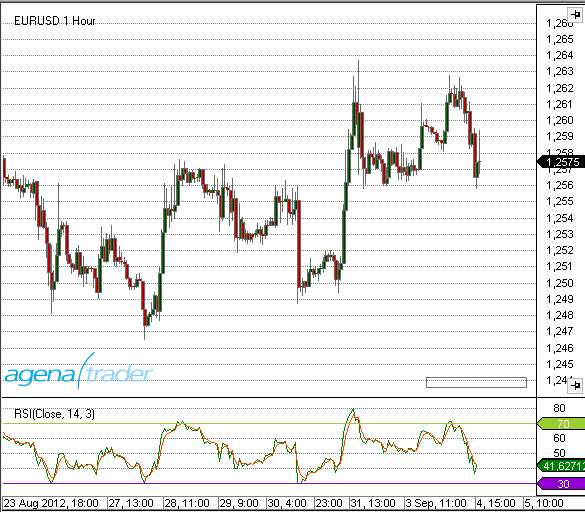

### Beispiel
```cs
//Ausgabe des Wertes für den Relative Strength Index (RSI)
Print("Der aktuelle Wert für den RSI ist: " + RSI(14, 3)[0]);

//Ausgabe des Wertes für die Avg-Linie
Print("Der aktuelle Wert der Avg-Linie ist: " + RSI(14, 3).Avg[0]);
```

##Relative Strength Levy (RSL)
### Beschreibung
Dem Konzept der Relativen Stärke nach Levy, Relative Strength Levy (RSL) liegt die Annahme zugrunde, daß Titel, die in der Vergangenheit eine große relative Stärke aufwiesen, sich auch in Zukunft relativ stark entwickeln werden und umgekehrt. Man berechnet hier also nicht die Relative Stärke mehrerer Titel zueinander, sondern vergleicht die Performance der Vergangenheit mit der Performance von heute.
Zur Berechnung wird der Wochenschlußkurs (oder Tagesschluss) des Basistitels durch das arithmetische Mittel der Schlußkurse im Betrachtungszeitraum dividiert. Das Ergebnis wird um die Marke 1,0 herum aufgetragen. Anschließend wird eine sortierte Liste erstellt, deren erster Platz vom Titel mit der höchsten RSL belegt wird.

### Interpretation
Besitzt ein Titel eine RSL größer 1, so zeigt er heute eine größere Kursstärke als in der Vergangenheit, besitzt er eine kleinere RSL, so tendiert der Titel schwächer, als in der Vergangenheit. Einer Interpretation nach Levy folgend, werden nur die beiden ersten Titel der oben beschriebenen Ranking-Liste, gekauft, alle anderen gelten als Verkaufspositionen.
Einer zweiten Interpretation Levys folgend, sind zunächst die Standardabweichungen der letzten 27 Wochenschlußkurse durch das arithmetische Mittel der letzten 27 Wochenschlußkurse zu dividieren. Mit diesem Verfahren soll die Volatilität der beobachteten Aktien ermittelt werden. Aus dem Ergebnis dieser Operation ist nun wieder eine Ranking-Liste aufzustellen. Als Kauf bewertete Levy die Titel der Schnittmenge aus den ersten 5% der RSL-Rangfolge und den ersten 12,5% der Volatilitätsrangfolge. Die Titel, die zu den letzten 30% der RSL-Liste gehören, sind zum Verkauf zu stellen. Ebenso wie die Relative Stärke sollte man die RSL als Filter benutzen, um die gefundenen Titel mit anderen technischen Indikatoren näher zu untersuchen.

### Verwendung
```cs
RSL(int period)
RSLDataSeries input, int period)
RSLnt period)[int barsAgo]
RSL(IDataSeries input, int period)[int barsAgo]
```

### Rückgabewert
**double**

Bei Verwendung der Methode mit einem Index ( z.B. **RSL**(27)\[**int** barsAgo\] ) wird der Wert des Indikators für den referenzierten Bar ausgegeben.

### Parameters
input  Eingangsdatenreihe für den Indikator

period	Anzahl der Bars, die in die Berechnung einbezogen werden

### Darstellung


### Beispiel
```cs
//Ausgabe des aktuellen Wertes füt die RSL
Print("Die Relative Stärke nach Levy beträgt" + RSL(27)[0]);
```

##Relative Volatility Index (RVI)
### Beschreibung
Der Relative Volatility Index (RVI) wurde von Donald Dorsey entwickelt. Es gleicht dem RSI, wobei anstelle der täglichen Preisspanne die Standardabweichung über den Indikator Zeitraumverwendet wird.
Um die grundlegende Volatilität eines Wertpapiers zu ermitteln eines Wertpapiers zu ermitteln, verwendet Donald Dorsey bei seinem Relative Volatility Index (RVI) die Standardabweichung über einen Zeitraum von zehn Tagen. Für die Berechnung der Dynamik der Volatilitätsentwicklung wendet er den Relative Strength Index (RSI) auf das Ergebnis der Volatilitätsberechnung an. Zur Berechnung der RSI verwendet er die üblichen 14 Tage.
Der Relative Volatility Index (RVI) misst die Richtung der Volatilitätsentwicklung auf einer Skala von 1 bis 100. Indem der RSI auf die Volatilität angewendet wird, werden die Schwankungen auf den Wertebereich zwischen 0 und 100 normiert und sind dadurch sowohl historisch als auch mit anderen Wertpapieren vergleichbar. (Quelle: VTAD)

### Interpretation
Beim RVI bedeuten Werte über 50 eine Zunahme der Volatilität. Werte unter 50 deuten auf eine nachlassende Volatilität hin.
Donald Dorsey bezeichnet die Verwendung als Filter für andere Indikatoren als Hauptaufgabe des RVI. Der RVI muss Signale eines Indikators bestätigen, damit sie als gültig gelten. 
Z.B. kann das Überkreuzen eines 10- und eines 20-Tage-Durchschnitts als signalgebender Indikator verwendet werden. Signale für steigende Kurse werden dann ausschließlich ausgeführt, wenn gilt: RVI > 50. Signale für fallende Kurse werden nur berücksichtigt, wenn gilt: RVI < 50.
Der Ausstieg aus einer Long-Position erfolgt, wenn gilt: RVI < 40. Der Ausstieg aus einer Short-Position erfolgt, wenn gilt: RVI > 60.
Ein ignoriertes Signal auf steigende Kurse wird nachgeholt, wenn gilt: RVI > 60. Ein ignoriertes Signal auf fallende Kurse wird nachgeholt, wenn gilt: RVI < 40.

### Weitere Informationen
<http://vtadwiki.vtad.de/index.php/Relative\_Volatility\_Index\_%28RVI%29>

### Verwendung
```cs
RVI(int period)
RVI(IDataSeries input, int period)
RVI(int period)[int barsAgo]
RVI(IDataSeries input, int period)[int barsAgo]
```

### Rückgabewert
**double**

Bei Verwendung der Methode mit einem Index ( z.B. **RVI**(14)\[**int** barsAgo\] ) wird der Wert des Indikators für den referenzierten Bar ausgegeben.

### Parameters
input Eingangsdatenreihe für den Indikator

period Anzahl der Bars, die in die Berechnung einbezogen werden

### Darstellung


### Beispiel
```cs
//Ausgabe des Wertes für den Relative Volatility Index (RVI)
Print("Der aktuelle Wert für den RVI ist:" + RVI(14)[0]);
```

##ReversalBars
**Für diesen Indikator ist die Installation des Markttechnik-Paketes Voraussetzung.**

### Beschreibung
Der Indikator ReversalBars dient der Erkennung und Markierung von Umkehrstäben im Chart. Die Umkehrstäbe konnen im Chart mit einer frei wählbaren Farbe eingefärbt werden. Zusätzlich könnnen auch Pfeile über bzw. unter einem Umkehrstab angezeigt werden.
Der Indikator besitzt einen Plot, und liefert für einen LOng-Umkehrstab den Wert 1, für einen Short-Umkehstab den Wert -1 und ansonsten den Wert 0. Somit kann der Indikator auch in einem Subchart unter dem Hauptchart dargestellt werden. (Die Farbe des Plots ist auf Transparent gesetzt und muß geändert werden.)
Die Rückgabewerte des Indikators erlauben eine Verwendung in anderen Indikatioren bzw. Strategien.

### Interpretation
Zur Interpretation von Umkehrstäben wird auf die ausführliche Beschreibung in "Das große Buch der Markttechnik") v. M. Voigt verwiesen.

### Verwendung
```cs
Reversalbars()
Reversalbars(IDataSeries input)
Reversalbars()[int barsAgo]
Reversalbars(IDataSeries input)[int barsAgo]
Reversalbars(int tolerance)
Reversalbars(IDataSeries input, int tolreance)
Reversalbars(int tolerance)[int barsAgo]
Reversalbars(IDataSeries input, int tolerance)[int barsAgo]
```

### Rückgabewert
**double**

 1 = Long-Umkehrstab
 
-1 = Short-Umkehrstab

 0 = kein Umkehrstab


Bei Verwendung der Methode mit einem Index ( z.B. **Reversalbars**()\[**int** barsAgo\] )wird der Wert des Indikators für den referenzierten Bar ausgegeben.

### Parameters
input	Eingangsdatenreihe für den Indikator
tolerance  s. nachfolgende Beschreibung

### Darstellung


### Der Parameter Tolerance
Umkehrstäbe müssen nach Definition ihren vorhergehenden Bar mindestens um 1 Tick übersteigen (Long-Umkehrstab) bzw. unterschreiten (Short-Umkehrstab). Mit dem Parameter Toleranz kann eine zusätzliche Anzahl Ticks angegeben werden, die - im Falle eines Long-Umkehrstabes - das Hoch des Umkehrstabes das Hoch des vorhergehenden Bars mindestens überschreiten muss.
Der Parameter per default auf 0 gesetzt, was in einem seitwärs verlaufenden Markt dazu führen kann, dass sehr viele nicht relevante Umkehrstäbe markiert werden.  

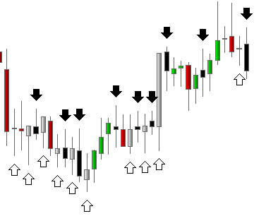

### Beispiel
```cs
// set CalculateOnBarClose = true !!
if (Reversalbars()[0] == 1.0)
Print("Der letzte Bar ist ein Long-Umkehrstab.");
```

##R-Squared
### Beschreibung
Der Indikator R-Squared gehört zu den Indikatoren aus dem Bereich der linearen Regression. R-Squared ist der sog. Korrelationskoeffizient. Er beschreibt die Qualität der linearen Regressionsgerade.

R-Squared hat seinen Namen von der Berechnung. Der Wert ist das Quadrat des Korrelationskoeffizienten, der in der Mathematik mit dem grichischen Buchstaben Rho (P) bezeichnet wird.

Siehe auch  [*Linear Regression*](#linearregression), [*LinRegSlope*](#linregslope), [*LinRegIntercept*](#linregintercept).

### Interpretation
Die Werte des Oszillators schwanken zwischen 0 und 1. Es wird standardmäßig eine obere Begrenzungslinie bei 0,75 und eine untere Begrenzungslinie bei 0,2 verwendet.
Verlaufen die Kurse in einer Seitwärtsbewegung, sind die Daten um ihre Regressionsgerade herum weit gestreut. R-Squared weist in diesem Fall einen Wert nahe Null auf.
In einer starken Trendphase, in der die Kurse längere Zeit in einem engen Schwankungsraum laufen, liegen diese sehr nahe an ihrer Regressionsgeraden. Der R-Squared Indikator weist dann einen Wert nahe 1 auf. Stanley Kroll und Tuchar Chande haben in ihrem Buch „The new technical Trader“ sowohl die Steigung der Regressionsgeraden, als auch den Korrelationskoeffizienten als Trendfilter verwendet, und zur Trendgütebestimmung vorgestellt. (Quelle tradesignalonline)

### Weitere Informationen
<http://www.blastchart.com/Community/IndicatorGuide/Indicators/LinearRegressionRSquared.aspx>

### Verwendung
```cs
RSquared(int period)
RSquared(IDataSeries input, int period)
RSquared(int period)[int barsAgo]
RSquared(IDataSeries input, int period)[int barsAgo]
```

### Rückgabewert
**double**

Bei Verwendung der Methode mit einem Index ( z.B.  **RSquared**(8)\[**int** barsAgo\] ) wird der Wert des Indikators für den referenzierten Bar ausgegeben.

### Parameters
input	Eingangsdatenreihe für den Indikator

period	Anzahl der Bars, die in die Berechnung einbezogen werden

### Darstellung


### Beispiel
```cs
//Ausgabe des Wertes für den Relative Volatility Index (RVI)
Print("Der aktuelle Wert für R-Squared ist:  " + RSquared(8)[0]);
```

##StandardDeviation(StdDev)
### Beschreibung
Die Standardabweichung (StdDev) ist ein Begriff der Statistik und der Wahrscheinlichkeitsrechnung und ein Maß für die Streuung der Werte einer Zufallsvariablen um ihren Mittelwert. Die Standardabweichung der letzten n Tage findet z.B. auch bei der Berechnung der Bollinger Bänder Verwendung.

### Interpretation
Eine niedrige Standardabweichung zeigt, dass die Datenpunkte sehr nahe an ihrem Mittelwert notieren. Eine hohe Standardabweichung zeigt an, dass die Daten über einen großen Bereich von Werten "ausgebreitet" notieren. Der Tradingansatz geht dann davon aus, dass die Kurse sich wieder ihrem Mittelwert annähern.

### Weitere Informationen
VTAD: <http://vtadwiki.vtad.de/index.php/Standard\_Abweichung>

### Verwendung
```cs
StdDev (int period)
StdDev (IDataSeries input, int period)
StdDev (int period)[int barsAgo]
StdDev (IDataSeries input, int period)[int barsAgo]
```

### Rückgabewert
**double**

Bei Verwendung der Methode mit einem Index ( z.B.**StdDev**(14)\[**int** barsAgo\] ) wird der Wert des Indikators für den referenzierten Bar ausgegeben.

### Parameters
input	Eingangsdatenreihe für den Indikator

period	Anzahl der Bars, die in die Berechnung einbezogen werden

### Darstellung


### Beispiel
```cs
//Ausgabe des Wertes für die Standardabweichung (StdDev)
Print("Der aktuelle Wert für die Standardabweichung ist:  " + StdDev(14)[0]);
```

##Standard Error (StdError)
### Beschreibung
Die Standard Error Bänder (StdError) wurden von Jon Anderson entwickelt. Ihr Aussehen ähnelt stark den Bollinger Bändern, obwohl die Berechnung unterschiedlich ist. Die Bänder entstehen durch eine obere und eine untere Begrenzung um eine Mittellinie, der Linearen Regression.
Die Empfehlungen von Andersen sind folgende Werte: die Anzahl der Perioden ist 21, die Glättung erfolgt mit einem einfachen gleitenden Durchschnitt (SMA) über 3-Perioden.
Die Subtraktion von zwei Standard-Fehlern von dem Endwert der Regressionsgeraden entspricht dem niedrigeren Standard Fehler, also des unteren Bandes. Einzelne Schlusskurse können einen großen Einfluss auf die Werte der Bänder haben und diese sehr stark schwanken lassen. Daher ist es notwendig, den Verlauf mit einem einfache gleitenden Durchschnitt (SMA) über die Endwerte der Linearen Regression und über die Standardfehler zu glätten.

### Interpretation
Die Standard Error Bänder haben viel gemeinsam mit den Bollinger Bändern, obwohl sich ihre Interpretation unterscheidet.
Eine der Anwendungsmöglichkeiten von Standard Error Bändern ist, die Verengung der Bänder während eines Kursanstiegs bzw. -verfalls zu beobachten. Ziehen sich die Bänder enger zusammen, liegt ein einfacher Trend vor. Ein starker Trend hält die Bänder eng zusammen Die Lineare Regression (Mittellinie) folgt der steigenden bzw. fallenden Kursbewegung

### Weitere Informationen
<http://www.forexrealm.com/technical-analysis/technical-indicators/standard-error-bands.html>

### Verwendung
```cs
StdError(int period)
StdError(IDataSeries input, int period)
StdError(int period)[int barsAgo]
StdError(IDataSeries input, int period)[int barsAgo]

//Für das obere Band
StdError(int period).Upper[int barsAgo]
StdError(IDataSeries input, int period).Upper[int barsAgo]

//Für das untere Band
StdError(int period).Lower[int barsAgo]
StdError(IDataSeries input, int period).Lower[int barsAgo]
```

### Rückgabewert
**double**

Bei Verwendung der Methode mit einem Index ( z.B.  **StdError**(21)\[**int** barsAgo\] ) wird der Wert des Indikators für den referenzierten Bar ausgegeben.

### Parameters
input	Eingangsdatenreihe für den Indikator

period	Anzahl der Bars, die in die Berechnung einbezogen werden

### Darstellung


### Beispiel
```cs
//Ausgabe des Wertes für die Mittellinie. Dieser Wert entspricht der Linearen Regression
Print("Die Mittellinie verläuft aktuell bei: " + StdError(21)[0]);

//Ausgabe des Wertes für das untere Band 
Print("Das untere Band des Standardfehlers verläuft aktuell bei: " + StdError(21).Lower[0]);

//Ausgabe des Wertes für das obere Band 
Print("Das obere Band des Standardfehlers verläuft aktuell bei:" + StdError(21).Upper[0]);
```

##Stochastics
### Beschreibung
Der Stochastik-Indikator wurde von George C. Lane in den späten 1950er Jahren entwickelt. Er gehört zu der Klasse der Momentum-Indicatoren (Oszillatoren). Dargestellt wird der aktuelle Schlusskurs relative zu einem High- bzw. Low-Bereich über eine vorgegebene Anzahl von Perioden.
Der Stochastik-Indikator basiert auf der Beobachtung, dass in Aufwärtsbewegungen der Schlußkurs nahe dem Tageshochkurs liegt, während in Abwärtsbewegungen der Schlußkurs nahe dem Tagestiefstkurs liegt.
Der Stochastik-Indikator setzt sich aus zwei exponentiellen Durchschnittslinien ( %K und %D) zusammen. Beide Linien schwanken zwischen 0 und 100.
Es wird zwischen der "klassischen" (Slow)-Stochastik (dieser Indikator) und der Fast Stochastik unterschieden.

**Fast Stochastik:**
Die %D-Linie ist ein GD der %K-Linie.

**Slow Stochastik:**
Die %D-Linie bildet die Basis, auf der wiederum ein GD berechnet wird. Die Slow -Stochastik glättet die Fast-Stochastik und bringt so etwas mehr Ruhe in den Oszillator.

### Interpretation
Schlusskurse, die sich dauerhaft im oberen Bereich befinden, deuten auf Akkumulation (d.h. Kaufdruck) hin, während die Distribution (d.h. Verkaufsdruck) durch einen Indikatorwert im unteren Bereich angezeigt wird.
Der Stochastik-Indikator als klassischer Oszillator wird hauptsächlich in Seitwärtsbewegungen eingesetzt, um Umkehrpunkte herauszufinden. In Zeiten mit stabilen Trends liefert der Stochastik-Indikator keine besonders überzeugenden Ergebnisse.

### Weitere Informationen
VTAD: <http://vtadwiki.vtad.de/index.php/Stochastik>

### Verwendung
```cs
Stochastics(int periodD, int periodK, int smooth)
Stochastics(IDataSeries input, int periodD, int periodK, int smooth)

//Für die %D Linie
Stochastics(int periodD, int periodK, int smooth).D[int barsAgo]
Stochastics(IDataSeries input, int periodD, int periodK, int smooth).D[int barsAgo]

//Für die %K Linie
Stochastics(int periodD, int periodK, int smooth).K[int barsAgo]
Stochastics(IDataSeries input, int periodD, int periodK, int smooth).K[int barsAgo]
```

### Rückgabewert
**double**

Bei Verwendung der Methode mit einem Index ( z.B.  **Stochastics**(7,14,3)\[**int** barsAgo\] ) wird der Wert des Indikators für den referenzierten Bar ausgegeben.

### Parameters
input	Eingangsdatenreihe für den Indikator

periodD	Anzahl der Perioden für die Glättung von %K

periodK	Anzahl der Bars, die in die Berechnung für %K einbezogen werden

smooth	Anzahl der Perioden für die Glättung von %D

### Darstellung


### Beispiel
```cs
//Ausgabe des Wertes für die %K-Linie.
Print("Die Stochastik Linie %K verläuft aktuell bei: " + Stochastics(3, 14, 7).K[0]);

//Ausgabe des Wertes für die %D-Linie.
Print("Die Stochastik Linie %D verläuft aktuell bei: " + Stochastics(3, 14, 7).D[0]);
```

##Stochastics Fast
### Beschreibung
Seihe [*stochastics*](#stochastics).

### Interpretation
Schlusskurse, die sich dauerhaft im oberen Bereich befinden, deuten auf Akkumulation (d.h. Kaufdruck) hin, während die Distribution (d.h. Verkaufsdruck) durch einen Indikatorwert im unteren Bereich angezeigt wird.
Der Stochastik-Indikator als klassischer Oszillator wird hauptsächlich in Seitwärtsbewegungen eingesetzt, um Umkehrpunkte herauszufinden. In Zeiten mit stabilen Trends liefert der Stochastik-Indikator keine besonders überzeugenden Ergebnisse.

### Weitere Informationen
VTAD: [http://vtadwiki.vtad.de/index.php/Stochastik](http://vtadwiki.vtad.de/index.php/Stochastik)

Charttec: [http://www.charttec.de/html/indikator_stochastics.php](http://www.charttec.de/html/indikator_stochastics.php)

### Verwendung
```cs
StochasticsFast(int periodD, int periodK)
StochasticsFast(IDataSeries input, int periodD, int periodK)

//Für die %D Linie
StochasticsFast(int periodD, int periodK).D[int barsAgo]
StochasticsFast(IDataSeries input, int periodD, int periodK).D[int barsAgo]

//Für die %K Linie
StochasticsFast(int periodD, int periodK).K[int barsAgo]
StochasticsFast(IDataSeries input, int periodD, int periodK).K[int barsAgo]
```

###Rückgabewert
**double**

Bei Verwendung der Methode mit einem Index ( z.B. **StochasticsFast**(7,14)\[**int** barsAgo\] ) wird der Wert des Indikators für den referenzierten Bar ausgegeben.

### Parameters
input Eingangsdatenreihe für den Indikator

periodD	Anzahl der Perioden für die Glättung von %K

periodK	Anzahl der Bars, die in die Berechnung für %K einbezogen werden

### Darstellung
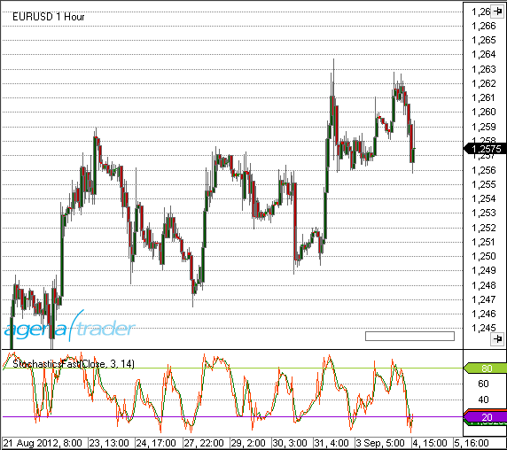

### Beispiel
```cs
//Ausgabe des Wertes für die %K-Linie der Fast Stochastik.
Print("Die Stochastik Linie %K verläuft aktuell bei:" + StochasticsFast(3, 14).K[0]);

//Ausgabe des Wertes für die %D-Linie der Fast Stochastik.
Print("Die Stochastik Linie %D verläuft aktuell bei: " + StochasticsFast(3, 14).D[0]);
```

##Stochastics RSI (StochRSI)
### Beschreibung
Bei der Stochastics RSI (StochRSI) handelt es sich um die Berechnung einer Stochastik auf den Relative Strength Index (RSI). Vorgestellt wurde diese Kombination von T. Chande und S. Kroll.

### Interpretation
Gute Ergebnisse liefert StochRSI als überkauft / überverkauft - Oszillator. Es wird sehr präzise (fast) jeder Extremzustand angezeigt. Der StochRSI kann sowohl als Trendfilter in höheren Zeiteinheiten, sowie für das Timing beim Einstieg in kleineren Zeiteeinheiten eingesetzt werden.

### Weitere Informationen
[http://www.investopedia.com/terms/s/stochrsi.asp#axzz263tizhIG](http://www.investopedia.com/terms/s/stochrsi.asp#axzz263tizhIG)

### Verwendung
```cs
StochRSI(int period)
StochRSI(IDataSeries input, int period)
StochRSI(int period)[int barsAgo]
StochRSI(IDataSeries input, int period)[int barsAgo]
```

### Rückgabewert
**double**

Bei Verwendung der Methode mit einem Index ( z.B.  **StochRSI**(14)\[**int** barsAgo\] ) wird der Wert des Indikators für den referenzierten Bar ausgegeben.

### Parameters
input	Eingangsdatenreihe für den Indikator

period	Anzahl der Bars, die in die Berechnung einbezogen werden

### Darstellung


### Beispiel
```cs
//Ausgabe des Wertes für den Stochastics RSI (StochRSI)
Print("Der aktuelle Wert für den StochRSIist: " + StochRSI(14)[0]);
```

##Summation (SUM)
### Beschreibung
Summation (SUM) liefert die Summe über eine bestimte Anzahl von Perioden.

### Verwendung
```cs
SUM(int period)
SUM(IDataSeries input, int period)
SUM(int period)[int barsAgo]
SUM(IDataSeries input, int period)[int barsAgo]
```

### Rückgabewert
**double**

Bei Verwendung der Methode mit einem Index ( z.B. **SUM**(14)\[**int** barsAgo\] ) wird der Wert für den referenzierten Bar ausgegeben.

### Parameters
input	Eingangsdatenreihe für den Indikator

period	Anzahl der Bars, die in die Berechnung einbezogen werden

### Darstellung
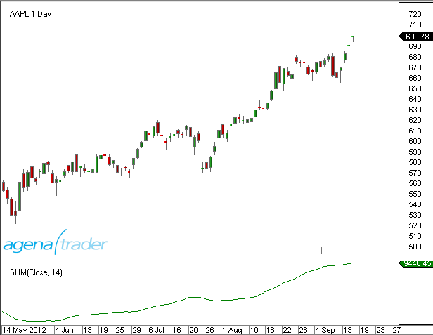

### Beispiel
```cs
// Summe des Volumens der letzten 10 Handelstage
Print(SUM(Volume,10)[0]);
```

##SuperTrend
### Beschreibung
Der SuperTrend-Indikator wurde von einem französchischen Trader entwickelt und ist ähnlich dem Parabolic Stop And Reverse System (Parabolic SAR), dass in den 1970er Jahren vorgestellt wurde. Er basiert auf dem Mittelwert der Stäbe und misst die Volatilität als Spanne zwischen Hoch und Tief, unter Berücksichtigung evtl. Kurslücken. Ausgehend von einem Startwert verläuft der Indikator solange in die eingeschlagene Richtung, bis der Markt bei steigender Volatilität eine starke Bewegung in die Gegenrichtung ausführt. Dann springt der Indikator auf den Startwert der Gegenrichtung. Der Indikator ist so programmiert, dass er sich nur in Trendrichtung verändern kann. Nachlassende Volatilität oder Bewegungen gegen die Trendrichtung führen nur dazu, dass er waagerecht weitergezeichnet wird. (Quelle: tradeSignalOnline)

### Interpretation
Es gibt viele verschiedene Anwendungsmethoden für SuperTrend. Unter Forex Händlern ist es verbreitet, die Überkreuzungen direkt zu handeln. Das System ist dann immer im Markt und wird lediglich durch einen Stopp und weitere Regeln zur Gewinnsicherung ergänzt.
Für analytische Zwecke kann der SuperTrend-Indikator einfach nur eine Information über den vorherrschenden Kurstrend liefern. Liegt der Markt über dem Indikator herrscht ein Aufwärtstrend vor, sonst ein Abwärtstrend.
Der Indikator kann auch als Exit für ein weiteres Handelssystem dienen. Das heißt, offene Positionen werden beim Trendwechsel des Indikators geschlossen. Hier ist allerdings zu beachten, dass die Positionseröffnungen an den Indikator angepasst werden, oder dass es für die Situationen, in denen Indikator und Position seit der Eröffnung nicht trendgleich verlaufen, eine Sonderbehandlung geben muss.

### Verwendung
```cs
SuperTrend(SuperTrendMode stMode, int length, double multiplier, SuperTrendMAType maType, int smooth)
SuperTrend(IDataSeries input, SuperTrendMode stMode, int length, double multiplier, SuperTrendMAType maType, int smooth)
SuperTrend(SuperTrendMode stMode, int length, double multiplier, SuperTrendMAType maType, int smooth)[int barsAgo]
SuperTrend(IDataSeries input, SuperTrendMode stMode, int length, double multiplier, SuperTrendMAType maType, int smooth)[int barsAgo]

//Für den Wert von UpTrend:
SuperTrend(SuperTrendMode stMode, int length, double multiplier, SuperTrendMAType maType, int smooth).UpTrend[int barsAgo]
SuperTrend(IDataSeries input, SuperTrendMode stMode, int length, double multiplier, SuperTrendMAType maType, int smooth).UpTrend[int barsAgo]

//Für den Wert von DownTrend:
SuperTrend(SuperTrendMode stMode, int length, double multiplier, SuperTrendMAType maType, int smooth).DownTrend[int barsAgo]
SuperTrend(IDataSeries input, SuperTrendMode stMode, int length, double multiplier, SuperTrendMAType maType, int smooth).DownTrend[int barsAgo]
```

### Rückgabewert
**double**

Bei Verwendung der Methode mit einem Index ( z.B. **SuperTrend**(...).UpTrend\[**int** barsAgo\] ) wird der Wert des Indikators für den referenzierten Bar ausgegeben.

### Parameters
|            |                                                                                                                                                                        |
|------------|------------------------------------------------------------------------------------------------------------------------------------------------------------------------|
| InSeries   | Eingangsdatenreihe für den Indikator                                                                                                                                    |
| maType     | Der zur Berechnung zu verwendende Gleitende Durchschnitt
Mögliche Werte sind:
SuperTrendMAType.HMA
SuperTrendMAType.SMA
SuperTrendMAType.SMMA
SuperTrendMAType.TEMA
SuperTrendMAType.TMA
SuperTrendMAType.VMA
SuperTrendMAType.VWMA
SuperTrendMAType.WMA

siehe: [*HMA*](#hma-hull-moving-average), [*SMA*](#sma-simple-moving-average), [*SMMA*](#smma-smoothed-moving-average), [*TEMA*](#tema-triple-exponential-moving-average), [*TMA*](#tma-triangular-moving-average), [*VMA*](#vma-variable-moving-average), [*VWMA*](#vwma-volume-weighted-moving-average), [*WMA*](#wma-weighted-moving-average).
Default:
              HMA  |
| multiplier |Ein Multiplikator zur internen Berechnung des Offset. Wird nur im Modus "ATR" und "DualThrust" verwendet
(Im Modus "Adaptiv" kommt als Multiplikator der sog. Homodyne Discriminator zum Einsatz.) Default: 2,618      |
| Period     | Anzahl der Bars zur Berechnung des gleitenden Durchschnittes
Default: 14    |
| smooth     | Wert für eine zusätzliche Glättung.
Wird keine Glättung benötigt, ist dieser wert auf 1 zu setzen.
Default: 14     |
| stMode     | Mögliche Werte sind::
SuperTrendMode.ATR, SuperTrendMode.DualThrust,  SuperTrendMode.Adaptive
Im DualThrust-Modus hat der Parameter Period einen sehr großen Einfluss. Je kleiner Period ist, desto enger folgt der Indikator dem Markt und wird dementsprechend auch mehr Fehlsignale liefern.
Default: SuperTrendMode.ATR     |

### Darstellung


### Beispiel
```cs
if (Close[0] > SuperTrend(SuperTrendMode.ATR, 14, 2.618, MovingAverageType.HMA, 14).UpTrend[0])
  Print("Markt befindet sich in einem Aufwärtstrend.");
if (Close[0] < SuperTrend(SuperTrendMode.ATR, 14, 2.618, MovingAverageType.HMA, 14).DownTrend[0])
  Print("Markt befindet sich in einem Abwärtstrend.");
```

##SupportResistanceAreas
### Beschreibung
Der Indikator SupportResistanceAreas zeichnet Unterstützungs- und Widerstandsbereiche in den Chart. Es werden insgesamt 4 Arten von Unterstützungen bzw. Widerständen (farblich) unterschieden.

Support durch einen zurückliegenden lokalen Hochpunkt 	(ColorLowerHigh)

Support durch einen zurückliegenden lokalen Tiefpunkt	(ColorLowerLow)

Widerstand durch einen zurückliegenden lokalen Hochpunkt   (ColorHigherHigh)

Widerstand durch einen zurückliegenden lokalen Tiefpunkt   (ColorHigherLow)


### Interpretation
In der Analyse von Charts spielen Unterstützungs- und Widerstandsbereiche eine herausragende Rolle.
An deutlich erkennbaren Unterstützungen bieten sich Einstiegsgelegenheiten, an Widerständen entsprechend Zielpunkte.
Einmal gebrochene Widerstände erweisen sich im weiteren Handel oftmals als Unterstützungen und umgekehrt.

<http://finanzportal.wiwi.uni-saarland.de/tech/Kapitel5\_4.htm>

### Parameters
|                   |                                                                                                  |
|-------------------|--------------------------------------------------------------------------------------------------|
| ATRRangeFactor    | Einstellung für die Breite eines Unterstützungs- bzw. Widerstandsbereiches gemessen in ATR.
Der kleinste einstellbarer Wert ist 0,1 default ist 0.3                                            |
| Levels            | Die Einstellung gibt an, wieviele Unterstützungs- bzw. Widerstandsbereiche von der gleichen Art (s. oben: 4 Arten) angezeigt werden sollen. Default ist 3.         |
| Opacity           | Transparenz der in den Chart gezeichneten Balken. Einstellungen sind von 0 (durchsichtig) bis 255 (deckend) möglich. Default ist 70                        |
| SensibilityFactor | Legt die "Empfindlichkeit" der Suche nach Widerstands bzw. Unterstützungsbereichen fest.
Die kleinste mögliche Einstellung ist 1. Default ist 5.                                                       |

### Darstellung
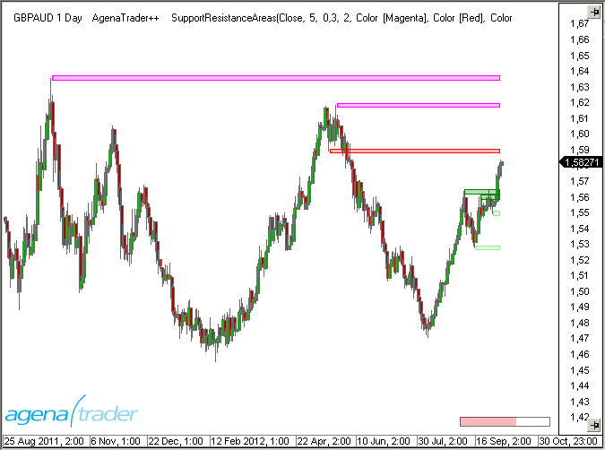

##Swing
### Beschreibung
Der Swing Indikator zeichnet Linien an den Swing-Hochs bzw. Swing-Tiefs basierend auf der "Stärke" dieser Punkte. Die Stärke ergibt sich dabei aus der Anzahl der Bars links und rechts neben diesem Extrempunkt.
Methoden dieses Indikators können in anderen Scripten verwendet werden um z.B. den letzten zurückliegenden Extrempunkt und den entsprechenden Kurswert zu erhalten.

### Interpretation
Methoden dieses Indikators können in anderen Scripten verwendet werden um z.B. den letzten zurückliegenden Extrempunkt und den entsprechenden Kurswert zu erhalten. Diese Hoch- bzw. Tiefpunkte können dann als Einstiegs-, Stopp- oder Targetmarken verwendet werden.

### Verwendung
```cs
//Für einen Hochpunkt
Swing(int strength).SwingHighBar(int barsAgo, int instance, int lookBackPeriod)
Swing(IDataSeries input, int strength).SwingHighBar(int barsAgo, int instance, int lookBackPeriod)

//Für einen Tiefpunkt
Swing(int strength).SwingLowBar(int barsAgo, int instance, int lookBackPeriod)
Swing(IDataSeries input, int strength).SwingLowBar(int barsAgo, int instance, int lookBackPeriod)
```

### Rückgabewert
**double**

Bei Verwendung der Methode mit einem Index ( z.B.  **Swing**(5)\[**int** barsAgo\] ) wird der Wert des Indikators für den referenzierten Bar ausgegeben.

**Wenn CurrentBar kleiner ist als der Parameter "strength" oder wenn noch kein SwingHigh bzw SwingLow gefunden wurde, ist der Rückgabewert -1.**

### Parameters
|                |                                                                                                              |
|----------------|--------------------------------------------------------------------------------------------------------------|
| barsAgo        | Startpunkt der Suche in der Vergangenheit                                                                    |
| InSeries       | Eingangsdatenreihe für den Indikator                                                                         |
| instance       | Die Anzahl des Auftretens von Extrempunkten (1 ist das letzte Vorkommen, 2 das vorletzte Vorkommen usw.)     |
| length         | Anzahl der Bars, die in der Berechnung verwendet werden                                                      |
| lookBackPeriod | Anzahl der Bars, innerhalb derer nach Swing-Punkten gesucht werden soll (Suchbereich)                        |
| strength       | Anzahl der Bars links und rechts von einem Extrempunkt                                                       |

### Darstellung


### Beispiel
```cs
// Position und Kurs des letzten SwingHigh
int barsAgo = Swing(5).SwingHighBar(0, 1, 10);
Print("The last swing high was " + barsAgo + " bars ago.");
Print("The last swing high was at " + High[barsAgo]);
```

##Time-Series-Forecast (TSF)
### Beschreibung
Der Time-Series-Forecast (TSF) ähnelt einem gleitenden Durchschnitt. Der Trend wird mit einer Regressionsgleichung nach der Methode der kleinsten Quadrate ermittelt. Ziel ist es, den Kurs anhand des bestehenden Trends in die Zukunft zu extrapolieren.

### Interpretation
TSF reagiert schneller als gleitende Durchschnitte. Diese bilden immer mit Zeitverzögerung den vorherrschenden Trend ab. Die TSF-Formel lässt den Abstand zum aktuellen Kurs jedoch nie zu groß werden. Dadurch gelingt es dem Indikator in vielen Fällen, schneller auf Trendwenden zu reagieren.
Ein Einstieg erfolgt dann, wenn der Kurs die TSF-Linie von unten nach oben durchbricht. Zum Ausstieg kommt es im umgedrehten Fall.
Diese Vorgehensweise ist aber nicht immer empfehlenswert. In einer Seitwärtsbewegung des Marktes gibt es zu viele Fehlsignale.
Die Anzahl von Fehlsignalen läßt sich verringern, wenn der Einstieg nur dann erfolgt, wenn der Indikator seine Richtung wechselt. Ein Kaufsignal ergibt sich, wenn der Indikator steigt, nachdem er zuvor gefallen war. Beim Richtungswechsel von steigend auf fallend dagegen wird verkauft. (Quelle: faz.net)

### Weitere Informationen
<http://en.wikipedia.org/wiki/Time\_series>

### Verwendung
```cs
TSF(int forecast, int period)
TSF(IDataSeries input, int forecast, int period)
TSF(int forecast, int period)[int barsAgo]
TSF(IDataSeries input, int forecast, int period)[int barsAgo]
```

### Rückgabewert
**double**

Bei Verwendung der Methode mit einem Index ( z.B.  **TSF**(3,14)\[**int** barsAgo\] ) wird der Wert des Indikators für den referenzierten Bar ausgegeben.

### Parameters
forecast Anzahl der Bars für Forecast

input Eingangsdatenreihe für den Indikator

period Anzahl der Bars, die in die Berechnung einbezogen werden

### Darstellung


### Beispiel
```cs
//Ausgabe des Wertes für den Time-Series-Forecast (TSF) 
Print("Der aktuelle Wert für TSF ist: " + TSF(3, 14)[0]);
```

##Tools
##Constant Lines
### Beschreibung
Der Indikator ConstantLines zeichnet bis zu vier frei konfigurierbare horizontale Linien in den Chart. Er kann dazu verwendet werden, bestimmte Preisniveaus (charttechnisch interessante Punkte) zu markieren um sie nicht aus dem Blick zu verlieren.

### Verwendung
```cs
ConstantLines(double line1Value, double line2Value, double line3Value, double line4Value)
ConstantLines(double line1Value, double line2Value, double line3Value, double line4Value)[barsAgo]
ConstantLines(double line1Value, double line2Value, double line3Value, double line4Value).Line1[barsAgo]
ConstantLines(double line1Value, double line2Value, double line3Value, double line4Value).Line2[barsAgo]
ConstantLines(double line1Value, double line2Value, double line3Value, double line4Value).Line3[barsAgo]
ConstantLines(double line1Value, double line2Value, double line3Value, double line4Value).Line4[barsAgo]
```

### Rückgabewert
**double**

Bei Verwendung der Methode mit einem Index ( z.B. **ConstantLines**(1,2,3,4)\[**int** barsAgo\] ) wird der Wert des Indikators für den referenzierten Bar ausgegeben.

### Darstellung


##CurrentDayOHL
### Beschreibung
Die Funktion CurrentDayOHL liefert für den aktuellen Tag (die aktuelle Session) die Werte für Open, High und Low.
CurrentDayOHL ist nur zur Verwendung mit Intraday-Datenserien vorgesehen.

Siehe auch [*PriorDayOHLC*](#priordayohlc), [*DayLines*](#daylines).

### Parameter
input Eingangsdatenreihe für den Indikator

### Rückgabewert
**double**

Bei Verwendung der Methode mit einem Index ( z.B.  **CurrentDayOHL**.CurrentOpen(...)\[**int** barsAgo\] ) wird der Wert des Indikators für den referenzierten Bar ausgegeben.

### Verwendung
```cs
CurrentDayOHL()
CurrentDayOHL(IDataSeries input)

//Für den Wert von Open
CurrentDayOHL().CurrentOpen[int barsAgo]
CurrentDayOHL(IDataSeries input).CurrentOpen[int barsAgo]

//Für den Wert von High
CurrentDayOHL().CurrentHigh[int barsAgo]
CurrentDayOHL(IDataSeries input).CurrentHigh[int barsAgo]

//Für den Wert von Low
CurrentDayOHL().CurrentLow[int barsAgo]
CurrentDayOHL(IDataSeries input).CurrentLow[int barsAgo]
```

### Darstellung


### Beispiel
```cs
Print("Das Tief der aktuellen Session liegt bei " + CurrentDayOHL().CurrentLow[0]);
```

##Daily Performance
### Beschreibung
Der Indikator DailyPerformance liefert Angaben über die Veränderung des Kurses ausgehend entweder von einem Close in der Vergangenheit oder vom Open des aktuellen Tages zum aktuellen Kurs.

Die Performance kann in Punkten, Ticks, Prozent oder einem Währungsbetrag angegene werden.

Für die Darstellung im Chart sind die Schriftart und die Farbe frei wählbar.

siehe auch [*Momentum*](#momentum), [*ROC*](#rate-of-change-roc).

**Hinweis zur Verwendung im Scanner:**
Um z.B. die bekannte Liste von Aktien mit ihrer täglichen prozentualen Veränderung zu erhalten, stellen sie bitte CalculateOnBarClose auf "false", TimeFrame auf "1 Day", Calculation mode auf "Percent" und Days ago auf "0". 


Das Ergebnis ist dann folgende Liste:


### Verwendung
```cs
DailyPerformance(DailyPerformanceReference reference, DailyPerformanceCalculationMode mode, int daysAgo)
DailyPerformance(IDataSeries input,DailyPerformanceReference reference, DailyPerformanceCalculationMode mode, int daysAgo)
DailyPerformance(DailyPerformanceReference reference, DailyPerformanceCalculationMode mode, int daysAgo)[int barsAgo]
DailyPerformance(IDataSeries input,DailyPerformanceReference reference, DailyPerformanceCalculationMode mode, int daysAgo)[int barsAgo]
```

### Rückgabewert
**double**

Bei Verwendung der Methode mit einem Index ( z.B. **DailyPerformance**(...)\[**int** barsAgo\] ) wird der Wert des Indikators für den referenzierten Bar ausgegeben.

### Parameters
input		Eingangsdatenreihe für den Indikator

reference	mögliche Werte sind:
		- DailyPerformanceReference.Open
		- DailyPerformanceReference.PreviousClose
		
mode		mögliche Werte sind:
		- DailyPerformanceCalculationMode.Points
		- DailyPerformanceCalculationMode.Ticks
		- DailyPerformanceCalculationMode.Percent
		- DailyPerformanceCalculationMode.Currency
		
daysAgo	        Anzahl der Tage in der Vergangenheit

### Darstellung


### Beispiel
```cs
//Wieviel Ticks liegen zwischen dem heutigen Open und dem aktuellen Kurs?
DailyPerformance(DailyPerformanceReference.Open, DailyPerformanceCalculationMode.Ticks, 1)[0]

//Wieviel Prozent ist die Aktie seit dem gestrigen Schlusskurs gestiegen/gefallen?
DailyPerformance(DailyPerformanceReference.PreviousClose, DailyPerformanceCalculationMode.Percent, 1)[0]

//Wieviel Punkte/Ticks hat der Future vom Beginn der Handelswoche bis zum aktuellen Kurs zurückgelegt.
//(Wenn heute Donnerstag ist, war Montag vor 3 Tagen)
DailyPerformance(DailyPerformanceReference.PreviousClose, DailyPerformanceCalculationMode.Points, 3)[0]

//Wieviel Euro bzw. USD entspricht diese Performance?
DailyPerformance(DailyPerformanceReference.PreviousClose, DailyPerformanceCalculationMode.Currency, 3)[0]

//Wie groß ist das Overnight-Gap zum heutigen Handelsstart?
DailyPerformance(DailyPerformanceReference.PreviousClose, DailyPerformanceCalculationMode.Points, 1)[0]
```

##DayLines
### Beschreibung
Der DayLines-Indikator zeichnet im Chart  Linien für das gestrige Hoch, Tief und Close sowie das heutige Open ein.
An diesen Linien (Kursniveaus) ist sehr oft mit einer Reaktion des Marktes zu rechnen.
Jede Linie ist einzeln ein- bzw. ausblendbar. Die Farben und Linienstärken sind frei konfigurierbar.

Siehe auch [*CurrentDayOHL*](#currentdayohl), [*PriorDayOHLC*](#priordayohlc).

### Darstellung


##DayLinesAdv
### Beschreibung
Der Indikator DayLinesAdv zeichnet im Chart  horizontale Linien für das gestrige Hoch, Tief und Close sowie das heutige Open ein.
An diesen Linien (Kursniveaus) ist sehr oft mit einer Reaktion des Marktes zu rechnen.

Jede Linie ist einzeln ein- bzw. ausblendbar. Die Farben und Linienstärken sind frei konfigurierbar.

Siehe auch[*CurrentDayOHL*](#currentdayohl), [*PriorDayOHLC*](#priordayohlc).

**Parameter DaysBack**

Mit dem Parameter DaysBack kann festgelegt werden, für wieviel rückwärtige Tage die Tageslinien in den Chart gelegt werden sollen.

**Parameter Include Weekends**
Der Parameter regelt die Behandlung von Kursdaten von Wochenenden.
Ist IncludeWeekends = true, werden die Kursdaten, die aus einer Handelssession an einem Wochenende entstehen, der letzten Handelssession zugerechnet.
Beispiel: Ein Händler in der deutschen Zeitzone bekommt im EURUSD einen Bar für die Session, die am Sonntag abend in Amerika beginnt.
Die Tageslinien für den Montag werden (bei IncludeWeekend = false) auf der letzten Session (der Sonntags-Session) berechnet.
Bei IncludeWeekends = true werden die wenigen Stunden aus dem Handel am Sonntag so behandelt, als gehörten sie zur Session vom Freitag. Damit ergeben sich am Montag deutlich relevantere Tageslinien. 
Im ersten Bild ist IncludeWeekends = false.
Hoch und Tief des Vortages werden anhand der kleinen grünen Kerze vom Sonntag berechnet.


Im zweiten Bild ist IncludeWeekends = true. Die Linien besitzen nun eine deutlich höhere Aussagekraft.


**Parameter Show Prices**
Wenn true, wird rechts von der Bezeichnung der Linie zusätzlich der Kurswert angegeben.


**Parameter Extend high lines und Extend low lines**
Wenn true, werden Hochs bzw. Tiefs, die noch nicht vom Kurs "gebrochen" wurden, mit gepunkteten Linien bis an den rechten Chartrand verlängert.
Hinweis: Um Widerstands- und Unterstützungszonen anzuzeigen, kann der darauf spezialisierte Indikator SupportResistanceAreas verwendet werden.


##GetDayBar
### Beschreibung
Die Funktion GetDayBar() liefert alle Werte (Open, High, Low, Close, Time, Median, Typical, Volume und Weighted) eines bestimmten Tages (Session) in der Vergangenheit oder des aktuellen Tages (Besonderheiten s. unter Rückgabewert). GetDayBar() ist nicht zur Anzeige im Chart gedacht. Hierfür ist der Indikator DayLinesAdv zu verwenden.
GetDayBar ist in erster Linie ein sehr performanter Ersatz für [*PriorDayOHLC*](#priordayohlc).

Einige Anbieter von Datenfeeds liefern neben Intraday-Daten (Realtime oder verzögerten Daten) auch separate Kurse auf Tagesbasis. Wenn Tageskurse vorhanden sind, werden diese von GetDayBar() direkt verwendet.  

Dies ist der Unterschied zum Indikator [*PriorDayOHLC*](#priordayohlc), bei dem die Werte immer aus den Intraday-Kursen gebildet werden.

Wenn sich Unterschiede zwischen den Werten beider Funktionen zeigen, ist die Ursache meist in der abweichenden Definition von Session-Beginn und Session-Ende zu suchen (Zeitzonen-Unterschiede) oder die Daten werden vom Datenanbieter bereits mit diesen Unterschieden geliefert. 


### Parameters
daysAgo	Anzahl der Tage in der Vergangenheit
(0 für den aktuellen Tag)

### Rückgabewert
DateTime 	für Time
double 		für alle anderen Werte

Für **daysAgo = 0** gilt:
Close = aktueller Kurs (für CalculateOnBarClose=false) bzw. Schlusskurs der letzten Kerze (für CalculateOnBarClose=true).
Time ist der Zeitpunkt für das heutige Open.
Alle anderen Werte werden mit den aktuellen Intraday-Daten berechnet.

### Verwendung
```cs
GetDayBar (int daysAgo)
```

### Beispiel
```cs
[TimeFrameRequirements("1 day")]
public class xy : UserIndicator
{
  int daysAgo = 5;
  double historicalClose = Instrument.Round2TickSize(GetDayBar(daysAgo).Close);
}

protected override void OnStart()
{
  Print("The closing price from " + daysAgo + " days ago was at " + historicalClose);
}
```

**Wichtig:**
Das Attribut *TimeFrameRequirements* muß immer auch für die aufrufende Klasse (hier class xy) angegeben werden, wenn der aufgerufene Indikator *Multibars* verwendet.

##Info
### Beschreibung
Info ist kein Indikator im klassischen Sinn, sondern ein Tool.
Im Hintergrund des Charts werden - abhängig vom dargestellten Handelsinstrument (Aktie, Future, Währung usw.) -  einige nützliche Zusatzinformationen angezeigt.
Die Textfarbe ist frei wählbar.

### Darstellung


##Maximum (MAX)
### Beschreibung
Maximum (MAX) liefert den höchsten Wert aus einer bestimmten Anzahl von Perioden.

### Verwendung
```cs
MAX(int period)
MAX (IDataSeries input, int period)
MAX (int period)[int barsAgo]
MAX (IDataSeries input, int period)[int barsAgo]
```

### Rückgabewert
**double**

Bei Verwendung der Methode mit einem Index ( z.B. **MAX**(Close, 10)\[**int** barsAgo\] ) wird der Wert des Indikators für den referenzierten Bar ausgegeben.

### Parameters
input	Eingangsdatenreihe für den Indikator

period	Anzahl der Bars, die in die Berechnung einbezogen werden

### Darstellung


### Beispiel
```cs
// Ausgabe des höchsten Wertes der letzten 20 Perioden
// Das Ergebnis ist identisch mit
// High[HighestBar(High, 20)] oder auch HighestHighPrice(High, 20)[0]
Print("Der höchste Wert der letzten 20 Perioden ist" + MAX(High, 20)[0]);
```

##Minimum (MIN)
### Beschreibung
Minimum (MIN) liefert den kleinsten Wert aus einer bestimmten Anzahl von Perioden.

### Verwendung
```cs
MIN (int period)
MIN (IDataSeries input, int period)
MIN (int period)[int barsAgo]
MIN (IDataSeries input, int period)[int barsAgo]
```

### Rückgabewert
**double**

Bei Verwendung der Methode mit einem Index ( z.B.  **MIN**(Close, 10)\[**int** barsAgo\] ) wird der Wert des Indikators für den referenzierten Bar ausgegeben.

### Parameters
input	Eingangsdatenreihe für den Indikator
period	Anzahl der Bars, die in die Berechnung einbezogen werden

### Darstellung


### Beispiel
```cs
// Ausgabe des tiefsten Wertes der letzten 20 Perioden
// Das Ergebnis ist identisch mit
// Low[LowestBar(Low, 20)] oder auch LowestLowPrice(Low, 20)[0]
Print("Der tiefste Wert der letzten 20 Perioden ist " + MIN(Low, 20)[0]);
```

##MTFBoxes
### Beschreibung
Der Indikator MTFBoxes zeichnet hinter die Kerzen in einem Chart eine farbige Fläche, die einer Kerze einer höheren Zeiteinheit entspricht.

So kann beispielsweise in einem 5-Minuten-Candle-Chart eine Fläche gezeichnet werden, die einer Kerze auf 60 Minuten entspricht. Die Fläche beinhaltet alle Kerzen, die in der 60-Minuten Kerze enthalten sind.

Sollte die "virtuelle" Kerze der höheren Zeiteinheit eine steigende Kerze sein (Close größer Open), so wird die Fläche in grüner, sonst in roter Farbe dargestellt. Bei einem Doji wird eine graue Farbe verwendet.

Mit dem Parameter "Mark candles body" kann der Kerzenkörper der höheren Zeiteinheit sichtbar gemacht werden.
Die Farben der Boxen und der Grad der Transparenz ist einstellbar (0 ist volle Transparenz, 255 ist voll deckend).

### Parameters
TimeFrame  Zeiteinheit der "virtuellen" Kerze (Sekunde, Minute, Stunde, Tag, Woche, Monat)
TimeFrame Value	 Wert für die Zeiteinheit (Zahl)
Mark candles body  Färbt den Kerzenkörper (Bereich zwischen Open und Close) mit etwas dunklerer Farbe ein.


### Darstellung


##PriceLine
### Beschreibung
PriceLine ist kein Indikator im klassischen Sinn, sondern ein Tool.
Es wird am aktuellen Kurs im Chart eine horizontale Linie angezeigt.
Die Farbe der Linie und die Linienstärke sind frei wählbar.

### Darstellung


##PriorDayOHLC
### Darstellung
Die Funktion PriorDayOHLC liefert für den gestrigen Tag (bzw. die vorangegangene Session) die Werte für Open, High Low und Close.
PriorDayOHLC ist nur zur Verwendung mit Intraday-Datenserien vorgesehen.
Hinweis:
Auf Tagesdaten sind die Werte des vergangenen Tages mit Open[1], High[1], Low[1] und Close[1] abrufbar.

**PriorDayOHLCext**
deutschen Zeitzone bereits am Sonntag Abend. Diese "Sonntags-Session" wird als eigene Session angesehen, was dazu führt, dass montags die Werte für PriorOpen, PriorHigh, PriorLow und PriorClose auf dieser relativ unbedeutenden "Sonntags-Session" basieren.
Um die wesentlich relevanteren Daten der vergangenen "Freitags-Session" zu erhalten, gibt es den Indikator **PriorDayOHLCext** mit erweiterter Funktion. Wird der zusätzliche Parameter "Include Weekend" auf "true" gestellt, werden alle Kursdaten von einem Samstag oder Sonntag so behandelt, als ob sie zur letzten "Freitags-Session" gehören.

Siehe auch [*CurrentDayOHL*](#currentdayohl), [*DayLines*](#daylines).

### Parameter
input	Eingangsdatenreihe für den Indikator

### Rückgabewert
**double**

Bei Verwendung der Methode mit einem Index ( z.B.  **PriorDayOHLC**().PriorHigh\[**int** barsAgo\] ) wird der Wert des Indikators für den referenzierten Bar ausgegeben.

### Verwendung
```cs
PriorDayOHLC()
PriorDayOHLC(IDataSeries input)

//Für den Wert von Open
PriorDayOHLC().PriorOpen[int barsAgo]
PriorDayOHLC(IDataSeries input).PriorOpen[int barsAgo]

//Für den Wert von High
PriorDayOHLC().PriorHigh[int barsAgo]
PriorDayOHLC(IDataSeries input).PriorHigh[int barsAgo]

//Für den Wert von Low
PriorDayOHLC().PriorLow[int barsAgo]
PriorDayOHLC(IDataSeries input).PriorLow[int barsAgo]

//Für den Wert von Close
PriorDayOHLC().PriorClose[int barsAgo]
PriorDayOHLC(IDataSeries input).PriorClose[int barsAgo]
```

### Darstellung


### Beispiel
```cs
// Werte des vergangenen Handelstages ausgeben
Print("das Vortages-Open liegt bei" + PriorDayOHLC().PriorOpen[0]);
Print("das Vortages-Hoch liegt bei" + PriorDayOHLC().PriorHigh[0]);
Print("das Vortages-Tief liegt bei" + PriorDayOHLC().PriorLow[0]);
Print("das Vortages-Close liegt bei " + PriorDayOHLC().PriorClose[0]);
```

##PriorDayOHLCext
siehe [*PriorDayOHLC*](#priordayohlc).

##SessionBreakLines
### Beschreibung
Der Indikator SessionBreakLines zeichnet an der ersten Kerze einer neuen Handelssession eine vertikale Linie.
Die Besonderheit ist, dass eingestellt werden kann, wie die sog. "Wochenend-Sessions" behandelt werden sollen.  Ist der Parameter "IncludeWeekends" auf "true" gesetzt, werden die kurzen Sessions am Sonntag der Freitags-Session zugerechnet (Beschreibung aus Sicht der deutschen Zeitzone). 
Die Linienfarbe, die Linienstärke und die Linienart sind frei wählbar.

siehe auch [*PriorDayOHLC*](#priordayohlc).

### Darstellung


##ShowBidAsk
### Beschreibung
Der Indikator ShowBidAsk zeigt am unteren Chart-Rand den aktuellen Bid- und Ask-Kurs jeweils mit dem entsprechenden Volumen an. Änderungen am Volumen werden auch dann angegeben, wenn es nicht tatsächlich zu einem Umsatz (Tick) kam.
Schriftart und -farbe sind frei konfigurierbar.
Voraussetzung für die Nutzung ist die Verbindung mit einem Realtime-Datenfeed.

### Darstellung


##TickCounter
### Beschreibung
Der Indikator TickCounter schreibt in den Chart eine Information über die im aktuell laufenden Bar enthaltene Anzahl von Ticks.
TickCounter kann die Anzahl der Ticks sowohl von 0 hochzählen, als auch von der eingestellten max. Anzahl der Ticks in einem Bar herunterzählen auf 0.

Der Wert kann jeweils als absolute Anzahl von Ticks oder als Prozentwert ausgegeben werden.
Farbe und Schriftart der Ausgabe sind frei wählbar.

Der Indikator funktioniert nur in Candle-Charts, in dem die Bars aus einer festen Anzahl Ticks gebildet werden.In Minuten-, Stunden- oder Tagescharts wird eine entsprechende Hinweismeldung ausgegeben. 

**Hinweis:**
Für die Programmierung in eigenen Scripts verwenden sie bitte Bars.TickCount bzw. Bars.PercentComplete.

### Darstellung


##True Strength Index (TSI)
### Beschreibung
Der True Strength Index (TSI) wurde erstmals im Jahre 1991 von William Blau veröffentlicht. Er gehört zu der Gruppe der Momentum-Indikatoren und ist einerseits geeignet als Indikator für die Trendrichtung und andererseits zur Anzeige von überkauft- / überverkauft-Situationen
Typischerweise gelten Momentum-Oszillatoren als Frühindikatoren der Preisbewegung, und gleitende Durchschnitte sind charakteristisch dafür, dem Kurs nachzulaufen. Der TSI kombiniert die Vorteile beider Indikator-Gruppen.

### Interpretation
Die Linie des TSI bewegt sich zwischen +100 und -100. Die meisten Werte liegen jedoch zwischen +25 und -25. W. Blau schlägt diese Werte vor, um im Markt überkaufte bzw überverkaufte Situationen zu finden. An diesem Triggerlinien kann ein Trader den Markt antizipieren. Durch die Steigung des TSI wird die Trendrichtung angegeben; Ein steigende TSI signalisiert einen Aufwärtstrend und ein fallender TSI einen Abwärtstrend.

### Weitere Informationen
[http://en.wikipedia.org/wiki/True_strength_index](http://en.wikipedia.org/wiki/True_strength_index)

### Verwendung
```cs
TSI(int fast, int slow)
TSI(IDataSeries input, int fast, int slow)
TSI(int fast, int slow)[int barsAgo]
TSI(IDataSeries input, int fast, int slow)[int barsAgo]
```

### Rückgabewert
**double**

Bei Verwendung der Methode mit einem Index ( z.B.  **TSI**(3,14)\[**int** barsAgo\] ) wird der Wert des Indikators für den referenzierten Bar ausgegeben.

### Parameters
input	Eingangsdatenreihe für den Indikator

fast	Anzahl der Bars, für die Berechnung des Fast EMA

slow	Anzahl der Bars, für die Berechnung des Slow EMA

### Darstellung


### Beispiel
```cs
//Ausgabe des aktuellen Wertes für den True Strength Index (TSI)
Print("Der aktuelle Wert für den TSI ist " + TSI(3, 14)[0]);
```

##Ultimate Oscillator
### Beschreibung
Der Ultimate Oscillator wurde 1985 von Larry Williams entwickelt und in der Aprilausgabe des Magazins "Technical Analysis of Stocks and Commodities" vorgestellt.

Der Indikator berechnet eine gewichtete Summe aus drei Oszillatoren unterschiedlicher Zeitebenen. Die drei Zeitebenen stehen für einen kurzfristigen, einen mittelfristigen und einen langfristigen Marktzyklus. Die typischen Periodenlängen sind 7, 14 und 28. Der Wer des Indikators schwankt zwischen 0 und 100. Werte über 70 werden als überkauft und Werte unter 30 als überverkauft angesehen.

### Interpretation
Williams hat folgende Kriterien für ein Kaufsignal festgelegt:

- Es kann eine Bullische Divergenz zwischen Kurs und Oszillator beobachtet werden, d.h. der Kurs bildet neue Tiefs aus, der Oszillator jedoch nicht.

- Während der Ausbildung dieser Divergenz fällt der Oszillator unter 30.

- Der Oszillator steigt anschließend wieder über das Hoch, welches er vor der Ausbildung der Divergenz erreichte.

- Das Kaufsignal entsteht mit dem Überschreiten dieses letzten Hochs.

Die Long Position wird geschlossen, wenn der Oszillator über 70 steigt oder auch, wenn der Oszillator über 50 gestiegen ist und wieder unter 45 zurückfällt.

Ein Verkaufssignal wird gegeben, wenn sich bei Werten oberhalb von 70 eine bearische Divergenz ausbildet. Diese Position wird mit dem Unterschreiten von 30 geschlossen.

### Verwendung
```cs
UltimateOscillator(int fast, int intermediate, int slow)
UltimateOscillator(IDataSeries input, int fast, int intermediate, int slow)
UltimateOscillator(int fast, int intermediate, int slow)[int barsAgo]
UltimateOscillator(IDataSeries input, int fast, int intermediate, int slow)[int barsAgo]
```

### Rückgabewert
**double**

Bei Verwendung der Methode mit einem Index ( z.B. **UltimateOscillator** (5)\[**int** barsAgo\] ) wird der Wert des Indikators für den referenzierten Bar ausgegeben.

### Parameters
|              |                                                                   |
|--------------|-------------------------------------------------------------------|
| input        | Eingangsdatenreihe für den Indikator                              |
| fast         | Anzahl der Bars zur Berechnung des kurzfristigen Oszillators      |
| intermediate | Anzahl der Bars zur Berechnung des mittelfristigen Oszillators    |
| slow         | Anzahl der Bars zur Berechnung des langfristigen Oszillators      |

### Darstellung


### Beispiel
```cs
// Ausgabe des Wertes für den UltimateOscillator mit der Einstellung 7, 14, 28
Print("Der aktuelle Wert des Ultimate-Oscillators ist " + UltimateOscillator(7, 14, 28)[0]);
```

##Volume (VOL)
### Beschreibung
Das Volumen (VOL) ist die Anzahl der gehandelten Aktien, Futures, ETF's usw. in einer bestimmten Zeiteinheit. D.h. es ist der Umsatz in dem zugrundeliegenden Wert. Die Analyse des Volumens ist eine einfaches, aber sehr wichtiges Element der technischen Analyse. Volume bietet Hinweise auf die Intensität einer Kursbewegung.

### Interpretation
In einem gesunden Aufwärtstrend steigt sowohl der Kurs, als auch das Volumen an. In einem Abwärtstrend fallen die Kurse unter steigendem Volumen. Die Korrekturphasen weisen in beiden Fällen ein vermindertes Volumen auf.
Steigendes Volumen in Verbindung mit einem seitwärts verlaufenden Kursverlaufdeutet auf ein distributives Verhalten des Marktes hin. Eine mögliche Kursumkehr wird vorbereitet.
Bei einem schwachen Volumen und einem nur mäßigem Kursfortschritt trifft ein geringes Angebot auf eine geringe Nachfrage. Der Markt ist gekennzeichnet durch technische Fehlsignale und schnelle unbedeutende Umkehrmuster.

### Weitere Informationen
[http://de.wikipedia.org/wiki/Volumenanalyse](http://de.wikipedia.org/wiki/Volumenanalyse)

### Verwendung
```cs
VOL()
VOL(IDataSeries input)
VOL()[int barsAgo]
VOL(IDataSeries input)[int barsAgo]
```

### Rückgabewert
**double**

Bei Verwendung der Methode mit einem Index ( z.B.  **VOL**()\[**int** barsAgo\] )wird der Wert des Indikators für den referenzierten Bar ausgegeben.

### Parameter
input	Eingangsdatenreihe für den Indikator

### Darstellung


### Beispiel
```cs
//Ausgabe des aktuellen Volumens (VOL)
Print("Der aktuelle Umsatz beträgt " + VOL()[0]);
```

##Volume Moving Average (VOLMA)
### Beschreibung
Der Volume Moving Average (VOLMA) errechnet sich durch die Anwendung eines Exponential Moving Average (EMA) auf das jeder einzelnen Perioden zugehörige Volumen, also EMA(Volumen).

**Verwechselungsgefahr!**
Gelegentlich wird in der Literatur und in anderer Handelssoftware für den Volumen Moving Average auch die Abkürzung VMA verwendet. In AgenaTrader steht VMA für den Indikator Variable Moving Average (siehe VMA).

### Interpretation
Der VOLMA-Indikator hilft, das relative Volumen in einer Periode zu bewerten.

Bei der Anwendung gibt es einige Richtlinien zu beachten:

- Bei einem Break sollte das Volumen über dem VOLMA sein.

- Nach einer Volumenspitze des VOLMA tritt eine Erschöpfung ein. Die Erschöpfung kann zur kompletten Umkehr einer Bewegung führen. Meist ist sie jedoch nur eine Verschnaufpause für eine weitere Bewegung in die Ursprungsrichtung.

- Nach 3 nacheinander folgenden Volumenspitzen wird es kritisch für weitere Bewegung in die gleiche Richtung. Eine komplette Umkehr wird jetzt immer wahrscheinlicher. (Quelle: volumen-analyse.de)

Zur generellen Interpretation von gleitenden Durchschnitten siehe auch unter *Moving Averages*.

### Weitere Informationen
Volumen-Analyse.de: [http://www.volumen-analyse.de](http://www.volumen-analyse.de)

### Verwendung
```cs
VOLMA(int period)
VOLMA(IDataSeries input, int period)
VOLMA(int period)[int barsAgo]
VOLMA(IDataSeries input, int period)[int barsAgo]
```

### Rückgabewert
**double**

Bei Verwendung der Methode mit einem Index ( z.B. **VOLMA**(14)\[**int** barsAgo\] ) wird der Wert des Indikators für den referenzierten Bar ausgegeben.

### Parameters
input Eingangsdatenreihe für den Indikator

period Anzahl der Bars, die in die Berechnung einbezogen werden

### Darstellung


### Darstellung
```cs
//Ausgabe des Wertes für den Volume Moving Average (VOLMA)
Print("Der aktuelle Wert für VOLMA ist " + VOLMA(14)[0]);
```

##Volume Oscillator
### Beschreibung
Der Volume Oscillator nutzt die Differenz zwischen zwei gleitenden Durchschnitten des Handelsvolumens. Das Ergebnis erinnert an den MACD bzw. an jeden anderen Oszillator, dem gleitende Durchschnitte zu Grunde liegen.

### Interpretation
Der VolumeOszillator wird verwendet, um die Trendstärke zu bestimmen. Werden Entwicklungen im Kurs der Aktie von überproportionalen Volume Oscillator Werten begleitet, ist ihnen eine hohe Relevanz zuzuschreiben. Auf diese Weise kann der VolumeOszillator als Filter gegen Fehlsignale eingesetzt werden.
Ein Wert über Null bedeutet, dass der kürzere GD des Volumens über dem längerfristigen GD liegt. Steigende Kurse mit erhöhtem kurzfristigen Volumen zeigen eine bullishe Situation an, genau wie fallende Kurse mit vermindertem Volumen eine Marktschwäche anzeigt.

### Verwendung
```cs
VolumeOscillator(int fast, int slow)
VolumeOscillator(IDataSeries input, int fast, int slow)
VolumeOscillator(int fast, int slow)[int barsAgo]
VolumeOscillator(IDataSeries input, int fast, int slow)[int barsAgo]
```

### Rückgabewert
**double**

Bei Verwendung der Methode mit einem Index ( z.B. **VolumeOszillator**(12,26)\[**int** barsAgo\] ) wird der Wert des Indikators für den referenzierten Bar ausgegeben.

### Parameters
input	Eingangsdatenreihe für den Indikator

fast	Anzahl der Bars für die Berechnung des kurzfristigen GD's

slow	Anzahl der Bars für die Berechnung des langfristigen GD's

### Darstellung


### Beispiel
```cs
//Ausgabe des aktuellen Wertes für den VolumeOszillator
Print("Der aktuelle Wertes für den VolumeOszillator ist:  " + VolumeOszillator(12,26)[0]);
```

##Volume Profile
### Beschreibung
Der VolumeProfile Indikator zeichnet ein Realtime-Volume Profil in Form eines vertikalen Histogramms in den Chart. Jeder Balken des Histogramms steht für das aufaddierte gehandelte Volumen an einem bestimmten Kurs. Der Bar, an dem die Berechnungen begonnen haben, wird mit wird einer kleinen Raute markiert.

Die Balken des Histogramms sind farblich unterschiedlich. Umsätze am Ask (oder darüber) werden als Kauf betrachtet und grün eingefärbt. Umsätze am bzw. unter dem Bid werden als Verkäufe rot dargestellt und Umsätze "in the market" (last) werden als neutral in grauer Farbe dargestellt.

Der Indikator funktioniert nur, wenn AgenaTrader mit einem Realtime-Datenfeed verbunden ist.

Nachdem Veränderungen im Eigenschaftsfenster des Indikators vorgenommen wurden, wird der Indikator neu gestartet. Evtl. bis zu diesem Zeitpunkt bereits berechnete Werte gehen hierdurch verloren.

siehe auch: [*VolumeZones*](#volumezones)

### Interpretation
An Kursen mit besonders hohem Handelsvolumen findet i.d.R. eine ausgeprägte Akkumulation bzw. Distribution statt. In der Folge bilden sich an diesen Kursniveaus Widerstands- bzw. Unterstützungszonen aus, die im laufenden Handel berücksichtigt werden können.

### Darstellung


### Parameter
Buy color:	Farbe der Balken für das Volumen bei Umsätzen am Ask.
Neutral color:	Farbe der Balken für das Volumen bei Umsätzen "inside market".
Sell color:	Farbe der Balken für das Volumen bei Umsätzen am Bid.
Bar spacing:	Zwischenraum zwischen den Volumenzonen. Einstellbar von 0 bis 5.
Draw lines:	Zeichnet Trennlinien zwischen den Volumenzonen.
Line color:	Farbe der Trennlinien
Opacity:	Durchsichtigkeit der Balken. 0 = nicht sichtbar    255 = hohe Sichtbarkeit.

### Verwendung in AgenaScript
Der Indikator ist lediglich für die Darstellung im Chart vorgesehen.
Er besitzt keine Datenreihe zur Auswertung in anderen Scripts. Damit ist er nicht in AgenaScript und auch nicht im Condition Escort für weitere Auswertungen einsetzbar.

##Volume Rate of Change (VROC)
### Beschreibung
Der Volume Rate of Change (ROC, Rate of Change = Änderungsrate) ist identisch mit dem Indikator Rate Of Change (ROC) mit dem Unterschied, dass anstelle der Kursdaten die Volumendaten (VOL) in die Berechnung einfließen.

Der VROC beschreibt die relative Änderung des Umsatzes in Prozent. Es ergeben sich daher Schwankungen um Null herum. Im Gegensatz zum ROC erfolgt noch eine Glättung durch einen gleitenden Durchschnitt, um zu starke Schwankungen zu vermeiden.

### Interpretation
Bei steigenden Kursen sollte auch der VROC steigen bzw. im positiven Bereich bleiben.
Ein rückläufiger VROC bei steigenden Kursen deutet auf eine Trendwende hin, d.h. der Umsatz (das Volumen) geht zurück.

### Weitere Informationen
[http://www.shareholder24.de/boersensoftware-wiki/pages/viewpage.action?pageId=9207904](http://www.shareholder24.de/boersensoftware-wiki/pages/viewpage.action?pageId=9207904)

### Verwendung
```cs
VROC(int period, int smooth)
VROC(IDataSeries input, int period, int smooth)
VROC(int period, int smooth)[int barsAgo]
VROC(IDataSeries input, int period, int smooth)[int barsAgo]
```

### Rückgabewert
**double**

Bei Verwendung der Methode mit einem Index ( z.B.  **VROC**(14,3)\[**int** barsAgo\] ) wird der Wert des Indikators für den referenzierten Bar ausgegeben.

### Parameters
input	Eingangsdatenreihe für den Indikator

period	Anzahl der Bars, die in die Berechnung einbezogen werden

smooth	Anzahl der Bars für die Berechnung des GD's für die Glättung

### Darstellung


### Beispiel
```cs
//Ausgabe des aktuellen Wertes für den Volume ROC
Print("Der aktuelle Wert für den Volume ROC ist:  " + VROC(14, 3)[0]);
```

##VolumeArea
**Die Installation des Technical Analysis-Pakets ist erforderlich, um auf diesen Indikator zugreifen zu können.**

### Beschreibung
Auch mit diesem Indikator können Sie eigene Volumen-Profile anzeigen lassen. Sie können hier nun den Anfangs- und Endzeitpunkt durch klicken auf die bevorzugte Position ganz frei festlegen. Es gibt keine Beschränkungen wo die Berechnung starten und enden soll. Im rechten oberen Eck haben Sie die Einstellungsmöglichkeiten mit denen Sie zwischen den Profil-Typen umschalten können (Beschreibung hierzu siehe unter VolumeSessionPro). Mit einem Klick auf das kleine rote „+“ unter den Profil-Einstellungen können Sie ein weiteres Volumenprofil zu Ihrem Chart hinzufügen, indem Sie erneut den Anfangs- und Endzeitpunkt durch klicken mit der linken Maustaste festlegen. Die Einstellungen und die Anzeige des Indikators enstprechen exakt dem VolumeSessionPro: über ProfileType wählen sie, welche Berechnungsmethode verwendet werden soll, über ValueArea legen Sie den Prozentsatz fest, welcher Anteil des Volumenbereichs mit der höchsten Aktivität eingefärbt werden soll. Die wohl effektivste Arbeitsweise mit dem VolumeArea ist, diesen Indikator in die ActionBar zu legen und einen Hotkey zuzuweisen. Bei Bedarf kann der Indikator so schnell aufgerufen werden und Sie können den gwünschten Volume-Bereich angeben.


### Parameters
angekündigt werden

### Rückgabewert
angekündigt werden

### Verwendung
angekündigt werden

### Darstellung
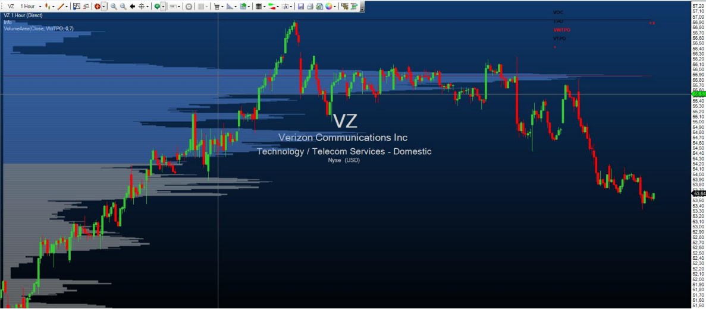

### Beispiel
angekündigt werden

##VolumeGraph
**Die Installation des Technical Analysis-Pakets ist erforderlich, um auf diesen Indikator zugreifen zu können.**

### Beschreibung
Dieser Indikator beinhaltet ein übliches Volumen-Histogramm, die Färbung wird hier aber aufgrund von Preistrends vorgenommen. Der VolumeGraph stellt kurz- oder langfristige Preistrends fest, die Sensibilität dafür können Sie über den Paramter „SlopeLength“ einstellen. Ein hoher Wert liefert langfristige Trends, niedrige Werte stellen kurzfristige Preistrends dar. Über die Einstellung „Exponential“ können Sie wählen, ob die Berechnung zur Trendbestimmung auf einem exponentiellen(=True) oder linearen (=False) Algorithmus basieren soll. Dabei handelt es sich um die Feinabstimmung und es sind keine gravierenden Änderungen durch diesen Parameter zu erwarten. Zusätzlich beinhaltet das Volumen-Histogramm noch einen gleitenden Durchschnitt, für den Sie mit dem Parameter „AvgLength“ die Periode eingeben können.

### Parameters
angekündigt werden

### Rückgabewert
angekündigt werden

### Verwendung
angekündigt werden

### Darstellung


### Beispiel
angekündigt werden

##VolumeKeltnerChannels
**Die Installation des Technical Analysis-Pakets ist erforderlich, um auf diesen Indikator zugreifen zu können.**

### Beschreibung
The VolumeKeltnerChannels are a great tool to determine very high or very low volume in comparison to past periods. Beginning with an upper Keltner channel line calculated with volume data, this line is shifted ever further upwards or downwards using special multipliers. Volume that is higher than the highest Keltner channel line can be interpreted as extremely high volume that shows that huge numbers of trades have been carried out in the current price period and that an unusually large number of traders are buying or selling positions at the current price level.

### Parameters
angekündigt werden

### Rückgabewert
angekündigt werden

### Verwendung
angekündigt werden

### Darstellung


### Beispiel
angekündigt werden

##VolumeRiseFall
**Die Installation des Technical Analysis-Pakets ist erforderlich, um auf diesen Indikator zugreifen zu können.**

### Beschreibung
Beim VolumeRiseFall – Indikator handelt es sich um eine normale Volumenanzeige als Volumenbars, jedoch mit anderer Farbgebung als üblicherweise. Ein Volumenbar wird grün gezeichnet, wenn das Volumen dieses Bars höher ist, als das Volumen des vorangegangenen Bars und somit ansteigendes Volumen gegeben ist. Ein Volumenbar wird grau gezeichnet, wenn das Volumen dieses Bars niedriger ist, als das Volumen des vorangegangenen Bars und zeigt somit fallendes Volumen an. 

### Parameters
angekündigt werden

### Rückgabewert
angekündigt werden

### Verwendung
angekündigt werden

### Darstellung


### Beispiel
angekündigt werden

##VolumeSentimentLong
**Die Installation des Technical Analysis-Pakets ist erforderlich, um auf diesen Indikator zugreifen zu können.**

### Beschreibung
Dieser Indikator spürt bullische Volumen-Aktivität auf Basis der Analyse des Volumens einer Periode, der Preisspanne eines Bars und dem Close des Bars auf (=VolumeSpreadAnalysis).

Es wird nach 3 Signalen gescreent (angeführt sind die Unterbedingungen, die für das jeweilige Signal erfüllt sein müssen): 

- SellingClimax (Dunkelgrün) 
 6.11..1. Tiefstes Tief seit 50 Perioden 
 6.11..2. Bar mit großer Range 
 6.11..3. Extrem hohes Volumen 

- DemandComingIn (Limettengrün) 
 6.11..1. UpBar (aktueller Close größer vorheriger Close) 
 6.11..2. Vorheriger Bar: DownBar (Close kleiner vorheriger Close) 
 6.11..3. Vorheriger Bar: Bar mit großer Range 
 6.11..4. Vorheriger Bar: Überdurchschnittlich hohes Volumen
 
- BagHolding (Hellgrün) 
 6.11..1. Tiefstes Tief seit 50 Perioden 
 6.11..2. DownBar 
 6.11..3. Bar mit geringer Range 
 6.11..4. Überdurchschnittlich hohes Volumen 
 6.11..5. Close größer gleich der Mitte des Bars 


Die VolumeSentiments bieten die Grundlage für die Berechnung der VolumenConditions, siehe Punkt 5. Wenn ein bullisches VolumeSentiment auftritt, wird der Bar in der jeweiligen Farbe des Signals gefärbt, diese Farbe können Sie in den Paramtereinstellungen verändern.

### Parameters
angekündigt werden

### Rückgabewert
angekündigt werden

### Verwendung
angekündigt werden

### Darstellung


### Beispiel
angekündigt werden

##VolumeSentimentShort
**Die Installation des Technical Analysis-Pakets ist erforderlich, um auf diesen Indikator zugreifen zu können.**

### Beschreibung
Dieser Indikator ist das Gegenstück zum VolumeSentimentLong und spürt bearische Volumen-Aktivität auf Basis der Analyse des Volumens einer Periode, der Preisspanne eines Bars und dem Close des Bars auf (=VolumeSpreadAnalysis). 

Es wird nach 3 Signalen gescreent (angeführt sind die Unterbedingungen, die für das jeweilige Signal erfüllt sein müssen): 

- BuyingClimax (Dunkelrot) 
 6.12..1. Höchstes Hoch seit 50 Perioden 
 6.12..2. Bar mit großer Range 
 6.12..3. Extrem hohes Volumen 
 
- SupplyComingIn (Rot) 
 6.12..1. DownBar 
 6.12..2. Vorheriger Bar: UpBar 
 6.12..3. Vorheriger Bar: Bar mit großer Range 
 6.12..4.Vorheriger Bar: Überdurchschnittlich hohes Volumen 
 
- EndOfRisingMarket (Koralle) 
 6.12..1. Höchstes Hoch seit 50 Perioden 
 6.12..2. UpBar 
 6.12..3. Bar mit geringer Range 
 6.12..4.Überdurchschnittlich hohes Volumen 
 6.12..5.Close kleiner gleich der Mitte des Bars 

Die VolumeSentiments bieten die Grundlage für die Berechnung der VolumenConditions, siehe Punkt 5. Wenn ein bearisches VolumeSentiment auftritt, wird der Bar in der jeweiligen Farbe des Signals gefärbt, diese Farbe können Sie in den Paramtereinstellungen verändern.

### Parameters
angekündigt werden

### Rückgabewert
angekündigt werden

### Verwendung
angekündigt werden

### Darstellung


### Beispiel
angekündigt werden

##VolumeSessionPro 
**Die Installation des Technical Analysis-Pakets ist erforderlich, um auf diesen Indikator zugreifen zu können.**

### Beschreibung
Dieser Indikator entspricht dem bekannten VolumeProfile-Indikator mit Anzeige für einen bestimmten Zeitabschnitt (Session). Sie können die Anfangszeit und die Dauer einer Session beliebig festlegen. Für jede Session wird dann das VolumeProfile angezeigt. Verwenden Sie diesen Indikator nur auf Zeiteinheiten kleiner als 1Tag, je kleiner die Zeiteinheit gewählt ist, desto detaillierter wird das VolumeProfile angezeigt. Der Preis, zu dem in der jeweiligen Session das meiste Volumen gehandelt wurde, wird als roter Balken angezeigt. Der Preisbereich, zu dem z.B. 70% der Trading-Aktivität der jeweiligen Session stattgefunden hat, wird hellblau eingefärbt. Sie können diesen Prozentwert selbst unter dem Parameter „ValueArea“ beliebig festlegen. 

Weiters haben Sie vier verschiedene Optionen um die Volumen-Informationen anzuzeigen: 

**4.1.1. VOC (Volume on close):** Lädt das gesamte Volumen eines Bars auf den Schlusskurs dieses Bars – z.B. wenn ein 5-Minuten Bar ein Volumen von 280 und eine Range von 1,5 Punkten mit einem Schlusskurs bei 1534,25 hat, werden alle 280 Volumeneinheiten auf den Schlusskurs bei 1534,24 gezählt.

** 4.1.2. TPO (Time price opportunity):**Diese Methode beachtet das tatsächlich gehandelte Volumen nicht, sondern zählt eine einzelne Volumen-Einheit zu jedem Preis in der gehandelten Range des Bars – z.B. wenn ein 5-Minuten Bar das Hoch bei 1534 und das Tief bei 1532,5 hat, wird je eine Volumeneinheit zu folgenden Preisen gezählt: 1532.50, 1532.75, 1533.0, 1533.25, 1533.50, 1533.75, and 1534

**4.1.3. VWTPO (Volume weighted time price opportunity):** Diese Variante verteilt das gehandelte Volumen eines Bars über dessen Preisrange – z.B. wenn ein 5-Minuten Bar ein Volumen von 280 bei einer Range von 1,5 Punkten aufweist, mit dem Hoch bei 1534 und dem Tief bei 1532,5, dann werden 40 Volumeneinheiten (=280/7) zu jedem der sieben Preise in dieser Range zugezählt: 1532.50, 1532.75, 1533.0, 1533.25, 1533.50, 1533.75, and 1534.

**4.1.4. VTPO (Volume time price opportunity):** Hier wird das gehandelte Volumen zu jedem Preis der Range zugezählt – z.B. wenn ein 5-Minuten Bar hat 280 Volumeneinheiten, eine Range von 1,5 Punkten mit dem Hoch bei 1534 und dem Tief bei 1532,5, dann werden 280 Volumeneinheiten zu jedem der sieben Preise der Range zugerechnet: 1532.50, 1532.75, 1533.0, 1533.25, 1533.50, 1533.75, and 1534


### Parameters
angekündigt werden

### Rückgabewert
angekündigt werden

### Verwendung
angekündigt werden

### Darstellung
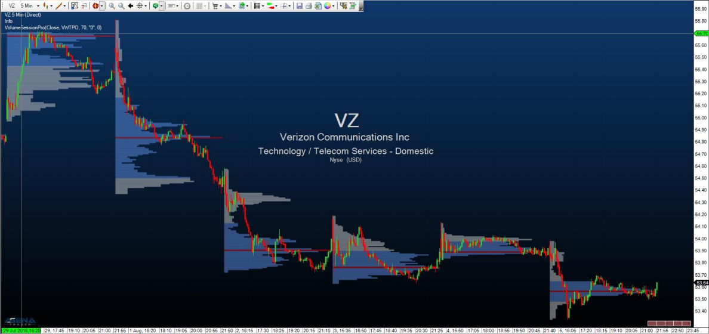

### Beispiel
angekündigt werden

##VolumeTickSpeed 
**Die Installation des Technical Analysis-Pakets ist erforderlich, um auf diesen Indikator zugreifen zu können.**

### Beschreibung
**ACHTUNG!** Diesen Indikator können Sie nur im Tickchart verwenden! Der Indikator misst die Anzahl an Ticks, die während einer vom User bestimmten Anzahl an Sekunden gehandelt wird. Die Anzahl an Sekunden können Sie unter dem Parameter „Period“ einstellen. Ein hoher TickSpeed ist also mit hoher Handelsintensität gleichzusetzen, die wiederum oft an Wendepunkten im Markt beobachtet werden kann. Mit dem Parameter „LimitValue“ können Sie angeben, ab welcher Anzahl an Ticks während der gewählten Periode der Hintergrund gefärbt werden soll, um Extremwerte anzuzeigen.

### Parameters
angekündigt werden

### Rückgabewert
angekündigt werden

### Verwendung
angekündigt werden

### Darstellung
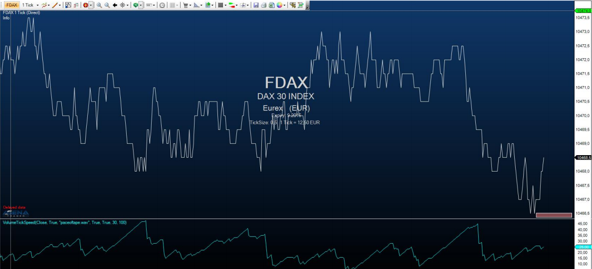

### Beispiel
angekündigt werden

##VolumeUDR 
**Die Installation des Technical Analysis-Pakets ist erforderlich, um auf diesen Indikator zugreifen zu können.**

### Beschreibung
Das VolumeUpDownRatio ist das Verhältnis zwischen UpVolume und DownVolume, angezeigt als Oszillator. Volumen wird als UpVolume gewertet, wenn der aktuelle Close der Preiskerze über dem Close der vorangegangenen Kerze liegt, vice versa gilt für DownVolume. Werte über 80 sind als bearisches Signal zu werten, Werte unter 20 als bullisches Signal. Außerdem kann ein gleitender Durchschnitt eingeblendet werden, der zusätzlich als Signalgeber dienen kann.

- Über „DrawCandleOutline“ können Sie bei Auftreten von bullischen/bearischen Extremwerten die Umrandung Ihrer Kerzen entsprechend färben lassen.

- PriceWeightChange regelt, ob Sie die gewichtete Veränderung des Marktpreises in die Berechnung des Indikator miteinfließen lassen möchten.

### Parameters
angekündigt werden

### Rückgabewert
angekündigt werden

### Verwendung
angekündigt werden

### Darstellung


### Beispiel
angekündigt werden

##VolumeUpDown
### Beschreibung
Der Indikator VolumeUpDown ist eine Variante des Volumen-Indikators (VOL). Der einzige Unterschied ist, dass die Volumenbars in Abhängig davon eingefärbt werden, ob es sich im Preischart um einen Aufwärtsbar oder Abwärtsbar handelt.
Bei einem steigenden Bar wird das Volumen in grün dargestellt.
Bei einem fallenden Bar wird das Volumen in rot dargestellt.
Bei einem Diji (Open = Close)  wird das Volumen in blau dargestellt.

### Verwendung
```cs
VolumeUpDown()
VolumeUpDown(IDataSeries input)
VolumeUpDown()[int barsAgo]
VolumeUpDown(IDataSeries input)[int barsAgo]
```

### Rückgabewert
**double**

Bei Verwendung der Methode mit einem Index ( z.B. **VolumeUpDown**()\[**int** barsAgo\] ) wird der Wert des Indikators für den referenzierten Bar ausgegeben.

### Parameter
input	Eingangsdatenreihe für den Indikator

### Darstellung


### Beispiel
```cs
//Ausgabe des aktuellen Volumens
Print("Der aktuelle Umsatz beträgt " + VolumeUpDown()[0]);
```

##Volume Zones
### Beschreibung
Der VolumeZones Indikator zeichnet an der linken Seite des Charts ein Histogramm für das historische Volumen.

Die Länge der Balken entspricht dem addierten Volumen. Herangezogen wird standardmäßig der Schlusskurs der Perioden. Die zu verwendende Kursreihe (Open, High, Low usw.) ist über den Eigenschaftendialog konfigurierbar.

Wenn es sich um einen steigenden Bar handelt (Close über Open) wird das Volumen des Bars in grün dargestellt. Bei fallenden Bars (Close unter Open) wird das Volumen in rot dargestellt.

Der Indikator ist nur zur Verwendung mit historischen Daten vorgesehen. Für die Darstellung von Volumenänderungen in Realtime verwenden Sie bitte den Indikator VolumeProfile.


##VolumeZoneOscillator
**Die Installation des Technical Analysis-Pakets ist erforderlich, um auf diesen Indikator zugreifen zu können.**

### Beschreibung
Der VolumeZoneOscillator unterteilt die Volumenaktivität in UpVolume und DownVolume, ähnlich wie der VolumeUDR. Volumen wird dann als UpVolume gewertet, wenn der aktuelle Schlusskurs über dem vorangegangenen Schlusskurs liegt, vice versa für DownVolume. Der dadurch errechnete Oszillator gibt relative Prozentwerte aus. Ein Instrument befindet sich in einem positiven Trend, wenn der VolumeZoneOscillator über eine Level von 5% steigt und vice versa in einem negativen Trend, wenn er unter -5% fällt. Werte über 40% zeigen überkaufte Situationen an, während Werte über 60% ein Indiz für eine extreme Übertreibung im Markt sind. Auf der anderen Seite sind Werte kleiner -40% als überverkauft anzusehen und Werte kleiner -60% als enorm überverkauft und übertrieben zu werten.

### Parameters
angekündigt werden

### Rückgabewert
angekündigt werden

### Verwendung
angekündigt werden

### Darstellung


### Beispiel
angekündigt werden


##Williams %R
### Beschreibung
Situationen. Entwickelt wurde er bereits 1966 von Larry Williams. Der Indikator kann in allen Märkten und in allen Zeiteinheiten verwendet werden, wird jedoch meist intraday genutzt. Vom Aussehen her erinnert der Indikator aus der Klasse der Momentum-Oszillatoren am ehesten an die Stochastik.

### Interpretation
Die Werte schwanken zwischen 0 und 100. Der Indikator ist darauf ausgerichtet, die Differenz zwischen dem Periodenhoch und dem heutigen Schlußkurs mit der Handelsspanne des Beobachtungszeitraumes in Bezug zu setzen und ist speziell in Seitwärtsbewegungen und leichten Trendphasen geeignet. In Zeiten mit ausgeprägten Trends ist er nicht sinnvoll anzuwenden. Bei einem Trend kommen die Kauf- bzw. Verkaufssignale zu früh. 

Der Indikator sollte nur in Verbindung mit trendfolgenden bzw. trendbestätigenden Indikatoren verwendet werden.
Werte des Indikators über -10 zeigen eine überkaufte Situtation an. Ein Verkaufssignal entsteht bei der Wende des Indikators nach unten.
Werte des Indikators unter -90 zeigen eine überverkaufte Situation an. Ein Kaufsignal entsteht bei der Wende des Indikators nach oben.

Divergenzen zwischen Indikator und zugrundeliegendem Wert deuten auf eine Trendwende hin.

### Weitere Informationen
<http://www.broker-test.de/finanzwissen/technische-analyse/williams-percent-r/>

### Verwendung
```cs
WilliamsR(int period)
WilliamsR(IDataSeries input, int period)
WilliamsR(int period)[int barsAgo]
WilliamsR(IDataSeries input, int period)[int barsAgo]
```

### Rückgabewert
**double**

Bei Verwendung der Methode mit einem Index ( z.B. **WilliamsR**(14)\[**int** barsAgo\] ) wird der Wert des Indikators für den referenzierten Bar ausgegeben.

### Parameters
input	Eingangsdatenreihe für den Indikator

period	Anzahl der Bars, die in die Berechnung einbezogen werden

### Darstellung


### Beispiel
```cs
WilliamsR(int period)
WilliamsR(IDataSeries input, int period)
WilliamsR(int period)[int barsAgo]
WilliamsR(IDataSeries input, int period)[int barsAgo]
```

##WyckoffWave

**Die Installation des Technical Analysis-Pakets ist erforderlich, um auf diesen Indikator zugreifen zu können.**

### Beschreibung
Der WyckoffWave-Indikator addiert das Volumen für jeden folgenden Bar, bis eine Preiswelle beendet ist. Sie können einstellen, wie sensibel die Preiswellen festgestellt werden sollen. Wenn das Volumen einer Welle auf besonders hohe Werte steigt, ist sehr oft ein Wendepunkt im Chart erreicht. Wenn die Volumenbars rot gefärbt sind, handelt es sich um eine Short-Welle, grüne Volumenbars indizieren eine Long-Welle. 

Über den Parameter „MedianPeriod“ wählen Sie, wie sensibel der Indikator die einzelnen Preiswellen bestimmen soll. Je geringer der Wert, desto größer die Preiswellen, die der Indikator berechnet.

Der Parameter Poles dient zur Feinabstimmung der Anzeige der Volumen-Wellen, Sie können einen Parameter zwischen 1-4 wählen. Die Änderung dieses Wertes verursacht meist nur unmerkbare Änderungen.


### Parameters
angekündigt werden

### Rückgabewert
angekündigt werden

### Verwendung
angekündigt werden

### Darstellung


### Beispiel
angekündigt werden

##ZigZag
### Beschreibung
Der ZigZag-Indikator findet Extrempunkte in verschiedenen Zeiteinheiten. Es werden so anhand eines frei bestimmbaren Schwellwertes bestehende Trends markiert. Der Schwellwert gibt an, um wieviel sich der Kurs verändern muss, bevor die Zig-Zag-Linie ihre Richtung ändert und einen Extrempunkt hinterläßt.

### Interpretation
Die zurückliegenden Extremwerte (lokale Hochs bzw. Tiefs) eignen sich klassisch zum Einstieg oder zur Stoppversetzung.

**Achtung:** Der ZigZag ist kein Indikator im herkömmlichen Sinn. Position und Richtung des ZigZag können sich nachträglich ändern.

### Weitere Informationen
<http://www.robotrading.de/indikatoren/zig-zag-indikator-zeigt-hoch-und-tief-punkte-im-forex-markt>

### Verwendung
```cs
//Für den oberen Extrempunkt
ZigZag(DeviationType deviationType, double deviationValue, bool useHighLow).ZigZagHigh[int barsAgo]
ZigZag(IDataSeries input, DeviationType deviationType, double deviationValue, bool useHighLow).ZigZagHigh[int barsAgo]

//Für den unteren Extrempunkt 
ZigZag(DeviationType deviationType, double deviationValue, bool useHighLow).ZigZagLow[int barsAgo]
ZigZag(IDataSeries input, DeviationType deviationType, double deviationValue, bool useHighLow).ZigZagLow[int barsAgo]
```

### Rückgabewert
**double**

Bei Verwendung der Methode mit einem Index ( z.B.**ZigZag**(...)\[**int** barsAgo\] ) wird der Wert des Indikators für den referenzierten Bar ausgegeben.

Der Rückgabewert 0 (Null) zeigt an, dass noch kein Hoch- bzw. Tiefpunkt gefunden werden konnte.

### Parameters
|                |                                                                                                                    |
|----------------|--------------------------------------------------------------------------------------------------------------------|
| input          | Eingangsdatenreihe für den Indikator                                                                               |
| deviationType  | Angabe der Änderung in Punkten bzw. in Prozent.
DeviationType.Points und DeviationType.Percent       |
| deviationValue | Wert der Abweichung                                                                                             |
| useHighLow     | legt fest, ob des Hoch/Tief eines Bars für die Suche von Extremwerten verwendet wird oder der Schlusskurs der Kerze |

### Darstellung


### Beispiel
```cs
//Ausgabe des Kurswertes des letzten Hochpunktes
Print("Der letzte Hochpunkt des ZigZag-Indikators liegt bei " + ZigZag(DeviationType.Percent, 1, true).ZigZagHigh[0]);

//Ausgabe des Kurswertes des letzten Tiefpunktes
Print("Der letzte Tiefpunkt des ZigZag-Indikators liegt bei " + ZigZag(DeviationType.Percent, 1, true).ZigZagLow[0]);
```
